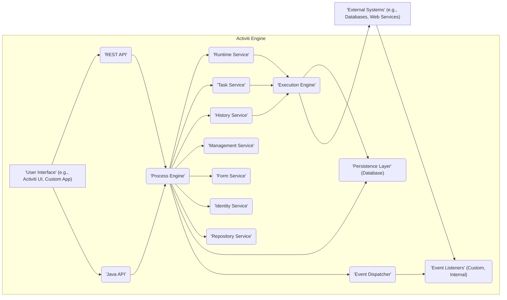
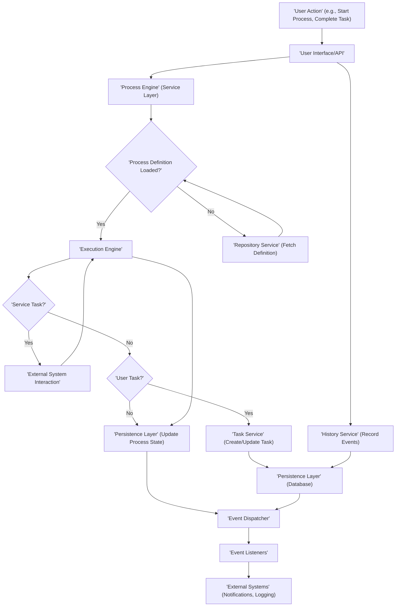

# Project Design Document: Activiti BPM Engine

**1. Introduction**

This document provides a detailed architectural design overview of the Activiti Business Process Management (BPM) engine, intended for use in threat modeling activities. It outlines the key components, their interactions, data flow, and security considerations. Activiti is a lightweight, embeddable Java-based BPM engine adhering to the BPMN 2.0 standard for process definition and execution. This document aims to provide a clear understanding of the system's internal workings to facilitate the identification of potential security vulnerabilities.

**2. Goals and Objectives**

The primary goals of the Activiti project are:

* To offer a robust and scalable platform for executing business processes.
* To provide a flexible and embeddable engine suitable for integration into diverse applications.
* To fully support the BPMN 2.0 standard for process modeling and execution.
* To enable efficient management and real-time monitoring of active process instances.
* To expose a comprehensive set of APIs for seamless interaction with the engine's functionalities.

**3. High-Level Architecture**

The Activiti engine employs a layered architecture, with core components interacting to manage process definitions, instances, tasks, and associated data. The following diagram illustrates the high-level interactions between key entities:

**4. Detailed Component Description**

This section details the responsibilities and functionalities of each key component within the Activiti engine:

* **User Interface (UI):**
    * Provides a visual interface for user interaction with the engine.
    * Examples include the pre-built Activiti UI or custom applications developed by users.
    * Enables users to initiate processes, claim and complete assigned tasks, and monitor the status of process instances.

* **REST API:**
    * Offers a standardized, stateless interface for programmatic interaction with the engine over HTTP.
    * Facilitates integration with external systems and applications through well-defined endpoints.
    * Provides access to functionalities for managing processes, tasks, deployments, and administrative operations.

* **Java API:**
    * Represents the core programmatic interface for embedding and controlling the Activiti engine within Java-based applications.
    * Grants developers direct access to all engine services and functionalities through a set of Java classes and interfaces.

* **Process Engine:**
    * Serves as the central orchestrator within Activiti, managing all other services and coordinating the execution of business processes.
    * Responsible for the initialization, configuration, and lifecycle management of the engine.

* **Runtime Service:**
    * Manages the active execution of process instances.
    * Provides functionalities for starting new process instances, signaling events during execution, and retrieving real-time information about running processes.

* **Task Service:**
    * Specifically manages user tasks that are part of running processes.
    * Allows for querying, claiming ownership of, completing, and delegating tasks to different users.

* **History Service:**
    * Records and stores historical data related to process executions, completed tasks, and variable changes.
    * Provides valuable insights for process analysis, auditing, and performance monitoring.

* **Management Service:**
    * Offers administrative functionalities for the engine.
    * Includes features for managing asynchronous jobs, deployments of process definitions, and overall engine configuration.

* **Form Service:**
    * Manages forms associated with user tasks, enabling data collection and presentation within the process flow.
    * Facilitates the rendering of forms and the submission of form data by users.

* **Identity Service:**
    * Manages users, groups, and the relationships between them, crucial for authentication and authorization.
    * Handles the verification of user identities and the determination of access rights within the engine.

* **Repository Service:**
    * Manages process definitions (typically represented as BPMN 2.0 XML files) and their deployments to the engine.
    * Allows for deploying new process definitions, retrieving existing ones, and managing different versions.

* **Execution Engine:**
    * Represents the core execution logic of the Activiti engine.
    * Interprets and executes the process definitions, managing the flow of execution through different process nodes and activities.

* **Persistence Layer (Database):**
    * Provides the underlying storage mechanism for all engine data, including process definitions, active and historical process instances, tasks, and variables.
    * Supports various relational database systems for data persistence.

* **Event Dispatcher:**
    * Responsible for broadcasting events that occur during the lifecycle of process executions.
    * Enables internal components and external systems to subscribe to and react to specific process-related events.

* **Event Listeners:**
    * Components that subscribe to events dispatched by the Event Dispatcher.
    * Can be internal engine components performing internal actions or custom listeners implemented to trigger external integrations.

* **External Systems:**
    * Represents external applications, databases, or web services that interact with the Activiti engine during process execution.
    * Interactions can occur through service tasks, message events, or other integration patterns defined within the process.

**5. Data Flow**

The following diagram illustrates the typical flow of data during the execution of a business process within Activiti:

**Data Flow Description:**

* **User Action:** A user initiates an action, such as starting a process or completing a task, through the UI or API.
* **User Interface/API:** The request is received by the appropriate interface layer.
* **Process Engine (Service Layer):** The request is routed to the relevant service within the Process Engine for processing.
* **Process Definition Loaded?:** The engine checks if the required process definition is currently loaded in memory.
* **Repository Service (Fetch Definition):** If the definition is not loaded, it is retrieved from the database via the Repository Service.
* **Execution Engine:** The Execution Engine interprets the process definition and manages the execution flow.
* **Service Task?:** The engine checks if the current activity is a service task requiring interaction with an external system.
* **External System Interaction:** If it's a service task, the engine interacts with the designated external system.
* **User Task?:** The engine checks if the current activity is a user task requiring human interaction.
* **Task Service (Create/Update Task):** If it's a user task, the Task Service creates or updates the task details in the database.
* **Persistence Layer (Database):** Engine data, including process state, task information, and variables, is stored or updated in the database.
* **Event Dispatcher:** Events related to process execution milestones are dispatched.
* **Event Listeners:** Registered listeners (internal or external) receive and process these events.
* **History Service (Record Events):** The History Service records relevant events for auditing and analysis purposes.
* **External Systems (Notifications, Logging):** External systems might receive notifications or log events based on the configured event listeners.

**6. Security Considerations**

Security is paramount in the design and operation of the Activiti engine. Key security considerations include:

* **Authentication:**
    * The process of verifying the identity of users attempting to access the engine.
    * Activiti supports integration with various identity providers, such as LDAP and Active Directory, for centralized authentication.
    * Secure storage and management of user credentials are crucial.

* **Authorization:**
    * Controlling access to engine resources and operations based on the authenticated user's roles and permissions.
    * Activiti provides fine-grained control over access to process definitions, instances, and tasks.
    * Implementation of Role-Based Access Control (RBAC) is essential for managing permissions.

* **Data Security (At Rest):**
    * Protecting sensitive data stored within the database.
    * Encryption of sensitive data fields within the database is recommended.
    * Secure database configuration, including access controls and encryption, is vital.

* **Data Security (In Transit):**
    * Ensuring secure communication between different components of the system and with external systems.
    * Mandatory use of HTTPS for all API communication to protect data in transit.
    * Employing secure protocols for communication with external services.

* **Input Validation:**
    * Rigorous validation of all data received from users and external systems to prevent injection attacks (e.g., SQL injection, cross-site scripting).
    * Proper sanitization and encoding of user input in forms and API requests.

* **Process Definition Security:**
    * Securing access to and modification of process definitions to prevent unauthorized changes or the deployment of malicious processes.
    * Implementing access controls on the Repository Service to restrict who can deploy and modify process definitions.

* **Dependency Management:**
    * Maintaining awareness of and addressing potential vulnerabilities in third-party libraries and dependencies used by Activiti.
    * Regular updates of dependencies to incorporate security patches.

* **Auditing:**
    * Comprehensive logging and tracking of significant events within the engine for security monitoring, compliance, and forensic analysis.
    * Recording user actions, process executions, administrative changes, and security-related events.

* **API Security:**
    * Protecting the REST API endpoints from unauthorized access and abuse.
    * Implementation of robust authentication and authorization mechanisms for API requests, such as OAuth 2.0 or API keys.

* **Secure Configuration:**
    * Proper configuration of the Activiti engine and its underlying infrastructure to minimize security risks.
    * Disabling unnecessary features and services to reduce the attack surface.

**7. Deployment Considerations**

Activiti offers flexibility in deployment options, each with its own security implications:

* **Embedded within a Java Application:** The engine runs within the same JVM as the application, sharing resources and security context.
* **Standalone Server:** Activiti is deployed as a separate application server, providing isolation but requiring careful network security configuration.
* **Cloud Environments:** Deployment on cloud platforms introduces cloud-specific security considerations, such as IAM roles and network configurations.
* **Containerized Environments:** Using Docker and Kubernetes offers scalability and isolation but requires secure container image management and orchestration configuration.

The chosen deployment strategy significantly impacts network security, access control mechanisms, and overall infrastructure security.

**8. Technologies Used**

* **Core Programming Language:** Java
* **BPMN Engine Implementation:** Activiti Core
* **Data Persistence:** Relational Databases (e.g., MySQL, PostgreSQL, H2)
* **Core Framework:** Spring Framework
* **API Implementation:** REST (using frameworks like Spring MVC or JAX-RS)
* **User Interface Technologies:** HTML, JavaScript (for Activiti UI or custom UIs)
* **Build Automation:** Maven

**9. Future Considerations**

* **Enhanced Security Features:** Exploration of more advanced security features like Attribute-Based Access Control (ABAC) for finer-grained authorization.
* **Integration with Security Information and Event Management (SIEM) Systems:** To facilitate centralized security monitoring and incident response.
* **Improved Audit Logging Capabilities:** Providing more detailed and configurable audit logging options for enhanced traceability.
* **Support for Secure Enclaves:** Investigating the use of secure enclaves for protecting sensitive data during process execution in untrusted environments.

This document provides a detailed architectural design overview of the Activiti project, specifically tailored for threat modeling purposes. It highlights key components, data flows, and crucial security considerations to aid in identifying potential vulnerabilities and designing appropriate security measures.