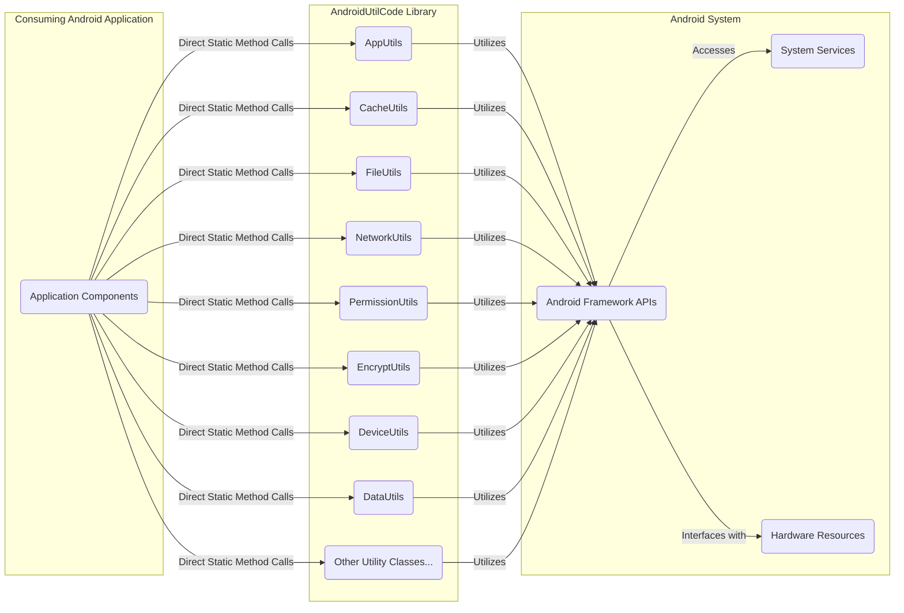
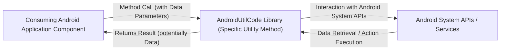

# Project Design Document: AndroidUtilCode Library

**Version:** 1.1
**Date:** October 26, 2023
**Author:** AI Software Architect

## 1. Introduction

This document provides an enhanced design overview of the AndroidUtilCode library, a comprehensive collection of utility functions for Android development. This detailed design serves as a crucial artifact for subsequent threat modeling activities, providing a thorough understanding of the library's architecture, components, interactions, and potential security implications.

### 1.1. Purpose

The primary purpose of this document is to furnish a clear, comprehensive, and security-focused understanding of the AndroidUtilCode library's design. This understanding is paramount for effectively identifying potential security vulnerabilities, attack surfaces, and data flow paths that could be exploited during the threat modeling process.

### 1.2. Scope

This document encompasses the design of the AndroidUtilCode library within the operational context of an Android application that integrates it. The focus is on the library's internal structure, its interactions with the Android operating system's APIs and services, the types of data it handles (directly or indirectly), and its potential impact on the security posture of the consuming application. This includes considering the library's role as a facilitator for various operations within the application.

### 1.3. Target Audience

This document is intended for a technical audience, including security engineers, threat modelers, software developers integrating the library, and anyone responsible for assessing the security and compliance of applications utilizing the AndroidUtilCode library.

## 2. Overview

AndroidUtilCode is a widely adopted open-source library offering a diverse range of static utility methods designed to simplify common Android development tasks. These utilities are logically organized into categories, providing functionalities such as:

*   **Application Management:** Retrieving application information, managing activities and processes.
*   **Data Handling:** Caching, data conversion, file operations, shared preferences management.
*   **Device Interaction:** Accessing device information, network status, screen properties, sensor data.
*   **User Interface:** Clipboard operations, toast and snackbar display, view manipulation.
*   **Security & Cryptography:** Encryption and decryption utilities.
*   **System Interaction:** Permission management, interacting with system services.
*   **Utility Functions:** String manipulation, regular expressions, time and date utilities.

The library is designed for seamless integration into Android projects via Gradle dependency management. Its reliance on static methods allows for direct invocation of utility functions without the need for object instantiation, promoting ease of use but also requiring careful consideration of context and potential side effects.

## 3. Architectural Design

The AndroidUtilCode library adopts a modular design, grouping related utility functions into distinct classes. This structure promotes organization and maintainability.

### 3.1. Component Diagram



### 3.2. Data Flow

The primary data flow pattern involves the consuming Android application invoking static methods within the AndroidUtilCode library. These methods may then interact with Android system APIs and services to perform their intended operations, potentially involving the processing or retrieval of data.



**Detailed Data Flow Examples:**

*   **Retrieving Sensitive Device Identifiers (using `DeviceUtils`):**
    1. An application component calls a static method in `DeviceUtils` (e.g., `getDeviceId()`).
    2. `DeviceUtils` internally invokes Android system APIs that access device-specific identifiers.
    3. The Android system APIs retrieve the device identifier.
    4. `DeviceUtils` returns the device identifier to the calling application component. *Potential security concern: Is this identifier handled securely by the application?*

*   **Performing Network Requests (using utilities within `NetworkUtils`):**
    1. An application component utilizes a method in `NetworkUtils` to initiate a network request, providing the target URL and request parameters.
    2. `NetworkUtils` uses Android's networking APIs to establish a connection and send the request.
    3. The remote server responds with data.
    4. `NetworkUtils` receives the response data.
    5. `NetworkUtils` returns the response data to the calling application component. *Potential security concern: Is the network communication secured (HTTPS)? Is the data validated?*

*   **Encrypting User Data (using `EncryptUtils`):**
    1. An application component calls a static encryption method in `EncryptUtils`, providing the sensitive user data and potentially an encryption key.
    2. `EncryptUtils` utilizes Android's cryptographic APIs to perform the encryption operation.
    3. The encrypted data is generated.
    4. `EncryptUtils` returns the encrypted data to the calling application component. *Potential security concern: What encryption algorithm is used? How is the key managed?*

### 3.3. Dependencies

The AndroidUtilCode library has a relatively small number of direct external dependencies, primarily relying on the standard Android SDK libraries and APIs provided by the Android operating system. However, it's crucial to consider the *transitive dependencies* introduced by the Android SDK and the consuming application's own dependencies, as these can also introduce potential vulnerabilities.

Key dependency considerations include:

*   **Android SDK:** The library inherently depends on various components of the Android SDK, such as `android.content`, `android.net`, `android.os`, and `android.util`. Security vulnerabilities within these SDK components could indirectly impact the security of applications using AndroidUtilCode.
*   **Support Libraries/Jetpack Libraries:** Depending on the specific utility methods used, there might be indirect dependencies on Android Support Libraries or Android Jetpack libraries.
*   **Transitive Dependencies:** The consuming application's dependencies might introduce further transitive dependencies that could interact with or be affected by the AndroidUtilCode library.

## 4. Security Considerations

This section details potential security considerations associated with the AndroidUtilCode library, providing a basis for thorough threat modeling.

*   **Improper Permission Management:**
    *   Utilities in `PermissionUtils` might be misused or relied upon without proper error handling, leading to incorrect assumptions about granted permissions.
    *   The library might facilitate access to sensitive device features or data based on permissions, and vulnerabilities in the Android permission model could be exploited.
*   **Insecure Data Handling:**
    *   `CacheUtils` and `FileUtils` might handle sensitive data that could be exposed if stored insecurely (e.g., without encryption, with world-readable permissions).
    *   Temporary files created by the library might not be properly cleaned up, potentially leaving sensitive data accessible.
*   **Vulnerable Network Communication:**
    *   While `NetworkUtils` might not implement network communication directly, it provides utilities that facilitate it. If the consuming application uses these utilities to perform insecure network operations (e.g., using HTTP instead of HTTPS), it introduces vulnerabilities.
    *   The library might not enforce best practices for network security, leaving it to the developer to implement proper security measures.
*   **Cryptographic Weaknesses:**
    *   If `EncryptUtils` is used with weak or outdated encryption algorithms, or if keys are managed insecurely (e.g., hardcoded), the encrypted data can be easily compromised.
    *   Improper use of cryptographic primitives can lead to vulnerabilities.
*   **Input Validation Failures:**
    *   While the primary responsibility for input validation lies with the consuming application, the library's utility methods could be vulnerable to unexpected input, leading to crashes or unexpected behavior.
    *   Lack of input sanitization could lead to injection vulnerabilities if the output of utility methods is used in sensitive contexts (e.g., displaying data in a WebView).
*   **Information Disclosure:**
    *   Utilities in `DeviceUtils` or `AppUtils` that retrieve device or application information could inadvertently expose sensitive data if this information is logged, transmitted insecurely, or stored inappropriately.
*   **Dependency Vulnerabilities:**
    *   Vulnerabilities in the Android SDK or any transitive dependencies could be exploited through the AndroidUtilCode library if it relies on the vulnerable components.
    *   Regularly updating the library and its dependencies is crucial to mitigate this risk.
*   **Misuse and Abuse:**
    *   The ease of use of the library might lead to developers misusing certain utilities, potentially introducing security flaws. For example, using insecure methods for temporary storage or relying on insecure default configurations.
*   **Reflection and Native Code (Potential):**
    *   While less likely in a utility library like this, if any utility methods internally use reflection or interact with native code, these areas could introduce complex security risks that are harder to analyze.

## 5. Deployment

The AndroidUtilCode library is integrated into Android projects by declaring it as a dependency in the application's `build.gradle` file.

```
dependencies {
    implementation 'com.blankj:utilcode:1.31.1' // Example version
}
```

Upon building the application, the library's compiled code is included within the application's APK file. At runtime, when the application is launched, the classes from the AndroidUtilCode library are loaded into the application's process memory, making the static utility methods available for invocation by the application's components.

## 6. Future Considerations

*   **Regular Security Audits and Penetration Testing:** Conducting periodic security audits and penetration testing specifically targeting applications utilizing AndroidUtilCode can help identify potential vulnerabilities in both the library's code and its usage.
*   **Enhanced Input Validation within the Library:** Implementing robust input validation within the library's utility methods can provide an additional layer of defense against unexpected or malicious input from the consuming application.
*   **Secure Defaults and Configuration Options:** For utilities with security implications (e.g., encryption, network communication), providing secure default configurations and options for developers to customize security settings is crucial.
*   **Comprehensive Security Documentation and Best Practices:**  Developing detailed documentation outlining secure usage patterns, potential security pitfalls, and best practices for integrating and using the library can significantly reduce the risk of misuse.
*   **Static Analysis Security Testing (SAST):** Utilizing SAST tools on projects incorporating AndroidUtilCode can help identify potential security vulnerabilities early in the development lifecycle.
*   **Dependency Management and Vulnerability Scanning:** Implementing robust dependency management practices and utilizing vulnerability scanning tools to identify and address vulnerabilities in the library's dependencies (including transitive dependencies) is essential.
*   **Consideration of Contextual Security:** Emphasize in documentation and developer guidance that the security implications of using a particular utility are highly dependent on the context of its use within the application. Encourage developers to consider the specific security requirements of their application when using the library.

This enhanced design document provides a more detailed and security-focused understanding of the AndroidUtilCode library. The outlined security considerations serve as critical inputs for the threat modeling process, enabling a more comprehensive assessment of potential risks and vulnerabilities.