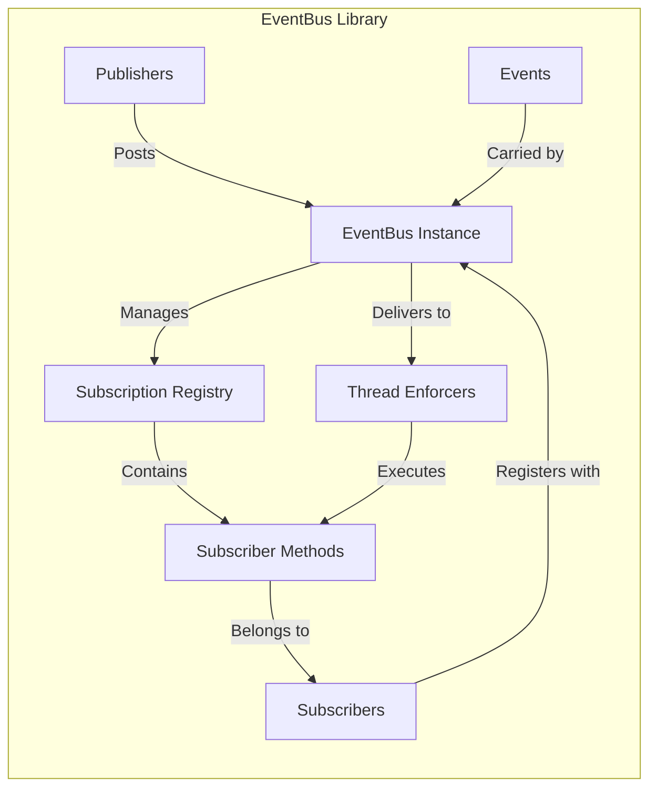
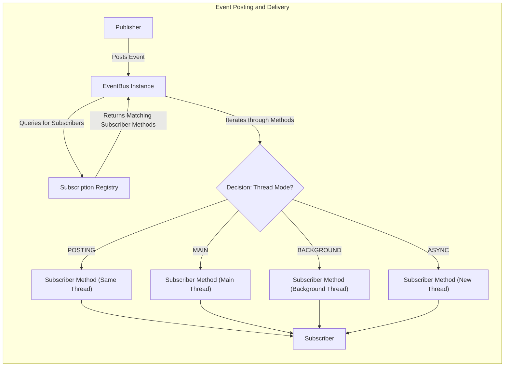

# Project Design Document: EventBus Library

**Version:** 1.1
**Date:** October 26, 2023
**Author:** AI Software Architect

## 1. Introduction

This document provides an enhanced design overview of the EventBus library, as found on GitHub at [https://github.com/greenrobot/EventBus](https://github.com/greenrobot/EventBus). The primary purpose of this document is to facilitate threat modeling by providing a clear and detailed understanding of the library's architecture, components, and data flow. This information will be used to identify potential security vulnerabilities and attack vectors.

## 2. Goals

*   Provide a clear and comprehensive description of the EventBus library's architecture and its constituent components.
*   Detail the flow of data within the library, specifically focusing on the mechanisms for event publishing, subscription, and delivery.
*   Clearly delineate the interaction points and boundaries within the EventBus system.
*   Serve as a robust foundation for subsequent threat modeling exercises, enabling the identification of potential security weaknesses.

## 3. Overview

EventBus is a lightweight and efficient publish/subscribe event bus library for Android and Java. It enables decoupled communication between application components by allowing them to interact through the posting and receiving of events. This eliminates the need for direct dependencies between communicating components, promoting modularity and maintainability. The core concept involves publishers posting events to the bus, and subscribers registering to receive specific types of events.

## 4. Architecture

The EventBus library's architecture comprises the following key components:

*   **EventBus Instance:** This is the central singleton (or instance) responsible for managing all event communication within a given scope. It acts as the intermediary between publishers and subscribers. Configuration options, such as allowing event inheritance, are managed at this level.
*   **Events:** These are standard Java objects (POJOs) that encapsulate information about an occurrence or state change within the application. The type of the event object is used to determine which subscribers should be notified.
*   **Subscribers:** These are objects that are interested in receiving specific types of events. Subscribers register with the EventBus, indicating the event types they wish to receive.
*   **Publishers:** These are objects that initiate the communication process by posting events to the EventBus instance.
*   **Subscription Registry:** This internal component within the EventBus maintains a mapping between event types and the subscriber methods that are interested in those events. It's a crucial element for efficient event delivery.
*   **Subscriber Methods:** These are methods within subscriber classes that are specifically annotated (e.g., using `@Subscribe`) to receive and process specific event types. The annotation also specifies the desired threading mode for the method's execution.
*   **Thread Enforcers (Executor Services/Handlers):** EventBus utilizes thread enforcers to manage the execution of subscriber methods on different threads, based on the specified threading mode. This includes options like posting on the same thread, the main thread, a background thread, or a new asynchronous thread.

### 4.1. Component Diagram

## 5. Data Flow

The process of event communication within EventBus follows these steps:

1. **Subscriber Registration:** A subscriber object registers its interest in specific event types with the EventBus instance. This involves the EventBus inspecting the subscriber object for methods annotated with `@Subscribe` and updating the Subscription Registry with the mapping between the event type and the subscriber method.
2. **Event Posting:** A publisher object creates an event object and posts it to the EventBus instance by calling a `post()` method.
3. **Event Matching and Lookup:** The EventBus receives the posted event and queries its Subscription Registry to identify all subscriber methods that are registered to receive events of that specific type (and potentially supertypes, depending on configuration).
4. **Event Delivery and Threading:** The EventBus iterates through the identified subscriber methods. For each method, it determines the appropriate thread for execution based on the threading mode specified in the `@Subscribe` annotation:
    *   **POSTING:** The subscriber method is executed on the same thread that posted the event.
    *   **MAIN:** The subscriber method is executed on the main (UI) thread.
    *   **BACKGROUND:** The subscriber method is executed on a background thread. If the posting thread is not the main thread, the method is executed directly. Otherwise, it's enqueued for background execution.
    *   **ASYNC:** The subscriber method is always executed on a new, separate thread.
5. **Subscriber Method Invocation:** The EventBus invokes the subscriber method, passing the event object as an argument. The subscriber method then processes the event.

### 5.1. Data Flow Diagram

## 6. Security Considerations

While EventBus focuses on application logic and communication, several security considerations arise from its usage:

*   **Unauthorized Event Posting (Integrity Risk):** Any component with access to the EventBus instance can post events. This could allow malicious or compromised components to inject arbitrary events, potentially triggering unintended and harmful actions in legitimate subscribers. For example, a rogue component could post an event that forces a subscriber to modify sensitive data incorrectly.
*   **Malicious Subscribers (Confidentiality, Integrity, Availability Risks):** A compromised subscriber could receive sensitive information broadcast through events (confidentiality breach). It could also perform malicious actions upon receiving specific events, disrupting application functionality (availability) or corrupting data (integrity).
*   **Data Exposure in Events (Confidentiality Risk):** If events contain sensitive data, any subscriber registered for that event type will have access to it. Insufficient access control or overly broad event subscriptions can lead to unintended data leaks.
*   **Denial of Service (DoS) (Availability Risk):** A malicious publisher could flood the EventBus with a large number of events, potentially overwhelming the bus and its subscribers. This could lead to performance degradation or even application crashes, impacting availability.
*   **Thread Safety Issues in Subscribers (Integrity, Availability Risks):** While EventBus manages the threading for event delivery, if subscriber methods are not implemented with thread safety in mind (e.g., improper synchronization when accessing shared resources), it can lead to race conditions, data corruption, and application instability.
*   **Event Injection from Untrusted Sources (Integrity, Availability Risks):** If events originate from untrusted sources (e.g., external inputs processed and then posted as events), malicious actors could craft events to exploit vulnerabilities in subscriber logic, potentially leading to code execution or other security breaches.
*   **Lack of Authentication and Authorization:** EventBus itself does not provide built-in mechanisms for authenticating publishers or authorizing subscribers. This means any component can potentially interact with the bus, making it crucial to implement these controls at a higher application level.
*   **Reflection Usage (Potential for Exploitation):** EventBus relies on reflection to discover and invoke subscriber methods. While efficient, reflection can sometimes be a target for security exploits if not handled carefully by the underlying platform.

## 7. Assumptions and Constraints

*   It is assumed that the underlying operating system and Java Virtual Machine (JVM) provide a baseline level of security.
*   The security of applications utilizing EventBus is heavily reliant on secure coding practices employed by application developers when designing and implementing events and subscribers.
*   EventBus, in its core functionality, does not offer built-in mechanisms for authentication or authorization of event publishers or subscribers. These security measures must be implemented at the application level.
*   This design document focuses on the fundamental architecture and data flow of the EventBus library and does not delve into specific implementation details or integrations within particular applications or frameworks.

## 8. Future Considerations

*   Further analysis of the security implications of different EventBus configurations, such as allowing event inheritance.
*   Detailed investigation into potential vulnerabilities arising from the use of reflection for subscriber method invocation.
*   Exploration of best practices and potential extensions for incorporating security features or controls when using EventBus in security-sensitive applications.
*   Assessment of the security considerations when using EventBus in complex architectures, such as multi-module applications or microservices environments.
*   Evaluation of the performance impact of implementing additional security measures around EventBus usage.

This enhanced design document provides a more detailed and nuanced understanding of the EventBus library, specifically tailored for threat modeling purposes. The identified components, data flow, and expanded security considerations offer a solid foundation for identifying potential vulnerabilities and developing appropriate mitigation strategies.
