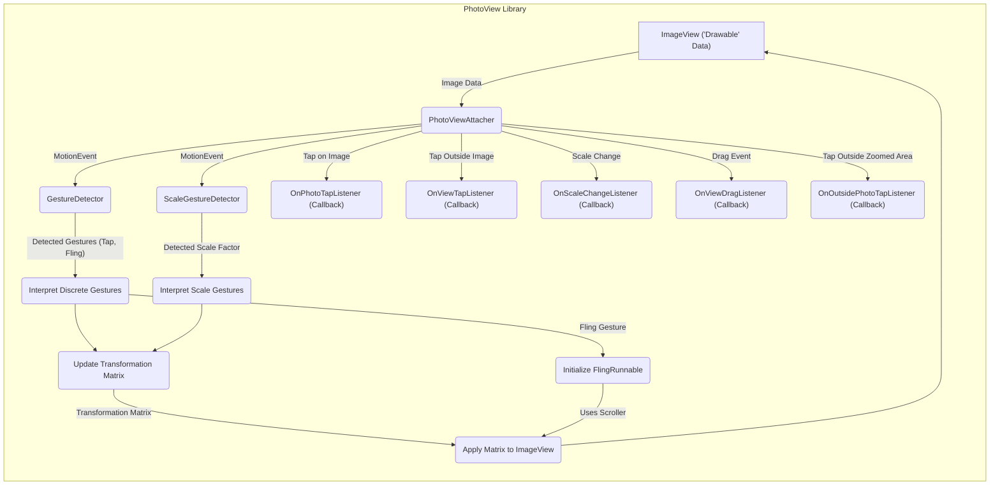

# Project Design Document: PhotoView Library

**Version:** 1.1
**Date:** October 26, 2023
**Author:** Gemini (AI Language Model)

## 1. Introduction

This document provides an enhanced and more detailed design overview of the PhotoView Android library, available at [https://github.com/Baseflow/PhotoView](https://github.com/Baseflow/PhotoView). This revised document aims to provide an even clearer articulation of the library's architecture, components, and data flow, specifically tailored for effective threat modeling. It serves as a foundational resource for in-depth security analysis and the identification of potential vulnerabilities.

## 2. Goals

*   Provide a comprehensive and refined architectural overview of the PhotoView library, including more granular component descriptions.
*   Describe the key components and their interactions with greater detail, emphasizing data exchange and control flow.
*   Illustrate the data flow within the library with a more precise and informative diagram.
*   Identify potential areas of security concern with more specific examples and context for subsequent threat modeling activities.

## 3. Overview

PhotoView is a widely used Android library designed to enhance standard `ImageView` widgets by adding robust zooming and panning capabilities. It abstracts the complexities of touch event handling and matrix transformations, allowing developers to easily integrate intuitive image interaction into their Android applications. The library functions as a sophisticated wrapper around a standard `ImageView`, intercepting and processing touch events to apply the necessary matrix transformations for smooth zoom and pan effects. It does not handle image loading itself, relying on the host application to provide the image to the `ImageView`.

## 4. Architectural Design

The core of the PhotoView library is the `PhotoViewAttacher` class, which acts as the central point of control and management for zoom and pan functionalities.

*   **Key Components (Detailed):**
    *   `PhotoViewAttacher`: The central orchestrator. It holds a reference to the target `ImageView` and manages all touch interactions and transformations. It initializes and manages the `GestureDetector` and `ScaleGestureDetector`. It also contains the current transformation `Matrix`.
    *   `ImageView`: The standard Android `ImageView` widget. PhotoView enhances its display capabilities by manipulating its `Matrix`. The `Drawable` within the `ImageView` is the target of the transformations.
    *   `GestureDetector`:  Specifically the `android.view.GestureDetector`. This component is responsible for detecting discrete touch events such as single taps, double taps, and flings. It receives `MotionEvent` objects from the `ImageView`.
    *   `ScaleGestureDetector`: Specifically the `android.view.ScaleGestureDetector`. This component detects pinch-to-zoom gestures, providing scaling factors based on the distance between the user's fingers. It also receives `MotionEvent` objects.
    *   `Scroller`:  Used for implementing smooth panning and flinging animations. When a pan gesture ends, the `Scroller` calculates the animation frames to smoothly transition the image to its final position.
    *   `FlingRunnable`: An internal runnable that uses the `Scroller` to perform the fling animation on a separate thread.
    *   `Matrix`:  An instance of `android.graphics.Matrix`. This object stores the current transformation state (scale and translation) of the image. `PhotoViewAttacher` directly manipulates this matrix.
    *   `OnPhotoTapListener`: An interface that allows the host application to receive callbacks when the user taps on the displayed photo (within the image bounds).
    *   `OnViewTapListener`: An interface for receiving callbacks when the user taps on the `ImageView` itself, but outside the bounds of the currently displayed image.
    *   `OnScaleChangeListener`: An interface that notifies the host application whenever the zoom scale of the image changes.
    *   `OnViewDragListener`: An interface that provides callbacks while the user is dragging the image.
    *   `OnOutsidePhotoTapListener`: An interface for receiving tap events that occur outside the currently zoomed and potentially translated image boundaries.

*   **Component Interactions and Control Flow:**
    *   The host application instantiates `PhotoViewAttacher` with a reference to an existing `ImageView`.
    *   `PhotoViewAttacher` sets itself as the `OnTouchListener` for the `ImageView`, intercepting all touch events.
    *   Incoming `MotionEvent` objects are passed to both the `GestureDetector` and `ScaleGestureDetector`.
    *   `GestureDetector` analyzes the sequence of `MotionEvent`s to detect single taps, double taps, and flings.
    *   `ScaleGestureDetector` analyzes `MotionEvent`s to detect pinch gestures and calculate the scale factor.
    *   Based on the detected gestures, `PhotoViewAttacher` updates the internal `Matrix` object. For example, a pinch gesture will modify the scale factor in the `Matrix`, while a pan gesture will modify the translation.
    *   For fling gestures, `PhotoViewAttacher` initializes a `FlingRunnable` with the calculated velocity and starts it on a separate thread. The `FlingRunnable` uses the `Scroller` to animate the panning.
    *   The updated `Matrix` is then applied to the `ImageView` using `imageView.setImageMatrix(matrix)`. This triggers a redraw of the `ImageView` with the transformed image.
    *   When specific gestures are recognized (e.g., a tap), the corresponding listeners (`OnPhotoTapListener`, `OnViewTapListener`, etc.) are invoked, allowing the host application to react to user interactions.

## 5. Data Flow (Enhanced)

The data flow within PhotoView involves the image data residing in the `ImageView` and the stream of user touch events that drive the transformations.

*   **Image Data Source:** The `ImageView` holds the image data in the form of a `Drawable`. PhotoView operates on this `Drawable` through matrix transformations. The source of this image data is external to the PhotoView library.
*   **Touch Event Stream:** User interactions on the `ImageView` generate a stream of `MotionEvent` objects. These events contain information about the touch location, pressure, and actions (down, move, up).
*   **Gesture Interpretation:** `GestureDetector` and `ScaleGestureDetector` process the `MotionEvent` stream to identify meaningful gestures.
*   **Matrix Updates:** Based on the interpreted gestures, the `PhotoViewAttacher` calculates and updates the transformation `Matrix`. This involves modifying the scale and translation values within the matrix.
*   **Transformation Application:** The updated `Matrix` is applied to the `ImageView`, causing the Android rendering pipeline to redraw the image with the new transformations.
*   **Callback Notifications:**  When specific events occur (taps, scale changes, drags), the corresponding listener interfaces are invoked, passing relevant information back to the host application.
*   **Fling Animation:** For fling gestures, a `FlingRunnable` is initiated, which uses the `Scroller` to generate smooth animation frames for the panning motion. These animation frames result in further updates to the transformation `Matrix` and subsequent redraws of the `ImageView`.

## 6. Security Considerations (Enhanced for Threat Modeling)

Threat modeling of the PhotoView library should consider the following potential areas of concern:

*   **Malicious Image Sources Exploitation:** While PhotoView doesn't load images, it renders whatever is provided to the `ImageView`. A malicious application could intentionally load a specially crafted image designed to exploit vulnerabilities in the underlying image decoding libraries (e.g., libjpeg, libpng). This could lead to crashes, memory corruption, or even remote code execution, although this is not a direct vulnerability in PhotoView itself.
    *   **Threat:** Exploitation of image parsing vulnerabilities.
    *   **Mitigation (Application Level):** Implement robust image source validation and consider using secure image loading libraries that perform thorough checks.
*   **Denial of Service (DoS) through Resource Exhaustion:**  Displaying extremely large images, even if not malicious, can consume excessive memory, potentially leading to `OutOfMemoryError` exceptions and application crashes. Repeated rapid zooming and panning of very large images could also strain the device's resources.
    *   **Threat:** Application crash due to memory exhaustion.
    *   **Mitigation (Application Level):** Implement checks on image dimensions and file sizes before loading. Use downsampling or tiling techniques for very large images.
*   **Potential Vulnerabilities in Gesture Handling:** Although less likely, vulnerabilities could exist in the `GestureDetector` or `ScaleGestureDetector` implementations within the Android framework. Maliciously crafted sequences of touch events might potentially trigger unexpected behavior or crashes within these components, indirectly affecting PhotoView.
    *   **Threat:** Unexpected behavior or crashes due to flawed gesture handling.
    *   **Mitigation:** Keep the Android SDK and support libraries updated to benefit from security patches. Thoroughly test the application with various touch patterns.
*   **Information Disclosure through Listener Callbacks (Application Vulnerability):**  While PhotoView's listeners primarily provide information about user interactions, if the application's implementation of these listeners inadvertently logs or transmits sensitive information related to the displayed image (e.g., file paths, metadata) without proper protection, it could lead to information disclosure. This is a vulnerability in the *using application*, not PhotoView itself.
    *   **Threat:** Exposure of sensitive image information.
    *   **Mitigation (Application Level):** Carefully review and sanitize any data handled within the listener implementations. Avoid logging or transmitting sensitive information unnecessarily.
*   **Input Validation and Boundary Conditions in Matrix Operations:**  While the `Matrix` class is part of the Android framework, it's worth considering potential edge cases or boundary conditions in the calculations performed by `PhotoViewAttacher` when updating the `Matrix`. Although unlikely to be exploitable, incorrect calculations could theoretically lead to unexpected visual artifacts or, in extreme cases, numerical instability.
    *   **Threat:** Unexpected visual behavior or potential numerical issues.
    *   **Mitigation:** Thorough testing with various image sizes and zoom levels. Code reviews to ensure correct matrix calculations.
*   **Potential for UI Redress Attacks (Application Level):** If the `ImageView` controlled by PhotoView is placed within a vulnerable part of the application's UI, an attacker might be able to overlay deceptive UI elements on top of the zoomed image, potentially tricking the user into performing unintended actions. This is a broader UI security concern, not specific to PhotoView.
    *   **Threat:** User tricked into unintended actions through UI manipulation.
    *   **Mitigation (Application Level):** Implement proper UI security practices, such as avoiding overlapping critical UI elements and validating user interactions.

## 7. Dependencies

*   Android SDK (specifically the `android.widget.ImageView`, `android.view.MotionEvent`, `android.graphics.Matrix`, etc.)
*   Android Support Library or AndroidX Library (`androidx.core.view.GestureDetectorCompat`, `androidx.core.view.ScaleGestureDetectorCompat`)

## 8. Deployment

The PhotoView library is integrated into Android applications by adding it as a dependency in the `build.gradle` file. Developers then instantiate `PhotoViewAttacher` instances, passing in the `ImageView` they wish to enhance with zoom and pan functionality.

## 9. Future Considerations

*   Explore more advanced touch handling techniques for improved responsiveness and smoother animations.
*   Consider adding support for more complex image transformations or visual effects beyond basic zoom and pan.
*   Investigate potential optimizations for memory usage, especially when handling very large images.

This improved document provides a more detailed and nuanced understanding of the PhotoView library's design, specifically focusing on aspects relevant to security threat modeling. By considering the enhanced descriptions of components, interactions, data flow, and security considerations, security professionals can conduct more thorough and effective analyses to identify and mitigate potential risks.
