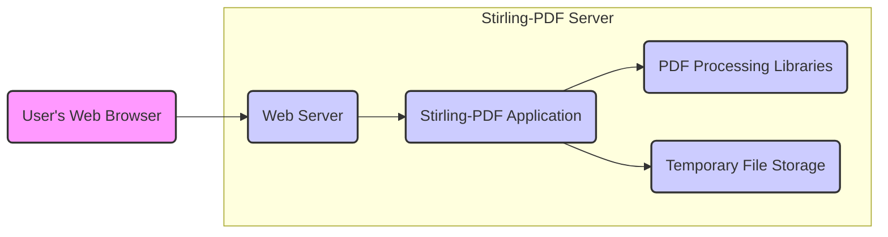
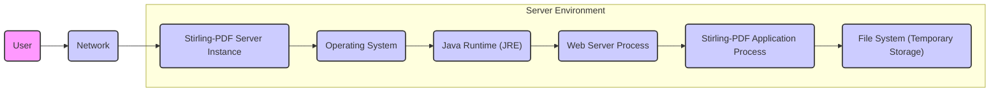

# Project Design Document: Stirling-PDF

**Version:** 1.1
**Date:** October 26, 2023
**Author:** AI Software Architect

## 1. Introduction

This document provides an enhanced and more detailed design overview of the Stirling-PDF project, a self-hosted, web-based PDF manipulation tool. This document serves as a robust foundation for subsequent threat modeling activities, offering a comprehensive understanding of the system's architecture, components, and data flow.

### 1.1. Purpose

The primary purpose of this document is to:

* Clearly and comprehensively articulate the architecture and design of the Stirling-PDF application.
* Identify and describe key components and their interactions in detail.
* Describe the data flow within the system, including potential variations.
* Outline the technology stack employed, with more specific details where possible.
* Serve as a robust and detailed basis for identifying potential security threats and vulnerabilities during the threat modeling process.

### 1.2. Scope

This document covers the design of the core Stirling-PDF application, including its web interface, backend processing logic, and file handling mechanisms. It focuses on the functional and technical aspects directly relevant to security considerations. While infrastructure dependencies are mentioned, specific cloud provider configurations or detailed network topologies remain outside the scope.

### 1.3. Audience

This document is intended for:

* Security engineers and architects responsible for conducting threat modeling and security assessments.
* Developers actively working on the Stirling-PDF project, requiring a deep understanding of the system design.
* DevOps engineers involved in the deployment, maintenance, and monitoring of the application.

## 2. System Overview

Stirling-PDF is designed as a self-contained web application, prioritizing local processing of PDF files. Users interact through a web browser, uploading PDFs and selecting operations. The backend processes these files locally on the server and provides the results back to the user. This self-hosted nature means the security responsibility is shared between the application and the environment it's deployed in.

**Key Components:**

* **"User's Web Browser":** The graphical interface through which users interact with the application, sending requests and receiving responses.
* **"Web Server":**  Handles incoming HTTP/HTTPS requests, serves static content (HTML, CSS, JavaScript), and routes API requests to the application logic. Examples include Tomcat, Jetty, or Undertow.
* **"Stirling-PDF Application":** The core of the application, encompassing the business logic for:
    * Request handling and routing.
    * User input validation.
    * Orchestrating PDF processing tasks based on user selections.
    * Managing the lifecycle of temporary files.
    * Implementing the various PDF manipulation functionalities.
* **"PDF Processing Libraries":** External, typically Java-based, libraries used to perform the low-level PDF manipulation operations. Examples include Apache PDFBox and iText.
* **"Temporary File Storage":**  A designated location on the server's file system used for the transient storage of:
    * Uploaded PDF files.
    * Intermediate files generated during the processing steps.
    * The final processed PDF file before it is downloaded by the user.

## 3. Detailed Design

### 3.1. Functional Components

The Stirling-PDF application offers a comprehensive suite of PDF manipulation functionalities. Each function interacts with the "PDF Processing Libraries" to achieve its purpose.

* **"File Upload":**
    * Accepts PDF files from the user's browser.
    * Performs basic validation (e.g., file size limits, MIME type checks).
    * Stores the uploaded file in "Temporary File Storage".
* **"Merge PDF":**
    * Accepts multiple PDF files as input.
    * Utilizes libraries to combine the pages of the input files into a single PDF.
    * Outputs the merged PDF to "Temporary File Storage".
* **"Split PDF":**
    * Accepts a single PDF file and page ranges as input.
    * Extracts the specified pages into new PDF files.
    * Outputs the split PDF files to "Temporary File Storage".
* **"Rotate PDF":**
    * Accepts a PDF file and rotation angles for specific pages or all pages.
    * Rotates the specified pages.
    * Outputs the rotated PDF to "Temporary File Storage".
* **"Extract Pages":**
    * Accepts a PDF file and page numbers or ranges.
    * Creates a new PDF containing only the specified pages.
    * Outputs the extracted PDF to "Temporary File Storage".
* **"Remove Pages":**
    * Accepts a PDF file and page numbers or ranges to remove.
    * Creates a new PDF without the specified pages.
    * Outputs the modified PDF to "Temporary File Storage".
* **"Convert to Image":**
    * Accepts a PDF file and an image format (e.g., JPEG, PNG).
    * Converts each page of the PDF into an image.
    * Outputs the images (typically as a ZIP archive) to "Temporary File Storage".
* **"Convert from Image":**
    * Accepts multiple image files.
    * Combines the images into a single PDF file.
    * Outputs the created PDF to "Temporary File Storage".
* **"Compress PDF":**
    * Accepts a PDF file.
    * Applies compression techniques to reduce the file size.
    * Outputs the compressed PDF to "Temporary File Storage".
* **"Add Password":**
    * Accepts a PDF file and a password.
    * Encrypts the PDF with the provided password.
    * Outputs the password-protected PDF to "Temporary File Storage".
* **"Remove Password":**
    * Accepts a password-protected PDF and the correct password.
    * Removes the password protection.
    * Outputs the unprotected PDF to "Temporary File Storage".
* **"Add Watermark":**
    * Accepts a PDF file, watermark text or image, and positioning options.
    * Adds the watermark to each page of the PDF.
    * Outputs the watermarked PDF to "Temporary File Storage".
* **"Repair PDF":**
    * Accepts a potentially corrupted PDF file.
    * Attempts to repair structural issues within the PDF.
    * Outputs the repaired PDF (if successful) to "Temporary File Storage".
* **"Organize PDF":**
    * Accepts a PDF file and allows the user to reorder pages.
    * Outputs the reorganized PDF to "Temporary File Storage".
* **"PDF to Text":**
    * Accepts a PDF file.
    * Extracts the textual content.
    * Outputs the extracted text (potentially as a text file) for download.
* **"PDF to Word (DOCX)", "Word (DOCX) to PDF", "Excel (XLSX) to PDF", "PowerPoint (PPTX) to PDF", "HTML to PDF", "Images to PDF", "PDF to Images", "OCR":** These functionalities follow a similar pattern of accepting input, utilizing appropriate libraries for conversion or processing, and outputting the result to "Temporary File Storage" for download. The "OCR" function specifically involves using Optical Character Recognition libraries to extract text from image-based PDFs.

### 3.2. Data Flow

A detailed user interaction flow for a PDF manipulation operation (e.g., adding a watermark) is as follows:

1. The user accesses the Stirling-PDF web interface via their "User's Web Browser".
2. The user navigates to the "Add Watermark" functionality.
3. The user uploads the target PDF file. This file is temporarily stored in the "Temporary File Storage" on the server.
4. The user provides the watermark text or uploads a watermark image and configures positioning options.
5. The "User's Web Browser" sends an HTTPS request to the "Web Server", including the uploaded file and watermark parameters.
6. The "Web Server" receives the request and forwards it to the "Stirling-PDF Application".
7. The "Stirling-PDF Application" receives the request:
    * It retrieves the uploaded PDF from the "Temporary File Storage".
    * It validates the user-provided watermark parameters.
8. The "Stirling-PDF Application" utilizes the "PDF Processing Libraries" to add the watermark to the PDF file.
9. The watermarked PDF file is created and stored back in the "Temporary File Storage".
10. The "Stirling-PDF Application" prepares the watermarked PDF for download.
11. The "Web Server" sends an HTTPS response back to the "User's Web Browser", providing the watermarked PDF file for download.
12. The user downloads the watermarked PDF file.
13. After a defined period or upon successful download, the temporary files (original upload and watermarked output) are cleaned up from the "Temporary File Storage".

### 3.3. Component Interactions

* **"User's Web Browser" <-> "Web Server":**  Communication primarily occurs over HTTPS. The browser sends requests (GET, POST) for static content, form submissions (including file uploads), and API calls. The server responds with HTML, CSS, JavaScript, and the processed PDF files.
* **"Web Server" <-> "Stirling-PDF Application":**  Interaction typically happens through internal method calls within the same application runtime environment or via a lightweight API (e.g., RESTful API endpoints exposed by the application). Data is exchanged as structured data (e.g., JSON) or through direct object passing.
* **"Stirling-PDF Application" <-> "PDF Processing Libraries":**  Direct method calls to the libraries' APIs. Data exchanged involves PDF file paths, input streams, and configuration parameters for the processing operations.
* **"Stirling-PDF Application" <-> "Temporary File Storage":**  Standard file system read and write operations. The application creates, reads, and deletes files within the designated temporary storage directory.

### 3.4. Data Storage

* **"Temporary File Storage":** This is the primary data storage component during operation. It holds:
    * **Uploaded PDF files:** The original files uploaded by the user.
    * **Intermediate files:** Files generated during multi-step processing (though ideally minimized).
    * **Processed output files:** The final PDF files generated after applying the requested operation, awaiting download.
    * Files in this storage should have a limited lifespan and be subject to regular cleanup to prevent disk space exhaustion and potential security risks associated with lingering sensitive data.
* **Configuration Files:** The application may store configuration settings, such as:
    * Library paths and dependencies.
    * Resource limits (e.g., maximum upload size).
    * Logging configurations.
    * Potentially, settings related to the "Temporary File Storage" location and cleanup policies. These files are typically read during application startup.

## 4. Deployment Architecture

Stirling-PDF is designed for straightforward self-hosting, giving users control over their environment.

* **Operating System:**  Any operating system capable of running a Java Virtual Machine (JVM) and a web server (e.g., Linux distributions, Windows Server).
* **Java Runtime Environment (JRE) or Java Development Kit (JDK):**  A specific version of the JRE or JDK is required to execute the Java-based application. The version dependency should be clearly documented.
* **Web Server:**  A web server is necessary to handle HTTP/HTTPS requests. This could be:
    * An embedded server (e.g., Tomcat, Jetty, Undertow) if the application is packaged as a self-executable JAR or WAR file.
    * A standalone web server (e.g., Apache HTTP Server, Nginx) acting as a reverse proxy in front of the application server.
* **File System:**  The server's local file system is used for the "Temporary File Storage". Adequate disk space and appropriate permissions are crucial.

## 5. Technology Stack

This section provides a more specific view of the likely technologies involved.

* **Programming Language:** Java (confirmed by the project structure and common PDF libraries). Specific version requirements should be documented.
* **Web Framework:**  Likely Spring Boot due to its popularity for Java web applications and ease of use for creating self-contained applications.
* **PDF Processing Libraries:**  Common choices include:
    * Apache PDFBox: A widely used open-source Java library for working with PDF documents.
    * iText (or its AGPL version iText 7): Another powerful Java PDF library with extensive features.
    * The specific library or combination of libraries used will impact the available functionalities and potential vulnerabilities.
* **Web Server:**  If using Spring Boot, an embedded server like Tomcat, Jetty, or Undertow is typically used. If deployed as a standalone application, a separate web server might be employed.
* **Frontend Technologies:**
    * HTML, CSS for structuring and styling the user interface.
    * JavaScript for client-side interactivity.
    * Potentially a JavaScript framework or library like Thymeleaf (for server-side rendering with Spring Boot), React, Vue.js, or jQuery.
* **Build Tool:** Maven or Gradle are the standard build tools for Java projects and are likely used for dependency management and building the application.
* **Logging Framework:**  A logging framework like SLF4j with Logback or Log4j2 is likely used for application logging.

## 6. Security Considerations (Detailed)

This section expands on the initial security considerations, providing more specific examples of potential threats.

* **Input Validation:**
    * **Threat:** Malicious users could upload files that are not valid PDFs, potentially crashing the application or exploiting vulnerabilities in the PDF processing libraries. They could also inject malicious scripts or code within PDF metadata.
    * **Mitigation:** Implement strict validation of uploaded files, including magic number checks, MIME type verification, and parsing the PDF structure to ensure it conforms to the PDF specification. Sanitize user inputs for parameters like page ranges and filenames.
* **File Handling:**
    * **Threat:** Insecure handling of uploaded files could lead to unauthorized access, modification, or deletion of files. Leaving temporary files accessible for too long could expose sensitive data.
    * **Mitigation:** Store uploaded files in a dedicated temporary directory with restricted access permissions. Generate unique, unpredictable filenames. Implement a robust cleanup mechanism to delete temporary files after processing and download.
* **Authentication and Authorization:**
    * **Threat:** If user accounts or access control are implemented (even for administrative functions), weak authentication or authorization could allow unauthorized access to the application or its data.
    * **Mitigation:** Enforce strong password policies, use secure authentication mechanisms (e.g., password hashing with salt), and implement role-based access control if necessary. For a self-hosted application without explicit user accounts, securing the deployment environment becomes paramount.
* **Path Traversal:**
    * **Threat:** Attackers could manipulate file paths provided as input to access or overwrite files outside the intended "Temporary File Storage" directory.
    * **Mitigation:**  Avoid directly using user-provided file paths. Use secure file handling APIs and ensure that any file paths are canonicalized and validated against a whitelist of allowed directories.
* **Denial of Service (DoS):**
    * **Threat:** Attackers could overwhelm the server with numerous requests or by uploading extremely large files, making the application unavailable to legitimate users.
    * **Mitigation:** Implement rate limiting to restrict the number of requests from a single IP address. Set limits on the maximum file upload size. Consider using a queueing mechanism for processing large files.
* **Code Injection:**
    * **Threat:** Vulnerabilities in the application code could allow attackers to inject and execute arbitrary code on the server.
    * **Mitigation:** Follow secure coding practices, perform regular code reviews, and use static analysis tools to identify potential vulnerabilities. Sanitize user inputs to prevent command injection or script injection.
* **Cross-Site Scripting (XSS):**
    * **Threat:** If the application displays user-provided data (e.g., filenames) without proper sanitization, attackers could inject malicious scripts that are executed in other users' browsers.
    * **Mitigation:** Sanitize all user-provided data before displaying it in the web interface. Use appropriate encoding techniques to prevent the execution of malicious scripts.
* **Cross-Site Request Forgery (CSRF):**
    * **Threat:** Attackers could trick authenticated users into performing unintended actions on the application.
    * **Mitigation:** Implement CSRF protection mechanisms, such as synchronizer tokens, to verify the origin of requests.
* **Dependency Management:**
    * **Threat:** Using outdated or vulnerable third-party libraries (like the PDF processing libraries) could expose the application to known security flaws.
    * **Mitigation:** Regularly update all dependencies to their latest stable versions. Use dependency scanning tools to identify and address known vulnerabilities.
* **Error Handling:**
    * **Threat:** Verbose error messages could leak sensitive information about the application's internal workings or the server environment.
    * **Mitigation:** Implement generic error messages for production environments. Log detailed error information securely for debugging purposes.
* **Secure Configuration:**
    * **Threat:** Misconfigured web servers or application settings could introduce security vulnerabilities.
    * **Mitigation:** Follow security best practices for configuring the web server and application. Disable unnecessary features and ensure appropriate access controls are in place. Use HTTPS to encrypt communication.

## 7. Future Considerations

* **Containerization (e.g., Docker):** Provide official Docker images to simplify deployment and ensure consistent environments. This would also facilitate easier scaling and management.
* **Cloud Deployment Options:** Offer detailed guides or configuration templates for deploying Stirling-PDF on popular cloud platforms (e.g., AWS, Azure, GCP), addressing cloud-specific security considerations.
* **Advanced Security Features:**
    * Implement rate limiting at the web server level for enhanced DoS protection.
    * Integrate with intrusion detection/prevention systems (IDS/IPS) for monitoring and threat mitigation.
    * Implement comprehensive security auditing and logging of user actions and system events.
* **Plugin Architecture:** Design a plugin system to allow users or developers to extend the functionality of Stirling-PDF in a modular and controlled manner. This would require careful consideration of plugin security.
* **Support for Secure Enclaves or Confidential Computing:** Explore options for leveraging secure enclaves or confidential computing environments to further protect sensitive data during processing.

This enhanced design document provides a more detailed and comprehensive understanding of the Stirling-PDF project, strengthening the foundation for thorough and effective threat modeling. The expanded descriptions of components, data flow, and security considerations offer a clearer picture of potential attack surfaces and vulnerabilities.