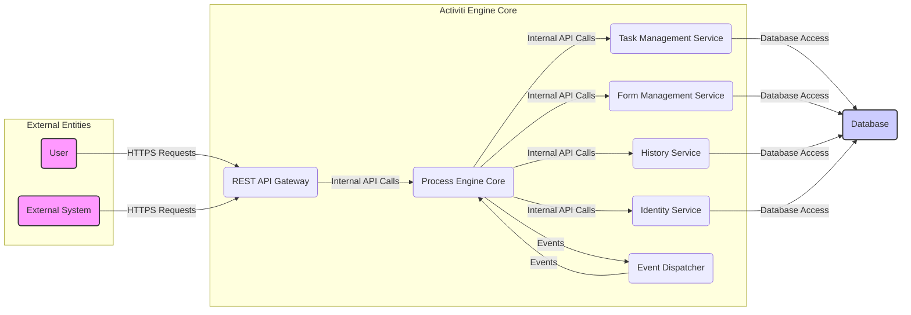
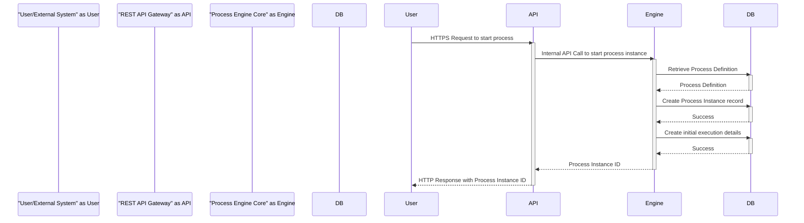
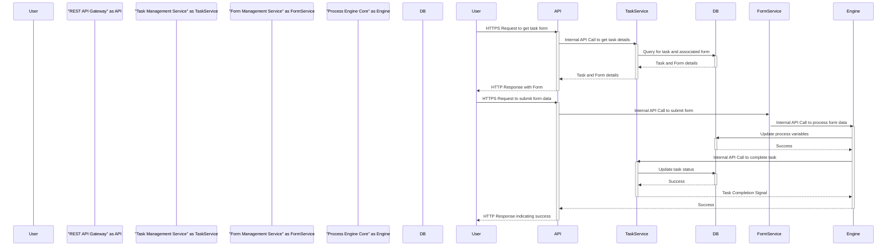

## Project Design Document: Activiti BPM Engine (Improved)

**1. Introduction**

*   **1.1 Purpose:** This document provides a detailed architectural design overview of the Activiti Business Process Management (BPM) engine, specifically tailored for threat modeling. It aims to clearly outline the system's components, interactions, and data flows to facilitate the identification of potential security vulnerabilities.
*   **1.2 Scope:** This document encompasses the core architectural components of the Activiti engine, their primary functionalities, and the interactions between them, including external interfaces. The focus is on aspects relevant to understanding data flow, trust boundaries, and potential attack surfaces. It does not delve into the specifics of individual process definitions or deployment environments unless generally applicable.
*   **1.3 Audience:** This document is intended for security architects, threat modelers, software developers, and operations teams responsible for deploying, managing, and securing applications utilizing the Activiti engine.

**2. System Overview**

*   **2.1 System Description:** Activiti is a Java-based, embeddable BPM engine designed for modeling, automating, and managing business processes. Its key strength lies in its lightweight nature and ability to be integrated into various Java applications. It adheres to the BPMN 2.0 standard for process definition.
*   **2.2 Key Features:**
    *   BPMN 2.0 compliant process execution engine.
    *   Support for a wide range of BPMN constructs (e.g., user tasks, service tasks, exclusive gateways, parallel gateways, timer events).
    *   Comprehensive task management capabilities, including assignment, claiming, delegation, and completion.
    *   Form management for user interaction and data capture.
    *   Historical data tracking of process execution, including activity instances, variable changes, and audit logs.
    *   A well-defined REST API for external integration and programmatic access to engine functionalities.
    *   Embeddability within Java applications, allowing for tight integration with existing systems.
    *   Pluggable architecture supporting various data persistence mechanisms and identity management solutions.
    *   Identity management for managing users, groups, and their roles within the engine.
*   **2.3 High-Level Architecture Diagram:**

**3. Detailed Component Design**

*   **3.1 REST API Gateway:**
    *   **Description:** The primary entry point for external interactions with the Activiti engine, providing a RESTful interface. This component acts as a gateway, potentially handling authentication, authorization, and request routing.
    *   **Functionality:**
        *   Receiving and processing HTTP requests for process definition management, process instance manipulation, task management, form handling, and historical data retrieval.
        *   Potentially enforcing authentication and authorization policies before forwarding requests to internal services.
        *   Translating HTTP requests and responses to internal service calls and data structures.
    *   **Technology:** Typically implemented using frameworks like Spring MVC or JAX-RS. May include security filters or interceptors.
    *   **Potential Entry Points (Attack Surface):** Publicly exposed HTTP endpoints (e.g., `/process-definitions`, `/runtime/process-instances`, `/runtime/tasks`). Vulnerabilities here could expose internal functionalities.
    *   **Data Formats:** Primarily JSON for request and response bodies.

*   **3.2 Process Engine Core:**
    *   **Description:** The central component responsible for interpreting and executing process definitions. It manages the lifecycle of process instances and orchestrates the execution of activities.
    *   **Functionality:**
        *   Parsing and validating BPMN 2.0 process definitions.
        *   Creating, managing, and tracking the state of process instances.
        *   Executing process elements (e.g., tasks, gateways, events, service calls).
        *   Managing process variables and data.
        *   Interacting with other internal services (Task Management, Form Management, History, Identity) to delegate specific functionalities.
    *   **Technology:** Core Java classes and libraries within the Activiti engine.
    *   **Internal Interactions:** Communicates with other services via Java APIs and event mechanisms. Secure communication channels within the application are assumed.
    *   **Security Considerations:** Vulnerabilities in process definition parsing or execution could lead to arbitrary code execution or denial of service.

*   **3.3 Task Management Service:**
    *   **Description:** Responsible for managing user tasks within running process instances.
    *   **Functionality:**
        *   Creating and assigning tasks to users or groups based on process definitions and business rules.
        *   Providing mechanisms for users to query, claim, and complete their assigned tasks.
        *   Managing task lifecycle events (e.g., creation, assignment, completion).
    *   **Technology:** Java-based service within the Activiti engine.
    *   **Data Storage:** Task-related data (e.g., assignee, due date, priority) is persisted in the database. Access control to task data is crucial.
    *   **Security Considerations:** Improper access control could allow unauthorized users to view or manipulate tasks.

*   **3.4 Form Management Service:**
    *   **Description:** Handles the rendering and submission of forms associated with user tasks, enabling user interaction within processes.
    *   **Functionality:**
        *   Retrieving form definitions associated with tasks (can be embedded in process definitions or stored separately).
        *   Rendering forms dynamically for user input.
        *   Processing submitted form data and updating process variables.
        *   Potentially validating form data.
    *   **Technology:** Java-based service. May involve UI rendering libraries or frameworks.
    *   **Data Storage:** Form definitions and potentially submitted data are stored in the database.
    *   **Security Considerations:** Vulnerabilities in form rendering or data processing could lead to cross-site scripting (XSS) or data injection attacks.

*   **3.5 History Service:**
    *   **Description:** Records historical data about process execution for auditing, reporting, and analysis purposes.
    *   **Functionality:**
        *   Storing information about completed process instances, tasks, and activities.
        *   Tracking changes to process variables throughout the execution lifecycle.
        *   Providing query capabilities for accessing historical data.
    *   **Technology:** Java-based service.
    *   **Data Storage:** Historical data is persisted in the database. Access control to historical data is important to maintain confidentiality and prevent unauthorized access to sensitive information.
    *   **Security Considerations:**  Sensitive data stored in the history should be protected. Unauthorized access to the history could reveal confidential business information.

*   **3.6 Identity Service:**
    *   **Description:** Manages users, groups, and their roles within the Activiti engine. This service handles authentication and authorization.
    *   **Functionality:**
        *   Creating, updating, and deleting users and groups.
        *   Managing user group memberships and roles.
        *   Authenticating users (can be internal or delegated to external identity providers via pluggable interfaces).
        *   Authorizing access to resources and tasks based on user roles and permissions.
    *   **Technology:** Java-based service with pluggable interfaces for integrating with different identity providers (e.g., LDAP, Active Directory, OAuth 2.0).
    *   **Data Storage:** User and group information is stored in the database. Secure storage of credentials (e.g., password hashes) is critical.
    *   **Security Considerations:**  A compromised Identity Service could grant unauthorized access to the entire system. Secure authentication and authorization mechanisms are paramount.

*   **3.7 Event Dispatcher:**
    *   **Description:** A mechanism for publishing and subscribing to events within the Activiti engine, allowing for asynchronous communication and decoupling of components.
    *   **Functionality:**
        *   Dispatching events related to process instance lifecycle (e.g., start, end), task events (e.g., creation, completion), and other significant occurrences.
        *   Allowing other internal components or external systems to subscribe to and react to these events.
    *   **Technology:** Typically uses an observer pattern or a message queue implementation.
    *   **Security Considerations:**  Care must be taken to ensure that event data is not tampered with and that only authorized components can subscribe to sensitive events.

*   **3.8 Database:**
    *   **Description:** The persistent storage layer for the Activiti engine, storing all core data.
    *   **Functionality:**
        *   Storing process definitions (BPMN XML).
        *   Storing process instance state, variables, and execution history.
        *   Storing task information, including assignments and status.
        *   Storing form definitions and submitted data.
        *   Storing user and group information, including credentials.
    *   **Technology:** Supports various relational databases (e.g., MySQL, PostgreSQL, Oracle).
    *   **Access:** Accessed by all core services of the Activiti engine. Database access should be secured with strong authentication and authorization.
    *   **Security Considerations:** The database is a critical asset. It must be protected against unauthorized access, data breaches, and data integrity violations. Encryption at rest and in transit is crucial for sensitive data.

**4. Data Flow Diagrams**

*   **4.1 Process Instance Initiation via REST API:**

*   **4.2 User Task Completion with Form Submission:**

**5. Security Considerations (Detailed for Threat Modeling)**

*   **5.1 Authentication and Authorization:**
    *   **Threats:** Brute-force attacks on login credentials, credential stuffing, unauthorized access due to weak or default credentials, privilege escalation.
    *   **Considerations:**  Enforce strong password policies, implement multi-factor authentication, securely store password hashes, utilize established authentication protocols (e.g., OAuth 2.0, SAML), implement robust role-based access control (RBAC) to restrict access based on user roles. Ensure proper authorization checks are in place for all API endpoints and internal service calls.
*   **5.2 Input Validation:**
    *   **Threats:** Injection attacks (SQL injection, command injection, LDAP injection, XML injection), cross-site scripting (XSS), cross-site request forgery (CSRF).
    *   **Considerations:**  Implement strict input validation on all data received via the REST API and within process definitions. Sanitize user-provided data before using it in database queries or rendering it in web pages. Utilize parameterized queries to prevent SQL injection. Implement CSRF protection mechanisms.
*   **5.3 Data Protection:**
    *   **Threats:** Data breaches, unauthorized access to sensitive data, data tampering, loss of confidentiality.
    *   **Considerations:** Encrypt sensitive data at rest in the database (e.g., using database encryption features or application-level encryption). Use HTTPS for all communication between clients and the REST API gateway to protect data in transit. Implement access controls to restrict access to sensitive data based on the principle of least privilege.
*   **5.4 Access Control:**
    *   **Threats:** Unauthorized access to process definitions, modification of running process instances, unauthorized task manipulation, access to sensitive historical data.
    *   **Considerations:** Implement granular access control policies for process definitions, process instances, tasks, and historical data. Ensure that only authorized users can deploy, start, modify, or view specific processes and data.
*   **5.5 Logging and Auditing:**
    *   **Threats:** Failure to detect security incidents, difficulty in forensic analysis, lack of accountability.
    *   **Considerations:** Implement comprehensive logging of security-relevant events, including authentication attempts, authorization failures, data access, and modifications. Securely store audit logs and protect them from tampering. Regularly review audit logs for suspicious activity.
*   **5.6 Dependency Management:**
    *   **Threats:** Exploitation of known vulnerabilities in third-party libraries and frameworks.
    *   **Considerations:** Maintain an inventory of all dependencies used by Activiti and the embedding application. Regularly update dependencies to the latest versions to patch known vulnerabilities. Implement a vulnerability scanning process for dependencies.
*   **5.7 Process Definition Security:**
    *   **Threats:** Deployment of malicious process definitions that could compromise the system or access sensitive data.
    *   **Considerations:** Implement mechanisms to validate and verify process definitions before deployment. Restrict who can deploy process definitions. Consider static analysis of process definitions for potential security risks.
*   **5.8 Event Handling Security:**
    *   **Threats:** Tampering with event data, unauthorized subscription to sensitive events, injection of malicious events.
    *   **Considerations:** Implement mechanisms to ensure the integrity and authenticity of events. Control which components can publish and subscribe to specific events.

**6. Assumptions and Constraints**

*   **6.1 Assumptions:**
    *   The underlying infrastructure (operating system, network) is assumed to be reasonably secure.
    *   Database access is secured through appropriate authentication and authorization mechanisms.
    *   Secure coding practices are followed during the development of any custom extensions or integrations.
*   **6.2 Constraints:**
    *   This design document provides a general overview and may not cover all specific deployment configurations.
    *   The security posture of the Activiti engine is dependent on its configuration and the security measures implemented by the integrating application.

**7. Future Considerations**

*   Conduct a detailed threat modeling exercise using methodologies like STRIDE or PASTA, leveraging this design document.
*   Perform security code reviews of custom extensions and integrations.
*   Implement penetration testing to identify potential vulnerabilities in the deployed system.
*   Evaluate the security implications of specific BPMN constructs and their potential for misuse.
*   Investigate the security features and best practices for securing the chosen database system.
*   Develop and implement security monitoring and alerting mechanisms for the Activiti engine.

This improved design document provides a more detailed and security-focused overview of the Activiti BPM engine, serving as a solid foundation for comprehensive threat modeling activities.
