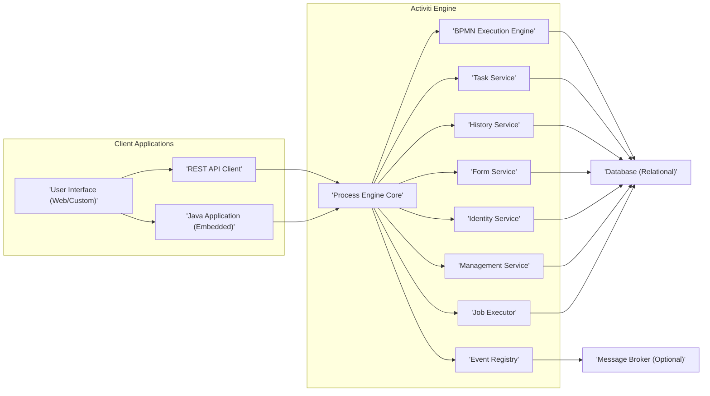

# Project Design Document: Activiti BPM Engine

**Version:** 1.1
**Date:** October 26, 2023
**Author:** AI Software Architect

## 1. Introduction

This document provides an enhanced and detailed architectural design of the Activiti Business Process Management (BPM) engine project, based on the information available in the provided GitHub repository: [https://github.com/activiti/activiti](https://github.com/activiti/activiti). This document aims to provide a comprehensive and improved overview of the system's components, their interactions, and key considerations for security and deployment. This refined document will serve as a stronger foundation for subsequent threat modeling activities.

## 2. Goals and Objectives

The primary goal of Activiti is to provide a lightweight, embeddable, and extensible BPM engine for executing business processes defined using BPMN 2.0. Key objectives include:

*   **Robust Process Execution:**  Reliably orchestrate and execute complex business processes defined in BPMN 2.0, handling various process constructs and events.
*   **Efficient Task Management:**  Provide a flexible and efficient system for managing user tasks, including assignment strategies, delegation, and escalation.
*   **Seamless Integration:** Offer well-defined APIs (REST and Java) for seamless integration with diverse applications and services.
*   **Developer Extensibility:**  Enable developers to extend the engine's core functionality through listeners, interceptors, and custom services.
*   **Reliable Persistence:**  Ensure the persistent storage of process state, data, and history using a relational database.
*   **Scalable Performance:**  Support varying workloads and user volumes with efficient resource utilization and potential for horizontal scaling.
*   **Comprehensive Monitoring and Management:** Provide tools and APIs for real-time monitoring of running processes, managing deployments, and performing administrative tasks.

## 3. Architectural Overview

Activiti employs a modular architecture, with distinct components interacting to deliver the complete BPM functionality.

### 3.1. High-Level Architecture Diagram

### 3.2. Component Descriptions

*   **Client Applications:**
    *   **User Interface (Web/Custom):** Presents a graphical interface enabling users to interact with running processes. This includes viewing task lists, claiming and completing tasks, submitting forms, and monitoring process status. This can be the provided Activiti UI or a custom-built application tailored to specific business needs.
    *   **REST API Client:** Allows external applications and services to programmatically interact with the Activiti engine through a well-defined RESTful API. This includes starting process instances, querying tasks, submitting form data, and managing deployments.
    *   **Java Application (Embedded):** Facilitates the direct integration of the Activiti engine within a Java application. This allows for tight coupling and direct access to the engine's API, suitable for applications requiring deep BPM integration.

*   **Activiti Engine:**
    *   **Process Engine Core:** The central orchestrator, responsible for managing the lifecycle of process definitions and instances. It provides core services for deployment, process instance creation, and overall engine management.
    *   **BPMN Execution Engine:** Interprets and executes BPMN 2.0 process definitions. This component traverses the process flow, executes activities (including service tasks and user tasks), evaluates gateways, and manages process variables.
    *   **Task Service:** Manages all aspects of user tasks within running processes. This includes creating tasks, assigning them to users or groups based on defined rules, allowing users to claim and complete tasks, and managing task lifecycle events.
    *   **History Service:** Records detailed historical data about process instances, tasks, variables, and activities. This data is crucial for auditing, reporting, and process analysis. It provides insights into process execution flow and performance.
    *   **Form Service:**  Handles the management of forms associated with user tasks and start events. It allows for the definition and rendering of forms, and the submission and validation of form data.
    *   **Identity Service:** Manages users, groups, and their relationships. This component is responsible for authentication (verifying user identity) and authorization (determining user permissions to access resources and perform actions). It can be integrated with external identity providers.
    *   **Management Service:** Provides administrative operations for the engine. This includes deploying and undeploying process definitions, managing job execution (for asynchronous tasks), accessing engine metrics, and performing database schema management.
    *   **Event Registry:**  Handles internal engine events and can be configured to integrate with external event systems. This allows for reacting to process events and triggering actions in other systems.
    *   **Job Executor:**  Responsible for asynchronously executing tasks, such as timers and asynchronous service tasks. This component ensures that long-running or potentially blocking operations do not tie up the main process execution thread.

*   **Infrastructure:**
    *   **Database (Relational):**  The persistent storage for all engine data, including process definitions, process instance state, task details, historical records, user and group information, and job definitions. The choice of database can impact performance and scalability.
    *   **Message Broker (Optional):**  Enables asynchronous communication and event handling, particularly useful for integrating with external systems or for decoupling components within a distributed deployment.

## 4. Data Flow

The following details the typical data flow within the Activiti engine during process execution:

1. **Process Definition Deployment:** A BPMN 2.0 XML file defining a business process is deployed to the engine. This is typically done through the Management Service or the REST API. The engine parses the XML, validates it, and stores the process definition (including its structure and elements) in the database.
2. **Process Instance Initiation:** A client application (UI, API, or embedded application) sends a request to the Process Engine Core to start a new instance of a specific deployed process definition. This request may include initial process variables.
3. **Process Execution and Task Creation:** The BPMN Execution Engine takes over, interpreting the process definition and executing the first set of activities. When a user task is encountered, the Task Service creates a corresponding task instance in the database, including details like assignee, due date, and priority.
4. **Task Assignment and User Interaction:** The Task Service determines the appropriate user or group to assign the task to, based on the process definition. The user can then access their task list through the User Interface or API. Upon claiming a task, the assignee is recorded.
5. **Form Data Submission:** If the user task has an associated form, the user fills out the form in the UI and submits the data. This form data is validated by the Form Service and then stored as process variables.
6. **Process Variable Updates:** Throughout the process execution, process variables are created, updated, and accessed by various activities and services. These variables store data relevant to the specific process instance.
7. **Service Task Execution:** When a service task is encountered, the BPMN Execution Engine invokes the associated logic. This might involve calling an external service via REST, sending a message to a message broker, or executing custom Java code.
8. **Gateway Evaluation:** When the execution flow reaches a gateway (e.g., exclusive gateway, parallel gateway), the BPMN Execution Engine evaluates the conditions defined in the gateway to determine the next path(s) to follow.
9. **History Data Recording:** The History Service passively listens to events within the engine and records detailed information about process instance progress, task completion, variable changes, and other relevant events in the history tables of the database.
10. **Asynchronous Job Execution:** If the process definition includes asynchronous activities (e.g., asynchronous service tasks, timers), the Job Executor picks up these jobs from the database and executes them in the background, ensuring non-blocking process execution.
11. **External System Communication:** Service tasks can interact with external systems by sending data (e.g., order details) or receiving data (e.g., payment confirmation). This communication often involves REST APIs or message queues.
12. **Process Instance Completion:** Once the final activity in the process definition is reached, the process instance is marked as completed, and the final state and history are recorded.

## 5. Security Considerations

Security is paramount for the Activiti engine, protecting sensitive business process data and ensuring authorized access. Key areas of concern include:

*   **Authentication and Authorization:**
    *   **User Authentication Mechanisms:**  Activiti supports various authentication methods to verify user identities, including username/password authentication against its internal user store or integration with external systems like LDAP, Active Directory, or OAuth 2.0 providers. Threats include unauthorized access due to weak passwords or compromised credentials.
    *   **Role-Based Access Control (RBAC):** Activiti's Identity Service allows defining roles and assigning permissions to these roles. Users are then assigned to roles, granting them access to specific process definitions, tasks, and administrative functions. Improperly configured RBAC can lead to privilege escalation or unauthorized data access.
    *   **Authorization Enforcement Points:** Authorization checks should be enforced at various points, including when starting process instances, claiming tasks, completing tasks, accessing historical data, and performing administrative operations. Missing or weak authorization checks can lead to unauthorized actions.

*   **Data Security:**
    *   **Data at Rest Encryption:** Sensitive process data stored in the database (including process variables and historical data) should be encrypted using database-level encryption or transparent data encryption (TDE). Lack of encryption exposes sensitive data in case of a database breach.
    *   **Data in Transit Encryption:** All communication channels, especially between client applications and the Activiti engine (e.g., REST API calls), must be secured using HTTPS/TLS to prevent eavesdropping and man-in-the-middle attacks.
    *   **Sensitive Process Variable Handling:**  Care should be taken when handling sensitive data within process variables. Consider encrypting sensitive variables or using secure vault solutions to store and manage sensitive information instead of directly embedding it in process variables.

*   **Input Validation:**
    *   **BPMN Process Definition Validation:**  The engine should rigorously validate deployed BPMN 2.0 definitions to prevent the deployment of malicious or malformed processes that could lead to denial-of-service or other attacks.
    *   **Form Data Sanitization and Validation:**  User input submitted through forms must be thoroughly sanitized and validated on both the client-side and server-side to prevent injection attacks (e.g., SQL injection, cross-site scripting).
    *   **REST API Input Validation:**  All input received through the REST API should be validated against expected data types and formats to prevent injection attacks and ensure data integrity.

*   **Logging and Auditing:**
    *   **Comprehensive Audit Logging:**  Maintain detailed and auditable logs of all significant events, including user logins, process instance starts and completions, task assignments and completions, administrative actions, and security-related events. This is crucial for security monitoring and incident response.
    *   **Secure Log Storage and Access Control:**  Audit logs should be stored securely and access to these logs should be restricted to authorized personnel to prevent tampering or unauthorized viewing.

*   **Dependency Management:**
    *   **Third-Party Library Vulnerabilities:** Regularly scan and update all third-party libraries and dependencies used by Activiti to address known security vulnerabilities. Outdated dependencies are a common attack vector.
    *   **Supply Chain Security:**  Ensure the integrity and security of the software supply chain for Activiti and its dependencies.

*   **Deployment Security:**
    *   **Secure Configuration Practices:**  Follow secure configuration guidelines for the Activiti engine, database, and application server. This includes disabling unnecessary features, setting strong passwords, and configuring appropriate access controls.
    *   **Network Segmentation and Firewall Rules:**  Implement network segmentation and firewall rules to restrict access to the Activiti engine and its associated infrastructure to only authorized networks and ports.
    *   **Regular Security Assessments:**  Conduct regular security assessments, including penetration testing and vulnerability scanning, to identify and address potential security weaknesses.

## 6. Deployment Considerations

Activiti offers flexible deployment options, each with its own security and scalability implications:

*   **Embedded within a Java Application:**  Deploying Activiti as a library within a Java application offers tight integration but requires careful consideration of the application's overall security posture. Security vulnerabilities in the embedding application can directly impact the engine.
*   **Standalone Server (e.g., Tomcat, Jetty):** Deploying Activiti as a web application on a standalone server provides better isolation but requires securing the application server itself. This includes configuring HTTPS, managing user access to the server, and keeping the server software up-to-date.
*   **Containerized Deployment (Docker, Kubernetes):** Deploying Activiti in containers offers scalability and portability. Security considerations include securing the container images, managing container orchestration security (e.g., Kubernetes RBAC), and securing network communication between containers.
*   **Cloud Environments (AWS, Azure, GCP):** Deploying Activiti on cloud platforms leverages the cloud provider's infrastructure and security services. Considerations include configuring appropriate network security groups, identity and access management (IAM) roles, and utilizing cloud-specific security features like encryption at rest and in transit.

Deployment considerations also include:

*   **Database Selection and Configuration:** Choosing a database that meets performance and security requirements and configuring it securely (e.g., strong passwords, network restrictions, encryption).
*   **Resource Provisioning:**  Allocating sufficient CPU, memory, and storage resources based on anticipated workload and ensuring proper resource isolation in multi-tenant environments.
*   **Scalability and High Availability Design:** Implementing strategies for horizontal scaling (running multiple engine instances) and ensuring high availability through load balancing and failover mechanisms.
*   **Monitoring and Alerting Setup:**  Configuring monitoring tools to track engine performance, resource utilization, and security-related events, and setting up alerts for critical issues.

## 7. Technologies Used

Based on the GitHub repository, key technologies employed by Activiti include:

*   **Java (Programming Language):** The core language for the Activiti engine.
*   **BPMN 2.0 (Process Modeling Standard):** The standard used to define business processes.
*   **Spring Framework (Dependency Injection, Transaction Management):** Provides core infrastructure and simplifies development.
*   **MyBatis (ORM Framework):**  Handles the mapping between Java objects and database tables.
*   **REST (API Design):**  Used for providing a programmatic interface to the engine.
*   **JSON (Data Exchange Format):**  The primary format for data exchange in the REST API.
*   **Maven (Build Management):**  Used for managing project dependencies and building the application.
*   **Git (Version Control):**  Used for managing the source code.

## 8. Future Considerations

Potential future enhancements and considerations for Activiti include:

*   **Enhanced Cloud-Native Support:**  Further optimizing the engine for cloud environments, potentially adopting a microservices architecture for improved scalability and resilience.
*   **Advanced Security Features:**  Implementing more granular access control mechanisms, enhanced data encryption options (e.g., field-level encryption), and integration with modern security protocols.
*   **Improved Integration Capabilities:**  Expanding integration options with modern technologies like serverless functions, event streaming platforms, and AI/ML services.
*   **Enhanced Monitoring and Observability:**  Providing richer monitoring dashboards, distributed tracing capabilities, and more comprehensive metrics for better insights into process execution and performance.
*   **Support for Emerging Standards:**  Adapting to new BPMN standards and related technologies.

This improved design document provides a more detailed and comprehensive overview of the Activiti BPM engine's architecture, data flow, and security considerations. This enhanced understanding will significantly benefit the subsequent threat modeling process, enabling a more thorough identification of potential vulnerabilities and the development of robust mitigation strategies.