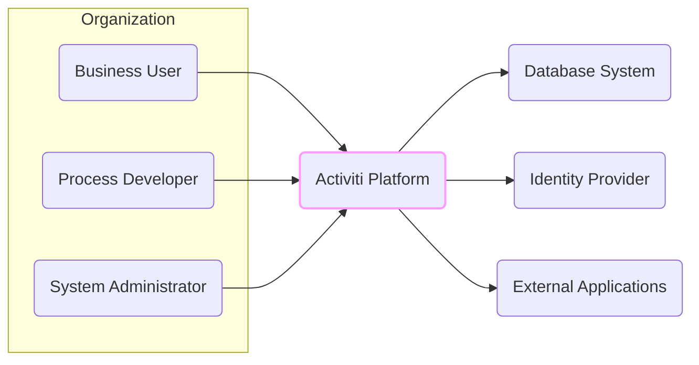
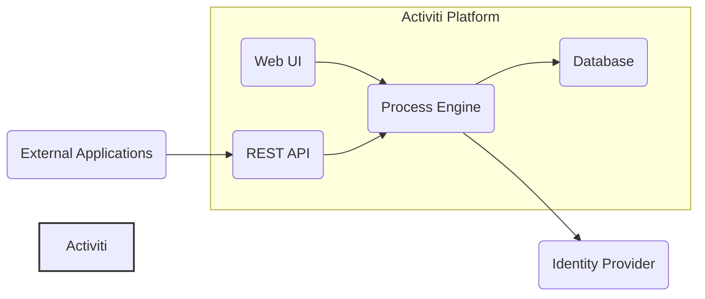

# BUSINESS POSTURE

The Activiti project aims to provide a flexible and powerful open-source Business Process Management (BPM) platform. The primary business goal is to enable organizations to automate and optimize their business processes, improving efficiency, reducing operational costs, and enhancing business agility. This is achieved by providing tools and an engine for designing, deploying, executing, and monitoring workflows and business rules.

Key business priorities for organizations adopting Activiti would include:
- Process Automation: Streamlining and automating repetitive tasks and workflows to improve operational efficiency.
- Digital Transformation: Enabling digital transformation initiatives by providing a platform for managing and automating business processes in a digital environment.
- Business Agility: Increasing responsiveness to changing business needs by allowing for rapid modification and deployment of business processes.
- Compliance and Governance: Ensuring processes are executed consistently and in compliance with regulations and internal policies.
- Operational Visibility: Gaining insights into process performance and identifying areas for improvement through monitoring and reporting capabilities.

Most important business risks associated with the Activiti project include:
- Data Integrity and Confidentiality: Business processes often handle sensitive data. Risks include data breaches, unauthorized access, and data manipulation, which could lead to financial loss, reputational damage, and regulatory penalties.
- Business Disruption: Failures in the BPM system can disrupt critical business processes, leading to operational downtime and financial losses.
- Compliance Violations: Incorrectly designed or executed processes can lead to non-compliance with industry regulations and legal requirements.
- Integration Complexity: Integrating Activiti with existing systems and applications can be complex and introduce vulnerabilities if not handled securely.
- Vendor Lock-in (though Activiti is open source, reliance on specific expertise or customizations can create a form of lock-in): Over-reliance on specific skills or customizations around Activiti can make it difficult to switch platforms or upgrade, potentially hindering future agility.

# SECURITY POSTURE

Existing security controls for the Activiti project, based on typical open-source project practices and common BPM system security considerations:

- security control: Access Control to GitHub Repository: Implemented via GitHub's role-based access control, managing who can contribute to the codebase. Described in GitHub repository settings.
- security control: Code Review Process: Likely implemented through pull requests and peer reviews on GitHub, aiming to catch vulnerabilities before code merges. Described in project contribution guidelines (if available) and typical open-source development workflows.
- security control: Software Composition Analysis (SCA): Potentially used to scan dependencies for known vulnerabilities. Tooling and reports location are project specific and might not be publicly documented.
- security control: Static Application Security Testing (SAST): Potentially used to scan the codebase for potential vulnerabilities. Tooling and reports location are project specific and might not be publicly documented.
- security control: Input Validation: Implemented within the Activiti codebase to validate user inputs and prevent injection attacks. Location is within the codebase, specifically in API endpoints and process engine components.
- security control: Authentication and Authorization: Implemented within Activiti to control access to the platform and its functionalities. Location is within the Activiti engine and security modules.
- security control: Encryption in Transit (HTTPS): Recommended for accessing Activiti web interfaces and APIs. Deployment specific, configured in web server or application server.
- security control: Database Security: Relies on underlying database security controls for data at rest. Configured and managed at the database level.

Accepted risks for the Activiti project, based on typical open-source project and BPM system considerations:

- accepted risk: Vulnerabilities in Dependencies: Open-source projects rely on numerous dependencies, which may contain undiscovered vulnerabilities. Mitigation relies on timely updates and SCA.
- accepted risk: Community-Driven Security Patching: Security patching relies on the open-source community, which might have slower response times compared to commercial vendors.
- accepted risk: Configuration Errors: Misconfiguration of Activiti and its deployment environment can introduce security vulnerabilities. Mitigation relies on clear documentation and secure deployment practices.
- accepted risk: Injection Vulnerabilities: Despite input validation, there's always a risk of undiscovered injection vulnerabilities in complex systems. Mitigation relies on ongoing security testing and code reviews.

Recommended security controls to implement for high priority:

- recommended security control: Dynamic Application Security Testing (DAST): Implement DAST to identify runtime vulnerabilities in deployed Activiti instances.
- recommended security control: Penetration Testing: Conduct regular penetration testing to simulate real-world attacks and identify weaknesses in the system.
- recommended security control: Security Awareness Training: Provide security awareness training for developers, administrators, and users of Activiti to reduce human error related security risks.
- recommended security control: Security Logging and Monitoring: Implement comprehensive security logging and monitoring to detect and respond to security incidents.
- recommended security control: Incident Response Plan: Develop and maintain an incident response plan to effectively handle security breaches and incidents.
- recommended security control: Secure Configuration Management: Implement secure configuration management practices to ensure consistent and secure configurations across all Activiti environments.

Security Requirements for the Activiti project:

- Authentication:
    - Requirement: Securely authenticate users accessing Activiti web interfaces, APIs, and administrative tools.
    - Requirement: Support multiple authentication mechanisms, including username/password, LDAP/Active Directory, and potentially SSO (Single Sign-On) protocols like OAuth 2.0 or SAML.
    - Requirement: Implement strong password policies, including password complexity, rotation, and lockout mechanisms.

- Authorization:
    - Requirement: Implement fine-grained authorization to control access to Activiti functionalities and data based on user roles and permissions.
    - Requirement: Enforce role-based access control (RBAC) to manage user permissions effectively.
    - Requirement: Ensure that users can only access and modify processes and data they are authorized to interact with.

- Input Validation:
    - Requirement: Validate all user inputs at every entry point to prevent injection attacks (e.g., SQL injection, Cross-Site Scripting (XSS), command injection).
    - Requirement: Use parameterized queries or prepared statements to prevent SQL injection.
    - Requirement: Sanitize user inputs before displaying them in web interfaces to prevent XSS.

- Cryptography:
    - Requirement: Protect sensitive data at rest and in transit using strong encryption algorithms.
    - Requirement: Encrypt sensitive data in the database, such as passwords, personal information, and confidential business data.
    - Requirement: Use HTTPS to encrypt communication between clients and the Activiti server.
    - Requirement: Securely manage cryptographic keys and certificates.

# DESIGN

## C4 CONTEXT



Context Diagram Elements:

- Element:
    - Name: Business User
    - Type: Person
    - Description: End users who interact with business processes managed by Activiti, often through web applications or custom interfaces. They initiate tasks, complete forms, and monitor process instances.
    - Responsibilities: Interacting with business processes, providing data, and making decisions within workflows.
    - Security controls: Authentication to access applications interacting with Activiti, authorization to perform actions within processes.

- Element:
    - Name: Process Developer
    - Type: Person
    - Description: Developers who design, build, and deploy business processes using Activiti's modeling tools and APIs. They create process definitions, integrate Activiti with other systems, and customize the platform.
    - Responsibilities: Designing and implementing business processes, integrating Activiti with other systems, and maintaining process definitions.
    - Security controls: Access control to Activiti design tools, version control for process definitions, secure development practices.

- Element:
    - Name: System Administrator
    - Type: Person
    - Description: Administrators responsible for installing, configuring, and maintaining the Activiti platform. They manage users, monitor system performance, and ensure the platform's availability and security.
    - Responsibilities: Platform installation, configuration, user management, security management, monitoring, and maintenance.
    - Security controls: Strong authentication and authorization for administrative access, audit logging of administrative actions, secure configuration management.

- Element:
    - Name: Activiti Platform
    - Type: Software System
    - Description: The core Business Process Management (BPM) platform that provides the engine for executing business processes, APIs for integration, and tools for process design and management.
    - Responsibilities: Process execution, process instance management, task management, API provision, process design and modeling, user and group management, security enforcement.
    - Security controls: Authentication, authorization, input validation, secure session management, audit logging, encryption of sensitive data, secure API design.

- Element:
    - Name: Database System
    - Type: Software System
    - Description: The database used by Activiti to persist process definitions, process instance data, task data, user information, and other platform data.
    - Responsibilities: Data persistence, data integrity, data availability, data security.
    - Security controls: Access control to the database, encryption at rest, regular backups, database auditing, vulnerability management.

- Element:
    - Name: Identity Provider
    - Type: Software System
    - Description: An external system responsible for managing user identities and authentication. Activiti can integrate with identity providers like LDAP, Active Directory, or OAuth 2.0 providers for user authentication.
    - Responsibilities: User authentication, user identity management, providing user information to Activiti.
    - Security controls: Secure authentication mechanisms, secure user data storage, access control, audit logging.

- Element:
    - Name: External Applications
    - Type: Software System
    - Description: Other software applications within the organization that interact with Activiti. These applications might initiate processes, receive notifications, or exchange data with running processes through Activiti's APIs.
    - Responsibilities: Integration with business processes, data exchange with Activiti, triggering process execution.
    - Security controls: Secure API communication (e.g., API keys, OAuth 2.0), input validation, authorization to access Activiti APIs.

## C4 CONTAINER



Container Diagram Elements:

- Element:
    - Name: Process Engine
    - Type: Container - Java Application
    - Description: The core component of Activiti, responsible for executing business processes defined in BPMN. It manages process instances, tasks, events, and interacts with the database and identity provider.
    - Responsibilities: Process execution, state management, task management, event handling, integration with database and identity provider, authorization enforcement.
    - Security controls: Input validation, authorization checks, secure session management, secure communication with database and identity provider, logging of security events.

- Element:
    - Name: REST API
    - Type: Container - Java Application
    - Description: Provides a RESTful API for external applications and the Web UI to interact with the Process Engine. It allows for starting processes, managing tasks, querying process data, and administering the platform.
    - Responsibilities: Exposing Activiti functionalities through REST APIs, handling API requests, input validation, authorization, communication with the Process Engine.
    - Security controls: API authentication (e.g., OAuth 2.0, API keys), API authorization, input validation, rate limiting, secure communication (HTTPS), API documentation and security guidelines.

- Element:
    - Name: Web UI
    - Type: Container - Web Application (JavaScript, HTML, CSS)
    - Description: A web-based user interface for process designers, business users, and administrators to interact with Activiti. It provides tools for process modeling, task management, process monitoring, and administration.
    - Responsibilities: User interface for Activiti functionalities, process modeling, task management, process monitoring, administration, user authentication and authorization (delegated to REST API).
    - Security controls: Input validation on the client-side and server-side (via REST API), secure session management, protection against XSS and CSRF attacks, authorization checks (delegated to REST API), secure communication (HTTPS).

- Element:
    - Name: Database
    - Type: Container - Database System (e.g., PostgreSQL, MySQL, H2)
    - Description: The relational database used by the Process Engine to persist all runtime and historical data, including process definitions, process instances, tasks, variables, and user information.
    - Responsibilities: Persistent storage of Activiti data, data integrity, data availability, data security.
    - Security controls: Database access control, database authentication, encryption at rest (if supported by database), regular backups, database auditing, vulnerability patching.

## DEPLOYMENT

Deployment Architecture Option: Cloud Deployment (Example using Kubernetes)

```mermaid
graph LR
    subgraph "Kubernetes Cluster"
        subgraph "Nodes"
            D1("Node 1")
            D2("Node 2")
        end
        subgraph "Namespaces"
            subgraph "activiti-namespace"
                P1("Process Engine Pod")
                R1("REST API Pod")
                W1("Web UI Pod")
            end
            subgraph "database-namespace"
                DB1("Database Pod")
            end
        end
        ING("Ingress Controller")
    end
    EXT("External Network")

    EXT --> ING --> W1
    EXT --> ING --> R1
    P1 --> DB1
    R1 --> P1
    W1 --> R1

    style "Kubernetes Cluster" fill:#f9f,stroke:#333,stroke-width:2px
```

Deployment Diagram Elements (Cloud Deployment - Kubernetes):

- Element:
    - Name: Kubernetes Cluster
    - Type: Infrastructure - Cloud Platform
    - Description: A Kubernetes cluster providing the container orchestration platform for deploying and managing Activiti components.
    - Responsibilities: Container orchestration, resource management, scalability, high availability, infrastructure security.
    - Security controls: Network policies, RBAC for Kubernetes API access, container security scanning, infrastructure security hardening, regular security updates.

- Element:
    - Name: Nodes (Node 1, Node 2)
    - Type: Infrastructure - Virtual Machines/Physical Servers
    - Description: Worker nodes in the Kubernetes cluster where Activiti pods are deployed.
    - Responsibilities: Running containerized applications, providing compute resources, network connectivity, storage.
    - Security controls: Operating system hardening, security patching, access control, monitoring, intrusion detection.

- Element:
    - Name: Namespaces (activiti-namespace, database-namespace)
    - Type: Infrastructure - Kubernetes Namespaces
    - Description: Kubernetes namespaces providing logical isolation for Activiti components and database components.
    - Responsibilities: Resource isolation, access control within namespaces, logical grouping of resources.
    - Security controls: Kubernetes RBAC for namespace access control, network policies to restrict traffic between namespaces.

- Element:
    - Name: Process Engine Pod
    - Type: Deployment Unit - Kubernetes Pod
    - Description: A Kubernetes pod containing the Process Engine container.
    - Responsibilities: Running the Process Engine application, process execution, communication with database and other components.
    - Security controls: Container security scanning, resource limits, security context configuration, network policies.

- Element:
    - Name: REST API Pod
    - Type: Deployment Unit - Kubernetes Pod
    - Description: A Kubernetes pod containing the REST API container.
    - Responsibilities: Exposing REST APIs, handling API requests, communication with Process Engine and Web UI.
    - Security controls: Container security scanning, resource limits, security context configuration, network policies, API authentication and authorization.

- Element:
    - Name: Web UI Pod
    - Type: Deployment Unit - Kubernetes Pod
    - Description: A Kubernetes pod containing the Web UI container.
    - Responsibilities: Serving the Web UI application, user interaction, communication with REST API.
    - Security controls: Container security scanning, resource limits, security context configuration, network policies, secure communication (HTTPS).

- Element:
    - Name: Database Pod
    - Type: Deployment Unit - Kubernetes Pod
    - Description: A Kubernetes pod containing the Database container.
    - Responsibilities: Database service, data persistence, data management.
    - Security controls: Database access control, encryption at rest (if configured in database), regular backups, database security hardening, network policies.

- Element:
    - Name: Ingress Controller
    - Type: Infrastructure - Kubernetes Ingress
    - Description: A Kubernetes Ingress controller to manage external access to the Web UI and REST API services.
    - Responsibilities: Routing external traffic to services, TLS termination, load balancing.
    - Security controls: TLS configuration, access control, rate limiting, web application firewall (WAF) integration.

## BUILD

```mermaid
graph LR
    subgraph "Developer Workstation"
        DEV("Developer")
    end
    subgraph "Version Control (GitHub)"
        VC("GitHub Repository")
    end
    subgraph "CI/CD Pipeline (GitHub Actions)"
        BC("Build Container")
        SAST("SAST Scanner")
        SCA("SCA Scanner")
        TEST("Automated Tests")
        IMG_BUILD("Container Image Build")
        IMG_REG("Container Image Registry")
    end

    DEV --> VC
    VC --> BC
    BC --> SAST
    BC --> SCA
    BC --> TEST
    BC --> IMG_BUILD
    IMG_BUILD --> IMG_REG

    style "CI/CD Pipeline (GitHub Actions)" fill:#f9f,stroke:#333,stroke-width:2px
```

Build Process Description:

1. Developer (DEV) develops code and commits changes to the Version Control system (VC) - GitHub Repository.
2. Changes to the repository trigger the CI/CD Pipeline, in this example using GitHub Actions.
3. Build Container (BC) in the CI/CD pipeline checks out the code.
4. Static Application Security Testing (SAST) Scanner analyzes the source code for potential security vulnerabilities.
5. Software Composition Analysis (SCA) Scanner analyzes project dependencies for known vulnerabilities.
6. Automated Tests (Unit, Integration, etc.) are executed to ensure code quality and functionality.
7. Container Image Build (IMG_BUILD) process builds container images for Activiti components.
8. Container Images are pushed to a Container Image Registry (IMG_REG).

Build Process Security Controls:

- Element:
    - Name: Developer Workstation
    - Type: Development Environment
    - Description: Developer's local machine used for writing and testing code.
    - Responsibilities: Code development, local testing, committing code changes.
    - Security controls: Secure workstation configuration, antivirus software, code editor security plugins, developer security awareness training.

- Element:
    - Name: Version Control (GitHub Repository)
    - Type: Code Repository
    - Description: GitHub repository hosting the Activiti source code.
    - Responsibilities: Source code management, version control, collaboration, code review.
    - Security controls: Access control to the repository, branch protection, code review process, audit logging of code changes.

- Element:
    - Name: CI/CD Pipeline (GitHub Actions)
    - Type: Automation Platform
    - Description: GitHub Actions workflows automating the build, test, and containerization process.
    - Responsibilities: Build automation, security scanning, testing, container image creation, deployment automation.
    - Security controls: Secure pipeline configuration, access control to pipeline definitions, secret management for credentials, audit logging of pipeline executions.

- Element:
    - Name: Build Container
    - Type: Build Environment
    - Description: Containerized build environment used to compile and package the Activiti application.
    - Responsibilities: Code compilation, dependency management, packaging, running security scans and tests.
    - Security controls: Minimal container image, hardened build environment, access control, secure build tools.

- Element:
    - Name: SAST Scanner
    - Type: Security Tool
    - Description: Static Application Security Testing tool integrated into the CI/CD pipeline to analyze source code for vulnerabilities.
    - Responsibilities: Static code analysis, vulnerability detection, reporting security findings.
    - Security controls: Regularly updated vulnerability rules, secure configuration, access control to scan results.

- Element:
    - Name: SCA Scanner
    - Type: Security Tool
    - Description: Software Composition Analysis tool integrated into the CI/CD pipeline to analyze project dependencies for known vulnerabilities.
    - Responsibilities: Dependency scanning, vulnerability detection in dependencies, reporting dependency vulnerabilities.
    - Security controls: Regularly updated vulnerability databases, secure configuration, access control to scan results.

- Element:
    - Name: Automated Tests
    - Type: Testing Framework
    - Description: Automated unit, integration, and other tests executed in the CI/CD pipeline.
    - Responsibilities: Code quality assurance, functional verification, regression testing.
    - Security controls: Secure test data management, test environment security, test code review.

- Element:
    - Name: Container Image Build
    - Type: Build Process
    - Description: Process of building container images for Activiti components.
    - Responsibilities: Creating container images, minimizing image size, ensuring image security.
    - Security controls: Base image selection, minimal image layers, vulnerability scanning of container images, secure build process.

- Element:
    - Name: Container Image Registry
    - Type: Artifact Repository
    - Description: Registry for storing and distributing container images.
    - Responsibilities: Secure storage of container images, image versioning, access control to images.
    - Security controls: Access control to the registry, image signing, vulnerability scanning of stored images, registry security hardening.

# RISK ASSESSMENT

Critical Business Processes to Protect:

- Workflow Automation: The core business process is the execution of automated workflows. Disruption or compromise of workflow execution can directly impact business operations.
- Process Data Management: Management of process instance data, task data, and business data within processes. Loss or corruption of this data can lead to business disruption and data integrity issues.
- User and Access Management: Management of user identities, roles, and permissions. Compromise of user management can lead to unauthorized access and actions within the system.
- Process Design and Deployment: The process of designing, deploying, and updating business processes. Unauthorized modification or disruption of this process can lead to incorrect or malicious process execution.

Data to Protect and Sensitivity:

- Business Process Data: Data generated and processed within business workflows. Sensitivity varies depending on the process, but can include sensitive customer data, financial information, and proprietary business logic. High sensitivity.
- User Credentials: Usernames, passwords, and other authentication credentials. Highly sensitive.
- Process Definitions: BPMN process models and related configurations. Sensitive as they represent business logic and processes. Medium to High sensitivity.
- Audit Logs: Logs of system events, user actions, and security events. Sensitive for security monitoring and incident investigation. Medium sensitivity.
- System Configuration Data: Configuration settings for Activiti and related infrastructure. Sensitive as misconfiguration can lead to vulnerabilities. Medium sensitivity.

# QUESTIONS & ASSUMPTIONS

Questions:

- What type of organization will be using Activiti (startup, Fortune 500)? This impacts risk appetite and security requirements.
- What is the sensitivity of the data processed by Activiti? This will determine the level of encryption and data protection needed.
- What are the compliance requirements for the organization and the data processed by Activiti (e.g., GDPR, HIPAA, PCI DSS)?
- What existing security infrastructure and tools are already in place within the organization?
- What is the expected scale and performance requirements for the Activiti platform?
- What are the integration points with other systems and applications?
- What is the team's expertise in BPM, security, and cloud technologies?

Assumptions:

- BUSINESS POSTURE:
    - The organization prioritizes both business agility and security.
    - Data processed by Activiti includes some level of sensitive business information.
    - Compliance with industry best practices for security is desired.

- SECURITY POSTURE:
    - Basic security controls like access control and input validation are assumed to be in place.
    - There is a need to enhance security posture with more proactive security measures.
    - Security is a shared responsibility between the Activiti project and the deploying organization.

- DESIGN:
    - Activiti will be deployed in a cloud environment using containers and Kubernetes for scalability and resilience.
    - Integration with an external Identity Provider is desired for centralized user management.
    - A REST API will be the primary interface for external applications and the Web UI.
    - A CI/CD pipeline with security checks will be used for building and deploying Activiti.