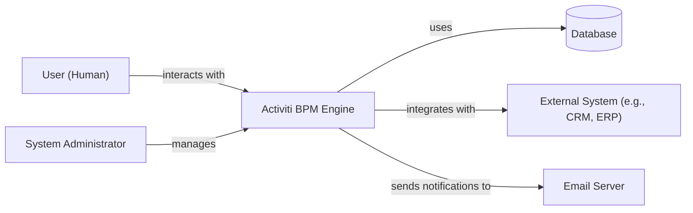
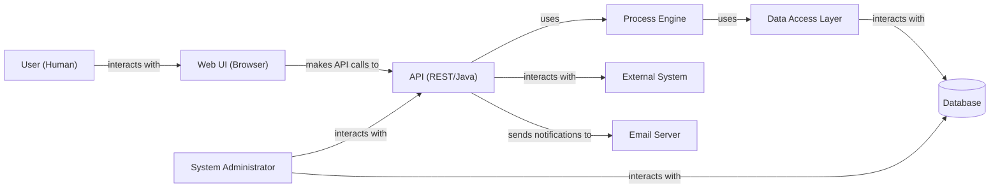
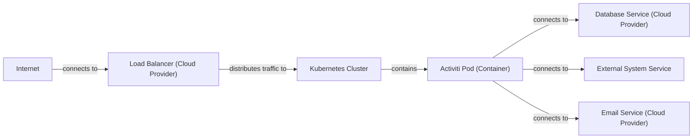
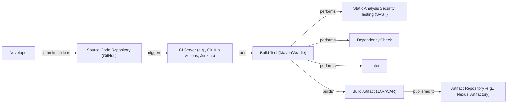

Okay, let's create a design document for the Activiti project, focusing on aspects relevant to threat modeling.

# BUSINESS POSTURE

Activiti is an open-source Business Process Management (BPM) engine.  The primary business goal is to provide a lightweight, fast, and easy-to-use workflow and BPM platform for developers, system administrators, and business users.  It aims to be embeddable within other applications and services, as well as operate as a standalone server.  The target audience includes organizations of all sizes, from startups to large enterprises, that need to model, automate, and manage business processes.  Given its open-source nature and wide adoption, the project likely has a moderate risk appetite, balancing innovation with stability and security.

Business Priorities:

*   Ease of Use and Integration:  The platform must be easy to learn, use, and integrate with other systems.
*   Performance and Scalability:  The engine must be performant and able to handle a large number of process instances.
*   Flexibility and Extensibility:  The platform must be flexible enough to model a wide variety of business processes and extensible to allow customization.
*   Community and Support:  A strong community and readily available support are crucial for adoption and long-term success.
*   Reliability and Stability: The engine must be reliable and stable to ensure business processes run without interruption.

Business Risks:

*   Unauthorized Access to Sensitive Process Data:  Business processes often involve sensitive data (e.g., customer information, financial data). Unauthorized access to this data could lead to financial loss, reputational damage, and legal consequences.
*   Process Manipulation:  Malicious actors could attempt to modify process definitions or running process instances to disrupt operations, commit fraud, or gain unauthorized access to resources.
*   Denial of Service:  Attacks targeting the Activiti engine could render it unavailable, halting critical business processes.
*   Data Breaches:  Vulnerabilities in the engine or its dependencies could be exploited to steal sensitive data.
*   Compliance Violations:  Failure to comply with relevant regulations (e.g., GDPR, HIPAA) could result in fines and legal penalties.
*   Supply Chain Attacks: Compromised dependencies or build processes could introduce vulnerabilities into the Activiti engine.

# SECURITY POSTURE

Existing Security Controls (based on the GitHub repository and general knowledge of similar projects):

*   security control: Authentication: Activiti likely supports various authentication mechanisms, potentially including username/password, LDAP, and OAuth 2.0. (Implementation details would be in configuration files and code related to user management and security).
*   security control: Authorization: Role-Based Access Control (RBAC) is likely implemented to restrict access to process definitions, instances, and tasks based on user roles. (Implementation details would be in configuration files, database schema, and code related to access control).
*   security control: Input Validation: Some level of input validation is expected to prevent common vulnerabilities like Cross-Site Scripting (XSS) and SQL Injection. (Implementation details would be in code handling user input and data persistence).
*   security control: Encryption: Data encryption at rest and in transit may be supported, but the extent and specifics need further investigation. (Implementation details would be in configuration files and code related to data storage and communication).
*   security control: Auditing: Activiti likely provides some level of auditing to track user actions and process events. (Implementation details would be in configuration files and code related to logging and event handling).
*   security control: Dependency Management: The project uses build tools (Maven/Gradle) that manage dependencies, but the rigor of vulnerability scanning and updates needs verification. (Described in pom.xml or build.gradle files).
*   security control: Secure Development Practices: The project likely follows some secure development practices, but the specifics (e.g., code reviews, security testing) need to be confirmed. (Evidence might be in contribution guidelines, pull request processes, and issue tracking).

Accepted Risks:

*   accepted risk: The open-source nature of the project means that vulnerabilities may be discovered and publicly disclosed before patches are available.
*   accepted risk: The flexibility and extensibility of the platform may introduce security risks if not properly configured and managed.
*   accepted risk: The reliance on third-party libraries and dependencies introduces the risk of supply chain vulnerabilities.
*   accepted risk: The project may not be fully compliant with all relevant regulations out of the box, requiring additional configuration and customization.

Recommended Security Controls:

*   Implement comprehensive input validation and output encoding to prevent XSS, SQL Injection, and other injection attacks.
*   Enforce strong password policies and multi-factor authentication (MFA) for all users.
*   Implement encryption at rest for sensitive data stored in the database.
*   Implement encryption in transit for all communication channels (HTTPS).
*   Regularly perform security audits and penetration testing.
*   Implement a robust vulnerability management program, including regular scanning of dependencies and timely patching.
*   Provide detailed security documentation and guidance for users and administrators.
*   Implement a secure software development lifecycle (SSDLC) with mandatory code reviews, static analysis, and dynamic analysis.
*   Implement a Content Security Policy (CSP) to mitigate XSS attacks.
*   Implement robust logging and monitoring to detect and respond to security incidents.

Security Requirements:

*   Authentication:
    *   Support for strong passwords and password policies.
    *   Support for multi-factor authentication (MFA).
    *   Integration with existing identity providers (e.g., LDAP, Active Directory, OAuth 2.0).
    *   Secure storage of user credentials (e.g., hashing and salting).
*   Authorization:
    *   Fine-grained access control based on roles and permissions.
    *   Ability to restrict access to specific process definitions, instances, and tasks.
    *   Ability to define custom roles and permissions.
*   Input Validation:
    *   Validation of all user input to prevent injection attacks (e.g., XSS, SQL Injection).
    *   Whitelist validation preferred over blacklist validation.
    *   Output encoding to prevent XSS.
*   Cryptography:
    *   Encryption of sensitive data at rest and in transit.
    *   Use of strong, industry-standard cryptographic algorithms.
    *   Secure key management practices.
*   Auditing:
    *   Detailed audit logs of all user actions and process events.
    *   Secure storage and protection of audit logs.
    *   Regular review of audit logs.

# DESIGN

## C4 CONTEXT

Element Descriptions:

*   1.  Name: User (Human)
    *   2.  Type: Person
    *   3.  Description: A person who interacts with the Activiti BPM Engine to start, complete, and monitor business processes.
    *   4.  Responsibilities: Initiating process instances, completing tasks, viewing process status.
    *   5.  Security controls: Authentication, Authorization, Input Validation.

*   1.  Name: Activiti BPM Engine
    *   2.  Type: Software System
    *   3.  Description: The core engine that executes and manages business processes.
    *   4.  Responsibilities: Executing process definitions, managing process instances, handling user tasks, integrating with external systems.
    *   5.  Security controls: Authentication, Authorization, Input Validation, Auditing, Encryption (at rest and in transit).

*   1.  Name: Database
    *   2.  Type: Database
    *   3.  Description: Stores process definitions, instance data, user information, and audit logs.
    *   4.  Responsibilities: Persisting data, providing data access to the Activiti engine.
    *   5.  Security controls: Access Control, Encryption (at rest), Auditing.

*   1.  Name: External System
    *   2.  Type: Software System
    *   3.  Description: An external system (e.g., CRM, ERP) that integrates with Activiti to exchange data or trigger actions.
    *   4.  Responsibilities: Providing data to Activiti, receiving data from Activiti, performing actions triggered by Activiti.
    *   5.  Security controls: Authentication, Authorization, Encryption (in transit).

*   1.  Name: Email Server
    *   2.  Type: Software System
    *   3.  Description: Sends email notifications to users (e.g., task assignments, process updates).
    *   4.  Responsibilities: Sending emails based on events in Activiti.
    *   5.  Security controls: Authentication, Encryption (in transit).

*   1.  Name: System Administrator
    *   2.  Type: Person
    *   3.  Description: A person who manages and maintains the Activiti BPM Engine.
    *   4.  Responsibilities: Deploying the engine, configuring security settings, monitoring performance, troubleshooting issues.
    *   5.  Security controls: Authentication, Authorization.

## C4 CONTAINER

Element Descriptions:

*   1.  Name: Web UI (Browser)
    *   2.  Type: Web Application
    *   3.  Description: A web-based user interface for interacting with the Activiti engine.
    *   4.  Responsibilities: Displaying process diagrams, forms, and task lists; allowing users to start processes, complete tasks, and view process status.
    *   5.  Security controls: Authentication, Authorization, Input Validation, Output Encoding, CSP.

*   1.  Name: API (REST/Java)
    *   2.  Type: API
    *   3.  Description: Provides an interface for interacting with the Activiti engine programmatically.
    *   4.  Responsibilities: Handling requests from the Web UI and external systems, exposing functionality of the Process Engine.
    *   5.  Security controls: Authentication, Authorization, Input Validation, Rate Limiting.

*   1.  Name: Process Engine
    *   2.  Type: Software Component
    *   3.  Description: The core component that executes and manages business processes.
    *   4.  Responsibilities: Parsing process definitions, creating and managing process instances, handling user tasks, executing service tasks.
    *   5.  Security controls: Input Validation, Auditing.

*   1.  Name: Data Access Layer
    *   2.  Type: Software Component
    *   3.  Description: Provides an abstraction layer for interacting with the database.
    *   4.  Responsibilities: Handling database queries and updates, ensuring data integrity.
    *   5.  Security controls: Input Validation, Prepared Statements (to prevent SQL Injection).

*   1.  Name: Database
    *   2.  Type: Database
    *   3.  Description: Stores process definitions, instance data, user information, and audit logs.
    *   4.  Responsibilities: Persisting data, providing data access to the Activiti engine.
    *   5.  Security controls: Access Control, Encryption (at rest), Auditing.

*   1.  Name: External System
    *   2.  Type: Software System
    *   3.  Description: An external system (e.g., CRM, ERP) that integrates with Activiti to exchange data or trigger actions.
    *   4.  Responsibilities: Providing data to Activiti, receiving data from Activiti, performing actions triggered by Activiti.
    *   5.  Security controls: Authentication, Authorization, Encryption (in transit).

*   1.  Name: Email Server
    *   2.  Type: Software System
    *   3.  Description: Sends email notifications to users (e.g., task assignments, process updates).
    *   4.  Responsibilities: Sending emails based on events in Activiti.
    *   5.  Security controls: Authentication, Encryption (in transit).

*   1.  Name: System Administrator
    *   2.  Type: Person
    *   3.  Description: A person who manages and maintains the Activiti BPM Engine.
    *   4.  Responsibilities: Deploying the engine, configuring security settings, monitoring performance, troubleshooting issues.
    *   5.  Security controls: Authentication, Authorization.

## DEPLOYMENT

Possible Deployment Solutions:

1.  Standalone Server: Deploy Activiti as a standalone server (e.g., Tomcat, Jetty) running on a virtual machine or physical server.
2.  Embedded Engine: Embed the Activiti engine within another application (e.g., a Spring Boot application).
3.  Cloud Deployment: Deploy Activiti to a cloud platform (e.g., AWS, Azure, GCP) using virtual machines, containers (Docker), or Kubernetes.
4.  Clustered Deployment: Deploy multiple instances of Activiti in a cluster for high availability and scalability.

Chosen Deployment Solution (Cloud Deployment with Kubernetes):

Element Descriptions:

*   1.  Name: Internet
    *   2.  Type: Network
    *   3.  Description: The public internet.
    *   4.  Responsibilities: Providing connectivity to users and external systems.
    *   5.  Security controls: Firewall, Intrusion Detection/Prevention System (IDS/IPS).

*   1.  Name: Load Balancer (Cloud Provider)
    *   2.  Type: Network Appliance
    *   3.  Description: Distributes incoming traffic across multiple instances of the Activiti application.
    *   4.  Responsibilities: Load balancing, SSL termination.
    *   5.  Security controls: SSL/TLS Encryption, Access Control Lists (ACLs).

*   1.  Name: Kubernetes Cluster
    *   2.  Type: Container Orchestration Platform
    *   3.  Description: Manages and orchestrates the Activiti containers.
    *   4.  Responsibilities: Scheduling, scaling, self-healing.
    *   5.  Security controls: Network Policies, Role-Based Access Control (RBAC), Pod Security Policies.

*   1.  Name: Activiti Pod (Container)
    *   2.  Type: Container
    *   3.  Description: Runs an instance of the Activiti application.
    *   4.  Responsibilities: Executing the Activiti engine.
    *   5.  Security controls: Container Image Security Scanning, Resource Limits.

*   1.  Name: Database Service (Cloud Provider)
    *   2.  Type: Managed Database Service
    *   3.  Description: Provides a managed database service (e.g., AWS RDS, Azure SQL Database).
    *   4.  Responsibilities: Data persistence, backups, replication.
    *   5.  Security controls: Access Control, Encryption (at rest and in transit), Auditing, Firewall.

*   1.  Name: External System Service
    *   2.  Type: External Service
    *   3.  Description: Represents an external system that Activiti integrates with.
    *   4.  Responsibilities: Varies depending on the specific external system.
    *   5.  Security controls: Authentication, Authorization, Encryption (in transit).

*   1.  Name: Email Service (Cloud Provider)
    *   2.  Type: Managed Email Service
    *   3.  Description: Provides a managed email service (e.g., AWS SES, Azure SendGrid).
    *   4.  Responsibilities: Sending email notifications.
    *   5.  Security controls: Authentication, Encryption (in transit), DKIM/SPF/DMARC.

## BUILD

Build Process Description:

1.  Developer commits code to the source code repository (GitHub).
2.  The commit triggers the CI server (e.g., GitHub Actions, Jenkins).
3.  The CI server runs the build tool (Maven or Gradle).
4.  The build tool performs the following steps:
    *   Static Analysis Security Testing (SAST): Scans the source code for potential security vulnerabilities.
    *   Dependency Check: Scans the project's dependencies for known vulnerabilities.
    *   Linter: Checks the code for style and quality issues.
    *   Builds the build artifact (JAR or WAR file).
5.  The build artifact is published to an artifact repository (e.g., Nexus, Artifactory).

Security Controls:

*   Source Code Repository: Access control, branch protection rules, code review requirements.
*   CI Server: Secure configuration, access control, audit logging.
*   SAST: Use of a reputable SAST tool, regular updates of vulnerability databases.
*   Dependency Check: Use of a dependency checking tool (e.g., OWASP Dependency-Check), regular updates of vulnerability databases.
*   Artifact Repository: Access control, authentication, encryption.
*   Supply Chain Security: Software Bill of Materials (SBOM) generation, signing of artifacts.

# RISK ASSESSMENT

Critical Business Processes:

*   Workflow Execution: The core process of executing defined workflows, including task assignment, completion, and routing.
*   Process Definition Management: The ability to create, modify, and deploy process definitions.
*   User and Role Management: The management of users, roles, and permissions within the system.
*   Integration with External Systems: The exchange of data and triggering of actions in external systems.

Data Sensitivity:

*   Process Instance Data: This data can include sensitive business information, customer data, financial data, and other confidential information. Sensitivity: High.
*   Process Definitions: These definitions can contain sensitive business logic and intellectual property. Sensitivity: Medium to High.
*   User Credentials: Usernames, passwords, and API keys. Sensitivity: High.
*   Audit Logs: These logs can contain sensitive information about user actions and system events. Sensitivity: Medium.
*   Configuration Data: Configuration files may contain sensitive information such as database credentials and API keys. Sensitivity: High.

# QUESTIONS & ASSUMPTIONS

Questions:

*   What specific security standards or regulations (e.g., GDPR, HIPAA, SOC 2) must Activiti comply with?
*   What are the specific authentication and authorization mechanisms currently implemented in Activiti?
*   What is the current process for managing vulnerabilities and applying security patches?
*   What level of auditing and logging is currently implemented?
*   Are there any existing security assessments or penetration testing reports available?
*   What are the specific external systems that Activiti integrates with, and what data is exchanged?
*   What is the current deployment architecture (e.g., standalone server, cloud deployment)?
*   What is the process for managing secrets (e.g., database credentials, API keys)?
*   Is there a dedicated security team or individual responsible for the security of Activiti?
*   What is the frequency of code reviews and security testing?

Assumptions:

*   BUSINESS POSTURE: The project has a moderate risk appetite, balancing innovation with stability and security.
*   SECURITY POSTURE: Basic security controls (authentication, authorization, input validation) are in place, but may need to be enhanced.
*   SECURITY POSTURE: The project follows some secure development practices, but a formal SSDLC may not be fully implemented.
*   DESIGN: The provided diagrams represent a simplified view of the architecture and may not include all components and interactions.
*   DESIGN: The deployment architecture can vary depending on the specific use case. The cloud deployment with Kubernetes is a common and recommended approach.
*   DESIGN: The build process includes some security checks, but may need to be enhanced with additional tools and practices.
*   DESIGN: The project uses a relational database for persistence.
*   DESIGN: The project uses REST APIs for communication between components.