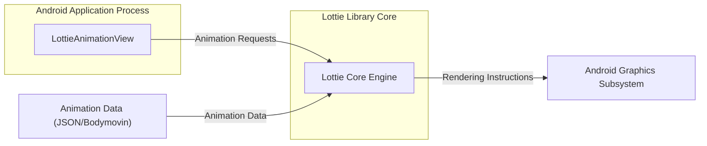
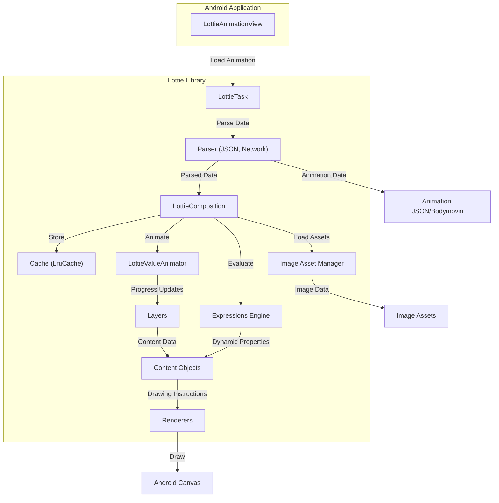

# Project Design Document: Lottie for Android - Enhanced

**Version:** 1.1
**Date:** October 26, 2023
**Author:** Gemini (AI Language Model)

## 1. Introduction

This document provides an enhanced and more detailed design overview of the Lottie for Android library, an open-source animation library developed by Airbnb. This document aims to provide a comprehensive and in-depth understanding of the library's architecture, key components, and data flow. This detailed design will serve as a robust foundation for subsequent threat modeling activities, enabling a more thorough security analysis.

## 2. Goals and Objectives

The primary goals of the Lottie for Android library are:

*   To enable the rendering of high-quality Adobe After Effects animations natively on Android platforms without requiring manual code implementation.
*   To deliver a performant and memory-efficient animation playback experience, suitable for a wide range of Android devices.
*   To significantly simplify the integration of complex, vector-based animations into Android applications, reducing development time and effort.
*   To minimize the reliance on traditional image-based animation assets, leading to smaller application sizes and improved scalability.
*   To offer broad support for a wide array of Adobe After Effects features, including complex expressions, masks, and mattes.

## 3. Target Audience

This document is intended for a technical audience, including:

*   Security engineers and architects responsible for conducting threat modeling, security assessments, and penetration testing of applications utilizing the Lottie library.
*   Software developers directly involved in integrating, customizing, or extending the Lottie library within Android applications.
*   Technical project managers and product owners who need a deep understanding of the library's architecture for planning and decision-making.
*   Quality assurance engineers responsible for testing the functionality and performance of Lottie integrations.

## 4. System Architecture

The Lottie for Android library is structured in a layered architecture, promoting modularity and separation of concerns.

*   **Input and Parsing Layer:** Responsible for loading animation data from various sources and converting it into an internal representation.
*   **Core Animation Logic Layer:**  Manages the animation state, interpolations, and calculations based on the parsed data.
*   **Rendering and Drawing Layer:**  Handles the actual drawing of animation frames onto the Android display using graphics APIs.
*   **Integration and API Layer:** Provides the public interfaces and classes for integrating Lottie functionality into Android applications.

### 4.1. High-Level Architecture Diagram

### 4.2. Detailed Architecture

The Lottie library's internal components work together to process and render animations:

*   **`LottieAnimationView`:**  An Android `View` subclass that serves as the primary interface for developers to display Lottie animations. It manages the animation lifecycle, loading, and playback controls.
*   **`LottieComposition`:**  A central data structure representing the parsed animation. It holds all the animation data, including layers, shapes, keyframes, expressions, and asset information.
*   **`LottieTask<LottieComposition>`:**  An asynchronous task used for loading and parsing animation data off the main thread. This prevents blocking the UI thread during potentially long-running operations.
*   **`LottieResult<T>`:** A sealed class representing the outcome of an asynchronous operation, either a successful result containing the parsed `LottieComposition` or an error indicating failure.
*   **`LottieValueAnimator`:**  Extends Android's `ValueAnimator` to drive the animation timeline. It calculates the interpolated values for animation properties based on the `LottieComposition`'s keyframes and timing functions.
*   **`Keyframe<T>`:** Represents a specific point in time within an animation where a property's value changes. It includes the time, value, and optional easing functions.
*   **`Layer`:**  Represents a visual element within the animation's composition. Layers can be shapes, images, text, or pre-compositions.
*   **`Content` Interface:** Defines a contract for drawable content within a layer. Concrete implementations handle drawing specific types of content.
*   **Renderers (e.g., `ShapeContent`, `ImageContent`, `TextContent`, `SolidColorContent`):** Implementations of the `Content` interface responsible for drawing specific visual elements using Android's `Canvas` API. They interpret the animation data and draw corresponding shapes, images, and text.
*   **Parsers (e.g., `JsonParser`, `NetworkFetcher`):**  Components responsible for reading and interpreting animation data from different sources. `JsonParser` handles local JSON files, while `NetworkFetcher` retrieves data from remote URLs.
*   **Cache (e.g., `LruCache`):**  Used to store parsed `LottieComposition` objects in memory to avoid redundant parsing of the same animation data, improving performance.
*   **Image Asset Management (`ImageAssetBitmapManager`):**  Handles the loading, caching, and retrieval of image assets referenced within the animation data. This includes managing bitmaps loaded from local assets or network URLs.
*   **Text Support (`LottieTextDelegate`):** Allows for dynamic modification of text layers within the animation, enabling localization and data binding.
*   **Expressions Engine:**  Evaluates Adobe After Effects expressions embedded within the animation data, allowing for dynamic and data-driven animation behavior.

## 5. Data Flow

The process of rendering a Lottie animation involves a series of steps, starting from loading the animation data to drawing the final frames:

1. The Android application instantiates a `LottieAnimationView` and sets the animation source (e.g., a JSON file path in assets, a raw resource ID, or a network URL).
2. `LottieAnimationView` initiates an asynchronous task (`LottieTask`) to load and parse the animation data.
3. The appropriate parser (e.g., `JsonParser` for local files, `NetworkFetcher` for URLs) reads the animation data.
4. The parser transforms the raw animation data into a `LottieComposition` object, representing the animation's structure and properties.
5. The parsed `LottieComposition` is stored in the cache (`LruCache`) for potential reuse.
6. A `LottieValueAnimator` is created and configured based on the `LottieComposition`'s duration and frame rate.
7. The `LottieValueAnimator` drives the animation timeline, emitting animation progress updates.
8. For each frame, `LottieAnimationView` requests the current frame's visual representation.
9. The rendering process iterates through the layers in the `LottieComposition`.
10. For each layer, the corresponding `Content` objects (e.g., `ShapeContent`, `ImageContent`) are processed.
11. Renderers utilize the animation data and the current animation progress to determine the properties (e.g., position, scale, color) of each visual element.
12. Renderers use Android's `Canvas` API to draw the visual elements onto the `LottieAnimationView`.
13. If image assets are required, the `ImageAssetBitmapManager` loads and caches them.
14. If the animation contains expressions, the expressions engine evaluates them to dynamically update animation properties.

### 5.1. Data Flow Diagram

## 6. Key Components and Their Responsibilities

*   **`LottieAnimationView`:**
    *   Primary entry point for displaying Lottie animations in Android applications.
    *   Manages the lifecycle of the animation (loading, playing, pausing, stopping).
    *   Provides methods for controlling animation playback speed, progress, and looping.
    *   Handles user interactions and animation events.
*   **`LottieComposition`:**
    *   The in-memory representation of the parsed animation data.
    *   Contains all the structural and property information required for rendering.
    *   Acts as the central source of truth for the animation.
*   **Parsers (`JsonParser`, `NetworkFetcher`):**
    *   Responsible for deserializing animation data from JSON format into the `LottieComposition` object.
    *   `NetworkFetcher` handles fetching animation data from remote URLs.
    *   Implement error handling for invalid or malformed animation data.
*   **Cache (`LruCache`):**
    *   Stores recently used `LottieComposition` objects to improve performance by avoiding repeated parsing.
    *   Implements a least-recently-used eviction policy to manage memory usage.
*   **`LottieValueAnimator`:**
    *   Drives the animation timeline by interpolating values between keyframes.
    *   Provides smooth transitions and accurate timing for animation playback.
    *   Can be customized for different animation behaviors.
*   **Renderers (`ShapeContent`, `ImageContent`, `TextContent`):**
    *   Responsible for the actual drawing of animation elements on the screen.
    *   Interpret the animation data and use Android's `Canvas` API to render shapes, images, and text.
    *   Optimize drawing operations for performance.
*   **Image Asset Management (`ImageAssetBitmapManager`):**
    *   Manages the loading and caching of image assets used in the animation.
    *   Handles loading images from local assets or network URLs.
    *   Implements caching mechanisms to avoid redundant image loading.
*   **Expressions Engine:**
    *   Evaluates JavaScript-like expressions embedded in the animation data.
    *   Allows for dynamic control of animation properties based on various factors.
    *   Adds significant flexibility and interactivity to animations.

## 7. Security Considerations (Detailed)

This section outlines potential security considerations relevant to the Lottie for Android library:

*   **Malicious Animation Data:**
    *   **Threat:**  A maliciously crafted animation JSON file could contain unexpected or excessively large data structures, leading to denial-of-service (DoS) by consuming excessive memory or CPU resources during parsing or rendering.
    *   **Mitigation:** Implement robust input validation and sanitization on the animation data during parsing. Set limits on the size and complexity of animation elements.
*   **Remote Code Execution (via Expressions):**
    *   **Threat:** While Lottie's expression engine is sandboxed, vulnerabilities in the engine could potentially be exploited to execute arbitrary code on the device.
    *   **Mitigation:** Regularly update the Lottie library to benefit from security patches. Carefully review and potentially disable or restrict the use of expressions from untrusted sources.
*   **Network Security (Fetching Remote Animations/Assets):**
    *   **Threat:** If animations or image assets are loaded from untrusted remote sources over insecure connections (HTTP), they could be intercepted or tampered with (Man-in-the-Middle attacks).
    *   **Mitigation:** Enforce the use of HTTPS for fetching remote resources. Implement certificate pinning for added security when communicating with known servers.
*   **Resource Exhaustion (Memory/CPU):**
    *   **Threat:** Complex animations with a large number of layers, shapes, or high frame rates can consume significant memory and CPU resources, potentially leading to application crashes or performance degradation.
    *   **Mitigation:**  Provide guidelines to developers on optimizing animations for performance. Implement mechanisms to limit the resources consumed by Lottie, such as frame rate throttling or memory limits.
*   **Path Traversal/Local File Access:**
    *   **Threat:** If the library incorrectly handles file paths provided for local animation or asset loading, it could potentially be exploited to access files outside the intended directories.
    *   **Mitigation:**  Sanitize and validate all file paths provided to the library. Use secure file access methods provided by the Android SDK.
*   **Dependency Vulnerabilities:**
    *   **Threat:**  Vulnerabilities in the Lottie library's dependencies could introduce security risks.
    *   **Mitigation:** Regularly update the Lottie library and its dependencies to the latest versions to patch known vulnerabilities. Use dependency scanning tools to identify and address potential issues.
*   **Data Confidentiality (Animation Content):**
    *   **Threat:**  Sensitive information might be embedded within animation data. If the application's data storage is compromised, this information could be exposed.
    *   **Mitigation:**  Avoid embedding sensitive data directly within animations. If necessary, encrypt the animation data or store sensitive information separately and retrieve it securely.

## 8. Dependencies

The Lottie for Android library relies on the following key dependencies:

*   **Android SDK:**  Utilizes core Android framework components such as `View`, `Canvas`, `ValueAnimator`, and `Handler`.
*   **`androidx.annotation`:**  For providing annotations to improve code correctness and readability.
*   **Potentially other Android Jetpack libraries:** Depending on the specific version of Lottie, it might depend on other support or Jetpack libraries for features like coroutines or lifecycle management.

## 9. Deployment

The Lottie for Android library is deployed as a library dependency within Android applications. Developers typically integrate it using build tools like Gradle by adding the appropriate dependency declaration to their `build.gradle` file.

## 10. Future Considerations

Potential future enhancements and considerations for the Lottie for Android library include:

*   **Enhanced Security Features:**  Further strengthening input validation, sandboxing of expressions, and secure handling of remote resources.
*   **Performance Optimizations:**  Exploring new rendering techniques and optimizations to improve performance on low-end devices.
*   **Expanded After Effects Feature Support:**  Adding support for a wider range of Adobe After Effects features and effects.
*   **Improved Error Handling and Debugging Tools:**  Providing more informative error messages and tools for debugging animation issues.
*   **Accessibility Improvements:**  Enhancing accessibility features to make animations more usable for users with disabilities.

This enhanced design document provides a more comprehensive and detailed understanding of the Lottie for Android library's architecture and functionality. This information is crucial for conducting a thorough and effective threat model to identify and mitigate potential security risks associated with its use in Android applications.