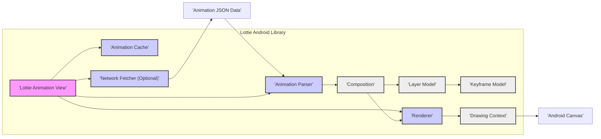
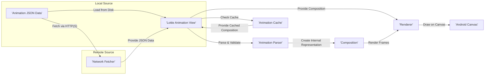

## Project Design Document: Lottie for Android - Improved

**1. Introduction**

This document provides an enhanced design overview of the Lottie for Android library, an open-source animation library that renders Adobe After Effects animations natively on Android. This improved document aims to provide a more detailed and security-focused understanding of the library's architecture, components, and data flow, specifically tailored for subsequent threat modeling activities.

**1.1. Purpose**

The primary purpose of this document is to offer a refined and more comprehensive design description of the Lottie Android library, specifically highlighting aspects relevant to security analysis and threat identification. This will facilitate a more thorough and effective threat modeling process.

**1.2. Scope**

This document expands upon the previous version, providing greater detail on the core architecture and functionalities of the Lottie Android library, with a strong emphasis on the processing of animation data. It includes:

*   A more detailed breakdown of the library's high-level architecture.
*   In-depth descriptions of key components and their specific responsibilities, particularly concerning data handling and security.
*   A refined representation of the data flow within the library, emphasizing potential points of vulnerability.
*   Clear identification of external interactions and dependencies, highlighting potential security implications.

This document still does not cover:

*   Fine-grained implementation details of individual classes or methods.
*   The intricacies of the After Effects plugin used for Lottie animation export.
*   Implementation details of Lottie on other platforms (e.g., iOS).
*   Detailed performance optimization techniques.

**1.3. Target Audience**

This document is primarily intended for:

*   Security engineers and architects tasked with performing threat modeling and security assessments of systems incorporating the Lottie Android library.
*   Developers actively contributing to or extending the Lottie Android library, particularly those focused on security aspects.
*   Anyone requiring a deep technical understanding of the library's internal mechanisms with a security lens.

**2. System Overview**

The Lottie Android library empowers developers to seamlessly integrate high-fidelity, vector-based animations into their Android applications. These animations are designed in Adobe After Effects and exported as JSON files using the Bodymovin plugin. The core function of the Lottie library is to parse this JSON data and render the animation frames natively using Android's graphics capabilities.

**3. Architectural Design**

The Lottie Android library is designed with a modular approach, clearly separating the responsibilities of parsing, caching, rendering, and managing animation data. The interaction between these core components is crucial for understanding potential security boundaries and data flow vulnerabilities.

**3.1. Detailed Component Descriptions**

*   **Lottie Animation View:** This is the primary interface component developers use to embed Lottie animations within their Android layouts. It orchestrates the loading of animation data, manages animation playback states, and triggers view invalidation for rendering updates. It acts as a central point for interacting with the library.
*   **Animation Parser:** This critical component is responsible for securely parsing the potentially untrusted JSON animation data into an internal, object-based representation (`Composition`). It interprets the JSON structure and properties, creating corresponding model objects. This stage is a key area for potential vulnerabilities if the parser is not robust against malformed or malicious JSON.
*   **Animation Cache:** This optional component stores parsed `Composition` objects, either in memory or persistently on disk, to optimize performance by avoiding redundant parsing of frequently used animations. The security of the cache itself (e.g., access controls, data integrity) is a consideration.
*   **Network Fetcher (Optional):** When animation data is sourced from a remote URL, this component handles the network request and retrieval of the JSON data. Security considerations include secure transport (HTTPS), certificate validation, and handling potential network errors or malicious responses.
*   **Renderer:** This component takes the parsed `Composition` and its associated models and performs the actual drawing of animation frames onto the Android `Canvas`. It applies transformations, masks, and effects defined in the animation data. Potential vulnerabilities here could involve resource exhaustion or unexpected behavior due to complex or malicious animation properties.
*   **Composition:** This is the in-memory representation of the parsed animation data. It contains metadata about the animation (duration, frame rate) and a hierarchical structure of layers. The integrity and validity of this object are crucial for correct and secure rendering.
*   **Layer Model:** Represents individual layers within the animation (shapes, text, images). Each layer has modifiable properties (position, scale, rotation, opacity). Maliciously crafted layer properties could potentially lead to unexpected rendering behavior or resource issues.
*   **Keyframe Model:** Defines the values of layer properties at specific points in time. The renderer interpolates between these keyframes to create smooth transitions. Exploiting vulnerabilities in keyframe interpolation could be a potential attack vector.
*   **Drawing Context:** Provides the necessary drawing primitives and state management for the `Renderer` to interact with the underlying Android `Canvas`. This component relies on the security and integrity of the Android graphics framework.

**4. Data Flow - Enhanced Detail**

The data flow for rendering a Lottie animation involves several stages where data integrity and security need to be considered:

1. **Animation Data Source:** The animation data, in JSON format, originates from one of three primary sources: a local asset file within the application package, a raw resource embedded in the application, or a remote URL. The trust level associated with the data source is a critical factor in threat assessment.
2. **Loading & Fetching:** The `Lottie Animation View` initiates the loading process. For local sources, this involves reading the file from disk. For remote URLs, the `Network Fetcher` is used to retrieve the JSON data. This network communication should ideally be over HTTPS to ensure confidentiality and integrity.
3. **Parsing & Validation:** The `Animation Parser` receives the raw JSON data. This is a critical juncture where input validation and sanitization are essential. The parser must be robust against malformed JSON, excessively large data, or structures designed to exploit parsing vulnerabilities.
4. **Caching (Conditional):** If caching is enabled and a valid, previously parsed `Composition` exists in the `Animation Cache`, the parsing step can be bypassed. The security of the cache itself becomes relevant here.
5. **Rendering & Drawing:** The `Lottie Animation View` provides the parsed `Composition` to the `Renderer`. The renderer iterates through the layers and keyframes, using the `Drawing Context` to draw onto the `Android Canvas`. This stage needs to handle potentially complex or malicious animation properties gracefully to prevent resource exhaustion or unexpected behavior.
6. **Display:** The Android system displays the rendered frames on the screen. The security of the Android graphics subsystem is a dependency here.

**5. External Interactions and Dependencies - Security Implications**

*   **Android SDK:** The Lottie library's security is inherently tied to the security of the underlying Android SDK. Vulnerabilities in the SDK's graphics components, networking stack, or file system access mechanisms could potentially be exploited through the Lottie library.
*   **Bodymovin Plugin (Adobe After Effects):** While not a runtime dependency, the security of the animation creation process is relevant. If the Bodymovin plugin itself is compromised, it could lead to the generation of malicious animation data.
*   **Network (Conditional):** When loading animations from remote URLs, the security of the network connection (use of HTTPS, certificate validation) is paramount. The library's handling of network errors and potentially malicious server responses is also a security consideration.
*   **File System (Conditional):** When loading local assets or resources, the library interacts with the Android file system. Proper file access permissions and handling of potentially malicious files are important. The security of the animation cache's storage mechanism is also relevant here.

**6. Security Considerations - Detailed**

This section provides a more in-depth look at potential security considerations, categorized for clarity:

*   **Malicious Animation Data (Input Validation):**
    *   **Threat:**  A primary concern is the injection of maliciously crafted JSON animation data designed to exploit vulnerabilities in the `Animation Parser` or `Renderer`.
    *   **Potential Impacts:** Denial of Service (resource exhaustion), unexpected rendering behavior, potential (though less likely) code execution if parsing vulnerabilities exist.
    *   **Affected Components:** `Animation Parser`, `Renderer`.
    *   **Potential Mitigation Strategies:** Implement robust input validation and sanitization within the parser, enforce limits on animation complexity, utilize secure JSON parsing libraries, and potentially implement a content security policy for animations.
*   **Network Security (Remote Data Loading):**
    *   **Threat:** Man-in-the-middle attacks where the downloaded animation data is intercepted and tampered with.
    *   **Potential Impacts:** Rendering of unexpected or malicious animations, potential for phishing or other attacks if the animation includes interactive elements (unlikely in core Lottie but possible in extensions).
    *   **Affected Components:** `Network Fetcher`, `Lottie Animation View`.
    *   **Potential Mitigation Strategies:** Enforce HTTPS for remote animation URLs, implement certificate pinning, verify the integrity of downloaded data (e.g., using checksums).
*   **Resource Exhaustion (DoS):**
    *   **Threat:**  Loading and rendering excessively large or complex animations can consume significant CPU, memory, and battery resources, leading to application unresponsiveness or crashes.
    *   **Potential Impacts:** Denial of Service, poor user experience.
    *   **Affected Components:** `Animation Parser`, `Renderer`, `Lottie Animation View`.
    *   **Potential Mitigation Strategies:** Implement limits on animation complexity (e.g., number of layers, keyframes), provide mechanisms for developers to control animation quality or detail, implement timeouts for loading and rendering.
*   **Data Integrity (Cache Security):**
    *   **Threat:** If the animation cache is compromised, malicious or tampered animation data could be served from the cache.
    *   **Potential Impacts:** Rendering of unexpected or malicious animations.
    *   **Affected Components:** `Animation Cache`.
    *   **Potential Mitigation Strategies:** Secure the cache storage location, implement integrity checks for cached data, consider encrypting cached data.
*   **Information Disclosure (Indirect):**
    *   **Threat:** While less direct, carefully crafted animations might potentially be used to infer information about the device or application state through subtle rendering behavior or timing.
    *   **Potential Impacts:** Minor information leakage.
    *   **Affected Components:** `Renderer`.
    *   **Potential Mitigation Strategies:**  Careful review of animation rendering logic to prevent unintended side channels.

**7. Technologies Used**

*   **Primary Programming Languages:** Java and Kotlin.
*   **Core Libraries:** Android SDK components (e.g., `android.graphics` for rendering, `android.net` for networking, `java.io` for file access).
*   **JSON Processing:** Likely utilizes standard Android JSON parsing libraries (e.g., `org.json`).

**8. Deployment**

The Lottie Android library is typically integrated into Android applications as a dependency managed by build tools like Gradle or Maven. Developers declare the library as a dependency in their project's build file, and the build system handles the download and linking of the library.

**9. Future Considerations - Security Enhancements**

*   **Formal Input Validation Schema:** Defining and enforcing a strict schema for valid animation JSON data could significantly reduce the attack surface.
*   **Sandboxing or Isolation:** Exploring the possibility of rendering animations in a more isolated environment to limit the impact of potential vulnerabilities.
*   **Security Audits:** Regular security audits and penetration testing of the Lottie library are crucial for identifying and addressing potential vulnerabilities.
*   **Content Security Policy (CSP) for Animations:** Investigating the feasibility of a CSP-like mechanism to control the sources and types of animations that can be loaded.

This improved design document provides a more comprehensive and security-focused understanding of the Lottie Android library. This enhanced information will be instrumental in conducting a thorough and effective threat model, enabling the identification of potential security risks and the development of appropriate mitigation strategies.