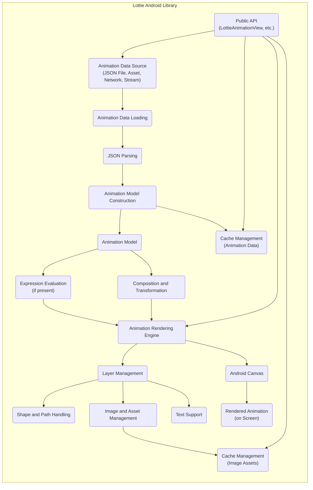

# Project Design Document: Lottie for Android

**Version:** 1.1
**Date:** October 26, 2023
**Author:** AI Software Architect

## 1. Introduction

This document provides a detailed design overview of the Lottie for Android library, an open-source animation library developed by Airbnb. This document aims to provide a comprehensive understanding of the library's architecture, components, and data flow, which will serve as a robust foundation for subsequent threat modeling activities. The focus is on providing sufficient detail to identify potential attack surfaces and vulnerabilities.

## 2. Goals

*   Provide a clear and concise description of the Lottie for Android library's architecture, emphasizing security-relevant aspects.
*   Identify key components and their interactions, detailing their responsibilities and potential security implications.
*   Describe the data flow within the library, from animation data input to rendered output, highlighting data transformation and potential injection points.
*   Elaborate on potential areas of security concern with specific examples to facilitate effective threat modeling.

## 3. Overview

Lottie is a mobile library that parses Adobe After Effects animations exported as JSON with Bodymovin and renders them natively on mobile and on the web. The core functionality of the Android library is to take an animation definition (typically in JSON format) and efficiently render it as a view within an Android application. This allows developers to easily integrate high-quality, vector-based animations into their apps without requiring extensive coding or large image assets. Understanding how this parsing and rendering occurs is crucial for identifying potential vulnerabilities.

## 4. System Architecture

The Lottie for Android library can be broadly divided into the following key components:

*   **Animation Data Loading and Parsing:**
    *   **Responsibility:**  Fetches animation data from various sources (local files, assets, network URLs, input streams). Parses the JSON data into an internal object model.
    *   **Security Relevance:** This is a critical entry point. Vulnerabilities in the parsing logic could allow malicious JSON to cause crashes, execute code, or leak information.
*   **Animation Model:**
    *   **Responsibility:** Represents the in-memory structure of the animation, holding data about layers, shapes, keyframes, transformations, expressions, and other animation properties.
    *   **Security Relevance:** The integrity of this model is vital. Manipulation could lead to unexpected behavior or rendering issues.
*   **Animation Rendering Engine:**
    *   **Responsibility:**  The core component that interprets the `Animation Model` and draws animation frames onto an Android `Canvas`. It handles complex calculations for property animation.
    *   **Security Relevance:**  Bugs in the rendering logic could potentially be exploited, although this is less likely than parsing vulnerabilities. Performance issues leading to DoS are a concern.
*   **Layer Management:**
    *   **Responsibility:** Manages the hierarchy and drawing order of animation layers, applying masks and effects.
    *   **Security Relevance:**  Complex layer structures from untrusted sources could potentially lead to performance issues or unexpected rendering behavior.
*   **Shape and Path Handling:**
    *   **Responsibility:**  Handles the creation, manipulation, and rendering of vector graphics elements (paths, fills, strokes).
    *   **Security Relevance:**  Maliciously crafted shape data could potentially cause rendering errors or consume excessive resources.
*   **Image and Asset Management:**
    *   **Responsibility:** Loads, caches, and manages raster image assets referenced in the animation data.
    *   **Security Relevance:**  Potential for path traversal vulnerabilities if asset paths are not properly sanitized. Loading large or malicious images could lead to DoS.
*   **Text Support:**
    *   **Responsibility:** Renders text layers with specified fonts and styles.
    *   **Security Relevance:**  Potential for issues related to font handling or rendering of unusual character sets.
*   **Expression Evaluation (Limited):**
    *   **Responsibility:** Lottie has limited support for After Effects expressions. This component evaluates these expressions to dynamically control animation properties.
    *   **Security Relevance:**  Expression evaluation, even limited, can be a significant security risk if not properly sandboxed. Malicious expressions could potentially execute arbitrary code or access sensitive data.
*   **Cache Management:**
    *   **Responsibility:** Caches parsed animation data and image assets to improve performance.
    *   **Security Relevance:**  Cache poisoning could lead to the display of incorrect or malicious animations. Improper cache management could lead to information disclosure if sensitive data is cached.
*   **Composition and Transformation:**
    *   **Responsibility:** Applies transformations (translation, rotation, scale, opacity) to layers and shapes based on the animation data hierarchy.
    *   **Security Relevance:**  While less likely, extreme or unusual transformation values from untrusted sources could potentially cause rendering issues.
*   **Performance Optimization:**
    *   **Responsibility:** Includes techniques like hardware acceleration and optimized drawing routines to ensure smooth rendering.
    *   **Security Relevance:**  While not directly a vulnerability, performance issues can be a form of denial of service.
*   **Public API:**
    *   **Responsibility:** The set of classes and methods developers use to interact with the Lottie library (e.g., `LottieAnimationView`, `LottieCompositionFactory`).
    *   **Security Relevance:**  Improper use of the API by developers could introduce vulnerabilities, although the library itself should aim to prevent this.

## 5. Data Flow

The typical data flow within the Lottie for Android library is as follows:

**Detailed Data Flow Description:**

1. **Animation Data Source:** The animation data, defining the animation's structure and properties, originates from:
    *   Local JSON files within the application's assets or resources.
    *   Input streams providing the JSON data.
    *   Network URLs pointing to remote JSON files.

2. **Animation Data Loading:**  The `LottieCompositionFactory` or `LottieAnimationView` initiates the loading process based on the provided source. This involves reading the data from the source.

3. **JSON Parsing:** A JSON parsing library (likely Gson) is used to deserialize the JSON data into a set of Java objects representing the animation structure. **This is a critical point for potential injection vulnerabilities.**

4. **Animation Model Construction:** The parsed JSON objects are used to construct the in-memory `Animation Model`. This involves creating instances of classes representing layers, shapes, keyframes, etc., and populating them with data from the parsed JSON.

5. **Animation Model:** The `Animation Model` holds the complete representation of the animation.

6. **Expression Evaluation (if present):** If the animation contains expressions, the expression evaluation component processes these expressions, potentially modifying animation properties dynamically. **This is a high-risk area for potential code execution vulnerabilities.**

7. **Animation Rendering Engine:** The core rendering engine iterates through the `Animation Model`, calculating the state of each animatable property at each frame.

8. **Layer Management:** The layer manager organizes and processes layers, applying masks, effects, and ensuring the correct drawing order.

9. **Shape and Path Handling:** Vector shapes and paths are processed and prepared for rendering on the `Canvas`.

10. **Image and Asset Management:** If raster images are included, the asset manager loads them from the specified locations (local or network), potentially using caching.

11. **Text Support:** Text layers are rendered using the specified fonts and styles.

12. **Composition and Transformation:** Transformations are applied to layers and shapes based on the animation hierarchy and defined transformations.

13. **Cache Management:**
    *   **Animation Data Cache:** Parsed `Animation Model`s can be cached in memory or on disk to avoid repeated parsing.
    *   **Image Asset Cache:** Loaded image assets are often cached in memory or on disk.

14. **Android Canvas:** The rendering engine uses the Android `Canvas` API to draw the animation frame by frame.

15. **Rendered Animation (on Screen):** The final output is the animation displayed within the `LottieAnimationView`.

16. **Public API:** Developers interact with the library through classes like `LottieAnimationView` to load, play, and control animations.

## 6. Security Considerations (Detailed for Threat Modeling)

Based on the architecture and data flow, potential security considerations for threat modeling include:

*   **Malicious Animation Data (JSON Parsing Vulnerabilities):**
    *   **Code Injection:**  A maliciously crafted JSON file could exploit vulnerabilities in the JSON parsing library (e.g., Gson) or the Lottie parsing logic to execute arbitrary code on the device. This could involve injecting malicious scripts or exploiting deserialization flaws.
    *   **Denial of Service (DoS):**  A large or deeply nested JSON structure could overwhelm the parser, leading to excessive CPU or memory consumption and causing the application to freeze or crash.
    *   **Resource Exhaustion:**  A malicious animation could contain an extremely large number of layers, shapes, keyframes, or other elements, leading to memory exhaustion and application crashes.
    *   **Integer Overflow/Underflow:**  Carefully crafted numerical values within the JSON could potentially trigger integer overflow or underflow errors during parsing or rendering calculations, leading to unexpected behavior or crashes.
*   **Expression Evaluation Vulnerabilities:**
    *   **Remote Code Execution (RCE):** If expression evaluation is not properly sandboxed, a malicious animation could contain expressions that execute arbitrary code on the device. This is a high-severity risk.
    *   **Data Exfiltration:** Malicious expressions could potentially access sensitive data stored within the application or on the device.
*   **Network Security (if loading from network):**
    *   **Man-in-the-Middle (MITM) Attacks:** If animations are loaded over insecure HTTP, an attacker could intercept the traffic and replace the legitimate animation data with a malicious one.
    *   **Data Integrity Issues:**  Ensuring the integrity and authenticity of downloaded animation data is crucial. Using HTTPS and verifying checksums or signatures can mitigate this.
    *   **Denial of Service (Network Level):** An attacker could flood the server hosting the animation files, preventing the application from loading animations.
*   **Asset Loading Vulnerabilities:**
    *   **Path Traversal:** If the animation JSON specifies paths to image assets, and these paths are not properly validated, an attacker could potentially use ".." sequences to access files outside the intended asset directory.
    *   **Loading Malicious Assets:**  An attacker could potentially trick the application into loading malicious image files (e.g., files with embedded exploits).
    *   **Denial of Service (Asset Loading):** Loading extremely large or corrupted image assets could lead to memory exhaustion or rendering errors.
*   **Caching Vulnerabilities:**
    *   **Cache Poisoning:** An attacker could potentially inject malicious animation data or assets into the cache, which would then be served to the application.
    *   **Information Disclosure:** If the cache is not properly protected, sensitive information contained within cached animations or assets could be accessed by other applications or processes.
*   **Resource Handling Vulnerabilities:**
    *   **Memory Leaks:** Bugs in the animation rendering or asset management components could lead to memory leaks, eventually causing the application to crash.
    *   **Excessive CPU Usage:** Certain animation structures or properties could lead to inefficient rendering, resulting in high CPU usage, battery drain, and a poor user experience. This could be exploited as a form of local DoS.
*   **Dependency Vulnerabilities:**
    *   Vulnerabilities in the underlying libraries used by Lottie (e.g., Gson, any image loading libraries) could be exploited. Keeping dependencies up-to-date is crucial.

## 7. Dependencies

The Lottie for Android library typically depends on the following:

*   **Android SDK:** Provides access to core Android framework APIs.
*   **AndroidX Libraries (formerly Support Libraries):**  Provides backward-compatible versions of newer Android features and utility components.
*   **Gson (or similar JSON parsing library):** Used for parsing the animation data from JSON format. The specific version used is important for tracking potential vulnerabilities.
*   **Potentially `androidx.annotation`:** For nullability annotations and other code quality checks.
*   **Potentially image loading libraries (if not relying solely on Android's built-in capabilities):**  For efficient loading and caching of image assets.

## 8. Deployment

The Lottie for Android library is typically deployed by:

*   Adding the library as a dependency using Gradle in the `build.gradle` file of an Android project. This involves specifying the library's coordinates (group ID, artifact ID, version).
*   Integrating the `LottieAnimationView` into the application's UI layouts, either in XML layout files or programmatically in Java/Kotlin code.
*   Providing the animation data to the `LottieAnimationView` through various methods, such as referencing a local asset file, providing an input stream, or specifying a network URL.

## 9. Future Considerations

Potential future enhancements or changes that could impact the design and security include:

*   **Expanded support for After Effects features:**  As After Effects evolves, Lottie may need to incorporate support for new animation properties, effects, and expressions, potentially introducing new attack surfaces.
*   **Performance optimizations and new rendering techniques:** Changes to the rendering pipeline could introduce new vulnerabilities if not carefully implemented.
*   **Integration with new platforms or frameworks:** Expanding Lottie's reach to other platforms could introduce new security considerations specific to those environments.
*   **Enhanced interactivity and user input:** Allowing more complex user interactions with animations could introduce new input validation requirements and potential vulnerabilities.

This document provides a more detailed and security-focused understanding of the Lottie for Android library's design. This enhanced information will be invaluable for conducting a comprehensive threat model to identify and mitigate potential security risks effectively.