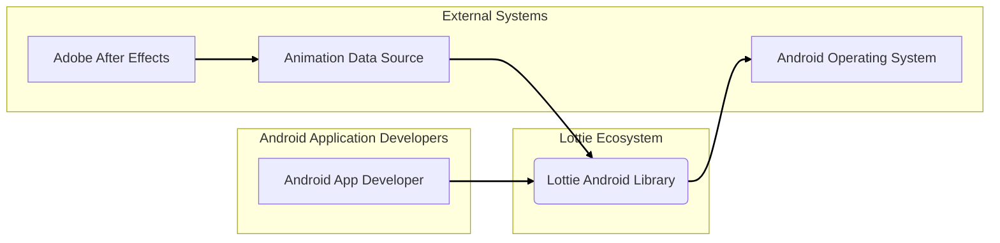
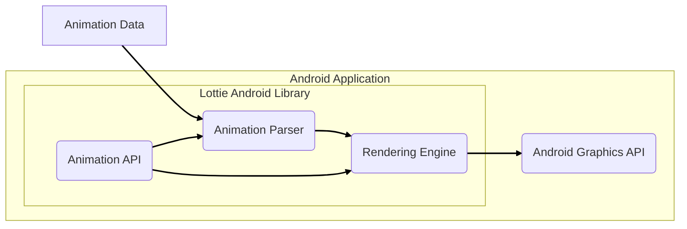
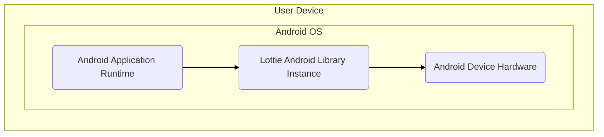
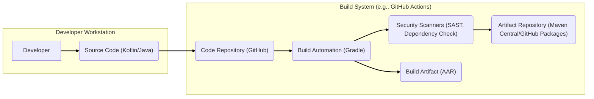

# BUSINESS POSTURE

This project, Lottie for Android, aims to provide a high-quality, performant, and easy-to-use animation library for Android applications. It enables developers to render Adobe After Effects animations natively on Android, iOS, Web, and Windows. The primary business goal is to enhance user experience in applications by allowing for the seamless integration of complex vector animations, reducing the need for traditional image-based animations or complex custom code.

- Business priorities:
  - High performance animation rendering on Android devices.
  - Broad compatibility with Adobe After Effects animations.
  - Simple integration and usage for Android developers.
  - Stability and reliability of the library.
  - Open-source community support and contributions.

- Business risks:
  - Performance bottlenecks in animation rendering leading to poor user experience.
  - Security vulnerabilities in the animation parsing or rendering engine that could be exploited by malicious animation files.
  - Compatibility issues with different Android versions and devices.
  - Lack of community support and maintenance leading to stagnation and security issues.
  - Legal risks associated with licensing and intellectual property if dependencies or contributions are not properly managed.

# SECURITY POSTURE

The security posture of the Lottie Android project, as an open-source library, is focused on ensuring the library is safe to use within Android applications. Given its nature as a rendering engine for animation data, the primary security concerns revolve around vulnerabilities arising from processing potentially untrusted animation files.

- Security controls:
  - security control: Code review process for contributions, implemented via GitHub Pull Requests. (Location: GitHub repository contribution guidelines and pull request process)
  - security control: Open source nature allows for community security review. (Location: Public GitHub repository)
  - security control: Dependency management using Gradle. (Location: build.gradle files)

- Accepted risks:
  - accepted risk: Vulnerabilities in third-party dependencies.
  - accepted risk: Potential for undiscovered vulnerabilities in the codebase due to complexity of animation parsing and rendering.
  - accepted risk: Risk of malicious contributions if code review process is insufficient.

- Recommended security controls:
  - security control: Implement automated dependency scanning to identify and address vulnerabilities in third-party libraries.
  - security control: Integrate Static Application Security Testing (SAST) tools into the CI/CD pipeline to automatically detect potential code-level vulnerabilities.
  - security control: Implement fuzz testing to identify vulnerabilities related to parsing malformed or malicious animation data.
  - security control: Establish a clear security vulnerability reporting and response process.

- Security requirements:
  - Authentication: Not directly applicable to a rendering library. Authentication is the responsibility of the application integrating the library.
  - Authorization: Not directly applicable to a rendering library. Authorization is the responsibility of the application integrating the library.
  - Input validation: Critical for animation data parsing. The library must robustly validate animation data to prevent vulnerabilities such as buffer overflows, injection attacks, or denial-of-service. Validation should cover data types, ranges, and structure.
  - Cryptography: Not a primary requirement for the core rendering functionality. However, if animation data is transmitted over a network, applications using Lottie should ensure secure communication channels (HTTPS). Lottie library itself might benefit from using cryptography for integrity checks if animation data is signed or encrypted, but this is not a current requirement.

# DESIGN

The Lottie Android project is designed as a library that Android developers can integrate into their applications to render animations. The core design revolves around parsing animation data, typically in JSON format, and using Android's graphics APIs to render these animations efficiently.

## C4 CONTEXT

- Elements of Context Diagram:
  - - Name: Android App Developer
    - Type: Person
    - Description: Developers who integrate the Lottie Android library into their Android applications to display animations.
    - Responsibilities: Integrate the Lottie library, provide animation data to the library, and handle animation playback within their applications.
    - Security controls: Responsible for the security of their applications, including how they obtain and use animation data.

  - - Name: Lottie Android Library
    - Type: Software System
    - Description: The Lottie Android library itself, responsible for parsing animation data and rendering animations on Android devices.
    - Responsibilities: Parse animation data (JSON), render vector animations using Android graphics APIs, provide APIs for controlling animation playback.
    - Security controls: Input validation on animation data, secure coding practices in the library implementation.

  - - Name: Adobe After Effects
    - Type: Software System
    - Description: Professional motion graphics and visual effects software used to create animations that can be exported in Lottie-compatible formats.
    - Responsibilities: Creation of animation content in a format compatible with Lottie.
    - Security controls: Security of After Effects software and the animation creation process is outside the scope of the Lottie library.

  - - Name: Android Operating System
    - Type: Software System
    - Description: The underlying operating system on Android devices that provides the environment for running Android applications and the Lottie library.
    - Responsibilities: Provide graphics rendering APIs, manage resources, and enforce security policies on Android devices.
    - Security controls: Android OS security features, such as permissions, sandboxing, and system updates.

  - - Name: Animation Data Source
    - Type: External System
    - Description: The source from which animation data (typically JSON files) is obtained. This could be local storage within the Android application, a remote server, or bundled assets.
    - Responsibilities: Provide animation data to the Lottie library.
    - Security controls: Depends on the source. If from a remote server, secure communication (HTTPS) and server-side security controls are relevant. If bundled within the app, integrity of the application package is important.

## C4 CONTAINER

- Elements of Container Diagram:
  - - Name: Animation Parser
    - Type: Container - Software Component
    - Description: Responsible for parsing animation data, typically in JSON format, into an internal representation that the rendering engine can use.
    - Responsibilities: Parse JSON animation data, validate data structure and values, handle different animation features and versions.
    - Security controls: Input validation to prevent parsing vulnerabilities, error handling for malformed data, memory management to prevent buffer overflows.

  - - Name: Rendering Engine
    - Type: Container - Software Component
    - Description: Takes the internal representation of the animation and uses Android's Graphics APIs to render the animation frames on the screen.
    - Responsibilities: Interpolate animation properties, draw shapes and paths, manage animation layers and effects, optimize rendering performance.
    - Security controls: Secure use of Android Graphics APIs, resource management to prevent denial-of-service, protection against rendering exploits.

  - - Name: Animation API
    - Type: Container - Software Component
    - Description: Provides the public API for Android developers to interact with the Lottie library. This includes methods for loading animations, controlling playback, and accessing animation properties.
    - Responsibilities: Expose a developer-friendly API, manage animation lifecycle, provide callbacks and listeners for animation events.
    - Security controls: API design to prevent misuse, input validation on API parameters, proper error handling.

  - - Name: Android Graphics API
    - Type: External Container - System API
    - Description: Android's built-in APIs for drawing graphics, used by the Lottie rendering engine.
    - Responsibilities: Provide low-level graphics rendering capabilities.
    - Security controls: Security is managed by the Android OS. Lottie relies on the security of the Android Graphics API.

  - - Name: Animation Data
    - Type: Data Store
    - Description: The animation data itself, typically in JSON format, which describes the animation content.
    - Responsibilities: Provide animation instructions to the Lottie library.
    - Security controls: Integrity of the animation data source, input validation by the Animation Parser.

## DEPLOYMENT

Lottie Android Library is deployed as part of an Android application. The library itself is not deployed as a standalone service. The deployment context is within the Android application runtime environment on user devices.

- Elements of Deployment Diagram:
  - - Name: Android Application Runtime
    - Type: Environment - Software Runtime
    - Description: The runtime environment provided by the Android OS for executing Android applications.
    - Responsibilities: Execute Android application code, manage application resources, provide access to device hardware and system services.
    - Security controls: Android OS security features, application sandboxing, runtime permissions.

  - - Name: Lottie Android Library Instance
    - Type: Node - Software Instance
    - Description: An instance of the Lottie Android library running within the Android application runtime.
    - Responsibilities: Parse and render animations within the application.
    - Security controls: Security controls implemented within the Lottie library code itself (input validation, secure coding practices).

  - - Name: Android Device Hardware
    - Type: Node - Hardware
    - Description: The physical Android device on which the application and Lottie library are running.
    - Responsibilities: Provide hardware resources for application execution.
    - Security controls: Device security features, such as hardware-backed keystore, secure boot, and device encryption.

## BUILD

The build process for the Lottie Android library involves compiling the Kotlin/Java source code, processing resources, and packaging it into an Android Archive (AAR) file, which can then be distributed via repositories like Maven Central or used directly by Android application developers.

- Elements of Build Diagram:
  - - Name: Developer
    - Type: Person
    - Description: Software developers contributing to the Lottie Android library.
    - Responsibilities: Write code, submit code changes, participate in code reviews.
    - Security controls: Secure development practices, code review participation, adherence to contribution guidelines.

  - - Name: Source Code (Kotlin/Java)
    - Type: Artifact - Code
    - Description: The Kotlin and Java source code of the Lottie Android library.
    - Responsibilities: Implement the library's functionality.
    - Security controls: Code reviews, static analysis, secure coding practices.

  - - Name: Code Repository (GitHub)
    - Type: System - Version Control
    - Description: GitHub repository hosting the Lottie Android source code and managing version control.
    - Responsibilities: Store source code, manage branches and versions, track code changes.
    - Security controls: Access control, branch protection, audit logs, vulnerability scanning by GitHub.

  - - Name: Build Automation (Gradle)
    - Type: System - Build Tool
    - Description: Gradle build system used to automate the build process, compile code, run tests, and package the library.
    - Responsibilities: Automate build steps, manage dependencies, execute build scripts.
    - Security controls: Secure build scripts, dependency management, integration with security scanners.

  - - Name: Security Scanners (SAST, Dependency Check)
    - Type: System - Security Tool
    - Description: Static Application Security Testing (SAST) tools and dependency vulnerability scanners integrated into the build process.
    - Responsibilities: Automatically scan code for vulnerabilities, identify vulnerable dependencies.
    - Security controls: Configuration and maintenance of security scanning tools, remediation of identified vulnerabilities.

  - - Name: Artifact Repository (Maven Central/GitHub Packages)
    - Type: System - Artifact Repository
    - Description: Repositories like Maven Central or GitHub Packages used to store and distribute the built AAR artifact.
    - Responsibilities: Host and distribute the library artifact.
    - Security controls: Access control, integrity checks, secure distribution channels (HTTPS).

  - - Name: Build Artifact (AAR)
    - Type: Artifact - Binary
    - Description: The Android Archive (AAR) file, the final packaged library ready for distribution and integration into Android applications.
    - Responsibilities: Provide the distributable form of the Lottie Android library.
    - Security controls: Signing of artifacts, integrity checks during distribution and usage.

# RISK ASSESSMENT

- Critical business process: Rendering animations smoothly and reliably within Android applications to enhance user experience. Failure to do so can lead to negative user perception and application abandonment. Security vulnerabilities could also disrupt this process.

- Data we are trying to protect:
  - Animation data (JSON files): Sensitivity depends on the context of the application using Lottie. In most cases, animation data itself is not highly sensitive. However, if animations are used in applications handling sensitive information, the integrity and availability of animation rendering become more important. Malicious animation data could potentially be used to exploit vulnerabilities in the Lottie library or the application itself.
  - Source code of the Lottie library: Protecting the integrity and confidentiality of the source code is important to prevent unauthorized modifications or disclosure of potential vulnerabilities.

- Data sensitivity:
  - Animation data: Low to Medium sensitivity in most general use cases. High sensitivity if used in security-critical applications or if animations themselves contain sensitive visual information.
  - Source code: Medium sensitivity. Publicly available open-source, but maintaining integrity is important.

# QUESTIONS & ASSUMPTIONS

- Questions:
  - What are the typical use cases for applications integrating Lottie Android in terms of data sensitivity? Are there specific industries or applications where Lottie is used to display animations related to sensitive user data or critical functionalities?
  - Are there any specific security requirements or compliance standards that applications using Lottie Android need to adhere to?
  - What is the process for reporting and addressing security vulnerabilities in the Lottie Android library? Is there a dedicated security team or contact?
  - Are there any existing security tests or audits performed on the Lottie Android library?

- Assumptions:
  - BUSINESS POSTURE: The primary business goal is to provide a feature-rich and performant animation library to enhance user experience in Android applications. Security is a secondary but important consideration to ensure the library is safe to use.
  - SECURITY POSTURE: Current security controls are primarily based on standard open-source development practices. There is room for improvement in automated security testing and vulnerability management processes. Input validation on animation data is a critical security requirement.
  - DESIGN: The library is designed as a modular component with clear separation of concerns between parsing, rendering, and API layers. Deployment is within the context of Android applications running on user devices. The build process likely uses standard open-source build tools and practices.