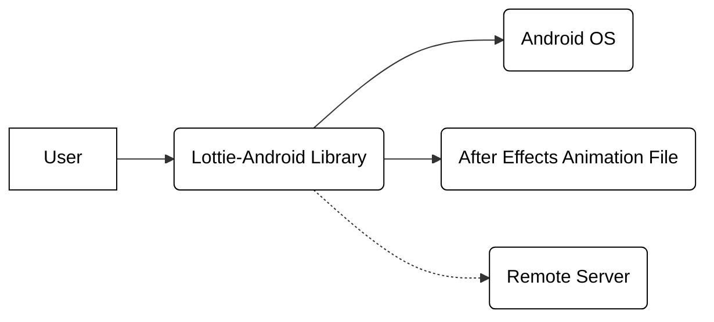
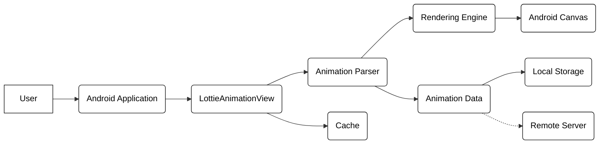
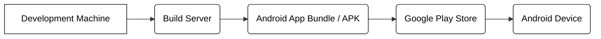
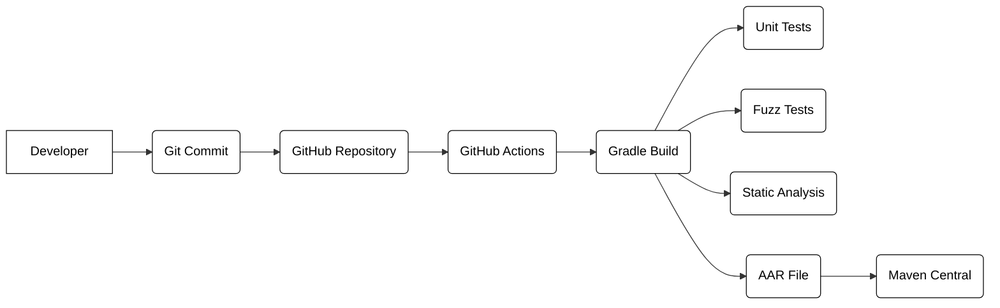

Okay, let's create a design document for the Lottie-Android project.

# BUSINESS POSTURE

Business Priorities and Goals:

*   Provide a high-performance, flexible, and reliable library for rendering After Effects animations natively on Android.
*   Enable developers to easily integrate rich animations into their applications, enhancing user experience.
*   Maintain a small library footprint to minimize the impact on application size.
*   Support a wide range of After Effects features and Android versions.
*   Foster a strong open-source community around the library.
*   Reduce development time and cost for creating complex animations.

Business Risks:

*   Security control: Maliciously crafted animation files could potentially exploit vulnerabilities in the parsing or rendering engine, leading to code execution or denial of service.
*   Security control: Large or complex animations could negatively impact application performance (CPU, memory, battery life).
*   Security control: Incompatibility with certain Android versions or devices could limit the library's adoption.
*   Security control: Lack of support for newer After Effects features could make the library less attractive over time.
*   Security control: A weak open-source community could lead to slow bug fixes and feature development.

# SECURITY POSTURE

Existing Security Controls:

*   Security control: Input validation: The library parses JSON files, which inherently involves input validation. The project's documentation and code suggest efforts to handle malformed input gracefully, although specific details are scattered. (Located throughout the codebase, particularly in parsing logic).
*   Security control: Fuzz testing: The project includes fuzz tests to identify potential vulnerabilities related to input handling. (Located in the `lottie/src/test/java/com/airbnb/lottie/` directory).
*   Security control: Code reviews: As an open-source project on GitHub, it benefits from community code reviews and scrutiny. (Visible in the project's pull request history).
*   Security control: Static analysis: The project likely uses static analysis tools as part of its development process, although the specific tools are not explicitly mentioned. (Implicit in the development workflow).
*   Accepted risk: The library relies on the underlying Android graphics framework, inheriting any security vulnerabilities present in that framework.
*   Accepted risk: The library does not encrypt animation files, meaning that sensitive data embedded within animations could be exposed if the files are intercepted or accessed without authorization.

Recommended Security Controls:

*   Security control: Implement a comprehensive security policy specifically addressing animation file validation and sanitization.
*   Security control: Integrate a Content Security Policy (CSP) if the library is used in a WebView context.
*   Security control: Provide clear documentation on security best practices for developers using the library, including recommendations for handling untrusted animation sources.
*   Security control: Regularly perform security audits and penetration testing to identify and address potential vulnerabilities.
*   Security control: Consider sandboxing the rendering engine to limit the impact of potential exploits.

Security Requirements:

*   Authentication: Not directly applicable, as the library itself does not handle authentication. However, if animations are fetched from a remote source, secure authentication mechanisms (e.g., OAuth 2.0, API keys) should be used.
*   Authorization: Not directly applicable, as the library does not manage user roles or permissions. However, if animations are conditionally displayed based on user roles, appropriate authorization checks should be implemented in the application using the library.
*   Input Validation:
    *   The library MUST strictly validate the structure and content of animation files (JSON format) to prevent parsing errors and potential exploits.
    *   The library SHOULD limit the size and complexity of animation files to mitigate denial-of-service risks.
    *   The library SHOULD sanitize any user-provided data used to control animation playback (e.g., animation speed, progress).
*   Cryptography:
    *   If animation files contain sensitive data, the application using the library SHOULD encrypt them at rest and in transit. The library itself does not need to provide encryption features, but it should not interfere with the application's ability to handle encrypted data.
*   Error Handling
    *   The library MUST handle errors gracefully and provide informative error messages to developers without exposing sensitive information.
    *   The library SHOULD provide mechanisms for developers to handle errors and recover from them.

# DESIGN

## C4 CONTEXT

Element List:

*   Element:
    *   Name: User
    *   Type: Person
    *   Description: A person who interacts with an Android application that uses the Lottie-Android library.
    *   Responsibilities: Interacts with the application's UI, which may include Lottie animations.
    *   Security Controls: None directly implemented by the library. Relies on the security of the Android application and device.

*   Element:
    *   Name: Lottie-Android Library
    *   Type: Software System
    *   Description: A library for rendering After Effects animations natively on Android.
    *   Responsibilities: Parsing animation files, rendering animations, managing animation playback.
    *   Security Controls: Input validation, fuzz testing, code reviews, static analysis (likely).

*   Element:
    *   Name: Android OS
    *   Type: Software System
    *   Description: The Android operating system.
    *   Responsibilities: Providing the underlying graphics framework, managing system resources, enforcing security policies.
    *   Security Controls: Android's built-in security features (sandboxing, permissions, etc.).

*   Element:
    *   Name: After Effects Animation File
    *   Type: Data
    *   Description: A JSON file exported from Adobe After Effects that defines the animation.
    *   Responsibilities: Containing the animation data (shapes, colors, transformations, etc.).
    *   Security Controls: None directly implemented by the library. Relies on the security of the storage and transport mechanisms.

*   Element:
    *   Name: Remote Server
    *   Type: Software System
    *   Description: A remote server from which animation files may be fetched.
    *   Responsibilities: Storing and serving animation files.
    *   Security Controls: Authentication, authorization, secure communication protocols (HTTPS). This is outside the scope of the Lottie library itself, but important for the overall security of the system.

## C4 CONTAINER

Element List:

*   Element:
    *   Name: User
    *   Type: Person
    *   Description: A person who interacts with an Android application that uses the Lottie-Android library.
    *   Responsibilities: Interacts with the application's UI, which may include Lottie animations.
    *   Security Controls: None directly implemented by the library. Relies on the security of the Android application and device.

*   Element:
    *   Name: Android Application
    *   Type: Container: Mobile App
    *   Description: The Android application that integrates the Lottie-Android library.
    *   Responsibilities: Hosting the LottieAnimationView, managing application logic, handling user interactions.
    *   Security Controls: Application-level security controls (authentication, authorization, data protection, etc.).

*   Element:
    *   Name: LottieAnimationView
    *   Type: Container: UI Component
    *   Description: A view that displays Lottie animations.
    *   Responsibilities: Managing animation playback, interacting with the rendering engine, handling user input (if enabled).
    *   Security Controls: None specific, relies on the security of the underlying components.

*   Element:
    *   Name: Animation Parser
    *   Type: Container: Component
    *   Description: A component that parses After Effects animation files (JSON).
    *   Responsibilities: Validating the JSON structure, extracting animation data, handling parsing errors.
    *   Security Controls: Input validation, fuzz testing.

*   Element:
    *   Name: Rendering Engine
    *   Type: Container: Component
    *   Description: A component that renders the animation frames.
    *   Responsibilities: Drawing shapes, applying transformations, handling animation timing.
    *   Security Controls: Potentially sandboxing (recommended).

*   Element:
    *   Name: Android Canvas
    *   Type: Container: API
    *   Description: The Android Canvas API, used for drawing graphics.
    *   Responsibilities: Providing drawing primitives, managing the display surface.
    *   Security Controls: Relies on the security of the Android OS.

*   Element:
    *   Name: Cache
    *   Type: Container: Component
    *   Description: A component that caches parsed animation data to improve performance.
    *   Responsibilities: Storing and retrieving cached animation data.
    *   Security Controls: None specific, but should ensure that cached data is not tampered with.

*   Element:
    *   Name: Animation Data
    *   Type: Data
    *   Description: The animation data, either loaded from local storage or a remote server.
    *   Responsibilities: Storing animation data.
    *   Security Controls: None.

*   Element:
    *   Name: Local Storage
    *   Type: Container: Storage
    *   Description: The device's local storage, where animation files may be stored.
    *   Responsibilities: Storing animation files.
    *   Security Controls: Relies on the security of the Android OS and file system permissions.

*   Element:
    *   Name: Remote Server
    *   Type: Container: Web Server
    *   Description: A remote server from which animation files may be fetched.
    *   Responsibilities: Storing and serving animation files.
    *   Security Controls: Authentication, authorization, secure communication protocols (HTTPS).

## DEPLOYMENT

Possible Deployment Solutions:

1.  Embedded within an APK: The Lottie library is typically included as a dependency in the Android application's APK file.
2.  Dynamic Feature Module: For larger animations, the animation files and potentially the Lottie library itself could be packaged within a dynamic feature module, which can be downloaded on demand.
3.  Fetched from a Content Delivery Network (CDN): Animation files can be hosted on a CDN and fetched at runtime.

Chosen Solution (Detailed): Embedded within an APK

Element List:

*   Element:
    *   Name: Development Machine
    *   Type: Infrastructure Node: Device
    *   Description: A developer's workstation used for writing code and building the application.
    *   Responsibilities: Code development, local testing, initiating builds.
    *   Security Controls: Developer workstation security (antivirus, firewall, etc.).

*   Element:
    *   Name: Build Server
    *   Type: Infrastructure Node: Server
    *   Description: A server that builds the Android application (e.g., Jenkins, GitHub Actions, GitLab CI).
    *   Responsibilities: Compiling code, running tests, packaging the application.
    *   Security Controls: Build server security (access control, vulnerability scanning, etc.).

*   Element:
    *   Name: Android App Bundle / APK
    *   Type: Artifact
    *   Description: The final application package, containing the Lottie library and animation files.
    *   Responsibilities: Containing all necessary code and resources for the application.
    *   Security Controls: Code signing, ProGuard/R8 obfuscation (potentially).

*   Element:
    *   Name: Google Play Store
    *   Type: Platform
    *   Description: Google's official app store for Android applications.
    *   Responsibilities: Distributing the application to users.
    *   Security Controls: Google Play Store security checks (malware scanning, etc.).

*   Element:
    *   Name: Android Device
    *   Type: Infrastructure Node: Device
    *   Description: An Android device on which the application is installed.
    *   Responsibilities: Running the application, rendering animations.
    *   Security Controls: Android device security (OS updates, security patches, etc.).

## BUILD

The Lottie-Android library is built using Gradle, a build automation system. The build process likely involves the following steps:

1.  Code Compilation: The Java and Kotlin source code is compiled into bytecode.
2.  Resource Processing: Resources, such as animation files, are processed and packaged.
3.  Testing: Unit tests and fuzz tests are executed.
4.  Packaging: The compiled code and resources are packaged into an AAR (Android Archive) file.
5.  Publication: The AAR file is published to a repository (e.g., Maven Central).

Security Controls in Build Process:

*   Security control: Version Control (Git): The source code is managed using Git, providing a history of changes and enabling collaboration.
*   Security control: Build Automation (Gradle): The build process is automated using Gradle, ensuring consistency and reproducibility.
*   Security control: Continuous Integration (GitHub Actions): GitHub Actions is used for continuous integration, automatically building and testing the code on every commit.
*   Security control: Unit Tests: Unit tests are used to verify the functionality of individual components.
*   Security control: Fuzz Tests: Fuzz tests are used to identify potential vulnerabilities related to input handling.
*   Security control: Static Analysis: Static analysis tools (likely integrated into the build process) are used to identify potential code quality and security issues.
*   Security control: Dependency Management (Gradle): Gradle manages dependencies, ensuring that the correct versions of libraries are used.  It's crucial to keep these dependencies up-to-date to avoid known vulnerabilities.
*   Security control: Artifact Repository (Maven Central): The built library is published to Maven Central, a well-known and trusted repository.

# RISK ASSESSMENT

Critical Business Processes:

*   Rendering animations correctly and efficiently.
*   Maintaining application performance and stability.
*   Providing a positive user experience.

Data to Protect:

*   Animation files (JSON): Sensitivity depends on the content of the animation. If animations contain sensitive data (e.g., user-specific information, branding assets), they should be protected.  Generally, these are considered low sensitivity unless they contain PII or proprietary information.
*   Application code: Medium sensitivity. Protecting against reverse engineering and unauthorized modification.
*   User data (indirectly): If animations are personalized or based on user data, that data has high sensitivity and needs to be protected by the *application* using Lottie, not Lottie itself.

# QUESTIONS & ASSUMPTIONS

Questions:

*   What specific static analysis tools are used in the build process?
*   Are there any specific security guidelines or policies followed by the Lottie-Android development team?
*   What is the process for handling reported security vulnerabilities?
*   Are there any plans to implement sandboxing for the rendering engine?
*   What is the maximum supported size/complexity of animation files?
*   Are there any known limitations or vulnerabilities in the current implementation?

Assumptions:

*   Business Posture: The primary goal is to provide a high-quality animation library, with security being a significant but not necessarily the *top* priority.  The project is likely willing to accept some level of risk in exchange for performance and ease of use.
*   Security Posture: The project relies heavily on existing security mechanisms provided by the Android OS and the development tools (Gradle, GitHub Actions).  There is an implicit trust in these tools and platforms.
*   Design: The provided design diagrams are based on a general understanding of the library's architecture and may not reflect all internal details. The deployment model assumes a standard APK-based distribution through the Google Play Store.