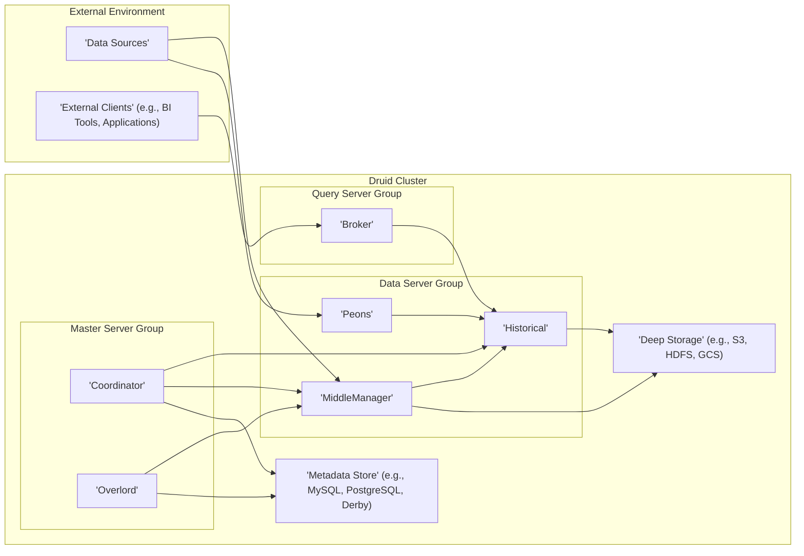
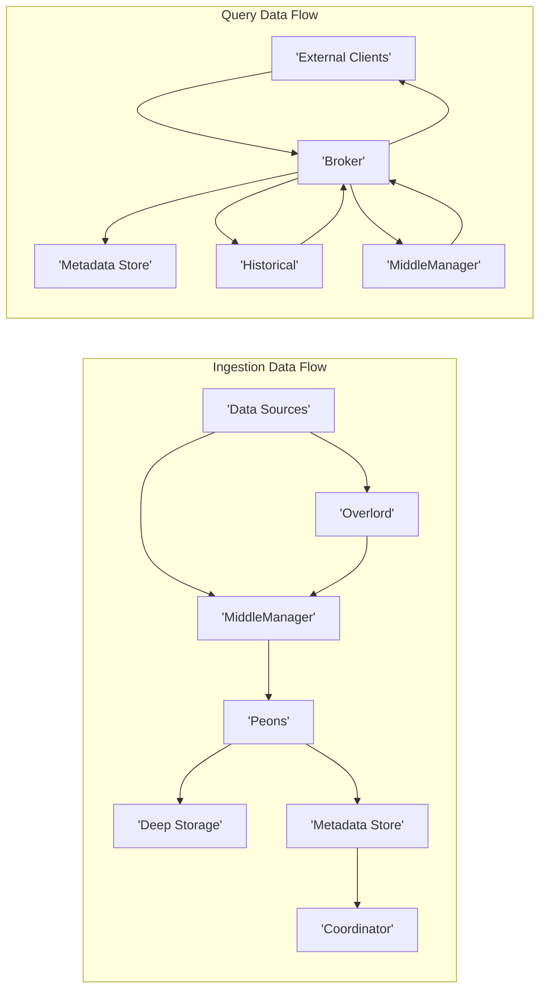

# Project Design Document: Apache Druid

**Version:** 1.1
**Date:** October 26, 2023
**Author:** AI Software Architect

## 1. Introduction

This document provides a detailed architectural design of the Apache Druid project, an open-source, distributed, column-oriented data store optimized for high-performance exploratory analytics on large datasets. This document is specifically designed to facilitate subsequent threat modeling activities by providing a comprehensive understanding of the system's structure and data flows.

### 1.1. Purpose

The primary purpose of this document is to provide a clear and detailed description of Druid's architecture, components, and data flow. This will enable security engineers and other stakeholders to effectively identify potential security vulnerabilities, attack vectors, and areas of risk during the threat modeling process. This document aims to be a single source of truth for the system's design from a security perspective.

### 1.2. Scope

This document covers the core architectural components of Druid, including their responsibilities, interactions, and key data flows. It focuses on the logical architecture and relevant security aspects, without delving into specific implementation details, configuration parameters, or operational procedures.

### 1.3. Goals

*   Provide a precise and unambiguous description of Druid's architecture, suitable for security analysis.
*   Clearly identify the key components, their roles, and their interdependencies.
*   Illustrate the complete lifecycle of data within the system, from ingestion to querying.
*   Highlight potential areas of security concern and provide context for future threat modeling sessions.

## 2. High-Level Architecture

Druid employs a distributed, shared-nothing architecture, where data is partitioned and replicated across multiple servers for scalability and fault tolerance. It is designed to handle both real-time streaming data and historical batch data, supporting high-concurrency querying.

### 2.1. Key Components

*   **Data Sources:** External systems that generate or store data to be ingested into Druid. Examples include:
    *   Message queues (e.g., Kafka, Kinesis)
    *   Databases (e.g., relational databases, NoSQL databases)
    *   File systems (e.g., local files, cloud storage)
*   **External Clients:** Applications, tools, or users that submit queries to Druid to analyze data. Examples include:
    *   Business intelligence (BI) tools (e.g., Apache Superset, Tableau)
    *   Custom applications using Druid's query API
    *   Command-line interface (CLI) tools
*   **Master Server Group:** Responsible for managing the overall cluster state and data availability.
    *   **Coordinator:** Manages the historical data segments on Historical nodes. Its responsibilities include:
        *   Segment load balancing across Historical nodes.
        *   Segment replication to ensure data availability.
        *   Segment tiering based on storage policies.
        *   Communicating with the Metadata Store to track segment metadata.
    *   **Overlord:** Manages the ingestion process. Its responsibilities include:
        *   Receiving and managing ingestion tasks.
        *   Assigning ingestion tasks to available MiddleManager nodes.
        *   Monitoring the status of ingestion tasks.
        *   Communicating with the Metadata Store to track task metadata.
*   **Query Server Group:** Handles incoming queries from external clients.
    *   **Broker:** The query entry point for external clients. Its responsibilities include:
        *   Receiving and parsing queries.
        *   Identifying the Historical and MiddleManager nodes that contain the relevant data segments.
        *   Routing sub-queries to the appropriate data servers.
        *   Merging the results from data servers.
        *   Returning the final result to the client.
        *   Caching query results for performance optimization.
*   **Data Server Group:** Stores and serves the actual data.
    *   **Historical:** Stores immutable, historical data segments in a columnar format. Its responsibilities include:
        *   Loading and serving segments from Deep Storage.
        *   Executing queries against local segments.
        *   Managing local disk storage.
    *   **MiddleManager:** Responsible for ingesting real-time and batch data. Its responsibilities include:
        *   Spawning Peon processes to perform ingestion tasks.
        *   Managing the lifecycle of Peon processes.
        *   Coordinating the hand-off of newly created segments to Historical nodes.
    *   **Peons:** Worker processes spawned by MiddleManagers to perform the actual data ingestion tasks. Their responsibilities include:
        *   Consuming data from configured sources.
        *   Parsing and transforming data.
        *   Creating in-memory segments.
        *   Persisting segments to Deep Storage.
*   **Metadata Store:** Stores metadata about the Druid cluster, such as:
    *   Segment locations and metadata.
    *   Ingestion task definitions and statuses.
    *   Datasource configurations.
    *   Used by the Coordinator and Overlord for coordination and state management.
*   **Deep Storage:** Provides durable and reliable storage for the immutable, persistent copies of data segments. Examples include:
    *   Object storage services (e.g., Amazon S3, Google Cloud Storage, Azure Blob Storage)
    *   Distributed file systems (e.g., HDFS)

## 3. Data Flow

The following outlines the typical data flow within a Druid cluster for both ingestion and querying.

### 3.1. Ingestion

1. **Data Emission:** Data is generated or retrieved from **Data Sources**.
2. **Real-time Ingestion:**
    *   Data streams are typically directed to **MiddleManager** nodes.
    *   The **Overlord** assigns ingestion tasks to available **MiddleManager** nodes based on resource availability and task definitions.
    *   **MiddleManager** nodes spawn **Peons** to handle the ingestion task.
    *   **Peons** consume data, perform transformations as defined in the ingestion spec, and create in-memory segments.
    *   Once segments are built and reach a certain size or time threshold, they are persisted to **Deep Storage**.
    *   Metadata about the new segments, including their location in Deep Storage, is written to the **Metadata Store**.
    *   The **Coordinator** monitors the Metadata Store and becomes aware of the new segments.
3. **Batch Ingestion:**
    *   Data can be loaded in batches, often directly processed by **MiddleManager** nodes or, in some configurations, directly loaded as historical segments.
    *   Similar to real-time ingestion, the **Overlord** manages the batch ingestion tasks.
    *   Segments are built and persisted to **Deep Storage**, and metadata is updated in the **Metadata Store**.

### 3.2. Querying

1. **Query Submission:** **External Clients** send queries to **Broker** nodes via Druid's query API (typically HTTP).
2. **Query Analysis and Routing:**
    *   The **Broker** receives the query and analyzes it to determine which datasources and time ranges are involved.
    *   It consults the **Metadata Store** (indirectly, through its knowledge of the cluster state) to identify the **Historical** and **MiddleManager** nodes that hold the relevant data segments.
3. **Sub-query Dispatch:**
    *   The **Broker** constructs sub-queries targeting the specific **Historical** and **MiddleManager** nodes.
    *   These sub-queries are dispatched to the relevant data servers.
4. **Data Retrieval and Processing:**
    *   **Historical** nodes query their local segments stored on disk.
    *   **MiddleManager** nodes query their in-memory segments.
5. **Result Aggregation:**
    *   The **Historical** and **MiddleManager** nodes return their partial results to the **Broker**.
    *   The **Broker** merges and aggregates these partial results according to the original query.
6. **Result Delivery:** The **Broker** returns the final query result to the **External Client**.

## 4. Component Details

This section provides a more detailed look at the responsibilities and functionalities of each core component.

### 4.1. Coordinator

*   **Segment Management:** Responsible for the lifecycle of historical data segments, including loading, dropping, and moving segments between tiers.
*   **Load Balancing:** Ensures an even distribution of segments across Historical nodes to optimize query performance and resource utilization.
*   **Replication Management:** Maintains the desired level of segment replication for fault tolerance.
*   **Tiering Management:** Implements storage tiering policies based on data age or access frequency.
*   **Metadata Interaction:** Continuously interacts with the Metadata Store to track segment metadata and cluster state.

### 4.2. Overlord

*   **Task Management:** Accepts and manages ingestion tasks submitted through the Druid API.
*   **Task Assignment:** Assigns ingestion tasks to available MiddleManager nodes based on their capacity and health.
*   **Task Monitoring:** Tracks the progress and status of running ingestion tasks.
*   **Scalability:** Can dynamically scale the number of MiddleManager nodes based on ingestion workload.
*   **Coordination:** Coordinates with the Metadata Store to manage task definitions and statuses.

### 4.3. Broker

*   **Query Reception:** Acts as the primary entry point for queries from external clients.
*   **Query Parsing and Planning:** Parses incoming queries and develops an execution plan.
*   **Data Location Awareness:** Maintains an understanding of where data segments are located within the cluster.
*   **Sub-query Generation and Routing:** Generates and routes sub-queries to the appropriate Historical and MiddleManager nodes.
*   **Result Merging and Aggregation:** Merges and aggregates the results received from data servers.
*   **Query Caching:** Caches query results to improve performance for repeated queries.

### 4.4. Historical

*   **Segment Storage:** Stores historical data segments on local disk.
*   **Query Execution:** Executes queries against the segments it holds.
*   **Segment Loading and Unloading:** Loads and unloads segments based on instructions from the Coordinator.
*   **Data Serving:** Serves data to Broker nodes in response to sub-queries.

### 4.5. MiddleManager

*   **Ingestion Task Execution:** Executes ingestion tasks assigned by the Overlord.
*   **Peon Management:** Spawns and manages Peon processes.
*   **Segment Building:** Builds in-memory segments from incoming data.
*   **Segment Persistence:** Persists completed segments to Deep Storage.
*   **Hand-off Coordination:** Coordinates the hand-off of newly created segments to Historical nodes.

### 4.6. Peons

*   **Data Consumption:** Consumes data from configured input sources.
*   **Data Parsing and Transformation:** Parses and transforms data according to the ingestion specification.
*   **Indexing:** Creates indexes on the data for efficient querying.
*   **Segment Creation:** Creates the actual data segments.
*   **Deep Storage Interaction:** Writes completed segments to Deep Storage.

### 4.7. Metadata Store

*   **Segment Metadata Storage:** Stores metadata about data segments, including location, size, and schema.
*   **Task Metadata Storage:** Stores metadata about ingestion tasks, including status and configuration.
*   **Cluster State Storage:** Stores information about the current state of the Druid cluster.
*   **Coordination and Synchronization:** Provides a mechanism for coordination and synchronization between Druid components.

### 4.8. Deep Storage

*   **Durable Storage:** Provides durable and reliable storage for data segments.
*   **Data Persistence:** Ensures that data is persisted even if individual Druid nodes fail.
*   **Source of Truth:** Acts as the source of truth for all data within the Druid cluster.

## 5. Security Considerations (Detailed)

This section expands on potential security considerations, providing more specific examples of potential threats and vulnerabilities.

*   **Authentication and Authorization:**
    *   **Threats:** Unauthorized access to data, unauthorized modification of data or cluster configuration, impersonation of legitimate users or services.
    *   **Considerations:** How are users and applications authenticated (e.g., username/password, API keys, OAuth)? How are access permissions defined and enforced for different datasources and operations? Is role-based access control (RBAC) implemented?
*   **Data Encryption:**
    *   **Threats:** Data breaches due to unauthorized access to storage or network traffic.
    *   **Considerations:** Is data encrypted at rest in Deep Storage and on Historical nodes? Is data encrypted in transit between Druid components and to external clients (e.g., using TLS/SSL)? How are encryption keys managed and rotated?
*   **Network Security:**
    *   **Threats:** Unauthorized access to Druid components, eavesdropping on network traffic, man-in-the-middle attacks.
    *   **Considerations:** Are firewalls and network segmentation used to isolate Druid components? Are network communications between components secured (e.g., using mutual TLS)? Are access control lists (ACLs) used to restrict network access?
*   **Input Validation:**
    *   **Threats:** Injection attacks (e.g., SQL injection if interacting with external databases), denial of service through malformed data.
    *   **Considerations:** How is input data validated during ingestion to prevent malicious or malformed data from entering the system? Are there mechanisms to sanitize or escape user-provided data in queries?
*   **Access Control (Component Level):**
    *   **Threats:** Unauthorized access to administrative interfaces or control plane components, leading to cluster disruption or data manipulation.
    *   **Considerations:** How is access to the Coordinator, Overlord, and other administrative components controlled? Are there separate authentication and authorization mechanisms for these components?
*   **Secrets Management:**
    *   **Threats:** Exposure of sensitive credentials (e.g., database passwords, API keys) leading to unauthorized access to external systems or the Druid cluster itself.
    *   **Considerations:** How are sensitive credentials stored and managed? Are secrets encrypted at rest? Are there mechanisms for secure secret rotation?
*   **Auditing and Logging:**
    *   **Threats:** Difficulty in detecting and responding to security incidents due to lack of visibility.
    *   **Considerations:** Are actions within the Druid cluster audited (e.g., user logins, query execution, configuration changes)? Are logs securely stored and accessible for security monitoring and incident response?
*   **Dependency Management:**
    *   **Threats:** Exploitation of known vulnerabilities in third-party libraries or components.
    *   **Considerations:** How are Druid's dependencies managed and updated? Are there processes for monitoring and patching vulnerabilities in dependencies?
*   **Denial of Service (DoS) Attacks:**
    *   **Threats:** Disruption of Druid service availability due to resource exhaustion.
    *   **Considerations:** Are there mechanisms to limit the rate of incoming queries or ingestion requests? Are there resource limits in place to prevent individual queries or tasks from consuming excessive resources?

## 6. Deployment Considerations

Druid can be deployed in various configurations, each with its own security implications.

*   **On-Premise Deployment:** Requires careful consideration of network security, physical security of servers, and access control within the organization's infrastructure.
*   **Cloud Deployment (IaaS):** Leveraging cloud infrastructure provides benefits like scalability and availability but requires securing the underlying virtual machines, networks, and storage. Cloud provider security best practices should be followed.
*   **Containerized Deployment (Docker, Kubernetes):** Containerization adds a layer of abstraction but introduces new security considerations related to container image security, orchestration platform security, and network policies within the cluster.
*   **Managed Services:** Utilizing managed Druid services offered by cloud providers offloads some operational security responsibilities but requires understanding the security controls and compliance certifications of the provider.

## 7. Dependencies

Druid relies on several external dependencies, which can be categorized as follows:

*   **Core Java Libraries:**
    *   **Java Virtual Machine (JVM):** The runtime environment for Druid. Security vulnerabilities in the JVM can impact Druid.
    *   **Netty:** A networking framework used for inter-process communication. Vulnerabilities in Netty could expose communication channels.
    *   **Jackson:** A library for JSON processing. Improper handling of JSON data could lead to vulnerabilities.
    *   **Guava:** A collection of core libraries from Google.
*   **Coordination and Metadata:**
    *   **ZooKeeper:** Used for cluster coordination and leader election (optional, but recommended). Security of the ZooKeeper ensemble is critical.
    *   **Metadata Store (e.g., MySQL, PostgreSQL, Derby):** Stores critical metadata. The security of this database is paramount.
*   **Storage:**
    *   **Deep Storage (e.g., S3, HDFS, GCS):** Stores persistent data. Security configurations of the chosen deep storage solution are important.
*   **Other Libraries:** Various other libraries for logging, metrics, and specific functionalities.

It is crucial to keep these dependencies up-to-date to mitigate known security vulnerabilities.

## 8. Conclusion

This document provides a comprehensive architectural design of Apache Druid, specifically tailored for security analysis and threat modeling. The detailed descriptions of components, data flows, and security considerations offer a solid foundation for identifying and mitigating potential security risks associated with the system. This document should be used as a key reference point in future security assessments and discussions.