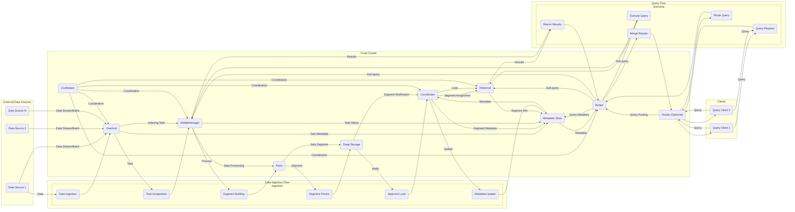

# Project Design Document: Apache Druid (Improved)

**Version:** 1.1
**Date:** October 26, 2023
**Author:** AI Software Architect

## 1. Introduction

This document provides an enhanced architectural overview of Apache Druid, specifically tailored for threat modeling. It details the core components, their interactions, and the data flow within the Druid system, emphasizing aspects relevant to security analysis. This document will serve as the foundation for identifying potential security vulnerabilities and designing appropriate mitigations. The specific codebase under consideration is the Alibaba Druid fork located at [https://github.com/alibaba/druid](https://github.com/alibaba/druid), although the fundamental architecture remains consistent with the Apache Druid project. The goal is to provide a clear and comprehensive understanding of the system's architecture from a security perspective.

## 2. Project Overview

Apache Druid is a high-performance, column-oriented, distributed data store optimized for real-time analytics and interactive ad-hoc queries on large datasets. Its key strengths lie in its ability to ingest streaming and batch data rapidly and provide low-latency access for business intelligence and OLAP workloads. Understanding these core functionalities is crucial for identifying potential attack vectors. Key characteristics of Druid include:

*   **Columnar Storage:** Data is stored column-wise, enabling efficient retrieval and processing for analytical queries that typically involve aggregations over a subset of columns. This impacts data access patterns and potential vulnerabilities related to column-level security.
*   **Scalability:** Designed for horizontal scalability, allowing the system to handle increasing data volumes and query loads by adding more servers. This introduces complexities in distributed security management.
*   **Real-time Ingestion:** Supports continuous ingestion of data streams with low latency, making it suitable for time-sensitive analytics. This requires robust security measures to protect the integrity and confidentiality of incoming data.
*   **Fast Aggregation and Filtering:** Optimized for complex aggregations and filtering operations, which are common in analytical workloads. The query processing engine's security is a critical area.
*   **Cloud-Native Architecture:** Well-suited for deployment in cloud environments, often leveraging cloud-provided security features and potentially introducing cloud-specific vulnerabilities.

## 3. Architectural Overview

Druid's architecture is composed of several independent, specialized components that collaborate to deliver its functionality. These components can be deployed on separate servers or co-located, influencing the attack surface and security considerations.

### 3.1. Core Components

*   **"Coordinator"**:  The brain of the historical data tier. It manages the lifecycle of historical data segments, including:
    *   **Segment Distribution:**  Determining which Historical processes should load which segments.
    *   **Data Retention:** Enforcing rules for dropping old data segments.
    *   **Segment Balancing:**  Moving segments between Historical processes to optimize query performance and resource utilization.
    *   **Security Implications:** Vulnerabilities in the Coordinator could lead to data loss, unauthorized data access by manipulating segment assignments, or denial of service by overloading specific Historical nodes.
*   **"Overlord"**:  The manager of the real-time data ingestion process. Its responsibilities include:
    *   **Task Management:**  Receiving and managing indexing tasks submitted by clients or external systems.
    *   **Task Assignment:**  Allocating indexing tasks to available MiddleManager processes.
    *   **Task Monitoring:**  Tracking the progress and health of running indexing tasks.
    *   **Security Implications:**  Compromising the Overlord could allow attackers to inject malicious data, disrupt the ingestion process, or gain insights into data pipelines.
*   **"Broker"**:  The query entry point and optimizer. It:
    *   **Receives Queries:** Accepts queries from external clients (e.g., applications, BI tools).
    *   **Query Routing:**  Determines which Historical and MiddleManager processes hold the data relevant to the query.
    *   **Result Merging:**  Aggregates and merges the results returned by the target processes.
    *   **Security Implications:** The Broker is a prime target for attackers seeking to access sensitive data. Vulnerabilities here could lead to unauthorized data retrieval, query injection attacks, or denial of service by overloading the query processing engine.
*   **"Router"**: An optional load balancer and high-availability gateway for Brokers. It:
    *   **Load Balancing:** Distributes incoming query requests across multiple Broker processes.
    *   **High Availability:**  Provides a single entry point for queries, even if some Brokers are unavailable.
    *   **Security Implications:**  While adding resilience, the Router itself becomes a point of focus for security. Compromising the Router could allow attackers to intercept or redirect queries.
*   **"Historical"**:  The long-term storage and query engine for immutable data segments. It:
    *   **Stores Segments:** Holds compressed, columnar data segments on disk.
    *   **Serves Queries:** Executes queries against its local data segments.
    *   **Security Implications:** Securing Historical processes is crucial for protecting the vast majority of Druid data. Unauthorized access could lead to large-scale data breaches.
*   **"MiddleManager"**:  The worker process responsible for building new data segments from incoming data. It:
    *   **Receives Tasks:** Accepts indexing tasks from the Overlord.
    *   **Spawns Peons:** Creates worker processes (Peons) to perform the actual data processing.
    *   **Manages Resources:**  Allocates CPU and memory for Peon processes.
    *   **Security Implications:**  Compromising a MiddleManager could allow attackers to manipulate the data ingestion process, potentially injecting malicious data or causing data corruption.
*   **"Peons"**:  Short-lived worker processes spawned by MiddleManagers to perform the heavy lifting of data ingestion and segment building.
    *   **Data Processing:** Reads, transforms, and aggregates incoming data.
    *   **Segment Creation:** Builds the columnar data segments.
    *   **Security Implications:** While ephemeral, vulnerabilities in Peons could be exploited to gain access to sensitive data during processing or to disrupt the ingestion pipeline.
*   **"ZooKeeper"**:  The central coordination service for the Druid cluster. It manages:
    *   **Cluster Membership:**  Tracking the active Druid processes.
    *   **Leader Election:**  Electing leaders for components like the Coordinator and Overlord.
    *   **Configuration Management:**  Storing and distributing cluster configuration.
    *   **Security Implications:** ZooKeeper is a critical component. If compromised, an attacker could disrupt the entire Druid cluster, cause data loss, or gain control over Druid components.
*   **"Metadata Store"**:  A relational database that persists metadata about the Druid cluster. This includes:
    *   **Segment Metadata:** Information about the location and properties of data segments.
    *   **Datasource Information:**  Schema definitions and other metadata about the data ingested into Druid.
    *   **Ingestion Task Status:**  Tracking the progress of data ingestion tasks.
    *   **Security Implications:**  The Metadata Store contains sensitive information about the Druid cluster. Unauthorized access could reveal the structure of the data, the location of segments, and potentially allow for manipulation of the cluster state.
*   **"Deep Storage"**:  A distributed object store where Druid persists immutable data segments for long-term storage and durability. Examples include:
    *   **Amazon S3**
    *   **HDFS**
    *   **Azure Blob Storage**
    *   **Google Cloud Storage**
    *   **Security Implications:**  Deep Storage holds the persistent data. Securing access to this storage is paramount. Misconfigured permissions or vulnerabilities in the storage platform could lead to data breaches or data loss.

### 3.2. Component Interactions

The following list elaborates on the key interactions between the Druid components, highlighting security-relevant aspects:

*   **Data Ingestion:**
    *   External data sources send data to the **"Overlord"**, often via HTTP or Kafka. **Security Consideration:**  Ensure secure communication channels (HTTPS) and proper authentication/authorization for data submission. Input validation at this stage is crucial to prevent injection attacks.
    *   The **"Overlord"** creates indexing tasks and assigns them to available **"MiddleManager"** processes via internal communication mechanisms. **Security Consideration:** Secure internal communication channels and ensure only authorized Overlords can assign tasks.
    *   **"MiddleManager"** processes spawn **"Peon"** processes to perform the actual data processing. **Security Consideration:**  Isolate Peon processes to limit the impact of potential compromises. Monitor resource usage to detect anomalies.
    *   **"Peon"** processes build data segments and upload them to **"Deep Storage"**. **Security Consideration:** Secure access credentials for Deep Storage. Implement encryption for data in transit and at rest in Deep Storage.
    *   The **"Coordinator"** is notified of new segments in **"Deep Storage"**. **Security Consideration:** Secure the notification mechanism to prevent malicious actors from injecting false segment information.
    *   The **"Coordinator"** assigns segments to **"Historical"** processes. **Security Consideration:** Ensure only authorized Coordinators can assign segments.
    *   **"Historical"** processes download segments from **"Deep Storage"**. **Security Consideration:** Secure the download process and verify the integrity of downloaded segments.
    *   Metadata about the segments is stored in the **"Metadata Store"**. **Security Consideration:** Secure access to the Metadata Store to prevent unauthorized modification or disclosure of segment metadata.
*   **Query Processing:**
    *   Clients send queries to the **"Broker"** (or **"Router"**) via protocols like HTTP. **Security Consideration:** Implement strong authentication and authorization for query requests. Sanitize query inputs to prevent injection attacks. Use HTTPS for secure communication.
    *   The **"Broker"** consults the **"Coordinator"** (via the **"Metadata Store"**) to determine the location of relevant data segments. **Security Consideration:** Secure communication between the Broker and Coordinator/Metadata Store.
    *   The **"Broker"** routes sub-queries to the appropriate **"Historical"** and **"MiddleManager"** processes. **Security Consideration:** Secure internal communication channels.
    *   **"Historical"** processes query their local segments. **Security Consideration:** Implement access controls within Historical processes to restrict data access based on user roles or permissions (if supported by extensions).
    *   **"MiddleManager"** processes query their in-progress segments. **Security Consideration:** Similar access control considerations as for Historical processes.
    *   Results are returned to the **"Broker"**. **Security Consideration:** Secure communication channels for result transmission.
    *   The **"Broker"** merges the results and returns them to the client. **Security Consideration:** Ensure the merged results are not tampered with before being returned to the client.
*   **Cluster Management:**
    *   All Druid components register with **"ZooKeeper"**. **Security Consideration:** Secure access to ZooKeeper to prevent unauthorized components from joining the cluster or disrupting its operation.
    *   **"ZooKeeper"** is used for leader election. **Security Consideration:** Protect ZooKeeper from attacks that could influence leader election and lead to denial of service.
    *   The **"Coordinator"** and **"Overlord"** monitor the health of other components. **Security Consideration:** Secure the monitoring mechanisms to prevent malicious actors from providing false health information.
    *   The **"Metadata Store"** is used by the **"Coordinator"** and **"Overlord"** to persist cluster state. **Security Consideration:** Secure access to the Metadata Store to prevent unauthorized modification of cluster state.

## 4. Data Flow

The following diagram illustrates the typical data flow within a Druid cluster for both ingestion and querying, emphasizing the components involved and the direction of data movement.

## 5. Key Security Considerations

This section expands on potential security concerns, providing more specific examples and categories of threats.

*   **Authentication and Authorization:**
    *   **Threats:** Unauthorized access to data, administrative functions, or the ability to inject malicious data.
    *   **Considerations:** How are clients authenticating to the Broker? How are internal components authenticating to each other? Is role-based access control (RBAC) implemented to restrict access based on user roles? How are API keys or other secrets managed?
*   **Data Confidentiality:**
    *   **Threats:** Exposure of sensitive data in transit or at rest.
    *   **Considerations:** Is TLS/SSL used for all network communication between components and with external clients? Is data at rest in Deep Storage and the Metadata Store encrypted? What encryption algorithms are used and how are the encryption keys managed?
*   **Data Integrity:**
    *   **Threats:** Unauthorized modification or corruption of data during ingestion, processing, or storage.
    *   **Considerations:** Are there mechanisms to verify the integrity of data segments? Are there audit logs to track data modifications? How is data validated during ingestion to prevent malicious or malformed data from being ingested?
*   **Availability:**
    *   **Threats:** Denial of service attacks that prevent legitimate users from accessing the data or disrupt the ingestion process.
    *   **Considerations:** Are there mechanisms to handle high query loads and prevent resource exhaustion? Are there redundancy and failover mechanisms for critical components? How is the system protected against distributed denial-of-service (DDoS) attacks?
*   **Network Security:**
    *   **Threats:** Unauthorized access to Druid components or data through network vulnerabilities.
    *   **Considerations:** Are appropriate firewall rules and network segmentation in place to isolate Druid components? Are network ports properly secured? Are there intrusion detection and prevention systems (IDPS) in place?
*   **Input Validation:**
    *   **Threats:** Injection attacks (e.g., SQL injection, NoSQL injection) or other malicious payloads being introduced into the system.
    *   **Considerations:** Is input data validated at all entry points, including data ingestion and query interfaces? Are parameterized queries or other techniques used to prevent injection attacks?
*   **Dependency Management:**
    *   **Threats:** Vulnerabilities in third-party libraries or systems that Druid depends on being exploited.
    *   **Considerations:** Are dependencies regularly scanned for vulnerabilities? Is there a process for patching or upgrading dependencies? Are only necessary dependencies included?
*   **Access Control to Deep Storage:**
    *   **Threats:** Unauthorized access to the underlying data in Deep Storage, bypassing Druid's access controls.
    *   **Considerations:** Are appropriate access control lists (ACLs) or IAM policies configured on the Deep Storage buckets or file systems? Are the credentials used by Druid to access Deep Storage securely managed?
*   **Access Control to Metadata Store:**
    *   **Threats:** Unauthorized access to sensitive metadata about the Druid cluster.
    *   **Considerations:** Are appropriate access controls configured on the Metadata Store database? Are the database credentials securely managed?
*   **Logging and Auditing:**
    *   **Threats:** Lack of visibility into security-related events, making it difficult to detect and respond to attacks.
    *   **Considerations:** Are security-related events logged, such as authentication attempts, authorization failures, and data access? Are audit logs regularly reviewed and analyzed?
*   **Secrets Management:**
    *   **Threats:** Exposure of sensitive credentials, such as database passwords, API keys, and encryption keys.
    *   **Considerations:** Are secrets stored securely using a dedicated secrets management solution (e.g., HashiCorp Vault, AWS Secrets Manager)? Are secrets rotated regularly? Are secrets never hardcoded in configuration files or code?

## 6. Dependencies

Druid relies on several external systems and libraries, each introducing its own set of security considerations:

*   **ZooKeeper:** Critical for cluster coordination. **Security Importance:** Compromise can lead to complete cluster disruption. Requires secure configuration, access controls, and regular patching.
*   **Relational Database (e.g., MySQL, PostgreSQL):** Stores metadata. **Security Importance:** Contains sensitive cluster information. Requires strong authentication, authorization, and encryption at rest.
*   **Distributed Object Storage (e.g., Amazon S3, HDFS):** Stores persistent data segments. **Security Importance:** Holds the bulk of the data. Requires robust access controls, encryption at rest and in transit, and potentially data loss prevention mechanisms.
*   **Java Virtual Machine (JVM):** The runtime environment for Druid. **Security Importance:** JVM vulnerabilities can directly impact Druid. Requires keeping the JVM updated with the latest security patches.
*   **Various Java libraries:** Used for various functionalities. **Security Importance:** Vulnerabilities in these libraries can be exploited. Requires regular scanning and updating of dependencies.
*   **Potentially Kafka or other message queues:** Used for data ingestion. **Security Importance:**  Secure communication channels and authentication/authorization are crucial to prevent unauthorized data injection.

## 7. Deployment Considerations

The deployment environment significantly impacts the security posture of the Druid cluster:

*   **Cloud Environments (e.g., AWS, Azure, GCP):** Leverage cloud-provided security services like IAM, network security groups, and encryption services. **Security Considerations:** Properly configuring these cloud-native security features is crucial. Understand the shared responsibility model for security in the cloud. Be aware of cloud-specific vulnerabilities.
*   **On-Premise Data Centers:** Requires manual configuration and management of security controls. **Security Considerations:**  Implementing strong perimeter security, network segmentation, and host-based security is essential. Managing updates and patches is the responsibility of the organization.
*   **Containerized Environments (e.g., Docker, Kubernetes):** Provides isolation and portability. **Security Considerations:** Secure container images, properly configure container orchestration platforms, and manage secrets securely within the container environment. Be aware of container-specific vulnerabilities.

The choice of deployment architecture should be informed by the organization's security requirements and capabilities.

## 8. Conclusion

This improved design document provides a more in-depth understanding of the Apache Druid architecture, emphasizing security-relevant aspects. This information is crucial for conducting a thorough threat model to identify potential security risks and design appropriate mitigation strategies. The next step involves using this document to systematically analyze the system for vulnerabilities and develop a comprehensive security plan, considering the specific deployment environment and security requirements.