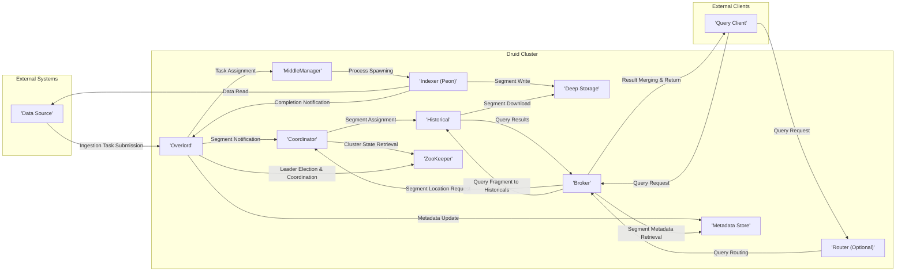

## Project Design Document: Apache Druid (Improved)

**1. Introduction**

This document provides an enhanced architectural overview of the Apache Druid project, an open-source, distributed, column-oriented data store optimized for high-performance, real-time analytics. This detailed design serves as a robust foundation for subsequent threat modeling activities, clearly outlining the key components, data flows, interactions, and security considerations within the Druid ecosystem.

**2. System Overview**

Apache Druid employs a distributed, shared-nothing architecture, comprising several independent processes communicating over a network. Its core function is the efficient ingestion, storage, and querying of data, particularly time-series data. This distributed nature allows for horizontal scalability and fault tolerance.

**3. Component Details**

Druid's architecture is centered around distinct node types, each with specialized responsibilities:

*   **Coordinator Node:**
    *   Responsibilities: Manages the global cluster state, including data segment availability, load balancing, and data source management.
    *   Key Functions:
        *   Oversees the creation, modification, and deletion of data sources and their configurations.
        *   Manages the assignment and reassignment of data segments to Historical nodes based on load and availability.
        *   Provides a central point for monitoring the cluster's health, status, and metadata.
    *   Interactions:
        *   Communicates with the **"Overlord"** to coordinate data ingestion and segment handoff.
        *   Communicates with **"Historical"** nodes to manage segment loading and unloading.
        *   Communicates with **"Broker"** nodes to provide information about segment locations for query routing.
        *   Interacts with the **"Metadata Store"** to persist cluster state and configuration.
*   **Overlord Node:**
    *   Responsibilities: Orchestrates the data ingestion process into Druid.
    *   Key Functions:
        *   Accepts ingestion tasks (batch, streaming) from external systems, defining data sources and ingestion specifications.
        *   Creates and manages **"MiddleManager"** and **"Indexer (Peon)"** processes to execute ingestion tasks.
        *   Coordinates the handoff of newly ingested, immutable data segments from MiddleManagers to Historical nodes.
    *   Interactions:
        *   Communicates with the **"Coordinator"** to signal new segment availability.
        *   Communicates with **"MiddleManager"** nodes to assign and monitor ingestion tasks.
        *   Interacts with **"Deep Storage"** to manage temporary segment storage during the ingestion process.
        *   Interacts with the **"Metadata Store"** to record ingestion task status and segment metadata.
*   **Broker Node:**
    *   Responsibilities: Receives and processes incoming queries from external clients.
    *   Key Functions:
        *   Accepts queries in Druid's native JSON-based query language or SQL.
        *   Consults the Coordinator to identify the **"Historical"** nodes containing the relevant data segments for a given query.
        *   Forwards query fragments to the appropriate Historical nodes for parallel processing.
        *   Merges the results received from Historical nodes and returns the consolidated result to the client.
    *   Interactions:
        *   Communicates with the **"Coordinator"** to retrieve segment location information.
        *   Communicates with **"Historical"** nodes to execute query fragments.
        *   Optionally communicates with the **"Router"** node if one is present in the architecture.
*   **Router Node (Optional):**
    *   Responsibilities: Provides a unified, load-balanced entry point for query requests, improving query distribution and resilience.
    *   Key Functions:
        *   Receives queries from external clients.
        *   Routes queries to available **"Broker"** nodes based on load, health, and potentially query characteristics.
    *   Interactions:
        *   Communicates with external **"Query Client"** applications.
        *   Communicates with **"Broker"** nodes to forward queries.
*   **Historical Node:**
    *   Responsibilities: Stores and serves historical, immutable data segments for querying.
    *   Key Functions:
        *   Downloads assigned data segments from **"Deep Storage"**.
        *   Serves query requests for the data segments it holds, performing filtering, aggregation, and other query operations.
        *   Optimizes data storage and retrieval for efficient query performance.
    *   Interactions:
        *   Communicates with the **"Coordinator"** to receive segment assignment and management commands.
        *   Communicates with **"Broker"** nodes to process query fragments.
        *   Interacts with **"Deep Storage"** to download data segments.
*   **MiddleManager Node:**
    *   Responsibilities: Executes data ingestion tasks for real-time or near real-time data streams.
    *   Key Functions:
        *   Receives ingestion tasks and specifications from the **"Overlord"**.
        *   Spawns one or more short-lived **"Indexer (Peon)"** processes to build individual data segments.
        *   Manages the lifecycle of Indexer processes and monitors their progress.
        *   Pushes completed, immutable segments to **"Deep Storage"**.
    *   Interactions:
        *   Communicates with the **"Overlord"** to receive tasks and report status.
        *   Manages and communicates with **"Indexer (Peon)"** processes.
        *   Interacts with **"Deep Storage"** to store completed segments.
*   **Indexer Process (Peon):**
    *   Responsibilities: A transient process responsible for building a single Druid data segment from raw data.
    *   Key Functions:
        *   Reads data from the ingestion source (e.g., Kafka, files).
        *   Transforms, parses, and aggregates the data according to the ingestion specification.
        *   Creates a Druid data segment file.
        *   Pushes the completed segment file to **"Deep Storage"**.
    *   Interactions:
        *   Communicates with its parent **"MiddleManager"** for task instructions and status updates.
        *   Reads data from external data sources.
        *   Writes completed segments to **"Deep Storage"**.
*   **Deep Storage:**
    *   Responsibilities: Provides durable, persistent storage for Druid data segments. This acts as the source of truth for the data.
    *   Examples: Amazon S3, HDFS, Azure Blob Storage, Google Cloud Storage, Network File System (NFS).
    *   Key Functions:
        *   Stores all ingested data segments in a fault-tolerant manner.
        *   Provides the storage layer from which Historical nodes load segments for querying.
    *   Interactions:
        *   Accessed by **"Historical"** nodes to download segments.
        *   Accessed by **"MiddleManager"** and **"Indexer (Peon)"** processes to upload completed segments.
*   **Metadata Store:**
    *   Responsibilities: Stores metadata about the Druid cluster, including segment locations, ingestion task configurations, data source schemas, and cluster topology.
    *   Examples: PostgreSQL, MySQL, Derby.
    *   Key Functions:
        *   Provides a central, consistent repository for cluster state and configuration information.
        *   Ensures coordination and consistency across different Druid processes.
    *   Interactions:
        *   Accessed by **"Coordinator"**, **"Overlord"**, and **"Broker"** nodes to retrieve and update metadata.
*   **ZooKeeper:**
    *   Responsibilities: Provides coordination and service discovery for Druid processes within the cluster.
    *   Key Functions:
        *   Performs leader election for **"Coordinator"** and **"Overlord"** nodes, ensuring high availability.
        *   Maintains a consistent view of the cluster topology and the availability of different node types.
        *   Facilitates communication and synchronization between Druid nodes.
    *   Interactions:
        *   Used by all core Druid node types for registration, discovery, and coordination.

**4. Data Flow**

The following diagram illustrates the typical data ingestion and query flow within a Druid cluster:

**Data Ingestion Flow:**

1. Data originates from an external **"Data Source"**.
2. An **"Ingestion Task Submission"** is sent to the **"Overlord"**.
3. The **"Overlord"** assigns the task to a **"MiddleManager"**.
4. The **"MiddleManager"** spawns one or more **"Indexer (Peon)"** processes.
5. The **"Indexer (Peon)"** reads **"Data"** from the **"Data Source"**.
6. The **"Indexer (Peon)"** writes the processed **"Segment"** to **"Deep Storage"**.
7. The **"Indexer (Peon)"** sends a **"Completion Notification"** to the **"Overlord"**.
8. The **"Overlord"** updates the **"Metadata Store"** with the new segment information.
9. The **"Overlord"** sends a **"Segment Notification"** to the **"Coordinator"**.
10. The **"Coordinator"** assigns the segment to a **"Historical"** node.
11. The **"Historical"** node downloads the **"Segment"** from **"Deep Storage"**.

**Query Flow:**

1. A **"Query Client"** sends a **"Query Request"** to either a **"Broker"** or a **"Router (Optional)"**.
2. If a **"Router"** is used, it performs **"Query Routing"** to an appropriate **"Broker"**.
3. The **"Broker"** requests **"Segment Location"** information from the **"Coordinator"**.
4. The **"Broker"** sends **"Query Fragment to Historicals"** requests to the relevant **"Historical"** nodes.
5. The **"Historical"** nodes process the queries and return **"Query Results"** to the **"Broker"**.
6. The **"Broker"** performs **"Result Merging & Return"** to the **"Query Client"**.

**Internal Coordination:**

*   Druid nodes utilize **"ZooKeeper"** for **"Leader Election & Coordination"**.
*   Nodes retrieve **"Cluster State"** information from **"ZooKeeper"**.
*   Nodes retrieve **"Segment Metadata"** from the **"Metadata Store"**.

**5. Deployment Architecture**

Druid is typically deployed as a cluster of nodes. Common deployment patterns include:

*   **Single-Machine Deployment:** Suitable for development, testing, and learning. All Druid processes run on a single machine.
*   **Clustered Deployment (On-Premise):** Production-ready deployment where different node types are deployed on separate physical or virtual machines within a data center.
*   **Cloud Deployments:** Leveraging cloud provider infrastructure and managed services:
    *   **AWS:** Utilizing EC2 instances for Druid nodes, S3 for Deep Storage, RDS for Metadata Store, and Managed Apache ZooKeeper.
    *   **Azure:** Utilizing Virtual Machines for Druid nodes, Azure Blob Storage for Deep Storage, Azure Database for PostgreSQL/MySQL for Metadata Store, and Azure HDInsight for ZooKeeper.
    *   **GCP:** Utilizing Compute Engine instances for Druid nodes, Google Cloud Storage for Deep Storage, Cloud SQL for PostgreSQL/MySQL for Metadata Store, and Cloud Composer (Airflow) for orchestration.
*   **Containerized Deployments (Kubernetes):** Deploying Druid nodes as containers orchestrated by Kubernetes, offering scalability and resilience.

**6. Security Considerations**

Security is a critical aspect of Druid deployments. Key considerations include:

*   **Authentication and Authorization:**
    *   **Internal Authentication:** Securing communication between Druid nodes (e.g., using shared secrets or mutual TLS).
    *   **External Authentication:** Verifying the identity of external clients accessing Druid (e.g., using HTTP Basic Auth, OAuth 2.0).
    *   **Authorization:** Controlling access to Druid resources (data sources, segments, APIs) based on user roles and permissions.
*   **Network Security:**
    *   **Network Segmentation:** Isolating Druid nodes within private networks and controlling access using firewalls and network policies.
    *   **Encryption in Transit:** Encrypting communication between Druid nodes and external clients using TLS/SSL.
*   **Data Encryption:**
    *   **Encryption at Rest:** Encrypting data stored in Deep Storage using cloud provider encryption services or custom encryption solutions.
    *   **Encryption in Transit:** (Covered above)
*   **Input Validation:**
    *   Sanitizing and validating user inputs in queries and ingestion specifications to prevent injection attacks (e.g., SQL injection).
*   **Access Control to Infrastructure Components:**
    *   Restricting access to the Metadata Store and Deep Storage using appropriate access control mechanisms provided by the underlying storage systems.
    *   Securing access to ZooKeeper to prevent unauthorized modifications to cluster coordination data.
*   **Secure Configuration:**
    *   Following security best practices when configuring Druid processes, including disabling unnecessary features and setting strong passwords.
*   **Auditing and Logging:**
    *   Enabling comprehensive logging of security-related events (authentication attempts, authorization decisions, data access) for monitoring and analysis.
*   **Vulnerability Management:**
    *   Regularly patching and updating Druid and its dependencies to address known vulnerabilities.
*   **Secure API Access:**
    *   Securing Druid's API endpoints using authentication and authorization mechanisms.

**7. Assumptions and Constraints**

*   This document describes a typical deployment of Apache Druid. Specific configurations and security measures may vary based on individual requirements.
*   The focus is on the core Druid architecture and common deployment patterns. Custom extensions or integrations are not explicitly covered.
*   Security recommendations are general guidelines and should be tailored to the specific threat model and risk assessment of the deployment environment.

**8. Future Considerations**

*   Detailed specification of API endpoints and communication protocols between components for deeper security analysis.
*   Inclusion of specific security configuration options and best practices for each component.
*   Mapping potential threats and vulnerabilities to specific components and data flows using frameworks like STRIDE for a comprehensive threat model.
*   Consideration of security implications for different authentication and authorization providers.
*   Analysis of the security impact of various deployment models (e.g., containerization).