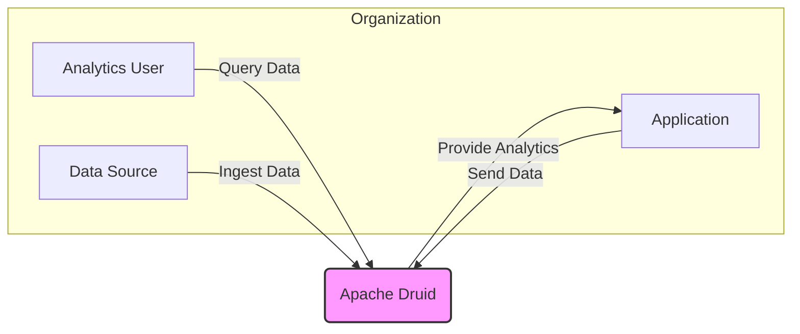
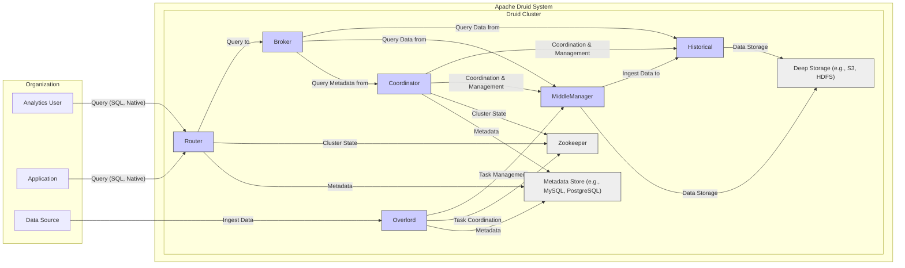

# BUSINESS POSTURE

This project, Apache Druid, aims to provide a high-performance, real-time analytics database. It is designed to efficiently query large datasets with low latency, enabling businesses to gain immediate insights from their data.

Business priorities and goals:
- Provide real-time analytics capabilities for large datasets.
- Enable fast query performance for interactive data exploration and dashboarding.
- Offer a scalable and reliable database solution for analytical workloads.
- Support various data ingestion methods for real-time and batch data.
- Provide a flexible query language (SQL and native) for diverse analytical needs.

Business risks:
- Data breaches leading to exposure of sensitive analytical data.
- Service disruption impacting real-time analytics availability and business operations.
- Performance degradation due to misconfiguration or security controls, hindering real-time analysis.
- Data integrity issues leading to inaccurate insights and flawed business decisions.
- Supply chain vulnerabilities in dependencies and build process compromising the security of the Druid deployment.

# SECURITY POSTURE

Existing security controls:
- security control: Access control lists (ACLs) for data access and management. (Inferred from typical database security practices)
- security control: Authentication mechanisms for user access. (Inferred from typical database security practices)
- security control: Authorization framework to manage user permissions. (Inferred from typical database security practices)
- security control: Encryption at rest for data stored in persistent storage. (Inferred from typical database security practices)
- security control: Encryption in transit for communication between Druid components and clients. (Inferred from typical database security practices)
- security control: Secure software development lifecycle (SSDLC) practices are likely followed by the open-source project, including code reviews and testing. (Inferred from open-source project best practices)
- security control: Deployment typically happens in controlled environments, like cloud platforms or private data centers, offering network security controls. (Inferred from typical deployment scenarios)

Accepted risks:
- accepted risk: Potential vulnerabilities in open-source dependencies. (Common risk for open-source projects, mitigated by dependency scanning and updates)
- accepted risk: Complexity of configuration and deployment may lead to misconfigurations and security gaps. (Mitigated by documentation and best practices)

Recommended security controls:
- security control: Implement and enforce multi-factor authentication (MFA) for administrative access.
- security control: Regularly perform vulnerability scanning and penetration testing of Druid deployments.
- security control: Implement a robust security monitoring and logging system to detect and respond to security incidents.
- security control: Establish a security incident response plan specific to Druid deployments.
- security control: Implement data masking or anonymization techniques for sensitive data used in analytics, where applicable.
- security control: Automate security checks in the CI/CD pipeline, including SAST and DAST scanning.
- security control: Implement dependency scanning and management to address vulnerabilities in third-party libraries.

Security requirements:
- Authentication:
    - Requirement: Securely authenticate users accessing Druid clusters and data.
    - Requirement: Support integration with existing enterprise authentication systems (e.g., LDAP, Active Directory, OAuth 2.0).
    - Requirement: Implement role-based access control (RBAC) to manage user permissions.
- Authorization:
    - Requirement: Enforce granular authorization policies to control access to data and operations based on user roles and privileges.
    - Requirement: Implement data-level security to restrict access to specific datasets or rows based on user roles.
    - Requirement: Audit all authorization decisions and access attempts.
- Input validation:
    - Requirement: Validate all user inputs to prevent injection attacks (e.g., SQL injection, NoSQL injection).
    - Requirement: Sanitize user inputs before processing and storing them in Druid.
    - Requirement: Implement input validation at all API endpoints and data ingestion points.
- Cryptography:
    - Requirement: Encrypt sensitive data at rest using strong encryption algorithms.
    - Requirement: Encrypt data in transit using TLS/SSL for all communication channels.
    - Requirement: Securely manage cryptographic keys and certificates.
    - Requirement: Utilize cryptography to protect sensitive configuration data and secrets.

# DESIGN

## C4 CONTEXT



Context Diagram Elements:

- Element:
    - Name: Analytics User
    - Type: Person
    - Description: Business analysts, data scientists, or operational users who query Druid to gain insights from data.
    - Responsibilities: Formulate and execute analytical queries against Druid to explore data and create reports or dashboards.
    - Security controls: Authentication to access Druid query interfaces, authorization based on roles to access specific datasets.

- Element:
    - Name: Application
    - Type: Software System
    - Description: Internal or external applications that rely on real-time analytics provided by Druid. These applications might display dashboards, trigger alerts, or make data-driven decisions based on Druid's output.
    - Responsibilities: Send data to Druid for ingestion, consume analytical results from Druid via APIs or query interfaces.
    - Security controls: Authentication to send data to Druid, secure API communication using TLS, input validation of data sent to Druid.

- Element:
    - Name: Data Source
    - Type: Software System
    - Description: External systems that generate the raw data ingested into Druid. These can be databases, message queues, streaming platforms, or other data-generating applications.
    - Responsibilities: Provide data streams or batch data for Druid to ingest and process.
    - Security controls: Secure data export mechanisms, access control to data sources to prevent unauthorized data access.

- Element:
    - Name: Apache Druid
    - Type: Software System
    - Description: A high-performance, real-time analytics database designed for fast query processing on large datasets.
    - Responsibilities: Ingest data from various sources, store and index data efficiently, execute analytical queries with low latency, provide APIs and query interfaces for data access.
    - Security controls: Authentication, authorization, input validation, encryption at rest and in transit, security logging and monitoring.

## C4 CONTAINER



Container Diagram Elements:

- Element:
    - Name: Broker
    - Type: Container - Java Application
    - Description: Query servers that receive queries from external clients, route them to Historical and MiddleManager processes, and merge the results.
    - Responsibilities: Query processing, query routing, result merging, query caching.
    - Security controls: Authentication and authorization for query access, query input validation, TLS for client communication, security logging of query activities.

- Element:
    - Name: Router
    - Type: Container - Java Application
    - Description: Optional component that sits in front of Brokers for load balancing and query routing in large deployments.
    - Responsibilities: Load balancing across Brokers, query routing, connection management.
    - Security controls: TLS for client communication, potentially acts as a reverse proxy with security features, rate limiting to prevent denial-of-service attacks.

- Element:
    - Name: Coordinator
    - Type: Container - Java Application
    - Description: Manages the data segment lifecycle on Historical processes, ensuring data availability and balance across the cluster.
    - Responsibilities: Segment management, data balancing, cluster health monitoring.
    - Security controls: Authentication and authorization for administrative access, secure communication with Historical and Overlord processes, access control to metadata store.

- Element:
    - Name: Overlord
    - Type: Container - Java Application
    - Description: Manages data ingestion tasks, distributing them to MiddleManager processes.
    - Responsibilities: Task management, ingestion scheduling, MiddleManager process management.
    - Security controls: Authentication and authorization for administrative access, secure communication with MiddleManager processes, input validation for ingestion tasks, access control to metadata store.

- Element:
    - Name: Historical
    - Type: Container - Java Application
    - Description: Stores and serves queryable data segments. Optimized for read-heavy analytical queries.
    - Responsibilities: Data storage, query processing for segments, data serving.
    - Security controls: Access control to data segments, encryption at rest for stored data, secure communication with Broker and Coordinator processes.

- Element:
    - Name: MiddleManager
    - Type: Container - Java Application
    - Description: Responsible for data ingestion and indexing in real-time. Creates data segments that are later served by Historical processes.
    - Responsibilities: Real-time data ingestion, indexing, segment creation.
    - Security controls: Input validation for ingested data, secure communication with Overlord and Historical processes, access control to temporary storage.

- Element:
    - Name: Zookeeper
    - Type: Container - Cluster Coordination Service
    - Description: Provides distributed coordination and configuration management for the Druid cluster.
    - Responsibilities: Cluster coordination, leader election, configuration management.
    - Security controls: Access control to Zookeeper nodes, authentication for Druid components, secure communication within the Zookeeper ensemble.

- Element:
    - Name: Metadata Store (e.g., MySQL, PostgreSQL)
    - Type: Database
    - Description: Stores metadata about data segments, cluster state, and tasks.
    - Responsibilities: Metadata persistence, transactional storage for cluster operations.
    - Security controls: Database access control, encryption at rest for metadata, secure communication with Druid components, regular database security patching.

- Element:
    - Name: Deep Storage (e.g., S3, HDFS)
    - Type: Object Storage / Distributed File System
    - Description: Stores data segments durably and reliably. Serves as the long-term storage for Druid data.
    - Responsibilities: Durable data storage, data backup and recovery.
    - Security controls: Access control to deep storage buckets/directories, encryption at rest for stored data, secure access credentials management.

## DEPLOYMENT

Deployment Solution: Cloud-based Deployment on Kubernetes

```mermaid
flowchart LR
    subgraph "Kubernetes Cluster"
        subgraph "Nodes"
            A1["Node 1"]
            A2["Node 2"]
            A3["Node 3"]
        end
        subgraph "Pods"
            B1["Broker Pod"] -- A1
            B2["Router Pod"] -- A1
            B3["Coordinator Pod"] -- A2
            B4["Overlord Pod"] -- A2
            B5["Historical Pod 1"] -- A3
            B6["Historical Pod 2"] -- A3
            B7["MiddleManager Pod"] -- A1
            B8["Zookeeper Pod 1"] -- A2
            B9["Zookeeper Pod 2"] -- A2
            B10["Zookeeper Pod 3"] -- A3
            B11["Metadata Store Pod"] -- A3
        end
        C["Persistent Volume Claims"] -- A1 & A2 & A3
        D["Load Balancer"] -- B1 & B2
    end
    E["Deep Storage (S3)"]
    F["External Metadata Store (RDS PostgreSQL)"]
    G["Analytics User"]
    H["Application"]
    I["Data Source"]

    D -- Internet --> G & H
    G & H -- Query --> D
    D -- Forward Query to --> B1 & B2
    B1 & B2 & B3 & B4 & B5 & B6 & B7 & B8 & B9 & B10 & B11 -- Persistent Storage --> C
    B5 & B6 & B7 -- Deep Storage --> E
    B3 & B4 & B11 -- Metadata Store --> F
    I -- Ingest Data --> B4 & B7

    style A1 fill:#eee,stroke:#333,stroke-width:1px
    style A2 fill:#eee,stroke:#333,stroke-width:1px
    style A3 fill:#eee,stroke:#333,stroke-width:1px
    style B1 fill:#ccf,stroke:#333,stroke-width:1px
    style B2 fill:#ccf,stroke:#333,stroke-width:1px
    style B3 fill:#ccf,stroke:#333,stroke-width:1px
    style B4 fill:#ccf,stroke:#333,stroke-width:1px
    style B5 fill:#ccf,stroke:#333,stroke-width:1px
    style B6 fill:#ccf,stroke:#333,stroke-width:1px
    style B7 fill:#ccf,stroke:#333,stroke-width:1px
    style B8 fill:#eee,stroke:#333,stroke-width:1px
    style B9 fill:#eee,stroke:#333,stroke-width:1px
    style B10 fill:#eee,stroke:#333,stroke-width:1px
    style B11 fill:#eee,stroke:#333,stroke-width:1px
    style C fill:#eee,stroke:#333,stroke-width:1px
    style D fill:#eee,stroke:#333,stroke-width:1px
    style E fill:#eee,stroke:#333,stroke-width:1px
    style F fill:#eee,stroke:#333,stroke-width:1px
```

Deployment Diagram Elements:

- Element:
    - Name: Kubernetes Cluster
    - Type: Infrastructure - Container Orchestration Platform
    - Description: A managed Kubernetes service in the cloud provider environment, providing the runtime environment for Druid containers.
    - Responsibilities: Container orchestration, resource management, scaling, high availability.
    - Security controls: Network policies to isolate namespaces and pods, RBAC for Kubernetes API access, security updates and patching of Kubernetes components, container runtime security (e.g., container scanning, security context).

- Element:
    - Name: Nodes
    - Type: Infrastructure - Virtual Machines
    - Description: Worker nodes in the Kubernetes cluster, providing compute resources for running Druid pods.
    - Responsibilities: Running container workloads, providing compute and memory resources.
    - Security controls: Operating system hardening, security monitoring, regular patching, network security groups to control access.

- Element:
    - Name: Pods (Broker Pod, Router Pod, Coordinator Pod, Overlord Pod, Historical Pod, MiddleManager Pod, Zookeeper Pod, Metadata Store Pod)
    - Type: Container - Docker Containers
    - Description: Individual pods running Druid containers, each pod encapsulates one or more Druid processes.
    - Responsibilities: Running specific Druid components (Broker, Router, etc.), providing the runtime environment for Druid processes.
    - Security controls: Container image scanning for vulnerabilities, least privilege security context for containers, resource limits to prevent resource exhaustion, network policies to restrict pod-to-pod communication.

- Element:
    - Name: Persistent Volume Claims
    - Type: Storage - Persistent Volumes
    - Description: Persistent storage volumes attached to pods for storing data that needs to survive pod restarts. Used for local storage by Druid components if needed.
    - Responsibilities: Providing persistent storage for Druid components.
    - Security controls: Access control to persistent volumes, encryption at rest for persistent volumes (if supported by cloud provider), regular backups.

- Element:
    - Name: Load Balancer
    - Type: Infrastructure - Network Load Balancer
    - Description: A cloud provider managed load balancer distributing traffic to Router or Broker pods, providing external access to Druid query interfaces.
    - Responsibilities: Load balancing, external access point, TLS termination.
    - Security controls: TLS encryption for external access, access control lists to restrict access to specific IP ranges, DDoS protection.

- Element:
    - Name: Deep Storage (S3)
    - Type: Storage - Cloud Object Storage
    - Description: Cloud-based object storage service (e.g., AWS S3) used for durable storage of Druid data segments.
    - Responsibilities: Durable and scalable storage for Druid data segments.
    - Security controls: Access control policies (IAM roles) to restrict access to S3 buckets, encryption at rest for data in S3, versioning and backups.

- Element:
    - Name: External Metadata Store (RDS PostgreSQL)
    - Type: Database - Managed Relational Database
    - Description: A managed relational database service (e.g., AWS RDS PostgreSQL) used as the metadata store for Druid.
    - Responsibilities: Reliable and scalable metadata storage.
    - Security controls: Database access control, encryption at rest and in transit for database connections, regular database security patching, database backups.

## BUILD

```mermaid
flowchart LR
    A["Developer"] -- Code Changes --> B(Version Control System (GitHub))
    B -- Trigger --> C{CI/CD System (GitHub Actions)}
    C -- Build & Test --> D["Build Environment"]
    D -- Security Checks (SAST, Dependency Scan, Linting) --> D
    D -- Build Artifacts (Docker Images, JARs) --> E["Artifact Repository (e.g., GitHub Packages, Docker Hub)"]
    E -- Deployment --> F["Deployment Environment (Kubernetes Cluster)"]

    style D fill:#ccf,stroke:#333,stroke-width:1px
    style E fill:#ccf,stroke:#333,stroke-width:1px
```

Build Process Elements:

- Element:
    - Name: Developer
    - Type: Person
    - Description: Software developers who write and modify the Druid codebase.
    - Responsibilities: Code development, bug fixing, feature implementation, code reviews.
    - Security controls: Secure development workstations, code review process, security training.

- Element:
    - Name: Version Control System (GitHub)
    - Type: Software System - Code Repository
    - Description: GitHub repository used for storing and managing the Druid source code.
    - Responsibilities: Source code management, version control, collaboration.
    - Security controls: Access control to the repository, branch protection rules, audit logging of code changes, vulnerability scanning of repository.

- Element:
    - Name: CI/CD System (GitHub Actions)
    - Type: Software System - Automation Platform
    - Description: GitHub Actions used for automating the build, test, and deployment processes.
    - Responsibilities: Build automation, testing, security checks, artifact publishing, deployment automation.
    - Security controls: Secure configuration of CI/CD pipelines, access control to CI/CD workflows, secret management for credentials, audit logging of CI/CD activities.

- Element:
    - Name: Build Environment
    - Type: Infrastructure - Build Servers
    - Description: Servers or containers used to execute the build and test processes.
    - Responsibilities: Code compilation, unit testing, integration testing, security scanning.
    - Security controls: Hardened build environment, access control to build servers, regular patching, secure build tools, isolation of build processes.

- Element:
    - Name: Artifact Repository (e.g., GitHub Packages, Docker Hub)
    - Type: Software System - Artifact Storage
    - Description: Repository for storing build artifacts like Docker images and JAR files.
    - Responsibilities: Artifact storage, versioning, distribution.
    - Security controls: Access control to the artifact repository, vulnerability scanning of artifacts, secure artifact signing, audit logging of artifact access.

- Element:
    - Name: Deployment Environment (Kubernetes Cluster)
    - Type: Infrastructure - Runtime Environment
    - Description: Target Kubernetes cluster where Druid is deployed and runs.
    - Responsibilities: Running Druid application, providing runtime environment.
    - Security controls: (Covered in Deployment section above).

# RISK ASSESSMENT

Critical business processes:
- Real-time analytics and dashboarding for business monitoring and decision-making.
- Application performance monitoring and alerting.
- Security monitoring and threat detection.
- Operational reporting and data exploration.

Data sensitivity:
- Data ingested into Druid can vary in sensitivity depending on the use case.
- Potential data types include:
    - Personally Identifiable Information (PII) in some application usage scenarios.
    - Financial transaction data.
    - Network traffic data, which may contain sensitive information.
    - Application logs, which may contain sensitive data or security-related information.
- Data sensitivity should be assessed based on the specific use case and data sources. Data might be classified as: Public, Internal, Confidential, or Highly Confidential.

# QUESTIONS & ASSUMPTIONS

Questions:
- What are the specific use cases for Druid in the target organization?
- What types of data will be ingested into Druid, and what is their sensitivity level?
- What are the compliance requirements for data security and privacy (e.g., GDPR, HIPAA, PCI DSS)?
- What existing security infrastructure and tools are available in the organization?
- What is the organization's risk appetite and security maturity level?
- What are the performance and scalability requirements for the Druid deployment?
- What are the budget and resource constraints for implementing security controls?

Assumptions:
- The organization requires a secure and reliable Druid deployment for real-time analytics.
- Security is a high priority for the Druid project.
- The organization is willing to invest in implementing necessary security controls.
- Druid will be deployed in a cloud environment using Kubernetes.
- Standard security best practices for databases and cloud deployments will be followed.
- The organization has or will establish a security incident response process.