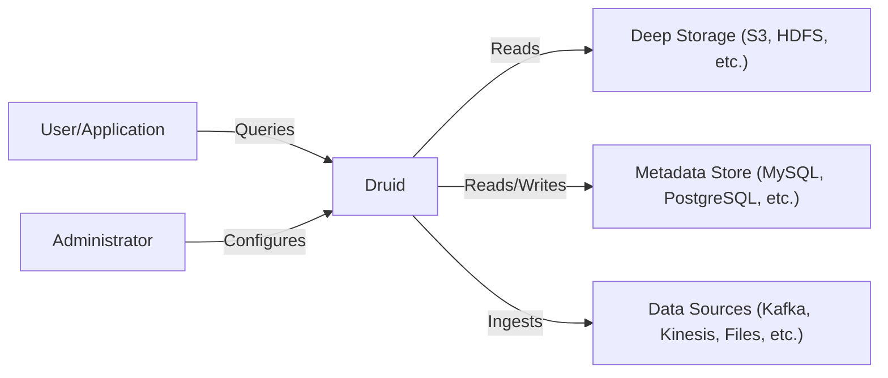
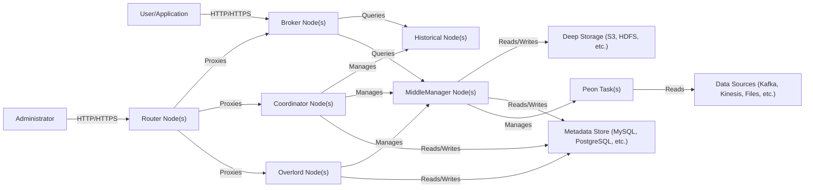
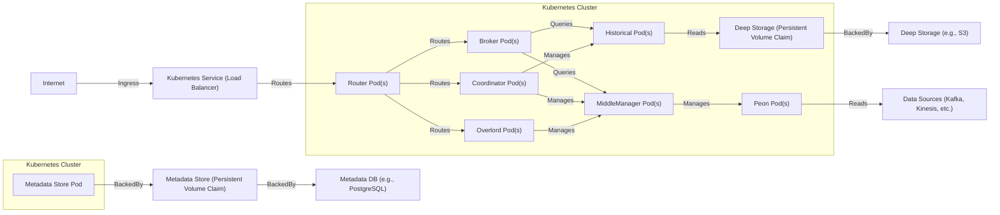
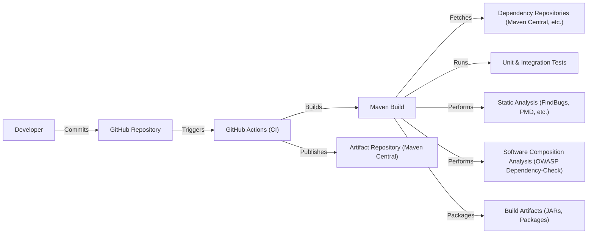

Okay, let's create a design document for the Apache Druid project, focusing on aspects relevant for threat modeling.

# BUSINESS POSTURE

Druid is a high-performance, real-time analytics database designed for fast, ad-hoc queries on large datasets.  It's often used for powering user-facing analytics applications, clickstream analysis, operational monitoring, and other use cases where speed and interactivity are crucial.  Given its nature, the core business priorities revolve around:

*   Data Ingestion Speed:  The ability to ingest large volumes of data quickly and efficiently.
*   Query Performance:  Providing low-latency query responses, even under high concurrency.
*   Data Availability and Durability:  Ensuring data is always accessible and protected against loss.
*   Scalability:  Handling growing data volumes and user loads without performance degradation.
*   Operational Simplicity:  Minimizing the complexity of deployment, management, and maintenance.

Based on these priorities, the most important business risks are:

*   Data Loss or Corruption:  Loss of valuable analytical data, potentially impacting business decisions.
*   Performance Degradation:  Slow query responses or ingestion bottlenecks, hindering real-time analysis.
*   System Downtime:  Unavailability of the Druid cluster, disrupting user access and data ingestion.
*   Unauthorized Data Access:  Exposure of sensitive data to unauthorized users or systems.
*   Data Breach: Exfiltration of sensitive data.
*   Resource Exhaustion:  Overconsumption of resources (CPU, memory, storage) leading to instability.
*   Operational Errors:  Misconfigurations or human errors that compromise the system's integrity.

# SECURITY POSTURE

Druid has evolved over time, and its security features have improved.  However, security is often a trade-off with performance and ease of use.  Here's a breakdown of the security posture:

*   security control: Authentication: Druid supports various authentication mechanisms, including:
    *   Basic authentication (username/password).
    *   Kerberos.
    *   LDAP.
    *   Custom authenticators via extensions.
    *   OAuth 2.0 (with extensions).
    *   Location: Described in Druid's documentation (Security section). Implemented in core Druid components and extensions.

*   security control: Authorization: Druid provides role-based access control (RBAC) to manage user permissions.  Permissions can be granted at the datasource, segment, or even column level (with extensions).
    *   Location: Described in Druid's documentation (Security section). Implemented in core Druid components and extensions.

*   security control: Network Security: Druid components communicate over the network, and it's recommended to use TLS/SSL for encryption in transit.
    *   Location: Described in Druid's documentation (Configuration reference). Implemented via configuration settings for inter-process communication.

*   security control: Data at Rest Encryption: While Druid doesn't natively encrypt data at rest on the deep storage (e.g., S3, HDFS), it relies on the underlying storage system's encryption capabilities.
    *   Location: Relies on external systems (e.g., S3 server-side encryption, HDFS encryption).

*   security control: Auditing: Druid can log requests and actions, which can be used for auditing and security monitoring.
    *   Location: Configurable via Druid's logging settings.

*   security control: Input Validation: Druid performs some input validation, particularly for SQL queries, to prevent injection attacks. However, the level of validation for data ingestion depends on the ingestion method and configuration.
    *   Location: Implemented in the query parsing and execution layers.

*   accepted risk: Extension Security: Druid's extensibility is a powerful feature, but it also introduces a potential security risk.  Custom extensions might have vulnerabilities that could compromise the cluster.  Users are responsible for vetting and securing any extensions they deploy.

*   accepted risk: Default Configurations: Druid's default configurations might not be secure for production environments.  It's crucial to review and harden the configuration before deploying to production.

*   accepted risk: Data Masking/Anonymization: Druid doesn't have built-in features for data masking or anonymization.  This must be handled before data ingestion if required.

*   accepted risk: Limited Denial-of-Service Protection: While Druid has some mechanisms to handle high load, it's not inherently designed to withstand sophisticated denial-of-service (DoS) attacks.  External DoS protection mechanisms are recommended.

Recommended Security Controls (High Priority):

*   Implement a robust vulnerability management program, including regular security scans of the Druid cluster and its dependencies.
*   Enforce strong password policies and multi-factor authentication (MFA) where possible.
*   Implement network segmentation to isolate the Druid cluster from other systems.
*   Regularly review and update Druid's configuration to address any security vulnerabilities.
*   Establish a process for securely managing and auditing Druid extensions.
*   Implement a Web Application Firewall (WAF) in front of Druid's web console and API endpoints.

Security Requirements:

*   Authentication:
    *   All users must be authenticated before accessing Druid resources.
    *   Support for strong authentication mechanisms (e.g., MFA, Kerberos).
    *   Centralized authentication management (e.g., integration with LDAP or an identity provider).

*   Authorization:
    *   Fine-grained access control based on roles and permissions.
    *   Ability to restrict access to specific datasources, segments, and columns.
    *   Regular auditing of user permissions.

*   Input Validation:
    *   Validate all user inputs, including SQL queries and ingestion specifications.
    *   Prevent SQL injection and other injection attacks.
    *   Sanitize data to remove potentially harmful characters or scripts.

*   Cryptography:
    *   Use TLS/SSL for all network communication between Druid components and clients.
    *   Leverage encryption at rest capabilities provided by the underlying storage system.
    *   Securely manage cryptographic keys.

# DESIGN

## C4 CONTEXT

*   Elements Description:

    *   Name: User/Application
        *   Type: External Entity
        *   Description: Represents users or applications that interact with Druid by submitting queries.
        *   Responsibilities: Submitting queries, visualizing data, consuming query results.
        *   Security controls: Authentication, Authorization (handled by Druid).

    *   Name: Druid
        *   Type: System
        *   Description: The Apache Druid real-time analytics database.
        *   Responsibilities: Ingesting data, processing queries, managing data storage, providing an API for interaction.
        *   Security controls: Authentication, Authorization, Input Validation, Auditing, Network Security (TLS).

    *   Name: Deep Storage
        *   Type: External System
        *   Description: The long-term storage for Druid segments (e.g., S3, HDFS).
        *   Responsibilities: Storing data segments persistently.
        *   Security controls: Data at Rest Encryption (provided by the specific storage system).

    *   Name: Metadata Store
        *   Type: External System
        *   Description: A relational database (e.g., MySQL, PostgreSQL) that stores Druid's metadata.
        *   Responsibilities: Storing metadata about segments, datasources, tasks, and configurations.
        *   Security controls: Database security best practices (authentication, authorization, encryption).

    *   Name: Data Sources
        *   Type: External System
        *   Description: The sources from which Druid ingests data (e.g., Kafka, Kinesis, files).
        *   Responsibilities: Providing data streams or files for ingestion.
        *   Security controls: Depend on the specific data source (e.g., Kafka authentication, secure file access).

    *   Name: Administrator
        *   Type: External Entity
        *   Description: Represents a human administrator who configures and manages the Druid cluster.
        *   Responsibilities: Configuring Druid, managing users and permissions, monitoring the cluster.
        *   Security controls: Authentication, Authorization (handled by Druid).

## C4 CONTAINER

*   Elements Description:

    *   Name: Broker Node(s)
        *   Type: Container
        *   Description: Receives queries from clients and routes them to Historical or MiddleManager nodes.
        *   Responsibilities: Query routing, result aggregation.
        *   Security controls: Authentication, Authorization, Input Validation.

    *   Name: Historical Node(s)
        *   Type: Container
        *   Description: Stores and serves historical data segments.
        *   Responsibilities: Serving queries on historical data.
        *   Security controls: Network Security (TLS).

    *   Name: MiddleManager Node(s)
        *   Type: Container
        *   Description: Manages real-time ingestion tasks (Peons).
        *   Responsibilities: Task management, resource allocation.
        *   Security controls: Network Security (TLS).

    *   Name: Peon Task(s)
        *   Type: Container
        *   Description: Short-lived processes that perform data ingestion.
        *   Responsibilities: Ingesting data from data sources, creating segments.
        *   Security controls: Input Validation (depending on the ingestion method).

    *   Name: Coordinator Node(s)
        *   Type: Container
        *   Description: Manages data distribution and replication across Historical nodes.
        *   Responsibilities: Data management, segment balancing.
        *   Security controls: Network Security (TLS).

    *   Name: Overlord Node(s)
        *   Type: Container
        *   Description: Manages task assignment and scheduling for MiddleManagers.
        *   Responsibilities: Task scheduling, resource allocation.
        *   Security controls: Network Security (TLS).

    *   Name: Router Node(s)
        *   Type: Container
        *   Description: Optional node that provides a unified entry point for Druid services.
        *   Responsibilities: Request routing, load balancing.
        *   Security controls: Network Security (TLS), Authentication (potentially).
    *   Name: Deep Storage
        *   Type: External System
        *   Description: The long-term storage for Druid segments (e.g., S3, HDFS).
        *   Responsibilities: Storing data segments persistently.
        *   Security controls: Data at Rest Encryption (provided by the specific storage system).

    *   Name: Metadata Store
        *   Type: External System
        *   Description: A relational database (e.g., MySQL, PostgreSQL) that stores Druid's metadata.
        *   Responsibilities: Storing metadata about segments, datasources, tasks, and configurations.
        *   Security controls: Database security best practices (authentication, authorization, encryption).

    *   Name: Data Sources
        *   Type: External System
        *   Description: The sources from which Druid ingests data (e.g., Kafka, Kinesis, files).
        *   Responsibilities: Providing data streams or files for ingestion.
        *   Security controls: Depend on the specific data source (e.g., Kafka authentication, secure file access).

    *   Name: Administrator
        *   Type: External Entity
        *   Description: Represents a human administrator who configures and manages the Druid cluster.
        *   Responsibilities: Configuring Druid, managing users and permissions, monitoring the cluster.
        *   Security controls: Authentication, Authorization (handled by Druid).

    *   Name: User/Application
        *   Type: External Entity
        *   Description: Represents users or applications that interact with Druid by submitting queries.
        *   Responsibilities: Submitting queries, visualizing data, consuming query results.
        *   Security controls: Authentication, Authorization (handled by Druid).

## DEPLOYMENT

Druid can be deployed in various ways, including:

1.  Single-Server Deployment: All Druid services run on a single machine.  Suitable for testing and development, but not for production.
2.  Clustered Deployment (Manual):  Each Druid service is deployed manually on separate machines.  Provides more control but requires more manual configuration.
3.  Clustered Deployment (with Kubernetes):  Druid services are deployed as containers within a Kubernetes cluster.  Offers scalability, resilience, and easier management.
4.  Clustered Deployment (with Hadoop/YARN): Druid services are deployed as YARN applications within a Hadoop cluster.

We'll describe the Kubernetes deployment in detail, as it's becoming increasingly popular and offers good security and scalability.

*   Elements Description:

    *   Name: Kubernetes Service (Load Balancer)
        *   Type: Infrastructure
        *   Description: A Kubernetes Service that exposes Druid's Router nodes to external traffic.
        *   Responsibilities: Load balancing incoming requests.
        *   Security controls: Network security (firewall rules, TLS termination).

    *   Name: Router Pod(s)
        *   Type: Container Instance
        *   Description: Pods running the Druid Router service.
        *   Responsibilities: Request routing.
        *   Security controls: Network security (TLS), Authentication (potentially).

    *   Name: Broker Pod(s)
        *   Type: Container Instance
        *   Description: Pods running the Druid Broker service.
        *   Responsibilities: Query routing, result aggregation.
        *   Security controls: Authentication, Authorization, Input Validation.

    *   Name: Coordinator Pod(s)
        *   Type: Container Instance
        *   Description: Pods running the Druid Coordinator service.
        *   Responsibilities: Data management, segment balancing.
        *   Security controls: Network Security (TLS).

    *   Name: Overlord Pod(s)
        *   Type: Container Instance
        *   Description: Pods running the Druid Overlord service.
        *   Responsibilities: Task scheduling, resource allocation.
        *   Security controls: Network Security (TLS).

    *   Name: MiddleManager Pod(s)
        *   Type: Container Instance
        *   Description: Pods running the Druid MiddleManager service.
        *   Responsibilities: Task management, resource allocation.
        *   Security controls: Network Security (TLS).

    *   Name: Peon Pod(s)
        *   Type: Container Instance
        *   Description: Pods running Druid Peon tasks.
        *   Responsibilities: Ingesting data, creating segments.
        *   Security controls: Input Validation (depending on the ingestion method).

    *   Name: Historical Pod(s)
        *   Type: Container Instance
        *   Description: Pods running the Druid Historical service.
        *   Responsibilities: Serving queries on historical data.
        *   Security controls: Network Security (TLS).

    *   Name: Deep Storage (Persistent Volume Claim)
        *   Type: Infrastructure
        *   Description: A Kubernetes Persistent Volume Claim that provides storage for Druid segments.
        *   Responsibilities: Providing persistent storage.
        *   Security controls: Access controls (managed by Kubernetes and the underlying storage system).

    *   Name: Deep Storage (e.g., S3)
        *   Type: External System
        *   Description: The actual deep storage system (e.g., S3, HDFS).
        *   Responsibilities: Storing data segments persistently.
        *   Security controls: Data at Rest Encryption, access controls.
    *   Name: Metadata Store Pod
        *   Type: Container Instance
        *   Description: Pod running database instance.
        *   Responsibilities: Storing metadata.
        *   Security controls: Authentication, Authorization, Encryption.
    *   Name: Metadata Store (Persistent Volume Claim)
        *   Type: Infrastructure
        *   Description: A Kubernetes Persistent Volume Claim that provides storage for Druid metadata.
        *   Responsibilities: Providing persistent storage.
        *   Security controls: Access controls (managed by Kubernetes and the underlying storage system).
    *   Name: Metadata DB (e.g., PostgreSQL)
        *   Type: External System
        *   Description: The actual metadata database system.
        *   Responsibilities: Storing metadata.
        *   Security controls: Data at Rest Encryption, access controls.
    *   Name: Data Sources
        *   Type: External System
        *   Description: The sources from which Druid ingests data (e.g., Kafka, Kinesis, files).
        *   Responsibilities: Providing data streams or files for ingestion.
        *   Security controls: Depend on the specific data source (e.g., Kafka authentication, secure file access).
    *   Name: Internet
        *   Type: External
        *   Description: Represents external network.
        *   Responsibilities: Network traffic.
        *   Security controls: Firewall.

## BUILD

Druid's build process involves several steps, from compiling the source code to creating distributable packages. Security considerations are important throughout the build process.

1.  Source Code Management: Druid's source code is hosted on GitHub, which provides built-in security features like access control, code scanning, and vulnerability alerts.
    *   security control: GitHub's security features.

2.  Build System: Druid uses Maven as its build system. Maven handles dependency management, compilation, testing, and packaging.
    *   security control: Dependency checking (using tools like OWASP Dependency-Check) to identify and mitigate known vulnerabilities in third-party libraries.

3.  Continuous Integration (CI): Druid uses GitHub Actions for CI.  The CI pipeline automates the build, test, and packaging process.
    *   security control: Automated testing (unit tests, integration tests) to identify bugs and security issues early in the development cycle.
    *   security control: Static analysis (using tools like FindBugs, PMD, or SonarQube) to detect potential code quality and security issues.
    *   security control: Software Composition Analysis (SCA) to identify vulnerabilities in dependencies.

4.  Artifact Repository:  Build artifacts (JAR files, distribution packages) are typically stored in a repository like Maven Central.
    *   security control:  Artifact signing (using GPG) to ensure the integrity and authenticity of the released artifacts.

# RISK ASSESSMENT

*   Critical Business Processes:
    *   Real-time data ingestion and querying for analytics.
    *   Providing insights to users and applications based on the ingested data.
    *   Monitoring and alerting based on real-time data streams.

*   Data We Are Trying to Protect:
    *   Raw data ingested from various sources (e.g., clickstream data, application logs, sensor data).
    *   Processed data stored in Druid segments.
    *   Druid metadata (information about datasources, segments, tasks, etc.).
    *   User credentials and access tokens.

*   Data Sensitivity:
    *   The sensitivity of the data depends on the specific use case.  It can range from non-sensitive (e.g., publicly available data) to highly sensitive (e.g., personally identifiable information (PII), financial data, healthcare data).  It's crucial to classify the data and apply appropriate security controls based on its sensitivity level.

# QUESTIONS & ASSUMPTIONS

*   Questions:
    *   What specific types of data will be ingested into Druid? (This is crucial for determining the required security controls.)
    *   What are the regulatory compliance requirements (e.g., GDPR, HIPAA, PCI DSS)?
    *   What is the expected scale of the deployment (data volume, query load, number of users)?
    *   What are the existing security infrastructure and policies in place?
    *   What is the threat model for the specific deployment environment?
    *   Are there any specific security concerns or requirements from stakeholders?
    *   What level of access will different users/groups have?
    *   What is the disaster recovery and business continuity plan?

*   Assumptions:
    *   BUSINESS POSTURE: We assume a moderate risk appetite, balancing performance and security.  We assume the organization understands the importance of data security but also needs a high-performance analytics platform.
    *   SECURITY POSTURE: We assume that basic security practices (e.g., strong passwords, regular patching) are already in place. We assume that the underlying infrastructure (network, operating systems) is reasonably secure.
    *   DESIGN: We assume a clustered deployment using Kubernetes, as it provides a good balance of scalability, resilience, and manageability. We assume that deep storage and metadata store are managed separately and have their own security controls. We assume that data sources have their own security mechanisms, and Druid will be configured to interact with them securely.