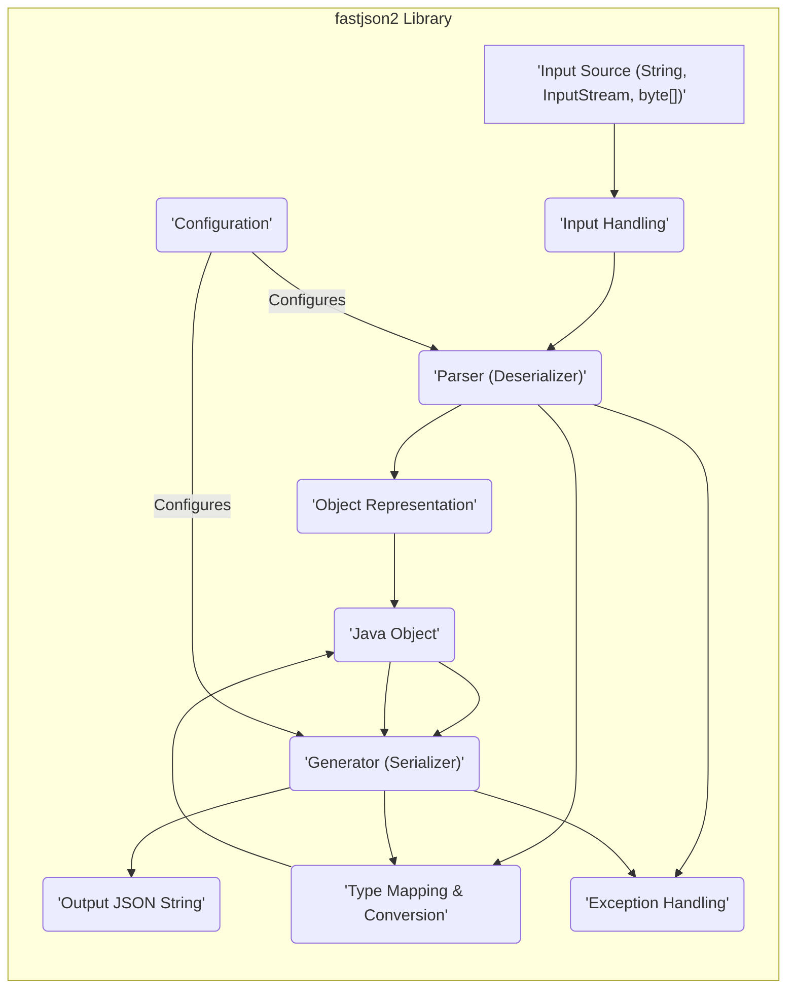
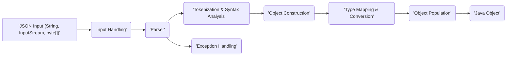
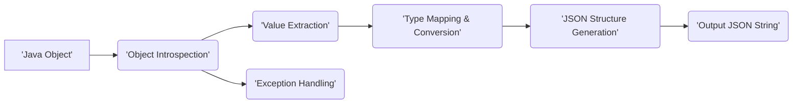

# Project Design Document: fastjson2 Library

**Version:** 1.1
**Date:** October 26, 2023
**Author:** AI Software Architect

## 1. Introduction

This document presents an enhanced architectural design of the fastjson2 library, a high-performance JSON library for the Java platform. The primary objective of this document is to provide a detailed and precise understanding of the library's internal structure, constituent components, and the pathways of data flow. This understanding is crucial as it will serve as the foundational basis for subsequent, in-depth threat modeling activities aimed at identifying and mitigating potential security vulnerabilities.

### 1.1. Purpose

The central purpose of this document is to meticulously delineate the architectural design of fastjson2. This detailed description is specifically intended to facilitate rigorous security analysis and comprehensive threat modeling. It achieves this by thoroughly describing the core components of the library, the intricate interactions between these components, and the precise movement of data as it is processed within the library.

### 1.2. Scope

This document comprehensively covers the fundamental functionalities inherent in the fastjson2 library. This includes, but is not limited to:

*   **JSON Parsing (Deserialization):** The process of converting JSON formatted data from various input sources, such as:
    *   String representations of JSON.
    *   `InputStream` objects containing JSON data.
    *   Byte arrays holding JSON encoded information.
*   **JSON Generation (Serialization):** The reverse process of converting Java objects into their corresponding JSON string representations.
*   **Configuration Options and Customization Points:**  The various settings and extension points that allow users to tailor the behavior of the library to specific needs.
*   **Key Internal Components and Their Responsibilities:** A detailed breakdown of the major internal modules and their designated functions within the library's architecture.

This document explicitly excludes the following aspects:

*   **Detailed Performance Benchmarks:** While performance is a key characteristic of fastjson2, this document does not delve into specific performance metrics or comparisons.
*   **Granular Code Implementation Details:** The focus remains on the architectural level; specific lines of code or intricate implementation choices are not covered. The emphasis is on the "what" and "how" at a component level, not the "how" at a code level.
*   **Exhaustive API Documentation:** This document is not intended to replace the official fastjson2 API documentation, which provides detailed information on available methods and their usage.

### 1.3. Goals

*   To deliver a lucid and succinct overview of the fastjson2 architectural framework.
*   To precisely identify the critical components within the library and elucidate the nature of their interactions.
*   To thoroughly depict the flow of data during both the parsing (deserialization) and generation (serialization) processes.
*   To proactively highlight areas within the architecture that warrant particular attention during security analysis and threat modeling exercises.

## 2. Overview

fastjson2 stands as a high-performance JSON processing library engineered for the Java ecosystem. Its core function is to facilitate the efficient transformation of Java objects into JSON format (serialization) and the reverse process of converting JSON strings back into their corresponding Java object representations (deserialization). A defining characteristic of the library is its emphasis on achieving superior performance, positioning it as a potentially faster and more resource-efficient alternative to other available JSON libraries in the Java landscape.

## 3. Architectural Design

The internal architecture of the fastjson2 library is structured around several distinct but interconnected key components:

*   **Input Handling:** This component is responsible for the initial reception and preprocessing of input data. Whether the input is a JSON string intended for parsing or a Java object slated for serialization, this component manages the initial stages of data ingestion. This includes tasks like:
    *   Determining the encoding of the input stream.
    *   Buffering the input data for efficient processing.
    *   Providing the parser or serializer with a consistent and manageable data stream.
*   **Parser (Deserializer):** The core of the deserialization process. This component takes a JSON input stream and transforms it into a corresponding hierarchy of Java objects. Its responsibilities encompass:
    *   **Tokenization:** Breaking down the JSON input into individual meaningful units (tokens) like brackets, braces, colons, commas, strings, numbers, and booleans.
    *   **Syntax Analysis:** Verifying that the sequence of tokens adheres to the grammatical rules of the JSON specification.
    *   **Object Instantiation:** Creating instances of Java classes that will hold the data parsed from the JSON. This often involves reflection to dynamically create objects.
*   **Object Representation:** This refers to the internal data structures and models used by the library to represent either the parsed JSON data in an intermediate form or the structure of the Java object being serialized. This might involve:
    *   Internal maps and lists to represent JSON objects and arrays.
    *   Specialized data structures for efficient access and manipulation of the data.
*   **Generator (Serializer):**  The counterpart to the parser, responsible for taking a Java object and converting it into a JSON string representation. This involves:
    *   **Object Traversal:**  Navigating the structure of the Java object, accessing its fields and their values.
    *   **JSON Formatting:**  Converting the extracted values into their JSON equivalents (e.g., Java strings to JSON strings, Java numbers to JSON numbers).
    *   **Structure Generation:**  Arranging the formatted values into a valid JSON structure (objects and arrays) according to the object's hierarchy.
*   **Configuration:** This component provides the mechanism for users to customize the behavior of both the parser and the serializer. These configurations can significantly impact how data is processed and are critical for security considerations. Examples include:
    *   Setting custom date formats.
    *   Defining how null values are handled.
    *   Specifying custom naming strategies for fields.
    *   Enabling or disabling specific features.
*   **Type Mapping and Conversion:** This component manages the crucial task of bridging the gap between JSON data types and their corresponding Java data types, and vice versa. It handles necessary type conversions, such as:
    *   Converting JSON strings to Java `int`, `long`, `double`, etc.
    *   Converting Java `Date` objects to JSON string representations according to a specified format.
*   **Exception Handling:** This component is responsible for managing errors and exceptional conditions that may arise during the parsing or serialization processes. This includes:
    *   Catching and handling invalid JSON syntax.
    *   Dealing with type mismatches during deserialization.
    *   Managing errors during object instantiation or value setting.

## 4. Data Flow

The movement of data within fastjson2 follows distinct paths depending on whether the operation is deserialization (converting JSON to Java) or serialization (converting Java to JSON).

### 4.1. Deserialization (JSON to Java Object)

1. **Input Reception:** The process commences with the receipt of JSON data in one of several forms: a JSON string, an `InputStream` containing JSON data, or a byte array holding JSON encoded information.
2. **Input Handling:** The `Input Handling` component takes charge, preparing the raw input data for the subsequent parsing stage. This may involve tasks such as:
    *   Detecting the character encoding of the input stream to ensure correct interpretation of the data.
    *   Buffering the input data to optimize read operations and improve performance.
3. **Parsing:** The `Parser` component takes the prepared input and begins the core process of analyzing the JSON structure. This involves:
    *   Breaking down the JSON text into a sequence of tokens, each representing a distinct element of the JSON structure (e.g., '{', '}', '[', ']', ':', ',', string literals, number literals, boolean values, null).
    *   Verifying that the sequence of tokens conforms to the grammatical rules defined by the JSON specification. Any deviation from these rules will result in a parsing error.
4. **Object Construction:** Based on the parsed JSON structure and any available type information (either explicitly provided or inferred), the parser initiates the creation of corresponding Java objects. This often involves:
    *   Using reflection to dynamically instantiate objects of the appropriate classes.
    *   Creating instances of basic Java types (e.g., `String`, `Integer`, `Boolean`) to represent primitive JSON values.
    *   Building collections (e.g., `List`, `Map`) to represent JSON arrays and objects.
5. **Type Mapping and Conversion:** The `Type Mapping & Conversion` component plays a crucial role in ensuring that JSON data types are correctly translated into their equivalent Java types. This involves performing necessary conversions, such as:
    *   Converting JSON string representations of numbers into Java `int`, `long`, `float`, or `double` values.
    *   Parsing JSON string representations of dates and times into Java `Date` or `LocalDateTime` objects.
    *   Converting JSON boolean values (`true` or `false`) into Java `boolean` values.
6. **Object Population:** Once the Java objects have been instantiated, the values extracted from the JSON input are used to populate the fields of these objects. This process involves:
    *   Identifying the corresponding fields in the Java objects based on the JSON property names.
    *   Setting the values of these fields using the converted data from the JSON input.
7. **Output:** The culmination of the deserialization process is the creation of a fully populated Java object or a hierarchical structure of Java objects that accurately represents the data contained within the original JSON input.
8. **Exception Handling:** Throughout the deserialization process, the `Exception Handling` component monitors for any errors or exceptional conditions. If issues arise, such as invalid JSON syntax or type mismatches, appropriate exceptions are thrown to signal the failure of the deserialization process.

### 4.2. Serialization (Java Object to JSON)

1. **Input Reception:** The serialization process begins with a Java object (or a graph of interconnected Java objects) that needs to be converted into its JSON representation.
2. **Object Introspection:** The `Generator` component starts by examining the structure of the input Java object. This involves:
    *   Using reflection to discover the fields of the object and their types.
    *   Identifying getter methods that provide access to the object's properties.
3. **Value Extraction:** The values of the object's fields or the values returned by its getter methods are extracted.
4. **Type Mapping and Conversion:** The `Type Mapping & Conversion` component comes into play again, this time mapping Java data types back to their corresponding JSON data types. Necessary conversions are performed, such as:
    *   Converting Java `int`, `long`, `float`, or `double` values into their JSON number representations.
    *   Formatting Java `Date` or `LocalDateTime` objects into JSON string representations according to a predefined or configured format.
    *   Converting Java `boolean` values into JSON boolean values (`true` or `false`).
5. **JSON Structure Generation:**  The serializer constructs the JSON structure based on the structure of the Java object and the extracted, converted values. This involves:
    *   Creating JSON objects (represented by curly braces `{}`) corresponding to Java objects.
    *   Creating JSON arrays (represented by square brackets `[]`) corresponding to Java collections or arrays.
    *   Mapping Java field names or getter method names to JSON property names.
6. **Output Generation:** The generated JSON structure is then formatted into a JSON string. This includes adding necessary punctuation (colons, commas, brackets, braces) and ensuring proper escaping of special characters.
7. **Output:** The final output of the serialization process is a JSON string that accurately represents the state of the input Java object.
8. **Exception Handling:** Similar to deserialization, the `Exception Handling` component monitors for errors during serialization. This might include situations like encountering unsupported data types or issues during value extraction.

## 5. External Dependencies

The fastjson2 library, like most Java libraries, relies on the Java Standard Library (JDK) for fundamental functionalities. Potential dependencies include:

*   **Core Java Libraries (`java.lang.*`):**  Essential classes for basic language features, such as `String`, `Object`, `Class`, and primitive types.
*   **Utility Classes (`java.util.*`):**  Provides collections frameworks (e.g., `List`, `Map`), date and time utilities, and other helpful data structures and algorithms.
*   **Input/Output Streams (`java.io.*`):**  Classes for handling input and output operations, particularly for reading JSON data from streams or writing serialized JSON data to streams.
*   **Reflection (`java.lang.reflect.*`):**  Used extensively for dynamic inspection and manipulation of Java objects during both serialization and deserialization. This allows the library to work with arbitrary Java classes without prior knowledge of their structure.
*   **Potentially Internal Alibaba Libraries:** While the focus is on the open-source portion, there might be dependencies on internal libraries developed by Alibaba Group for specific functionalities or optimizations. Identifying these could be relevant for a complete security assessment.
*   **Optional Dependencies:** Depending on specific features used, there might be optional dependencies on other libraries. For example, if specific encoding support is required beyond standard UTF-8, external encoding libraries might be used.

Understanding the full dependency tree is crucial for security analysis, as vulnerabilities in dependent libraries can indirectly affect fastjson2.

## 6. Configuration Options

fastjson2 offers a range of configuration options that allow developers to fine-tune its behavior. These options can have significant implications for security and should be carefully considered:

*   **Feature Flags:** Enables or disables specific features of the parser and serializer. For example:
    *   Disabling auto-type support can mitigate certain deserialization vulnerabilities by preventing the library from instantiating arbitrary classes based on type hints in the JSON.
    *   Controlling the maximum depth of JSON structures can help prevent stack overflow errors caused by deeply nested input.
*   **Date Format:** Specifies the format used for serializing and deserializing date and time values. Using a strict and well-defined format can prevent ambiguity and potential parsing errors.
*   **Property Naming Strategy:** Customizes how Java field names are mapped to JSON property names. While primarily a functional concern, inconsistencies or unexpected mappings could potentially lead to data integrity issues.
*   **Handling of Null Values:** Options for how null values are represented in the JSON output (e.g., omitting null fields, explicitly outputting `null`). The chosen strategy can impact the interpretation of the JSON data by consuming applications.
*   **Circular Reference Detection:** Mechanisms to handle objects with circular references during serialization, preventing infinite loops. The chosen strategy (e.g., ignoring circular references, throwing an exception) can impact the completeness and correctness of the serialized output.
*   **Type Adapters/Deserializers/Serializers:** Allows developers to register custom logic for handling specific types during parsing and serialization. While powerful, improperly implemented custom adapters can introduce vulnerabilities. For example, a custom deserializer that doesn't properly sanitize input could be a source of injection attacks.
*   **Parser Features:** Options to control parser behavior, such as:
    *   Allowing or disallowing comments in JSON.
    *   Setting the maximum string length to prevent excessive memory allocation.
*   **Serializer Features:** Options to control serializer behavior, such as:
    *   Pretty printing the JSON output for readability.
    *   Escaping non-ASCII characters.

## 7. Security Considerations (Detailed)

Based on the architectural design and functionalities of fastjson2, several potential security considerations arise:

*   **Deserialization Vulnerabilities (Remote Code Execution):**  A primary concern with any deserialization library is the potential for arbitrary code execution. If fastjson2 is used to deserialize untrusted JSON input without proper safeguards, an attacker could craft malicious JSON payloads that, when deserialized, lead to the instantiation of arbitrary classes and the execution of malicious code. This is often achieved through the exploitation of "gadget chains" - sequences of existing classes within the application's classpath that can be chained together to perform unintended operations.
*   **Denial of Service (DoS):**
    *   **Large Payloads:** Processing extremely large JSON payloads can consume excessive memory and CPU resources, potentially leading to a denial of service.
    *   **Deeply Nested Structures:**  Deserializing deeply nested JSON structures can lead to stack overflow errors, crashing the application. Configuration options to limit nesting depth can mitigate this.
    *   **Hash Collision Attacks:** While less likely with modern hash algorithms, if the underlying implementation uses hash maps without proper randomization, an attacker could craft JSON with many keys that hash to the same bucket, leading to performance degradation and potential DoS.
*   **Integer Overflow/Underflow:** When parsing numeric values from JSON, if the input values are outside the valid range for Java integer types (e.g., `Integer.MAX_VALUE`, `Integer.MIN_VALUE`), it could lead to integer overflow or underflow. This might cause unexpected behavior or security vulnerabilities in subsequent calculations.
*   **String Handling Vulnerabilities:**
    *   **Memory Exhaustion:** Parsing extremely long strings in JSON could lead to excessive memory allocation, potentially causing an `OutOfMemoryError` and crashing the application.
    *   **Regular Expression Denial of Service (ReDoS):** If regular expressions are used internally for parsing or validation, carefully crafted malicious strings could cause the regex engine to enter a catastrophic backtracking state, leading to a denial of service.
*   **Configuration Vulnerabilities:**
    *   **Insecure Defaults:** If default configuration settings are not secure, they could leave the application vulnerable. For example, if auto-type support is enabled by default, it increases the risk of deserialization attacks.
    *   **Misconfiguration:** Developers might inadvertently misconfigure the library, weakening security. For example, allowing deserialization of arbitrary classes or using insecure custom deserializers.
*   **Injection Attacks (Indirect):** While fastjson2 itself doesn't directly execute code from the JSON, if the serialized output is used in other parts of the application without proper sanitization, it could contribute to injection vulnerabilities. For example, if serialized data is used to construct SQL queries without parameterization, it could lead to SQL injection.
*   **Information Disclosure:**  Error messages or debug information generated by fastjson2 might inadvertently reveal sensitive information about the application's internal structure or data.

## 8. Deployment Considerations

The way fastjson2 is deployed can influence the potential attack surface and the impact of vulnerabilities:

*   **Web Applications (REST APIs):**  A common use case where fastjson2 is used to serialize and deserialize data exchanged between clients and servers. Vulnerabilities here could allow attackers to compromise the API and potentially gain access to sensitive data or perform unauthorized actions.
*   **Microservices:** In a microservices architecture, fastjson2 might be used for communication between services. A compromised service could exploit vulnerabilities in fastjson2 to attack other services in the ecosystem.
*   **Standalone Java Applications:** Even in standalone applications, if fastjson2 is used to process data from untrusted sources (e.g., configuration files, user input), vulnerabilities could be exploited.
*   **Android Applications:**  If used in Android applications, vulnerabilities could potentially be exploited by malicious apps or through compromised data sources.
*   **Server-Side vs. Client-Side:**  The security implications differ depending on whether fastjson2 is used on the server-side (handling requests from potentially untrusted clients) or client-side (processing data from a trusted server). Server-side usage generally presents a higher risk.
*   **Integration with Frameworks:** The specific frameworks used in conjunction with fastjson2 (e.g., Spring MVC, Jakarta EE) can introduce additional security considerations and potential attack vectors.

## 9. Future Considerations

This design document provides a solid foundation for ongoing security analysis and threat mitigation efforts. Future steps should include:

*   **Comprehensive Threat Modeling:** Conduct a detailed threat modeling exercise, such as STRIDE (Spoofing, Tampering, Repudiation, Information Disclosure, Denial of Service, Elevation of Privilege), specifically using this design document as the primary input. This will help systematically identify potential threats and vulnerabilities.
*   **Source Code Review:** Perform a thorough manual and automated source code review to identify potential implementation flaws, coding errors, and security vulnerabilities that might not be apparent at the architectural level.
*   **Dependency Vulnerability Analysis:**  Conduct a detailed analysis of all direct and transitive dependencies of fastjson2 to identify known vulnerabilities in those libraries. Tools like OWASP Dependency-Check can be used for this purpose.
*   **Security Testing (Penetration Testing and Fuzzing):** Perform dynamic security testing, including penetration testing to simulate real-world attacks and fuzzing to identify unexpected behavior and potential crashes when processing malformed or unexpected input.
*   **Regular Updates and Patching:**  Stay informed about security advisories and updates for fastjson2 and promptly apply necessary patches to address identified vulnerabilities.
*   **Secure Configuration Guidance:** Develop and disseminate clear guidelines for the secure configuration of fastjson2, emphasizing best practices for mitigating potential risks.
*   **Developer Training:** Educate developers on the security implications of using JSON libraries like fastjson2 and best practices for secure coding and configuration.
*   **Runtime Monitoring and Logging:** Implement robust logging and monitoring mechanisms to detect and respond to potential security incidents related to fastjson2 usage.

This enhanced design document provides a more detailed and nuanced understanding of the fastjson2 library's architecture, which is essential for effective threat modeling and proactive security measures. By understanding the components, data flow, configuration options, and deployment considerations, security professionals and developers can better identify, assess, and mitigate potential security risks associated with its use.