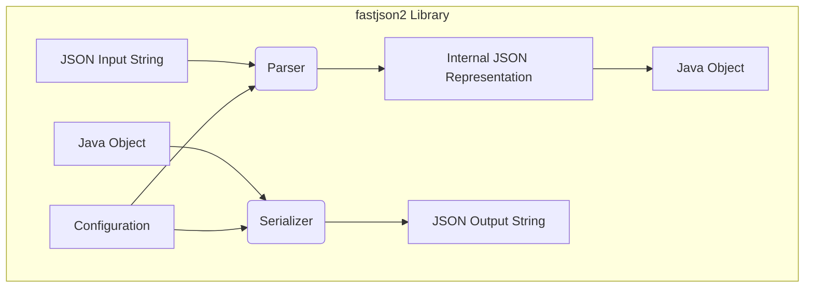
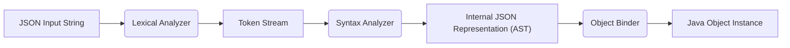
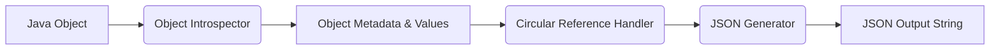

# Project Design Document: fastjson2

**Version:** 1.1
**Date:** October 26, 2023
**Author:** AI Software Architect

## 1. Introduction

This document provides a detailed architectural design of the `fastjson2` library, a high-performance JSON library for Java, originally developed by Alibaba. This document aims to provide a comprehensive understanding of the library's structure, components, and data flow, which will serve as the foundation for subsequent threat modeling activities.

### 1.1. Purpose

The primary purpose of this document is to outline the design of `fastjson2` in sufficient detail to facilitate effective threat modeling. It describes the key components, their interactions, and the data flow within the library, with a particular focus on aspects relevant to security.

### 1.2. Scope

This document focuses on the core functionalities of `fastjson2`, including:

*   JSON parsing (deserialization) and the various strategies employed.
*   JSON generation (serialization) and its customization options.
*   Configuration options and features influencing parsing and serialization behavior.
*   Key internal components and their specific responsibilities in the data processing pipeline.

This document does not cover:

*   Detailed performance benchmarking data or comparisons with other libraries.
*   Line-by-line code implementations within individual classes.
*   The complete history of the library's development and specific version changes.

### 1.3. Goals

The goals of this design document are to:

*   Provide a clear and concise overview of the `fastjson2` architecture, emphasizing security-relevant aspects.
*   Identify key components and their interactions, highlighting potential attack surfaces.
*   Describe the data flow during parsing and serialization with sufficient detail for vulnerability analysis.
*   Highlight specific areas of interest for security analysis and threat modeling, providing concrete examples.

## 2. High-Level Architecture

`fastjson2` is architected around the core tasks of parsing JSON strings into Java objects and serializing Java objects into JSON strings. The library prioritizes performance and offers extensive configuration options to tailor its behavior.

*   **JSON Input String:** The raw JSON string intended for parsing.
*   **Parser:** The central component responsible for deserializing the JSON input string into Java objects. This involves lexical analysis, syntax analysis, and object binding.
*   **Java Object:** The target Java object to be populated during parsing or the source Java object to be serialized.
*   **Serializer:** The central component responsible for serializing Java objects into a JSON output string. This involves object introspection and JSON structure generation.
*   **Internal JSON Representation:** An in-memory representation of the JSON data structure, typically using a combination of maps and lists. This acts as an intermediary between the raw string and Java objects.
*   **JSON Output String:** The resulting JSON string after the serialization process.
*   **Configuration:**  A set of settings and options that govern the behavior of both the parser and the serializer, influencing how data is processed and transformed.

## 3. Component Details

This section provides a more detailed breakdown of the key components within the `fastjson2` library.

### 3.1. Parser

The Parser component is responsible for taking a JSON string as input and converting it into Java objects. It can be further broken down into sub-components:

*   **Lexical Analyzer (Lexer/Scanner):**
    *   **Functionality:**  Scans the input JSON string character by character, identifying and categorizing tokens (e.g., `{`, `}`, `:`, `,`, string literals, numbers, booleans, `null`).
    *   **Inputs:** Raw JSON input string.
    *   **Outputs:** A stream of tokens representing the structure of the JSON.
    *   **Security Relevance:** Potential vulnerabilities related to handling malformed or excessively long tokens, leading to DoS.
*   **Syntax Analyzer (Parser Logic):**
    *   **Functionality:**  Takes the stream of tokens from the Lexer and builds a hierarchical representation of the JSON document based on grammar rules. This often employs techniques like recursive descent parsing.
    *   **Inputs:** Stream of tokens.
    *   **Outputs:** An Abstract Syntax Tree (AST) or an equivalent internal representation of the JSON structure.
    *   **Security Relevance:** Vulnerabilities in handling deeply nested structures or specific syntax errors could lead to DoS.
*   **Object Binder:**
    *   **Functionality:**  Maps the parsed JSON structure (from the Syntax Analyzer) to instances of Java classes. This involves:
        *   **Reflection:** Inspecting Java classes to determine fields, constructors, and setter methods.
        *   **Constructor Invocation:** Creating new instances of Java objects.
        *   **Setter Method Invocation/Field Assignment:** Setting the values of object fields based on the JSON data.
        *   **Type Conversion:** Converting JSON data types (string, number, boolean, null) to corresponding Java types.
    *   **Inputs:** Internal JSON representation and target Java class information.
    *   **Outputs:** Populated Java object.
    *   **Security Relevance:** This is a critical area for deserialization vulnerabilities. Malicious JSON can be crafted to instantiate arbitrary classes, invoke methods with unintended side effects (gadget chains), or manipulate object states.
*   **Configuration Handler (Parser Specific):**
    *   **Functionality:** Applies parsing-specific configurations, such as handling of unknown fields, date formats, and custom deserializers.
    *   **Inputs:** Configuration settings and the internal JSON representation.
    *   **Outputs:** Modified parsing behavior or data transformation.
    *   **Security Relevance:** Incorrectly configured or bypassed security settings can lead to vulnerabilities.

### 3.2. Serializer

The Serializer component takes a Java object as input and converts it into a JSON string. It can be further broken down into sub-components:

*   **Object Introspector:**
    *   **Functionality:**  Examines the Java object to determine its structure and the values of its fields. This primarily uses reflection.
    *   **Inputs:** Java object to be serialized.
    *   **Outputs:** Information about the object's fields, types, and values.
    *   **Security Relevance:**  Potential for information disclosure if sensitive data is inadvertently accessed and serialized.
*   **JSON Generator:**
    *   **Functionality:**  Constructs the JSON string representation based on the information provided by the Object Introspector. This involves generating:
        *   Object start and end delimiters (`{`, `}`).
        *   Array start and end delimiters (`[`, `]`).
        *   Key-value pairs (`"key": value`).
        *   Separators (`,`).
        *   Handling different data types and their JSON representations.
    *   **Inputs:** Object structure and values.
    *   **Outputs:** JSON string fragments.
    *   **Security Relevance:**  Vulnerabilities related to generating excessively large strings or incorrect JSON syntax could lead to DoS or parsing errors on the receiving end.
*   **Circular Reference Handler:**
    *   **Functionality:** Detects and handles circular references between objects to prevent infinite loops during serialization. Strategies might include omitting the circular reference or using a special marker.
    *   **Inputs:** Object being serialized and the current serialization context.
    *   **Outputs:** Modified serialization behavior to avoid infinite loops.
    *   **Security Relevance:** Failure to handle circular references can lead to stack overflow errors and DoS.
*   **Configuration Handler (Serializer Specific):**
    *   **Functionality:** Applies serialization-specific configurations, such as date formats, pretty printing, inclusion/exclusion of fields, and custom serializers.
    *   **Inputs:** Configuration settings and the object being serialized.
    *   **Outputs:** Modified serialization behavior or output format.
    *   **Security Relevance:** Incorrectly configured serialization can lead to information disclosure or bypass security measures.

### 3.3. Internal JSON Representation

This is a transient, in-memory data structure used to represent the parsed JSON before it's bound to Java objects. It typically consists of:

*   **Maps (JSONObject):** Represent JSON objects, where keys are strings and values can be other JSON values.
*   **Lists (JSONArray):** Represent JSON arrays, containing ordered sequences of JSON values.
*   **Primitive Wrappers:**  Represent JSON primitive values (strings, numbers, booleans, null).

This internal model facilitates the decoupling of the parsing process from the specific target Java classes.

### 3.4. Configuration

The Configuration component provides a way to customize the behavior of the parser and serializer. Key configuration options include:

*   **Date Format:** Specifies the format for parsing and serializing dates.
*   **Handling of Unknown Fields:** Determines how the parser should handle fields in the JSON input that do not have corresponding fields in the target Java class (e.g., ignore, throw an exception).
*   **Field Naming Policy:** Defines how Java field names are mapped to JSON keys (e.g., camelCase, snake_case).
*   **Pretty Printing:**  Formats the output JSON string for better readability.
*   **Feature Flags:** Enables or disables specific features of the library.
*   **Type Adapters/Converters:** Allows users to register custom logic for serializing and deserializing specific Java types.
*   **Serialization Filters:** Enables the inclusion or exclusion of specific fields during serialization based on certain criteria.

## 4. Data Flow

This section provides a more detailed description of the data flow during parsing and serialization.

### 4.1. Parsing Data Flow

1. **JSON Input String:** The raw JSON string to be parsed.
2. **Lexical Analyzer:** Scans the input string and generates a stream of tokens.
3. **Token Stream:** A sequence of identified tokens representing the basic building blocks of the JSON structure.
4. **Syntax Analyzer:**  Parses the token stream according to JSON grammar rules, building an internal representation of the JSON structure, often an Abstract Syntax Tree (AST).
5. **Internal JSON Representation (AST):** A hierarchical representation of the JSON data, making it easier to process and map to Java objects.
6. **Object Binder:** Traverses the internal JSON representation and maps the data to the fields of the target Java class, performing type conversions and invoking constructors/setters as needed.
7. **Java Object Instance:** The fully populated Java object resulting from the parsing process.

### 4.2. Serialization Data Flow

1. **Java Object:** The Java object to be serialized into a JSON string.
2. **Object Introspector:** Uses reflection to extract metadata (field names, types) and values from the Java object.
3. **Object Metadata & Values:**  Information about the object's structure and the data it contains.
4. **Circular Reference Handler:** Checks for and handles any circular references within the object graph to prevent infinite loops.
5. **JSON Generator:** Constructs the JSON string based on the object's metadata and values, adhering to JSON syntax rules and applying any configured formatting options.
6. **JSON Output String:** The final JSON string representation of the Java object.

## 5. Security Considerations (Detailed for Threat Modeling)

This section expands on potential security considerations, providing more specific examples relevant to threat modeling:

*   **Deserialization Vulnerabilities:**
    *   **Polymorphic Deserialization Exploits:**  Manipulating the JSON input to instantiate unexpected and potentially malicious classes. For example, providing type information that leads to the instantiation of classes with dangerous `readObject()` methods or other side effects.
    *   **Gadget Chain Exploitation:**  Crafting JSON payloads that, when deserialized, trigger a chain of method calls leading to arbitrary code execution. This often involves leveraging existing classes within the application's classpath.
    *   **Resource Exhaustion through Deeply Nested Objects/Arrays:**  Providing JSON with extremely deep nesting levels that consume excessive stack space or processing time during parsing, leading to DoS.
    *   **Uncontrolled Resource Consumption via Large Strings/Arrays:**  Including extremely large string or array values in the JSON input that consume excessive memory during parsing, leading to OutOfMemory errors and DoS.
*   **Denial of Service (DoS):**
    *   **Hash Collision Attacks:**  Exploiting weaknesses in the hashing algorithms used for JSON object keys, potentially leading to excessive CPU usage when processing objects with many colliding keys.
    *   **Integer Overflow/Underflow:**  Providing large numerical values in the JSON that could cause integer overflow or underflow issues during parsing or processing.
    *   **Regular Expression Denial of Service (ReDoS):** If regular expressions are used for input validation or parsing, carefully crafted malicious input strings could cause the regex engine to enter a catastrophic backtracking state, leading to excessive CPU consumption.
*   **Information Disclosure:**
    *   **Serialization of Sensitive Data:**  Accidentally serializing fields containing sensitive information (e.g., passwords, API keys) if proper exclusion mechanisms are not in place.
    *   **Exposure of Internal State:**  Custom serializers might inadvertently expose internal state information of objects that should not be included in the JSON output.
    *   **Error Message Information Leaks:**  Verbose error messages during parsing or serialization could reveal information about the application's internal structure or dependencies.
*   **Input Validation Issues:**
    *   **Bypassing Validation Logic:**  Crafting JSON input that circumvents intended validation rules, potentially leading to unexpected behavior or vulnerabilities in downstream processing.
    *   **Injection Attacks (e.g., NoSQL Injection):** If the parsed JSON data is used to construct queries for NoSQL databases, insufficient sanitization could lead to injection vulnerabilities.
*   **Configuration Vulnerabilities:**
    *   **Insecure Default Configurations:**  Default settings that are not secure, such as allowing the deserialization of arbitrary classes without proper restrictions.
    *   **Misconfigured Type Adapters/Converters:**  Custom serialization or deserialization logic that introduces vulnerabilities.
*   **Dependency Vulnerabilities:**
    *   Utilizing third-party libraries with known security vulnerabilities.

## 6. Dependencies

`fastjson2` relies on the following types of dependencies:

*   **Java Standard Library (JDK):**  Core Java classes for reflection (`java.lang.reflect`), collections (`java.util`), and basic data types. Vulnerabilities in the JDK itself could impact `fastjson2`.
*   **Potentially External Libraries (Conditional):** Depending on specific features or extensions used, `fastjson2` might have optional dependencies on other libraries. These dependencies should be carefully reviewed for known vulnerabilities. Examples might include libraries for specific data formats or advanced functionalities.

## 7. Deployment Considerations

The security implications of deploying `fastjson2` depend heavily on the context in which it is used:

*   **Web Applications and APIs:**
    *   **Exposure to Untrusted Input:** When used to parse JSON requests from clients, `fastjson2` is directly exposed to potentially malicious input. Robust input validation and secure deserialization practices are crucial.
    *   **Serialization of Responses:** Ensure that sensitive data is not inadvertently included in JSON responses.
*   **Microservices:**
    *   **Inter-Service Communication:**  If used for communication between microservices, ensure that the communication channels are secure (e.g., using TLS) and that both services have appropriate security configurations for `fastjson2`.
*   **Data Processing Applications:**
    *   **Processing Untrusted Data Sources:** If processing JSON data from external or untrusted sources, be aware of the potential for malicious payloads.
*   **Mobile Applications:**
    *   **Data Serialization and Deserialization:**  Similar considerations as web applications, but with potential constraints on resource usage.

This improved design document provides a more detailed and security-focused overview of the `fastjson2` library's architecture, intended to facilitate more effective threat modeling activities.