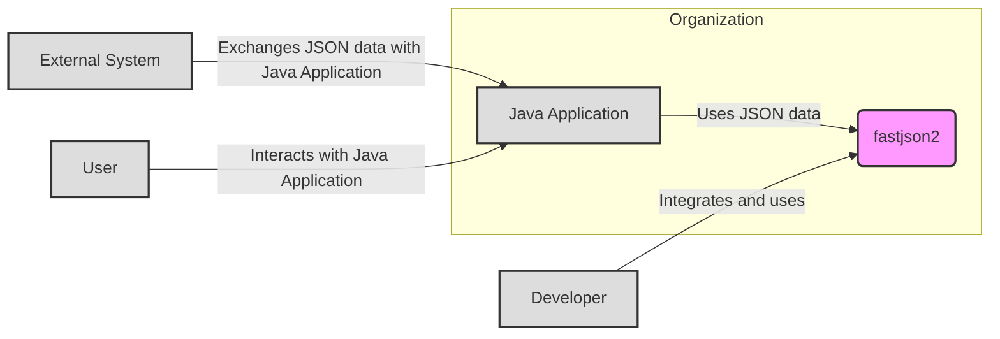
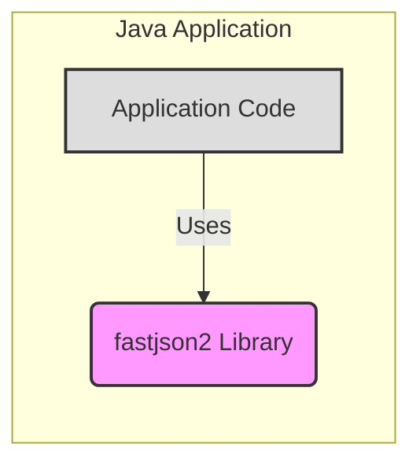
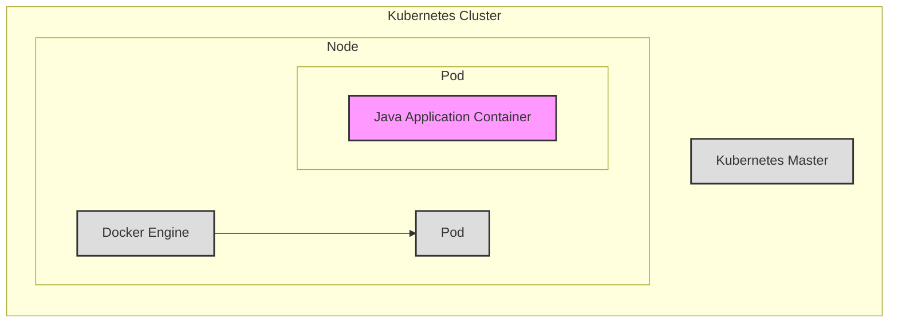
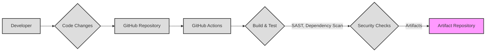

# BUSINESS POSTURE

- Business Priorities and Goals:
  - The fastjson2 project aims to provide a high-performance and feature-rich JSON library for Java.
  - Primary goals are to offer fast JSON parsing and serialization, be compatible with various JSON standards, and be easy to integrate into Java applications.
  - The project likely targets developers and organizations that require efficient JSON processing in their applications, especially in performance-sensitive environments like microservices, data processing pipelines, and web applications.
  - For businesses adopting fastjson2, the priorities are likely to improve application performance, reduce resource consumption related to JSON processing, and ensure compatibility with existing systems that rely on JSON data exchange.

- Business Risks:
  - Security vulnerabilities in the library could lead to data breaches or application compromise if exploited by attackers.
  - Performance issues or bugs in the library could cause application instability or service disruptions.
  - Compatibility issues with different JSON standards or other libraries could lead to integration problems and development delays.
  - Supply chain risks if the library's dependencies or build process are compromised.
  - Reputational damage if security flaws or critical bugs are discovered and publicized.

# SECURITY POSTURE

- Existing Security Controls:
  - security control: Code review process (assumed for open-source projects, but not explicitly stated in the repository).
  - security control: Static code analysis (assumed, but not explicitly stated).
  - security control: Unit and integration testing (evident from the repository structure and test directories).
  - security control: Open-source nature allows for community security review and contributions.
  - accepted risk: Reliance on community contributions for security vulnerability discovery and patching.
  - accepted risk: Potential delay in security patch releases due to open-source development cycles.

- Recommended Security Controls:
  - security control: Implement automated static application security testing (SAST) in the CI/CD pipeline to detect potential vulnerabilities early in the development process.
  - security control: Integrate dependency scanning to identify and manage vulnerable dependencies.
  - security control: Establish a clear vulnerability disclosure and response process.
  - security control: Consider fuzz testing to proactively discover input validation vulnerabilities.
  - security control: Provide security advisories for reported vulnerabilities and their fixes.

- Security Requirements:
  - Authentication: Not applicable for a JSON library. Authentication is handled by the applications that use fastjson2.
  - Authorization: Not applicable for a JSON library. Authorization is handled by the applications that use fastjson2.
  - Input Validation:
    - security requirement: Robust input validation is crucial to prevent vulnerabilities like injection attacks (e.g., if fastjson2 is used to process user-provided JSON data that is later used in other contexts).
    - security requirement: The library must handle malformed or unexpected JSON input gracefully and securely, avoiding crashes or unexpected behavior.
    - security requirement: Implement validation to prevent denial-of-service attacks through excessively large or deeply nested JSON structures.
  - Cryptography:
    - security requirement: If fastjson2 is intended to handle sensitive data within JSON, ensure that it does not introduce vulnerabilities related to cryptographic operations if any are performed (though unlikely for a core JSON library).
    - security requirement: If the library provides features for handling encrypted JSON data (e.g., JWE, JWA), these features must be implemented securely, following best practices for cryptography.

# DESIGN

## C4 CONTEXT

- Context Diagram Elements:
  - - Name: Java Application
    - Type: Software System
    - Description: A Java application developed by the organization that requires JSON processing capabilities.
    - Responsibilities: Utilizing fastjson2 to serialize and deserialize JSON data for various purposes, such as data storage, API communication, and data exchange with other systems.
    - Security controls: Input validation on data received from external systems and users, authorization checks within the application logic, secure data handling practices.
  - - Name: fastjson2
    - Type: Software System (Library)
    - Description: A high-performance JSON library for Java, developed by Alibaba and the open-source community.
    - Responsibilities: Providing efficient and reliable JSON parsing and serialization functionalities to Java applications.
    - Security controls: Input validation within the library to handle malformed JSON, protection against buffer overflows and other memory safety issues, adherence to secure coding practices.
  - - Name: Developer
    - Type: Person
    - Description: Software developers within the organization who integrate and use fastjson2 in their Java applications.
    - Responsibilities: Properly integrating fastjson2 into applications, understanding its API and security considerations, and reporting any issues or vulnerabilities.
    - Security controls: Secure development training, code review practices, using secure development tools.
  - - Name: External System
    - Type: Software System
    - Description: External systems that communicate with the Java Application by exchanging data in JSON format. These could be APIs, databases, or other services.
    - Responsibilities: Providing and consuming JSON data according to agreed-upon formats and protocols.
    - Security controls: API authentication and authorization, secure communication channels (e.g., HTTPS), input validation on data sent to the Java Application.
  - - Name: User
    - Type: Person
    - Description: End-users who interact with the Java Application. User interactions might indirectly involve JSON data processing within the application.
    - Responsibilities: Using the Java Application for its intended purpose.
    - Security controls: Authentication to access the application, authorization to perform actions, input validation on user-provided data within the application.

## C4 CONTAINER

- Container Diagram Elements:
  - - Name: fastjson2 Library
    - Type: Library
    - Description: The fastjson2 library itself, containing the code for JSON parsing and serialization. It's a single container in this context as it's a library integrated directly into the Java Application.
    - Responsibilities: Providing JSON parsing and serialization functionalities. Handling various JSON formats and standards. Ensuring performance and reliability.
    - Security controls: Input validation within the library, memory safety checks, secure coding practices, vulnerability scanning during development.
  - - Name: Application Code
    - Type: Code Component
    - Description: The custom application code written by developers that utilizes the fastjson2 library.
    - Responsibilities: Implementing application logic, handling business requirements, integrating with other systems, and using fastjson2 for JSON processing as needed.
    - Security controls: Secure coding practices, input validation at the application level, authorization checks, secure session management, and proper error handling.

## DEPLOYMENT

- Deployment Options:
  - Option 1: Standalone Java Application Deployment: The Java application using fastjson2 is deployed as a standalone application on virtual machines or physical servers.
  - Option 2: Containerized Deployment (Docker/Kubernetes): The Java application and fastjson2 are packaged into a Docker container and deployed in a container orchestration platform like Kubernetes.
  - Option 3: Serverless Deployment: The Java application (potentially using a framework like Micronaut or Quarkus for serverless) is deployed as a serverless function on platforms like AWS Lambda or Azure Functions.

- Selected Deployment Architecture: Containerized Deployment (Docker/Kubernetes) - This is a common and scalable deployment approach for modern applications.

- Deployment Diagram Elements:
  - - Name: Kubernetes Cluster
    - Type: Infrastructure
    - Description: A Kubernetes cluster providing container orchestration and management.
    - Responsibilities: Managing container deployments, scaling, networking, and resource allocation.
    - Security controls: Network policies, RBAC (Role-Based Access Control), pod security policies/admission controllers, secrets management, regular security updates and patching of the Kubernetes platform.
  - - Name: Node
    - Type: Infrastructure (Compute)
    - Description: Worker nodes within the Kubernetes cluster, providing the runtime environment for containers.
    - Responsibilities: Executing containers, managing local resources, and communicating with the Kubernetes master.
    - Security controls: Operating system hardening, security monitoring, intrusion detection systems, regular security patching, container runtime security (e.g., Docker Engine security configurations).
  - - Name: Docker Engine
    - Type: Software (Container Runtime)
    - Description: The container runtime environment running on each node, responsible for running and managing Docker containers.
    - Responsibilities: Container image management, container lifecycle management, resource isolation for containers.
    - Security controls: Container image scanning, runtime security monitoring, seccomp profiles, AppArmor/SELinux configurations, regular updates of Docker Engine.
  - - Name: Pod
    - Type: Infrastructure (Logical Group of Containers)
    - Description: The smallest deployable unit in Kubernetes, representing a group of one or more containers that share storage and network.
    - Responsibilities: Hosting and managing Java Application Container.
    - Security controls: Pod security context, resource limits, network policies applied at the pod level.
  - - Name: Java Application Container
    - Type: Software (Containerized Application)
    - Description: A Docker container packaging the Java Application and the fastjson2 library.
    - Responsibilities: Running the Java application, utilizing fastjson2 for JSON processing.
    - Security controls: Security controls inherited from the application and library, container image scanning, least privilege principles applied to container user and permissions.

## BUILD

- Build Process:
  - Developer makes code changes and commits them to the GitHub Repository.
  - GitHub Actions is configured to trigger the build process upon code changes (e.g., push, pull request).
  - The build process includes:
    - Compilation of Java code.
    - Running unit and integration tests.
    - Performing static application security testing (SAST) to identify potential code vulnerabilities.
    - Scanning dependencies for known vulnerabilities.
  - Build artifacts (e.g., JAR files) are created and stored in an artifact repository (e.g., Maven Central for library publication, or a private repository for internal applications).

- Build Security Controls:
  - security control: Automated build process using GitHub Actions to ensure consistency and repeatability.
  - security control: Source code hosted in GitHub Repository with access controls and audit logging.
  - security control: Static Application Security Testing (SAST) integrated into the build pipeline to detect code-level vulnerabilities.
  - security control: Dependency scanning to identify and manage vulnerable dependencies.
  - security control: Code signing of build artifacts (if applicable for library distribution) to ensure integrity and authenticity.
  - security control: Secure configuration of the CI/CD pipeline (GitHub Actions) to prevent unauthorized access and modifications.
  - security control: Regular updates and patching of build tools and dependencies used in the build environment.

# RISK ASSESSMENT

- Critical Business Processes:
  - For a JSON library, the critical business process is the reliable and secure processing of JSON data within applications that depend on it.
  - If fastjson2 fails or has vulnerabilities, applications using it might malfunction, become unavailable, or be compromised, impacting any business processes those applications support.

- Data Sensitivity:
  - The sensitivity of data processed by fastjson2 depends entirely on how it is used by the consuming application.
  - fastjson2 itself does not inherently handle sensitive data unless the applications using it pass sensitive data through it for serialization or deserialization.
  - If applications use fastjson2 to process Personally Identifiable Information (PII), financial data, or other confidential information, then the data handled by fastjson2 is considered sensitive.
  - The sensitivity level should be determined based on the context of the applications using fastjson2 and the type of data they process.

# QUESTIONS & ASSUMPTIONS

- Questions:
  - What are the primary use cases for fastjson2 within the organization or for its users? (e.g., web APIs, data storage, configuration files).
  - Are there specific compliance requirements (e.g., PCI DSS, HIPAA, GDPR) that applications using fastjson2 must adhere to?
  - What are the performance requirements for JSON processing in applications using fastjson2?
  - Is there a vulnerability disclosure policy in place for fastjson2?
  - Are there specific security features or configurations of fastjson2 that are commonly used or recommended?
  - What is the process for updating fastjson2 in applications when new versions or security patches are released?

- Assumptions:
  - fastjson2 is primarily used as a library integrated into Java applications for JSON processing.
  - Security is a concern for users of fastjson2, especially given its role in data handling.
  - The organization using fastjson2 has a software development lifecycle that includes testing and security considerations.
  - The deployment environment for applications using fastjson2 includes standard security controls like network security, access management, and monitoring.
  - The build process for applications using fastjson2 includes basic security checks like dependency scanning.