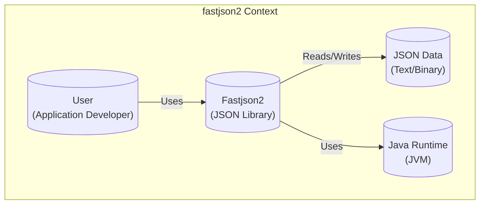
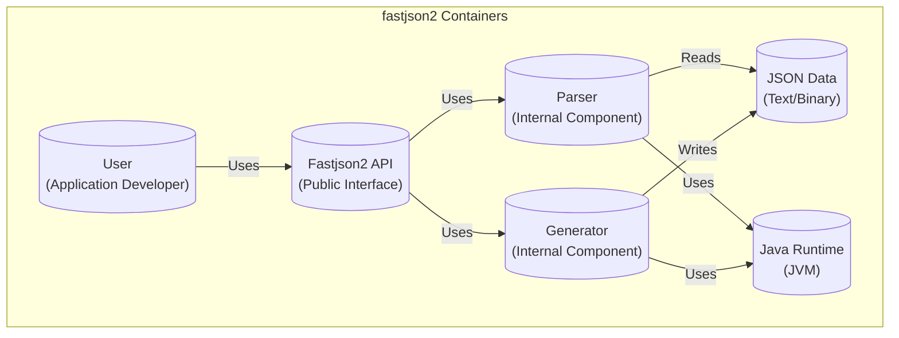
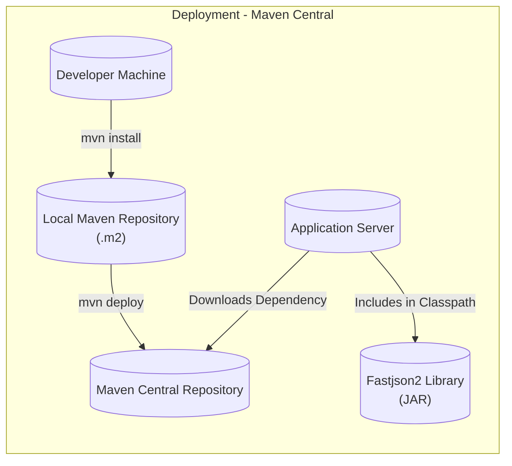
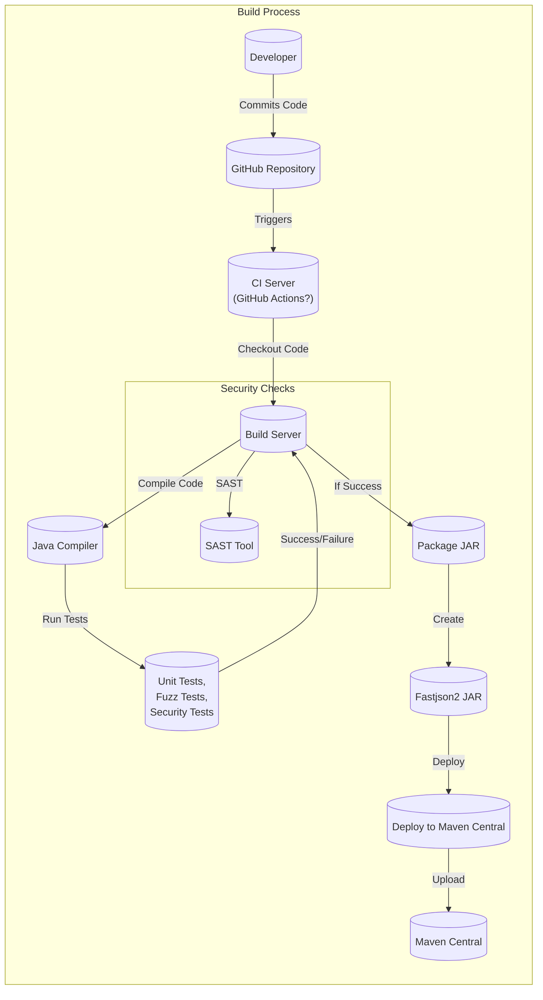

# BUSINESS POSTURE

Fastjson2 is a Java library for parsing and generating JSON data. It's positioned as a high-performance successor to Fastjson. Given its nature as a foundational library used by other applications, the primary business priorities and goals are:

*   Performance: Provide extremely fast JSON parsing and serialization, minimizing CPU and memory overhead. This is a key differentiator and selling point.
*   Correctness: Ensure accurate and reliable handling of JSON data, adhering strictly to JSON standards and specifications. Data integrity is paramount.
*   Security: Prevent vulnerabilities that could be exploited through malicious JSON payloads, protecting applications that use the library.
*   Ease of Use: Offer a simple and intuitive API for developers to easily integrate and use the library.
*   Maintainability: Maintain a clean, well-documented codebase for long-term sustainability and contributions.
*   Compatibility: Maintain compatibility with various Java versions and environments.
*   Adoption: Encourage widespread adoption by the Java community, replacing older JSON libraries.

Based on these priorities, the most important business risks are:

*   Security Vulnerabilities: Vulnerabilities in the library could be exploited in numerous applications that depend on it, leading to widespread security breaches. This is the highest risk.
*   Performance Degradation: Any significant performance regression would undermine its core value proposition and could lead to users switching to alternatives.
*   Incorrect Parsing/Serialization: Bugs leading to incorrect JSON handling could cause data corruption or application malfunctions, impacting reliability.
*   Lack of Adoption: If the library fails to gain traction, it may become unsustainable in the long run.

# SECURITY POSTURE

Existing security controls (based on the GitHub repository and common practices):

*   security control: Fuzz Testing: The repository mentions fuzz testing, which is a crucial security control for a JSON parser. This helps discover edge cases and vulnerabilities that might be missed by manual code review. (Evidence: Mentioned in the README and likely integrated into the build process).
*   security control: Code Reviews: Pull requests and code reviews are standard practice, providing a layer of scrutiny for potential security issues. (Evidence: Standard GitHub workflow).
*   security control: Static Analysis: Likely use of static analysis tools (e.g., SonarQube, FindBugs, PMD) to identify potential code quality and security issues. (Evidence: Common practice in Java development, though not explicitly mentioned in the README).
*   security control: Dependency Management: Careful management of dependencies to avoid using vulnerable libraries. (Evidence: Standard practice, but specific tools/processes are not detailed in the README).
*   security control: Secure Coding Practices: Developers are likely following secure coding guidelines for Java to prevent common vulnerabilities. (Evidence: Implied, but not explicitly documented).

Accepted risks:

*   accepted risk: Complexity of JSON Parsing: JSON parsing is inherently complex, and despite best efforts, there's always a residual risk of undiscovered vulnerabilities, especially with highly optimized code.
*   accepted risk: Reliance on Third-Party Dependencies: While dependencies are managed, there's an inherent risk associated with relying on external libraries.
*   accepted risk: Zero-Day Vulnerabilities: The possibility of zero-day vulnerabilities in the Java runtime or underlying system libraries exists.

Recommended security controls (high priority):

*   security control: Comprehensive Security Test Suite: Beyond fuzzing, implement a dedicated security test suite that specifically targets known JSON-related vulnerabilities (e.g., injection attacks, denial-of-service, etc.).
*   security control: Regular Security Audits: Conduct periodic security audits by independent experts to identify potential vulnerabilities.
*   security control: Security-Focused Documentation: Provide clear documentation on secure usage of the library, including best practices for handling untrusted JSON input.
*   security control: Vulnerability Disclosure Program: Establish a clear process for reporting and handling security vulnerabilities discovered by external researchers.
*   security control: Supply Chain Security: Implement measures to ensure the integrity of the build and distribution process, preventing tampering with the library artifacts (e.g., code signing).
*   security control: SAST (Static Application Security Testing): Integrate SAST tools into the CI/CD pipeline to automatically scan for vulnerabilities during each build.
*   security control: DAST (Dynamic Application Security Testing): Although more applicable to applications, consider using DAST-like techniques to test the library's behavior with various inputs, including malformed or malicious JSON.

Security Requirements:

*   Authentication: Not directly applicable to a JSON parsing library.
*   Authorization: Not directly applicable to a JSON parsing library.
*   Input Validation:
    *   Strictly adhere to the JSON specification (RFC 8259).
    *   Reject invalid JSON input.
    *   Implement configurable limits on input size, depth, and complexity to prevent denial-of-service attacks.
    *   Provide options for sanitizing or escaping potentially dangerous characters in JSON strings (if applicable to the library's functionality).
*   Cryptography:
    *   If the library handles encrypted JSON Web Tokens (JWT) or other cryptographic operations, use only well-vetted cryptographic libraries and algorithms.
    *   Ensure proper key management and secure random number generation.

# DESIGN

## C4 CONTEXT

Element Descriptions:

*   Element:
    *   Name: User
    *   Type: Person
    *   Description: A developer integrating Fastjson2 into their Java application.
    *   Responsibilities: Uses Fastjson2 API to parse and generate JSON data.
    *   Security controls: Implements application-level security controls, including input validation and data sanitization.
*   Element:
    *   Name: Fastjson2
    *   Type: Software System
    *   Description: The Fastjson2 library itself.
    *   Responsibilities: Parsing and generating JSON data efficiently and securely.
    *   Security controls: Fuzz testing, code reviews, static analysis, secure coding practices.
*   Element:
    *   Name: JSON Data
    *   Type: Data
    *   Description: JSON data in text or binary format.
    *   Responsibilities: Represents data to be processed by Fastjson2.
    *   Security controls: Input validation (at the application level before passing to Fastjson2).
*   Element:
    *   Name: Java Runtime
    *   Type: Software System
    *   Description: The Java Virtual Machine (JVM) that executes Fastjson2.
    *   Responsibilities: Provides the runtime environment for Fastjson2.
    *   Security controls: JVM security updates, secure configuration.

## C4 CONTAINER

Since Fastjson2 is a library, the container diagram is essentially an extension of the context diagram.

Element Descriptions:

*   Element:
    *   Name: User
    *   Type: Person
    *   Description: A developer integrating Fastjson2 into their Java application.
    *   Responsibilities: Uses Fastjson2 API to parse and generate JSON data.
    *   Security controls: Implements application-level security controls, including input validation and data sanitization.
*   Element:
    *   Name: Fastjson2 API
    *   Type: API
    *   Description: The public interface of the Fastjson2 library.
    *   Responsibilities: Provides methods for parsing and generating JSON data.
    *   Security controls: Input validation, API design to minimize misuse.
*   Element:
    *   Name: Parser
    *   Type: Component
    *   Description: Internal component responsible for parsing JSON data.
    *   Responsibilities: Reads JSON data and converts it into Java objects.
    *   Security controls: Fuzz testing, secure coding practices, input validation.
*   Element:
    *   Name: Generator
    *   Type: Component
    *   Description: Internal component responsible for generating JSON data.
    *   Responsibilities: Converts Java objects into JSON data.
    *   Security controls: Secure coding practices, output validation (if applicable).
*   Element:
    *   Name: JSON Data
    *   Type: Data
    *   Description: JSON data in text or binary format.
    *   Responsibilities: Represents data to be processed by Fastjson2.
    *   Security controls: Input validation (at the application level before passing to Fastjson2).
*   Element:
    *   Name: Java Runtime
    *   Type: Software System
    *   Description: The Java Virtual Machine (JVM) that executes Fastjson2.
    *   Responsibilities: Provides the runtime environment for Fastjson2.
    *   Security controls: JVM security updates, secure configuration.

## DEPLOYMENT

Fastjson2 is a library, so deployment involves including it as a dependency in other Java projects.  There are several deployment options:

1.  Maven Central Repository: The most common approach. Developers add Fastjson2 as a dependency in their project's build configuration (e.g., pom.xml for Maven, build.gradle for Gradle).
2.  Direct JAR Download: Less common, but developers can download the JAR file directly and include it in their project's classpath.
3.  Building from Source: Developers can clone the GitHub repository and build the library themselves.

We'll describe the Maven Central Repository approach in detail:

Element Descriptions:

*   Element:
    *   Name: Developer Machine
    *   Type: Infrastructure Node
    *   Description: The developer's workstation where the application using Fastjson2 is built.
    *   Responsibilities: Building the application and resolving dependencies.
    *   Security controls: Secure development environment, developer authentication.
*   Element:
    *   Name: Local Maven Repository
    *   Type: Infrastructure Node
    *   Description: The local cache of Maven dependencies on the developer's machine.
    *   Responsibilities: Storing downloaded dependencies.
    *   Security controls: File system permissions.
*   Element:
    *   Name: Maven Central Repository
    *   Type: Infrastructure Node
    *   Description: The central repository for Maven artifacts.
    *   Responsibilities: Hosting and distributing Fastjson2 JAR files.
    *   Security controls: Repository security measures (authentication, authorization, integrity checks).
*   Element:
    *   Name: Application Server
    *   Type: Infrastructure Node
    *   Description: The server where the application using Fastjson2 is deployed.
    *   Responsibilities: Running the application and loading Fastjson2.
    *   Security controls: Server security hardening, network security.
*   Element:
    *   Name: Fastjson2 Library
    *   Type: Software Artifact
    *   Description: The Fastjson2 JAR file.
    *   Responsibilities: Providing JSON parsing and generation functionality.
    *   Security controls: Code signing (recommended), checksum verification.

## BUILD

The build process for Fastjson2 likely involves the following steps:

Element Descriptions:

*   Developer: Commits code changes to the GitHub repository.
*   GitHub Repository: Stores the source code and triggers the CI/CD pipeline.
*   CI Server (GitHub Actions?): Automates the build process.
*   Build Server: Executes the build steps (compilation, testing, packaging).
*   Java Compiler: Compiles the Java source code.
*   Tests: Executes unit tests, fuzz tests, and security tests.
*   Package JAR: Creates the Fastjson2 JAR file.
*   Fastjson2 JAR: The final build artifact.
*   Deploy to Maven Central: Deploys the JAR to the Maven Central repository.
*   Maven Central: Hosts the released JAR file.
*   SAST Tool: Performs static analysis to identify potential security vulnerabilities.

Security Controls in the Build Process:

*   security control: CI/CD Pipeline: Automates the build process, ensuring consistency and repeatability.
*   security control: Version Control (Git): Tracks code changes and allows for auditing.
*   security control: Unit Tests: Verify the functionality of individual components.
*   security control: Fuzz Tests: Discover edge cases and vulnerabilities by providing random inputs.
*   security control: Security Tests: Specifically target known JSON-related vulnerabilities.
*   security control: SAST (Static Application Security Testing): Analyzes the source code for potential security flaws.
*   security control: Dependency Scanning: Checks for vulnerable dependencies.
*   security control: Code Signing (Recommended): Digitally signs the JAR file to ensure its integrity and authenticity.

# RISK ASSESSMENT

*   Critical Business Processes:
    *   Providing a reliable and performant JSON processing library for Java applications.
    *   Maintaining the trust and reputation of the library and its developers.
*   Data We Are Trying to Protect:
    *   The primary concern isn't protecting specific data *within* the library, but rather preventing the library from being a *conduit* for attacks that could compromise data processed by applications *using* the library.
    *   The library itself handles JSON data, which can range in sensitivity from public information to highly confidential data, depending on the application using it.
    *   Sensitivity: Varies greatly depending on the application. The library must be designed to handle all levels of sensitivity securely.

# QUESTIONS & ASSUMPTIONS

*   Questions:
    *   What specific static analysis tools are used?
    *   What are the specific criteria for code review and acceptance?
    *   What are the details of the fuzz testing implementation (e.g., tools used, coverage achieved)?
    *   Are there any existing security incident response plans?
    *   What are the specific Java versions supported?
    *   Is there a dependency vulnerability management process in place? What tools are used?
    *   Is code signing used for released artifacts?
    *   Is there a formal vulnerability disclosure program?

*   Assumptions:
    *   BUSINESS POSTURE: Assumes that performance and security are the top priorities.
    *   SECURITY POSTURE: Assumes that standard secure coding practices are followed. Assumes that basic security measures like code reviews are in place. Assumes that developers are aware of common JSON-related vulnerabilities.
    *   DESIGN: Assumes a standard Java library structure. Assumes deployment via Maven Central. Assumes a CI/CD pipeline is used for building and testing.