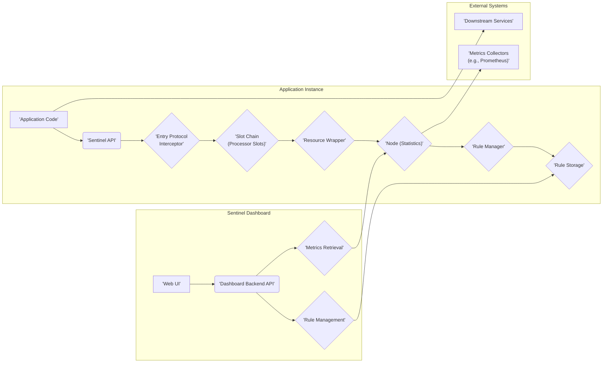
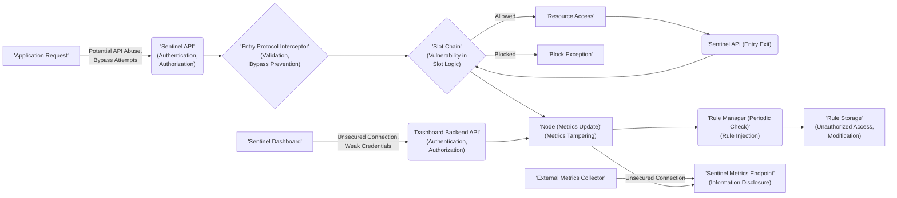

# Project Design Document: Sentinel (Improved for Threat Modeling)

**Version:** 1.1
**Date:** October 26, 2023
**Prepared By:** AI Software Architect

## 1. Introduction

This document provides an enhanced design overview of the Sentinel project, focusing on aspects relevant for threat modeling. The goal is to provide a detailed understanding of Sentinel's architecture, components, and data flow, specifically highlighting potential security considerations and attack surfaces. This document will serve as the foundation for identifying and mitigating potential threats.

## 2. Goals

*   Clearly define the architecture and key components of the Sentinel project with a security-focused lens.
*   Describe the data flow within the system, emphasizing potential security checkpoints and vulnerabilities.
*   Identify the major functionalities and their interactions, highlighting potential security risks associated with each.
*   Provide sufficient detail and context for effective threat modeling sessions.

## 3. Project Overview

Sentinel is a flow control component designed to enhance the reliability and stability of microservices. Its core functionalities, from a security perspective, involve controlling access and resource usage, making it a critical component for preventing abuse and ensuring service availability. Key features relevant to security include:

*   **Traffic Shaping:**  Controls the rate and volume of requests, which can be used to mitigate denial-of-service attacks or prevent resource exhaustion.
*   **Circuit Breaking:**  Automatically stops traffic to unhealthy downstream services, preventing cascading failures and limiting the impact of vulnerabilities in those services.
*   **System Adaptive Protection:**  Dynamically adjusts protection strategies based on system load, potentially mitigating attacks that aim to overload the system.
*   **Real-time Metrics Monitoring:**  Provides visibility into traffic patterns and the effectiveness of flow control rules, aiding in the detection of anomalies and potential attacks.

## 4. System Architecture

Sentinel's architecture, while designed for performance, also presents various points of interaction and potential vulnerabilities.

### 4.1. High-Level Architecture Diagram

### 4.2. Key Components (Security Focused)

*   **Application Code:** The application integrating Sentinel. Potential vulnerabilities here include incorrect Sentinel configuration or misuse of the API, leading to bypassed protections.
*   **Sentinel API:** The interface for interacting with Sentinel. Security concerns include unauthorized access to the API for rule manipulation or metric retrieval.
*   **Entry Protocol Interceptor:** Intercepts requests. A vulnerability here could allow bypassing Sentinel's protection mechanisms if not implemented correctly.
*   **Slot Chain (Processor Slots):** The core of Sentinel's logic. Each slot presents potential security considerations:
    *   **Node Selector Slot:**  Incorrect node selection could lead to incorrect rule application.
    *   **Statistic Slot:**  Potential for manipulation of statistics if not properly secured, leading to incorrect decisions by other slots.
    *   **Authority Slot:**  Crucial for authorization. Vulnerabilities here could allow unauthorized access.
    *   **Flow Control Slot:**  Misconfigured rules or vulnerabilities in the logic could lead to unintended blocking or allowing of traffic.
    *   **Degrade Slot:**  Incorrectly configured circuit breaking could lead to unnecessary service disruptions or failure to protect against cascading failures.
    *   **System Slot:**  Vulnerabilities could allow manipulation of system protection rules.
*   **Resource Wrapper:** Represents the protected resource. Incorrectly defined resources could lead to gaps in protection.
*   **Node (Statistics):** Stores real-time metrics. Access to this data needs to be controlled to prevent information leakage or manipulation.
*   **Rule Manager:** Responsible for managing flow control rules. Unauthorized access or manipulation of the Rule Manager is a critical security risk.
*   **Rule Storage:**  The persistence layer for rules. This is a critical component to secure, as unauthorized modification can directly impact Sentinel's effectiveness. Consider the security of the storage mechanism itself (e.g., file system permissions, database access controls).
*   **Sentinel Dashboard:** The web UI for managing Sentinel. This is a significant attack surface and requires robust authentication and authorization mechanisms.
*   **Dashboard Backend API:**  The API powering the dashboard. Needs strong authentication and authorization to prevent unauthorized rule management and metric access.
*   **Metrics Retrieval:**  Exposes metrics data. Access should be controlled to prevent information disclosure.
*   **Downstream Services:** The services being protected by Sentinel. Vulnerabilities in these services are the reason Sentinel is needed.
*   **Metrics Collectors (e.g., Prometheus):** External systems pulling metrics. Secure communication channels are necessary to prevent eavesdropping or tampering.

## 5. Data Flow (Security Perspective)

The data flow through Sentinel involves several stages where security needs to be considered:

*   **Application Request to Sentinel API:**  The initial interaction point. Is this communication authenticated and authorized? Can malicious requests be crafted to exploit vulnerabilities in the API?
*   **Entry Protocol Interceptor:**  How does the interceptor identify and validate requests? Can it be bypassed?
*   **Slot Chain Processing:**  Each slot operates on the request and associated data. Are there vulnerabilities in the logic of each slot that could be exploited? Is the data being processed securely?
*   **Rule Evaluation:**  How are rules retrieved and evaluated? Is there a risk of rule injection or tampering?
*   **Metrics Recording:**  Is the recording of metrics secure? Can malicious actors influence the metrics to manipulate Sentinel's behavior?
*   **Interaction with Rule Storage:**  How are rules read from and written to storage? Are these operations authenticated and authorized? Is the storage itself secure?
*   **Dashboard Interaction:**  Communication between the web UI and the backend API needs to be secured (e.g., using HTTPS). Authentication and authorization are critical here.
*   **Metrics Retrieval by External Systems:**  Is the metrics endpoint secured? Is the data transmitted securely?

### 5.1. Data Flow Diagram (Security Emphasis)

## 6. Key Functionalities (Security Risks)

*   **Resource Definition:**  Incorrectly defining resources could leave gaps in protection, allowing unauthorized access.
*   **Flow Control Rule Configuration:**  Vulnerabilities in the rule configuration process (e.g., lack of input validation) could allow malicious rules to be injected. Overly permissive rules could negate the benefits of Sentinel.
*   **Circuit Breaking Rule Configuration:**  Incorrectly configured circuit breaking could lead to unnecessary service outages or fail to protect against real failures.
*   **System Adaptive Protection Configuration:**  Vulnerabilities could allow manipulation of these rules, potentially disabling protection during peak load or attacks.
*   **Rule Management:**  A critical security function. Unauthorized access to rule management can completely compromise Sentinel's effectiveness.
*   **Metrics Monitoring and Visualization:**  While primarily for monitoring, unauthorized access to metrics could reveal sensitive information about application behavior and potential vulnerabilities.
*   **Authority Control:**  If not implemented correctly, authorization rules could be bypassed, allowing unauthorized access to resources.
*   **Event Listening:**  If event listeners are not carefully designed, they could introduce new vulnerabilities or leak information.

## 7. Deployment Considerations (Security Implications)

The deployment model significantly impacts the security posture of Sentinel:

*   **Embedded Library:**  Security relies on the security of the application itself. Vulnerabilities in the application could potentially be used to bypass or manipulate the embedded Sentinel instance.
*   **Standalone Service (Sentinel Standalone):**  Introduces network communication as a potential attack vector. Requires secure communication channels (e.g., TLS) and robust authentication and authorization for clients connecting to the service. The standalone service itself becomes a critical component to secure.
*   **Agent-based:**  Similar to the standalone service, requires secure communication between the application and the agent. The security of the agent itself is also a concern.

## 8. Security Considerations (Detailed)

This section expands on potential security threats and vulnerabilities:

*   **Authentication and Authorization:**
    *   **Dashboard Access:** Weak or default credentials for the Sentinel Dashboard could allow unauthorized access and rule manipulation.
    *   **API Access:**  Lack of or weak authentication for the Dashboard Backend API allows unauthorized rule management and metric retrieval.
    *   **Rule Storage Access:**  Unauthorized access to the rule storage could lead to modification or deletion of critical flow control rules.
*   **Input Validation:**
    *   **Rule Configuration:** Insufficient input validation when configuring flow control rules could allow injection of malicious rules or unexpected behavior.
*   **Communication Security:**
    *   **Standalone Deployment:** Unencrypted communication between applications and the standalone Sentinel service could expose sensitive data and allow for man-in-the-middle attacks.
    *   **Metrics Endpoints:** Unsecured metrics endpoints could leak sensitive performance and usage data.
*   **Rule Management Security:**
    *   **Rule Injection:**  Vulnerabilities in the rule management interface could allow attackers to inject malicious rules.
    *   **Rule Tampering:**  Unauthorized modification of existing rules could disable protection mechanisms or cause service disruptions.
*   **Metrics Security:**
    *   **Information Disclosure:**  Unprotected metrics endpoints could reveal sensitive information about application behavior and potential vulnerabilities.
    *   **Metrics Manipulation:**  If metrics can be manipulated, attackers could influence Sentinel's decision-making process.
*   **Denial of Service (DoS):**
    *   **Dashboard DoS:**  The Sentinel Dashboard could be targeted by DoS attacks, preventing administrators from managing flow control rules.
    *   **Sentinel Instance DoS:**  The Sentinel instance itself could be targeted by DoS attacks, potentially disrupting flow control for protected applications.
*   **Dependency Vulnerabilities:**  Vulnerabilities in Sentinel's dependencies could be exploited to compromise the system.
*   **Error Handling:**  Verbose error messages could leak sensitive information about the system's internal workings.
*   **Configuration Management:**  Insecure storage or management of Sentinel configuration files could expose sensitive information or allow for unauthorized modifications.
*   **Logging and Auditing:**  Insufficient logging and auditing could hinder the detection and investigation of security incidents.

## 9. Future Considerations (Security Implications)

Future enhancements should consider potential security implications:

*   **Enhanced Rule Management UI:**  New features should be designed with security in mind, including proper access controls and input validation.
*   **Integration with More Data Sources for Adaptive Protection:**  Ensure the integrity and trustworthiness of new data sources to prevent manipulation of protection strategies.
*   **Advanced Analytics and Reporting:**  Secure access to analytics data and ensure that reporting mechanisms do not inadvertently expose sensitive information.
*   **Support for More Protocols and Frameworks:**  Carefully consider the security implications of integrating with new protocols and frameworks.

This improved design document provides a more detailed and security-focused overview of the Sentinel project. It highlights potential attack surfaces and vulnerabilities, serving as a valuable resource for subsequent threat modeling activities.