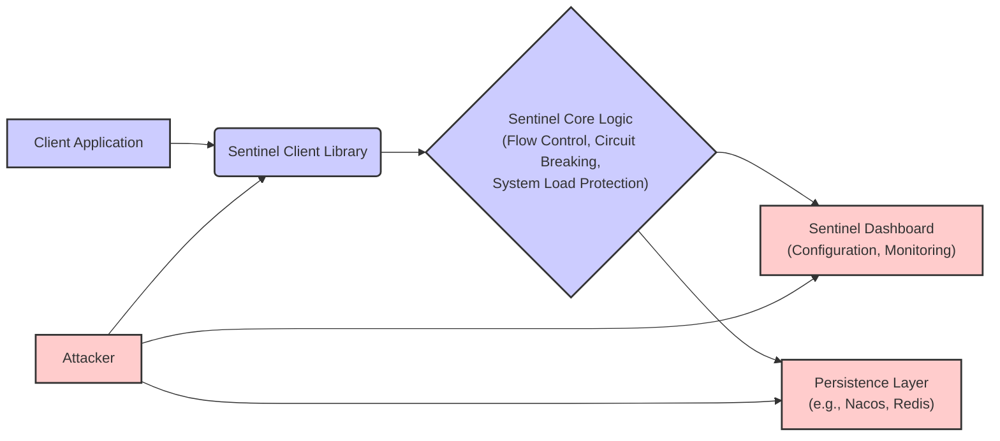

### High and Critical Threats Directly Involving Alibaba Sentinel

This list details high and critical threats directly associated with the use of Alibaba Sentinel within an application.

#### Threat 1: Unauthorized Rule Modification

*   **Description:** An attacker gains unauthorized access to the Sentinel Dashboard or the underlying persistence layer. They then modify flow control rules (e.g., reducing the QPS limit to zero), circuit breaking rules (e.g., forcing a circuit to always be open), or system load protection configurations (e.g., setting very low thresholds).
*   **Impact:**
    *   Denial of Service (DoS) by blocking all legitimate traffic.
    *   Bypassing intended rate limits, allowing malicious activities to proceed unchecked.
    *   Forcing premature circuit breaks, leading to unnecessary service disruptions and cascading failures.
*   **Affected Component:**
    *   Sentinel Dashboard (Configuration UI, API endpoints)
    *   Persistence Layer (e.g., Nacos, Redis - data storage and retrieval mechanisms)
*   **Risk Severity:** Critical
*   **Mitigation Strategies:**
    *   Implement strong authentication and authorization for the Sentinel Dashboard. Use role-based access control (RBAC) to restrict access to rule modification functionalities.
    *   Secure the underlying persistence layer with strong authentication, authorization, and network access controls.
    *   Audit log all configuration changes made through the Sentinel Dashboard.
    *   Implement a process for reviewing and approving critical rule changes.

#### Threat 2: Exposure of Sensitive Configuration Data

*   **Description:** An attacker exploits vulnerabilities or misconfigurations in the Sentinel Dashboard or the persistence layer to gain access to sensitive configuration details. This could involve accessing unprotected API endpoints, exploiting authentication bypasses, or gaining access to the underlying data store. The exposed data might include resource names, internal application structure, or sensitive thresholds.
*   **Impact:**
    *   Information Disclosure: Attackers gain insights into the application's architecture and resource dependencies, which can be used to plan further attacks.
    *   Potential for exploiting misconfigurations revealed in the data.
*   **Affected Component:**
    *   Sentinel Dashboard (Configuration UI, API endpoints)
    *   Persistence Layer (e.g., Nacos, Redis - data storage and retrieval mechanisms)
*   **Risk Severity:** High
*   **Mitigation Strategies:**
    *   Ensure the Sentinel Dashboard and persistence layer are deployed with secure configurations.
    *   Regularly scan for vulnerabilities in the Sentinel Dashboard and its dependencies.
    *   Enforce the principle of least privilege for access to configuration data.
    *   Use HTTPS for all communication to protect data in transit.

#### Threat 3: Exploiting Vulnerabilities in Sentinel Client Library

*   **Description:** An attacker discovers and exploits a security vulnerability within the Sentinel client library itself. This could allow the attacker to execute arbitrary code within the application's context, bypass security checks, or cause other unexpected behavior.
*   **Impact:**
    *   Complete compromise of the application.
    *   Data breaches, unauthorized access, and other severe security consequences.
*   **Affected Component:**
    *   Sentinel Client Library (All modules and functions)
*   **Risk Severity:** Critical
*   **Mitigation Strategies:**
    *   Keep the Sentinel client library updated to the latest stable version to patch known vulnerabilities.
    *   Subscribe to security advisories and release notes for the Sentinel project.
    *   Perform regular security assessments of the application and its dependencies, including the Sentinel client library.