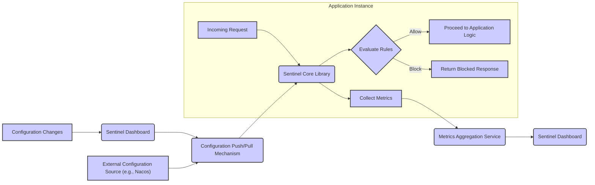

# Project Design Document: Sentinel - Flow Control and Traffic Shaping

**Version:** 1.1
**Date:** October 26, 2023
**Author:** AI Cloud & Security Architect
**Target Audience:** Security Engineers, Software Architects, Development Teams

## 1. Introduction

This document provides an enhanced and detailed architectural design of the Sentinel project, a powerful flow control component crucial for ensuring the reliability, resilience, and observability of microservices. This document is specifically crafted to serve as a comprehensive reference for security engineers and development teams to understand the system's architecture, components, interactions, and data flows, which is essential for conducting effective threat modeling and security assessments. The information presented here is based on the publicly available information from the [Sentinel GitHub repository](https://github.com/alibaba/sentinel).

## 2. Goals of this Document

*   Provide a clear and comprehensive architectural blueprint of the Sentinel system.
*   Identify and describe the responsibilities of each key component within Sentinel.
*   Illustrate the flow of data and control within the system and its interactions with external entities.
*   Detail the various deployment models and configuration options relevant to security considerations.
*   Serve as a definitive resource for security professionals to perform thorough threat modeling, identify potential vulnerabilities, and develop appropriate mitigation strategies for the Sentinel project.

## 3. Scope

This document covers the core architectural elements of Sentinel, including:

*   The core Sentinel library embedded within application instances.
*   The Sentinel Dashboard for real-time monitoring and rule configuration.
*   Key concepts such as resources, rules (flow control, circuit breaking, system adaptive protection, authority control, degrade), and the slot chain.
*   Common deployment scenarios and their architectural implications.
*   Different configuration sources and their impact on security.

This document does not cover:

*   In-depth implementation details of the Sentinel core library's internal algorithms.
*   Specific code-level analysis or detailed API specifications.
*   Highly specific configurations tailored to niche use cases.

## 4. Architectural Overview

Sentinel is designed as a lightweight, non-intrusive, high-performance library that integrates directly into application processes. It primarily operates within the application runtime, intercepting requests to defined resources and applying pre-configured rules to manage traffic flow and ensure system stability. A separate central dashboard provides a user interface for configuring these rules and monitoring the real-time status of the system.

## 5. Detailed Design

### 5.1. Core Components

*   **Sentinel Core Library:** The foundational component, embedded directly within each application instance. Its key responsibilities include:
    *   **Request Interception:**  Intercepting incoming requests targeting specifically defined resources within the application. This is typically achieved through AOP (Aspect-Oriented Programming) or similar interception mechanisms.
    *   **Resource Identification:** Identifying the specific resource being accessed based on the request context.
    *   **Rule Evaluation:** Evaluating pre-configured rules against the current state of the resource and the system, considering metrics like current request rate, concurrency, and error ratios.
    *   **Policy Enforcement:** Enforcing flow control, circuit breaking, system adaptive protection, authority control, and degrade policies based on the evaluated rules.
    *   **Real-time Metrics Collection:** Gathering and maintaining real-time statistics about resource access, including success counts, failure counts, response times, and thread pool usage.
    *   **API Provision:** Providing APIs for developers to define resources programmatically and interact with Sentinel's functionalities.

*   **Resource:** Represents any unit of the application that can be protected and controlled by Sentinel. Examples include:
    *   Specific API endpoints (e.g., `/users/{id}`).
    *   Individual service calls to other microservices.
    *   Database queries or operations.
    *   Critical code sections or business logic.
    *   Message queue consumers or producers.

*   **Rule:** Defines the specific logic for controlling access and ensuring the stability of a resource. Different rule types cater to various scenarios:
    *   **Flow Rules:** Control the inbound traffic rate to a resource to prevent overload. Examples include:
        *   Limiting the Queries Per Second (QPS) to a specific value.
        *   Limiting the concurrent access to a resource.
    *   **Circuit Breaking Rules:**  Prevent cascading failures by temporarily blocking access to an unhealthy resource. Examples include:
        *   Blocking requests if the error ratio exceeds a threshold within a time window.
        *   Blocking requests if the average response time exceeds a threshold.
    *   **System Rules:** Protect the overall stability of the application instance by monitoring system-level metrics. Examples include:
        *   Rejecting requests if the CPU usage is too high.
        *   Rejecting requests if the system load is above a certain limit.
    *   **Authority Rules:** Control access to resources based on the request's origin or associated identity. Examples include:
        *   Allowing access only from specific IP addresses.
        *   Blocking access for users without specific roles.
    *   **Degrade Rules:** Provide fallback mechanisms or alternative behaviors when a resource is under stress or failing. Examples include:
        *   Returning cached data instead of making a failing service call.
        *   Redirecting traffic to a degraded service instance.

*   **Slot Chain:**  The core execution pipeline within the Sentinel core library. It's a chain of responsibility pattern where each slot performs a specific task during request processing:
    *   **Node Creation Slot:** Creates and manages runtime statistics nodes for each accessed resource. These nodes hold the real-time metrics.
    *   **Statistic Slot:** Collects and aggregates various metrics for the resource, such as pass count, block count, error count, and response times.
    *   **Authority Slot:** Enforces authority rules by checking if the request source has the necessary permissions to access the resource.
    *   **Flow Control Slot:** Evaluates and enforces flow rules based on the collected metrics and configured thresholds.
    *   **Degrade Slot:** Evaluates and enforces circuit breaking and degrade rules to prevent cascading failures and provide fallback mechanisms.

*   **Metrics Repository:**  A local, in-memory store within each application instance that holds the real-time metrics collected by the Sentinel core. This data is used for immediate rule evaluation and is also periodically sent to the monitoring dashboard.

*   **Sentinel Dashboard:** A separate web application providing a centralized interface for:
    *   **Rule Configuration and Management:** Creating, updating, and deleting Sentinel rules for various applications and resources.
    *   **Real-time Monitoring:** Visualizing real-time metrics such as QPS, response times, and block counts for protected resources.
    *   **System Status Overview:** Displaying the overall health and status of applications using Sentinel.
    *   **Flow Chart Visualization:** Providing graphical representations of traffic flow and rule enforcement.
    *   **Cluster Management (Optional):** Configuring and managing Sentinel clusters for more advanced deployment scenarios.

*   **Configuration Push/Pull Mechanism:** The system responsible for propagating rule configurations from the Sentinel Dashboard (or other configuration sources) to the individual Sentinel core instances running within applications. Common mechanisms include:
    *   **Pull-based (e.g., using a shared configuration center like Nacos, Consul, or ZooKeeper):** Application instances periodically poll the configuration center for updates. This approach offers better resilience in case of dashboard unavailability.
    *   **Push-based (e.g., using WebSocket, gRPC, or a message queue):** The Sentinel Dashboard actively pushes configuration changes to registered application instances. This allows for more immediate updates.
    *   **File-based:** Configurations are stored in local files within the application instances, requiring manual updates or deployment changes. This is less dynamic but can be simpler for certain environments.

*   **External Configuration Source:**  A centralized repository for storing and managing Sentinel rule configurations. Examples include:
    *   **Nacos:** A popular open-source configuration management and service discovery platform.
    *   **Consul:** A service mesh solution that also provides configuration management capabilities.
    *   **ZooKeeper:** A centralized service for maintaining configuration information, naming, providing distributed synchronization, and group services.

### 5.2. Data Flow

The typical data flow within Sentinel involves these steps:

1. **Incoming Request Arrival:** An application instance receives an incoming request destined for a protected resource.
2. **Sentinel Core Interception:** The Sentinel Core Library intercepts the request through configured interception points.
3. **Resource Identification:** Sentinel identifies the specific resource targeted by the request based on pre-defined rules or annotations.
4. **Rule Evaluation within Slot Chain:** The request is passed through the Slot Chain. Each slot performs its designated function:
    *   The **Node Creation Slot** ensures a statistics node exists for the resource.
    *   The **Statistic Slot** updates the real-time metrics for the resource.
    *   The **Authority Slot** checks if the request is authorized based on configured authority rules.
    *   The **Flow Control Slot** evaluates configured flow rules against the current metrics.
    *   The **Degrade Slot** checks for circuit breaking or degrade conditions.
5. **Decision Making:** Based on the evaluations within the Slot Chain, Sentinel makes a decision:
    *   **Allow:** The request is allowed to proceed to the application logic.
    *   **Block:** The request is blocked, and a predefined blocked response is returned to the client.
    *   **Degrade:** The request is handled by a fallback mechanism or alternative logic.
6. **Action Execution:**
    *   If allowed, the request proceeds to the application's business logic.
    *   If blocked, a "blocked" response is sent back to the requester.
    *   If degraded, the fallback logic is executed.
7. **Metrics Update:** The Sentinel Core Library updates the local metrics repository with the outcome of the request processing (success, failure, response time, etc.).
8. **Metrics Aggregation and Reporting:** The collected metrics are periodically aggregated locally and sent to the Metrics Aggregation Service, which then feeds data to the Sentinel Dashboard for visualization and monitoring.
9. **Configuration Management via Dashboard:** Administrators can modify or create new rules through the Sentinel Dashboard.
10. **Configuration Propagation:**  Configuration changes are propagated from the Sentinel Dashboard (or external configuration source) to the individual Sentinel Core instances in the applications via the configured push/pull mechanism.

## 6. Key Technologies

*   **Core Language:** Primarily implemented in **Java**.
*   **Concurrency Management:** Utilizes **java.util.concurrent** for high-performance, thread-safe metric collection and rule evaluation.
*   **Networking:**  Employs various networking libraries depending on the configuration push mechanism (e.g., **Netty** for high-performance networking, **Spring WebFlux** for reactive communication).
*   **Web Framework (for Dashboard):** Typically built using **Spring Boot** or similar Java web frameworks.
*   **Persistence (for Dashboard):** May use databases like **MySQL**, **PostgreSQL**, or in-memory stores for storing rule configurations and dashboard metadata.
*   **Configuration Management Integration:** Supports integration with popular configuration management tools like **Nacos**, **Consul**, and **ZooKeeper**.

## 7. Deployment Model

Sentinel can be deployed in several ways, each with its own security implications:

*   **Standalone Mode (Embedded):** Each application instance runs its own independent Sentinel instance. Rules are typically managed through a central dashboard, and configuration is pushed or pulled to individual instances. This model is simple to deploy but requires careful management of configuration propagation and can lead to inconsistencies if not handled properly.
*   **Cluster Mode (Decentralized Rule Evaluation):** Multiple application instances form a cluster and coordinate their flow control decisions. This requires a shared state mechanism (e.g., using Redis or Nacos) to synchronize metrics and rule evaluations across instances. This model provides higher resilience and more accurate global flow control but introduces complexities related to distributed state management and potential security vulnerabilities in the shared state mechanism.
*   **Using a Service Mesh:** When deployed within a service mesh like Istio or Envoy, Sentinel's functionalities can be offloaded to the service mesh sidecar proxies. This provides a more centralized and potentially more secure way to manage traffic control, as the policies are enforced at the infrastructure level. However, it adds complexity to the deployment and requires careful configuration of the service mesh.

## 8. Security Considerations for Threat Modeling

This section outlines key security considerations that should be thoroughly analyzed during the threat modeling process, categorized for clarity:

*   **Confidentiality:**
    *   **Rule Configuration Exposure:** How are rule configurations stored and transmitted? Is the configuration data encrypted in transit and at rest? Could unauthorized parties gain access to sensitive rule configurations (e.g., rate limits, blocked IP addresses)?
    *   **Metrics Data Exposure:**  Are the collected metrics considered sensitive? Is access to the metrics aggregation service and dashboard properly controlled? Could unauthorized access to metrics reveal sensitive usage patterns or system vulnerabilities?
*   **Integrity:**
    *   **Rule Tampering:** Who has the authority to modify Sentinel rules? Are there sufficient access controls and audit logs to prevent unauthorized or malicious rule changes that could disrupt service or bypass security controls?
    *   **Configuration Injection:** Could an attacker inject malicious configurations through vulnerabilities in the configuration push/pull mechanism or the dashboard?
    *   **Metrics Manipulation:** Could an attacker manipulate the metrics data reported to the dashboard to hide attacks or influence rule evaluations?
*   **Availability:**
    *   **Dashboard Availability:** Is the Sentinel Dashboard a single point of failure? What are the implications if the dashboard becomes unavailable for rule management and monitoring?
    *   **DoS Attacks on Sentinel Core:** Could an attacker craft requests that specifically target Sentinel's rule evaluation logic, causing excessive resource consumption and leading to a denial of service?
    *   **Configuration Service Availability:** If using an external configuration service, what is the impact of its unavailability on Sentinel's ability to retrieve and update rules?
    *   **Bypass Vulnerabilities:** Are there any ways to bypass Sentinel's flow control or circuit breaking logic, allowing malicious traffic to reach the application?
*   **Authentication and Authorization:**
    *   **Dashboard Access Control:** How is access to the Sentinel Dashboard authenticated and authorized? Are strong password policies enforced? Is multi-factor authentication supported?
    *   **Configuration API Security:** If the configuration push/pull mechanism exposes APIs, how are these APIs authenticated and authorized?
    *   **Inter-Component Authentication:**  If Sentinel components communicate with each other (e.g., in cluster mode), how is this communication authenticated and secured?
*   **Other Considerations:**
    *   **Dependency Vulnerabilities:** Are there known vulnerabilities in the third-party libraries used by Sentinel? Regular dependency scanning and updates are crucial.
    *   **Code Injection in Rules:** If rules allow complex expressions or scripting, is there a risk of code injection vulnerabilities if input is not properly sanitized?
    *   **Logging and Auditing:** Are Sentinel's actions and configuration changes adequately logged and auditable for security monitoring and incident response?

This improved design document provides a more detailed and security-focused overview of the Sentinel project, making it a valuable resource for conducting thorough threat modeling and ensuring the secure deployment and operation of applications utilizing Sentinel for flow control and resilience.
