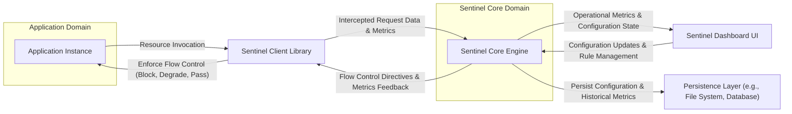
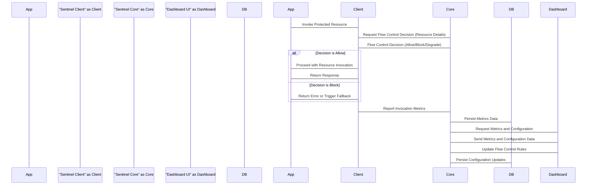

## Project Design Document: Sentinel (Improved)

**1. Introduction**

This document provides an enhanced and more detailed design overview of the Sentinel project, an open-source flow control component crucial for ensuring the high-availability and reliability of microservices. This improved document aims to provide a clearer and more comprehensive understanding of Sentinel's architecture, components, and data flow, specifically tailored for effective threat modeling.

**2. Project Goals and Scope**

* **Goal:** To deliver a refined and more detailed design document for the Sentinel project, with a strong emphasis on aspects relevant to security analysis and threat modeling.
* **Scope:** This document comprehensively covers the core architecture, key components, and data flow of the Sentinel system, drawing information from the provided GitHub repository (https://github.com/alibaba/sentinel). It focuses on both the server-side components and the interaction patterns between applications and the Sentinel core, including relevant client-side integration details that impact data flow and security.

**3. High-Level Architecture**

The Sentinel architecture is structured around the following key functional areas:

* **Application Integration Layer:**  The mechanisms by which applications connect and interact with Sentinel.
* **Sentinel Core Processing Engine:** The central component responsible for flow control logic and decision-making.
* **Management and Monitoring Interface:** The user interface for configuring and observing Sentinel's behavior.
* **Data Persistence and Storage:** The systems used for storing configuration and operational metrics.

**4. Detailed Component Description**

* **Application Instance:**
    * Represents a single running instance of a microservice or application requiring flow control and real-time monitoring.
    * Integrates with Sentinel by incorporating the Sentinel Client Library as a dependency.
    * Reacts to flow control decisions received from the Sentinel Client Library, potentially blocking requests or triggering fallback mechanisms.

* **Sentinel Client Library:**
    * A lightweight library embedded within the application instance.
    * Acts as an interceptor for designated resources or entry points within the application.
    * Collects and transmits resource invocation details and performance metrics to the Sentinel Core Engine.
    * Receives and interprets flow control decisions (allow, block, degrade) from the Sentinel Core Engine.
    * Enforces the received flow control rules, directly impacting the application's behavior.
    * Often provides adapters or integrations for popular frameworks like Spring Cloud and Dubbo, simplifying integration.

* **Sentinel Core Engine:**
    * The central processing unit of the Sentinel system, responsible for the core flow control logic.
    * Receives a continuous stream of metrics and resource invocation data from connected Sentinel Client Libraries.
    * Evaluates pre-configured flow control rules (e.g., rate limiting, circuit breaking, adaptive system protection) against the incoming data.
    * Makes real-time flow control decisions based on the rule evaluations and the current system state.
    * Exposes APIs for external systems, including the Sentinel Dashboard, to retrieve metrics and manage configurations.
    * Can operate in various deployment modes, including embedded within an application or as a standalone service/cluster.

* **Sentinel Dashboard UI:**
    * A web-based graphical interface for managing and monitoring the Sentinel system.
    * Provides functionalities for defining, modifying, and managing flow control rules.
    * Displays real-time and historical metrics, offering insights into application performance and system health.
    * Allows users to visualize traffic patterns, identify bottlenecks, and adjust flow control strategies.
    * Communicates with the Sentinel Core Engine via its exposed APIs to fetch data and apply configuration changes.

* **Persistence Layer:**
    * Responsible for the durable storage of Sentinel's configuration and historical metrics data.
    * **Configuration Persistence:** Ensures that defined flow control rules are preserved across restarts of the Sentinel Core Engine. This might involve storing rules in files, databases, or distributed configuration stores.
    * **Metrics Persistence:** Enables the long-term storage of operational metrics for historical analysis, trend identification, and reporting. This could utilize time-series databases or other suitable storage solutions.

**5. Data Flow (Detailed)**

The data flow within the Sentinel system can be broken down into the following key stages:

1. **Resource Invocation:** An application instance attempts to access a protected resource, triggering the Sentinel Client Library.
2. **Request Interception and Contextualization:** The Sentinel Client Library intercepts the request and creates a context containing relevant information about the resource, the caller, and the invocation parameters.
3. **Rule Evaluation Request to Core:** The client library sends a request to the Sentinel Core Engine, including the resource name and potentially other contextual data, to determine if the request should be allowed based on current flow control rules.
4. **Core Rule Evaluation:** The Sentinel Core Engine evaluates the configured flow control rules against the received request information and its current metrics. This involves checking rate limits, circuit breaker status, and other relevant conditions.
5. **Flow Control Decision Response:** The Sentinel Core Engine sends a decision back to the client library, indicating whether the request should be allowed, blocked, or handled with a degraded service.
6. **Enforcement at the Client:** The Sentinel Client Library enforces the received decision. If the request is allowed, it proceeds. If blocked, an error is returned or a fallback mechanism is triggered. If degraded, a less resource-intensive operation might be performed.
7. **Metrics Reporting to Core:**  Regardless of the flow control decision, the Sentinel Client Library reports metrics about the resource invocation (e.g., success, failure, latency, request count) to the Sentinel Core Engine.
8. **Metrics Aggregation and Processing:** The Sentinel Core Engine aggregates and processes the received metrics, updating its internal state and preparing data for monitoring and rule evaluation.
9. **Persistence of Metrics and Configuration:** The Sentinel Core Engine periodically persists aggregated metrics and the current configuration to the designated Persistence Layer.
10. **Dashboard Data Retrieval:** The Sentinel Dashboard UI periodically queries the Sentinel Core Engine via its API to retrieve metrics and configuration data for display.
11. **Configuration Updates via Dashboard:** Users interact with the Sentinel Dashboard UI to create, modify, or delete flow control rules. These changes are transmitted to the Sentinel Core Engine via its API.
12. **Configuration Update and Propagation:** The Sentinel Core Engine receives configuration updates from the Dashboard and updates its internal rule set. These changes are often propagated to connected client libraries, depending on the deployment mode and configuration.

**6. Deployment Model Considerations for Security**

The chosen deployment model significantly impacts the security posture of the Sentinel system:

* **Embedded Mode (Within Application Process):**
    * **Pros:** Simpler deployment, lower latency communication.
    * **Cons:** Increased attack surface of the application itself, potential for resource contention, security vulnerabilities in the application could directly impact Sentinel.
* **Standalone Mode (Separate Service):**
    * **Pros:** Better isolation, improved scalability, reduced attack surface on individual applications.
    * **Cons:** Increased deployment complexity, network communication overhead, requires secure network communication channels.
* **Cluster Mode (Multiple Core Instances):**
    * **Pros:** High availability, improved fault tolerance, scalability for large deployments.
    * **Cons:** Most complex deployment, requires robust inter-node communication security, potential for distributed consensus vulnerabilities.

**7. Key Security Considerations for Threat Modeling**

This section outlines critical security considerations that should be the focus of a thorough threat modeling exercise.

* **Authentication and Authorization:**
    * **Application to Core:** How are applications authenticating themselves to the Sentinel Core Engine when sending metrics or requesting decisions? Are there mechanisms to prevent unauthorized applications from interacting with the core?
    * **Dashboard Access:** How is access to the Sentinel Dashboard UI controlled? Are strong authentication mechanisms (e.g., multi-factor authentication) enforced? What authorization controls are in place to restrict access to sensitive configuration and metrics data?
    * **Configuration Changes:** Who is authorized to modify flow control rules? Are there audit logs for configuration changes? Can unauthorized modifications lead to denial of service or other security issues?

* **Data Confidentiality and Integrity:**
    * **Configuration Data:** How is sensitive configuration data (e.g., API keys, sensitive thresholds) protected at rest in the Persistence Layer? Is encryption used?
    * **Metrics Data in Transit:** Is communication between the Sentinel Client Library and the Sentinel Core Engine encrypted (e.g., using TLS)? Can metrics data be intercepted or tampered with during transmission?
    * **Metrics Data at Rest:** How is the integrity of historical metrics data ensured in the Persistence Layer? Can malicious actors manipulate past performance data?

* **Availability and Resilience:**
    * **Core Availability:** What measures are in place to ensure the high availability of the Sentinel Core Engine? How does the system handle failures of core instances?
    * **Impact of Core Unavailability:** What is the impact on applications if the Sentinel Core Engine becomes temporarily unavailable? Are there fallback mechanisms or local caching of rules in the client libraries?
    * **DoS Attacks on Core:** How is the Sentinel Core Engine protected against denial-of-service attacks from malicious applications or external actors? Are there rate limiting or traffic shaping mechanisms in place?

* **Input Validation and Injection Attacks:**
    * **Dashboard Inputs:** Are inputs to the Sentinel Dashboard UI properly validated to prevent injection attacks (e.g., SQL injection, cross-site scripting)?
    * **API Inputs:** Are the APIs exposed by the Sentinel Core Engine protected against injection attacks through rigorous input validation?

* **Dependency Management and Vulnerabilities:**
    * Are the dependencies of the Sentinel project (both core and client libraries) regularly scanned for known vulnerabilities? Is there a process for patching and updating dependencies?

* **Logging and Auditing:**
    * Are security-related events (e.g., authentication failures, authorization violations, configuration changes) logged and auditable? Are these logs securely stored and accessible for security analysis?

* **Denial of Service (Application Level):**
    * Can malicious applications exploit Sentinel's flow control mechanisms to cause denial of service to other applications by intentionally triggering circuit breakers or rate limits?

* **Configuration Management Security:**
    * How are configuration changes tracked and managed? Is there a versioning system for configurations? Is there a rollback mechanism in case of erroneous or malicious configuration changes?

**8. Future Considerations (Beyond Initial Threat Modeling)**

* **Integration with external security information and event management (SIEM) systems for enhanced monitoring and alerting.**
* **Advanced role-based access control (RBAC) for more granular control over dashboard functionalities.**
* **Support for dynamic rule updates and propagation without requiring restarts.**

This improved design document provides a more detailed and security-focused overview of the Sentinel project. The information presented here serves as a solid foundation for conducting a comprehensive threat modeling exercise to identify potential security vulnerabilities and develop appropriate mitigation strategies.