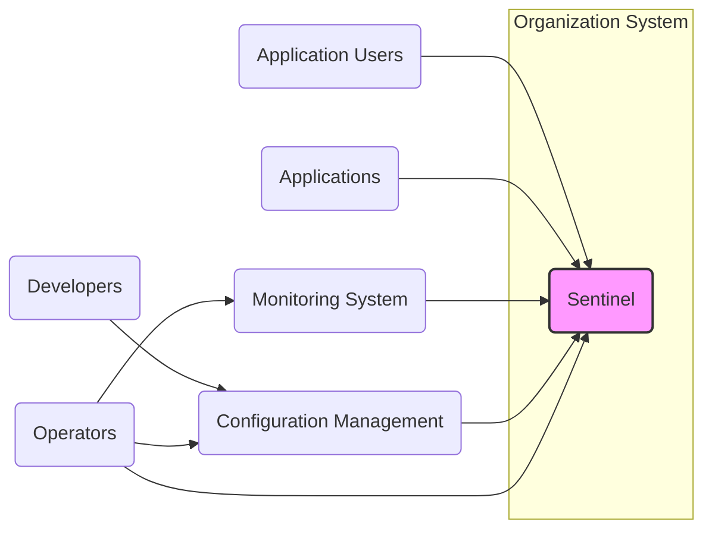
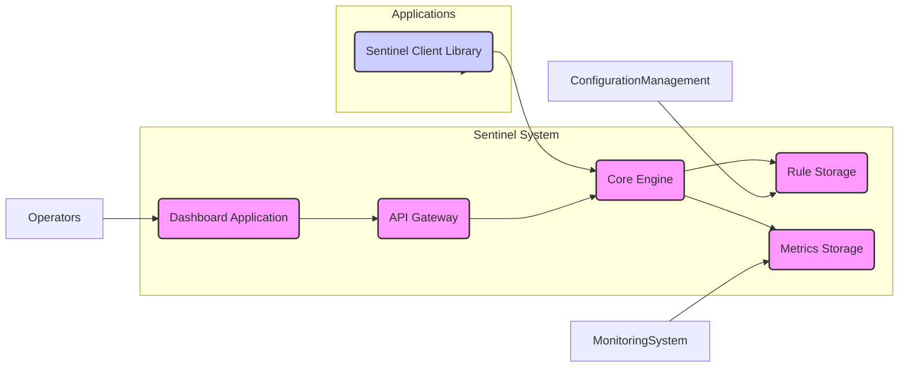
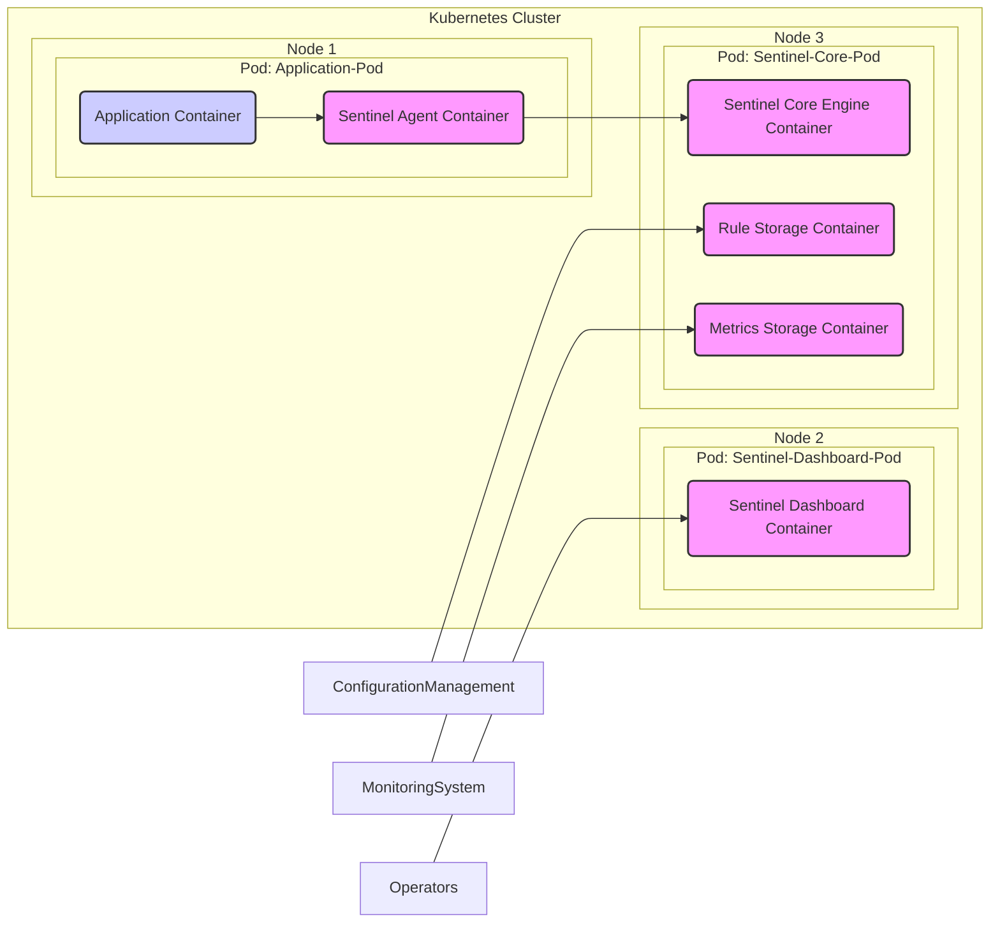
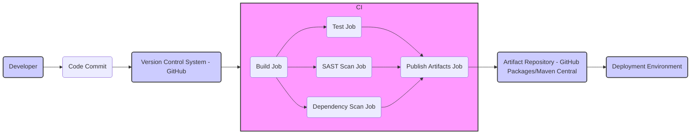

# BUSINESS POSTURE

This project, Sentinel, aims to provide a comprehensive flow control and system resilience solution for microservices and cloud-native applications. The primary business priority is to ensure the reliability and stability of applications by preventing cascading failures, managing traffic surges, and providing real-time monitoring and alerting. The goal is to enhance application resilience, improve user experience by maintaining service availability, and reduce operational costs associated with downtime and performance degradation.

Most important business risks that need to be addressed:
- Risk of service unavailability due to traffic overload or cascading failures.
- Risk of performance degradation impacting user experience and business transactions.
- Risk of misconfiguration leading to incorrect flow control and service disruptions.
- Risk of operational complexity in managing and monitoring distributed systems without proper resilience mechanisms.

# SECURITY POSTURE

Existing security controls:
- security control: Access control to the Sentinel dashboard and API is typically managed through network policies and authentication mechanisms implemented by the deployment environment (e.g., Kubernetes RBAC, cloud provider IAM).
- security control: Secure software development lifecycle practices are expected to be followed by the development team, including code reviews, static and dynamic analysis, and vulnerability scanning, although specific details are not provided in the repository.
- security control: Dependency management is likely in place to track and update third-party libraries, mitigating known vulnerabilities in dependencies.
- security control: Regular security audits and penetration testing are assumed to be conducted, although specific reports are not publicly available.
- accepted risk: Public accessibility of the GitHub repository implies that the source code is open to scrutiny, which can be both a security benefit (community review) and a potential risk (information disclosure).
- accepted risk: Reliance on the security of underlying infrastructure and deployment environments (e.g., Kubernetes, cloud providers) is an accepted risk, as Sentinel itself focuses on application-level resilience.

Recommended security controls:
- security control: Implement robust authentication and authorization mechanisms for accessing the Sentinel dashboard and API, such as OAuth 2.0 or OpenID Connect, integrated with enterprise identity providers.
- security control: Enforce input validation and sanitization for all user inputs to the Sentinel dashboard and API to prevent injection attacks.
- security control: Implement encryption for sensitive data at rest and in transit, such as configuration data and metrics, especially if stored or transmitted outside of secure environments.
- security control: Integrate security scanning tools (SAST, DAST, dependency scanning) into the CI/CD pipeline to automate vulnerability detection and remediation during the development lifecycle.
- security control: Establish a security incident response plan specific to Sentinel deployments, outlining procedures for handling security vulnerabilities and incidents.

Security requirements:
- Authentication:
    - Requirement: Securely authenticate users accessing the Sentinel dashboard and API.
    - Requirement: Support integration with existing identity providers for centralized authentication management.
- Authorization:
    - Requirement: Implement role-based access control (RBAC) to restrict access to Sentinel functionalities based on user roles and permissions.
    - Requirement: Enforce authorization checks for all sensitive operations, such as modifying flow control rules and accessing audit logs.
- Input Validation:
    - Requirement: Validate all user inputs to the Sentinel dashboard and API to prevent injection attacks (e.g., SQL injection, command injection, cross-site scripting).
    - Requirement: Sanitize user inputs before processing and storing them to mitigate potential security risks.
- Cryptography:
    - Requirement: Protect sensitive data at rest and in transit using encryption.
    - Requirement: Securely store and manage cryptographic keys used for encryption.
    - Requirement: Utilize TLS/SSL for all communication channels, especially for external access to the Sentinel dashboard and API.

# DESIGN

## C4 CONTEXT

Context Diagram Elements:

- Element:
    - Name: Sentinel
    - Type: Software System
    - Description: Sentinel is a flow control, circuit breaking, and system protection component. It monitors application traffic, enforces predefined rules, and provides real-time metrics and alerts to ensure system resilience and stability.
    - Responsibilities:
        - Traffic monitoring and shaping.
        - Circuit breaking and adaptive protection.
        - Real-time metrics collection and reporting.
        - Rule configuration and management.
    - Security controls:
        - Access control to dashboard and API.
        - Input validation for rule configuration.
        - Audit logging of configuration changes and security events.

- Element:
    - Name: Application Users
    - Type: Person
    - Description: End-users who interact with the applications protected by Sentinel. Their experience is directly impacted by Sentinel's effectiveness in maintaining application availability and performance.
    - Responsibilities:
        - Generate traffic to applications.
        - Expect reliable and performant application access.
    - Security controls:
        - Authentication and authorization to access applications (handled by applications, not directly by Sentinel).

- Element:
    - Name: Applications
    - Type: Software System
    - Description: Microservices and other applications that are being protected by Sentinel. They integrate with Sentinel clients to enforce flow control rules and report metrics.
    - Responsibilities:
        - Integrate with Sentinel client libraries.
        - Send traffic metrics to Sentinel.
        - Enforce flow control decisions made by Sentinel.
    - Security controls:
        - Application-level security controls (authentication, authorization, input validation).
        - Secure communication with Sentinel clients (e.g., using mutual TLS).

- Element:
    - Name: Monitoring System
    - Type: Software System
    - Description: External monitoring and alerting systems (e.g., Prometheus, Grafana, ELK stack) that consume metrics exposed by Sentinel for visualization, alerting, and analysis.
    - Responsibilities:
        - Collect and store metrics from Sentinel.
        - Visualize metrics and create dashboards.
        - Trigger alerts based on predefined thresholds.
    - Security controls:
        - Access control to monitoring dashboards and data.
        - Secure communication with Sentinel for metric retrieval.

- Element:
    - Name: Configuration Management
    - Type: Software System
    - Description: Systems used to manage and deploy Sentinel configurations, such as Git repositories, configuration servers (e.g., Spring Cloud Config, Consul), or CI/CD pipelines.
    - Responsibilities:
        - Store and version control Sentinel configurations.
        - Distribute configurations to Sentinel instances.
        - Manage rule updates and deployments.
    - Security controls:
        - Access control to configuration repositories and servers.
        - Audit logging of configuration changes.
        - Encryption of sensitive configuration data at rest and in transit.

- Element:
    - Name: Developers
    - Type: Person
    - Description: Software developers who configure Sentinel rules, integrate Sentinel clients into applications, and monitor Sentinel's performance.
    - Responsibilities:
        - Define and configure flow control rules.
        - Integrate Sentinel clients into applications.
        - Monitor Sentinel's effectiveness and performance.
    - Security controls:
        - Access control to configuration management systems.
        - Training on secure configuration practices.

- Element:
    - Name: Operators
    - Type: Person
    - Description: Operations teams responsible for deploying, managing, and monitoring Sentinel infrastructure and ensuring its availability and performance.
    - Responsibilities:
        - Deploy and manage Sentinel instances.
        - Monitor Sentinel's health and performance.
        - Respond to alerts and incidents related to Sentinel.
        - Manage access to Sentinel dashboard and API.
    - Security controls:
        - Access control to Sentinel infrastructure and management tools.
        - Training on secure operations practices.

## C4 CONTAINER

Container Diagram Elements:

- Element:
    - Name: Dashboard Application
    - Type: Web Application
    - Description: A web-based user interface for operators and developers to monitor Sentinel's status, configure rules, view metrics, and manage the system.
    - Responsibilities:
        - Provide a user-friendly interface for Sentinel management.
        - Visualize metrics and system status.
        - Allow rule configuration and management.
    - Security controls:
        - Authentication and authorization for user access.
        - Input validation and output encoding to prevent web application vulnerabilities.
        - Secure communication over HTTPS.

- Element:
    - Name: Core Engine
    - Type: Application
    - Description: The central component of Sentinel responsible for traffic monitoring, rule evaluation, flow control decisions, and metrics collection. It processes requests from client libraries and interacts with storage components.
    - Responsibilities:
        - Traffic monitoring and analysis.
        - Rule evaluation and enforcement.
        - Circuit breaking logic.
        - Metrics aggregation and reporting.
    - Security controls:
        - Secure inter-process communication.
        - Input validation for data received from client libraries and API.
        - Rate limiting to prevent denial-of-service attacks.

- Element:
    - Name: Rule Storage
    - Type: Database
    - Description: A persistent storage for Sentinel rules and configurations. It can be implemented using various databases or configuration management systems.
    - Responsibilities:
        - Persistently store Sentinel rules and configurations.
        - Provide data persistence and retrieval for the Core Engine.
    - Security controls:
        - Access control to the database.
        - Encryption of sensitive data at rest.
        - Regular backups and disaster recovery mechanisms.

- Element:
    - Name: Metrics Storage
    - Type: Time-Series Database
    - Description: A storage system optimized for time-series data, used to store metrics collected by Sentinel. This could be Prometheus, InfluxDB, or other time-series databases.
    - Responsibilities:
        - Store time-series metrics data.
        - Provide efficient querying and retrieval of metrics data for monitoring and analysis.
    - Security controls:
        - Access control to the database.
        - Data retention policies.

- Element:
    - Name: API Gateway
    - Type: Application
    - Description: Provides a programmatic interface (API) for interacting with Sentinel's core engine. Used by the Dashboard and potentially other systems for configuration and management.
    - Responsibilities:
        - Expose Sentinel functionalities through a well-defined API.
        - Handle API requests and route them to the Core Engine.
        - Provide authentication and authorization for API access.
    - Security controls:
        - API authentication and authorization (e.g., API keys, OAuth 2.0).
        - Input validation for API requests.
        - Rate limiting and throttling to prevent abuse.
        - Secure communication over HTTPS.

- Element:
    - Name: Sentinel Client Library
    - Type: Library
    - Description: Libraries integrated into applications to intercept traffic, report metrics to Sentinel, and enforce flow control decisions. Available in multiple languages (Java, Go, etc.).
    - Responsibilities:
        - Intercept application traffic.
        - Report metrics to the Core Engine.
        - Enforce flow control decisions received from the Core Engine.
        - Provide SDK for developers to integrate Sentinel into applications.
    - Security controls:
        - Secure communication with the Core Engine (e.g., mutual TLS).
        - Input validation for data sent to the Core Engine.
        - Minimize attack surface and dependencies.

## DEPLOYMENT

Deployment Solution: Kubernetes Sidecar Deployment

Deployment Diagram Elements:

- Element:
    - Name: Kubernetes Cluster
    - Type: Infrastructure
    - Description: A Kubernetes cluster providing the runtime environment for deploying and managing Sentinel and applications.
    - Responsibilities:
        - Container orchestration and management.
        - Resource provisioning and scaling.
        - Network and security policies.
    - Security controls:
        - Kubernetes RBAC for access control.
        - Network policies to isolate namespaces and pods.
        - Security audits and vulnerability scanning of Kubernetes components.

- Element:
    - Name: Node 1, Node 2, Node 3
    - Type: Infrastructure
    - Description: Worker nodes in the Kubernetes cluster providing compute resources.
    - Responsibilities:
        - Run containers and pods.
        - Provide compute, memory, and network resources.
    - Security controls:
        - Host-level security hardening.
        - Regular patching and updates.
        - Monitoring and intrusion detection.

- Element:
    - Name: Pod: Application-Pod
    - Type: Container Runtime Environment
    - Description: Kubernetes pod hosting the Application Container and Sentinel Agent Container as a sidecar.
    - Responsibilities:
        - Provide a shared network namespace and resources for containers within the pod.
        - Manage lifecycle of containers within the pod.
    - Security controls:
        - Pod security policies or pod security admission controllers.
        - Resource limits and quotas.

- Element:
    - Name: AppContainer
    - Type: Container
    - Description: Container running the application code.
    - Responsibilities:
        - Execute application logic.
        - Serve application requests.
    - Security controls:
        - Application-level security controls.
        - Secure coding practices.

- Element:
    - Name: SentinelContainer
    - Type: Container
    - Description: Container running the Sentinel Agent (Client Library) as a sidecar to the application.
    - Responsibilities:
        - Intercept application traffic.
        - Communicate with Sentinel Core Engine.
        - Enforce flow control rules.
    - Security controls:
        - Minimal container image with only necessary components.
        - Secure communication with Core Engine.

- Element:
    - Name: Pod: Sentinel-Dashboard-Pod
    - Type: Container Runtime Environment
    - Description: Kubernetes pod hosting the Sentinel Dashboard Container.
    - Responsibilities:
        - Serve the Sentinel Dashboard application.
    - Security controls:
        - Network policies to restrict access.
        - Authentication and authorization for dashboard access.

- Element:
    - Name: DashboardContainer
    - Type: Container
    - Description: Container running the Sentinel Dashboard application.
    - Responsibilities:
        - Provide web interface for Sentinel management.
    - Security controls:
        - Web application security controls.

- Element:
    - Name: Pod: Sentinel-Core-Pod
    - Type: Container Runtime Environment
    - Description: Kubernetes pod hosting the Sentinel Core Engine Container, Rule Storage Container, and Metrics Storage Container.
    - Responsibilities:
        - Run core Sentinel components.
    - Security controls:
        - Network policies to isolate components.
        - Access control to storage containers.

- Element:
    - Name: CoreEngineContainer
    - Type: Container
    - Description: Container running the Sentinel Core Engine.
    - Responsibilities:
        - Core flow control logic.
    - Security controls:
        - Secure inter-container communication.

- Element:
    - Name: RuleStorageContainer
    - Type: Container
    - Description: Container running the Rule Storage database (e.g., Redis, MySQL).
    - Responsibilities:
        - Persistent rule storage.
    - Security controls:
        - Database security controls.

- Element:
    - Name: MetricsStorageContainer
    - Type: Container
    - Description: Container running the Metrics Storage database (e.g., Prometheus, InfluxDB).
    - Responsibilities:
        - Persistent metrics storage.
    - Security controls:
        - Database security controls.

## BUILD

Build Process Description:

The build process for Sentinel project typically involves the following steps, focusing on security controls:

1. Developer commits code changes to the Version Control System (VCS), which is GitHub in this case.
2. The CI System, such as GitHub Actions, is triggered by code commits.
3. The CI pipeline consists of several jobs:
    - Build Job: Compiles the code and builds the necessary artifacts (e.g., JAR files, Docker images).
        - security control: Use of secure build environments and build tools.
        - security control: Dependency management to ensure integrity of dependencies.
    - Test Job: Executes unit tests and integration tests to ensure code quality and functionality.
        - security control: Automated testing to detect functional vulnerabilities.
    - SAST Scan Job: Performs Static Application Security Testing (SAST) to identify potential security vulnerabilities in the source code.
        - security control: Integration of SAST tools into the CI pipeline.
        - security control: Automated vulnerability scanning and reporting.
    - Dependency Scan Job: Scans dependencies for known vulnerabilities using tools like dependency-check or Snyk.
        - security control: Integration of dependency scanning tools.
        - security control: Automated vulnerability scanning of dependencies.
    - Publish Artifacts Job: Packages the build artifacts and publishes them to an Artifact Repository, such as GitHub Packages or Maven Central.
        - security control: Secure artifact signing to ensure integrity and authenticity.
        - security control: Access control to the artifact repository.
4. The Artifact Repository stores the build artifacts securely.
5. The Deployment Environment retrieves artifacts from the Artifact Repository for deployment.

# RISK ASSESSMENT

Critical business processes we are trying to protect:
- Application availability and resilience: Sentinel is primarily protecting the business process of ensuring applications remain available and performant under various conditions, including traffic surges and upstream failures. This directly impacts user experience and business continuity.
- Service performance and stability: By controlling traffic flow and preventing cascading failures, Sentinel helps maintain service performance and stability, which is crucial for business operations and revenue generation.

Data we are trying to protect and their sensitivity:
- Sentinel Configuration Data (Rules, Policies): This data is moderately sensitive. Unauthorized modification could lead to service disruptions or bypass of protection mechanisms. Integrity and availability are key concerns.
- Sentinel Metrics Data: This data is less sensitive but important for monitoring and analysis. Confidentiality is not a primary concern, but integrity and availability are important for operational visibility.
- Audit Logs: Audit logs containing information about configuration changes and security events are moderately sensitive. Integrity and availability are important for security monitoring and incident response. Confidentiality might be relevant depending on the content of the logs.

# QUESTIONS & ASSUMPTIONS

Questions:
- What specific authentication and authorization mechanisms are currently used or planned for the Sentinel dashboard and API in the target deployment environment?
- What type of database is used for Rule Storage and Metrics Storage in the target deployment environment?
- Are there specific compliance requirements (e.g., PCI DSS, HIPAA) that Sentinel deployment needs to adhere to?
- What is the expected scale and performance requirements for Sentinel in the target environment?
- Are there any existing security policies or guidelines within the organization that need to be considered for Sentinel deployment?

Assumptions:
- BUSINESS POSTURE: The primary business goal is to enhance application resilience and availability. The organization values service reliability and user experience.
- SECURITY POSTURE: Standard secure software development lifecycle practices are generally followed. Security is a concern, but performance and functionality are also high priorities. The deployment environment provides basic network security and access control.
- DESIGN: Sentinel is deployed in a Kubernetes environment as a sidecar to applications. Rule Storage and Metrics Storage are separate persistent storage systems. The build process includes automated testing and basic security scans.