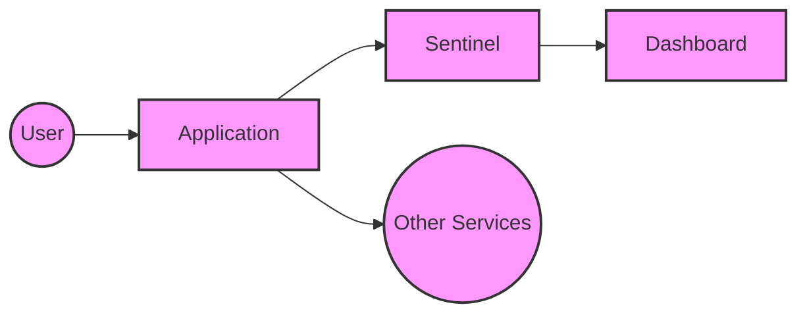
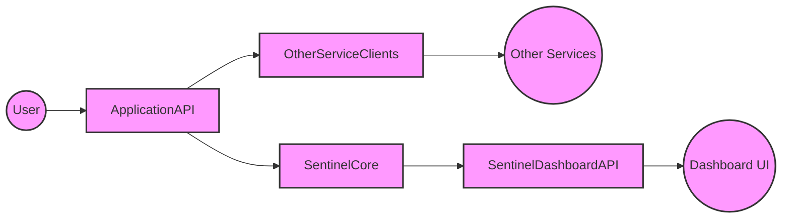
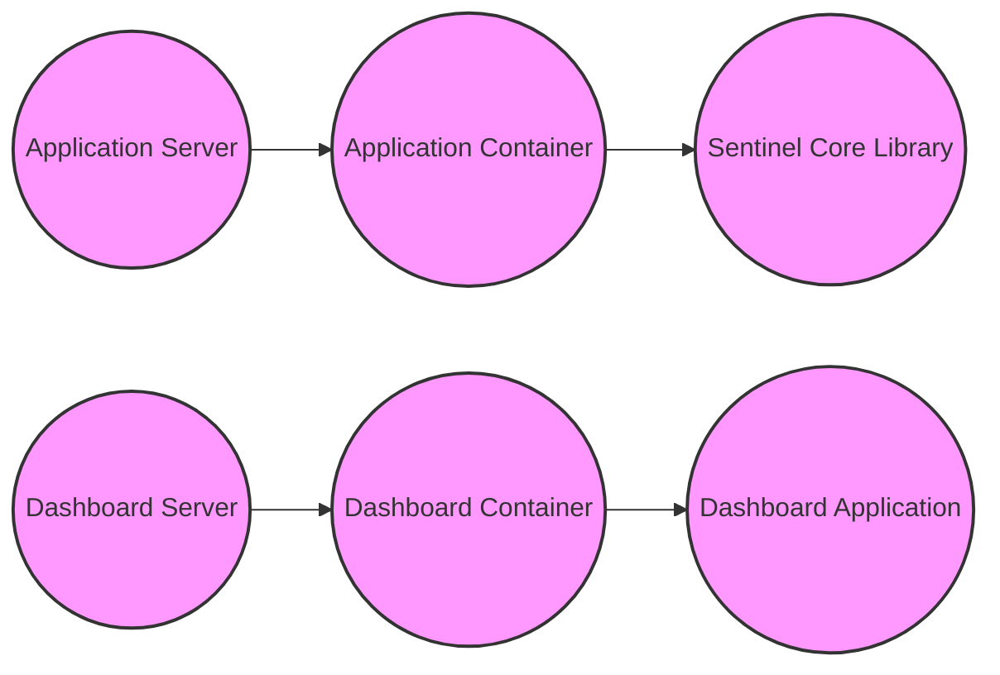
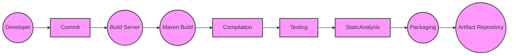

Okay, let's create a design document for the Alibaba Sentinel project.

# BUSINESS POSTURE

Sentinel is a flow control and service resilience component designed for distributed systems.  It aims to ensure service stability and availability, particularly in microservice architectures.  The core business priorities are:

*   Reliability: Ensuring services remain available and responsive even under high load or partial failures.
*   Performance: Minimizing the impact of flow control and resilience mechanisms on overall system performance.
*   Maintainability: Providing a framework that is easy to integrate, configure, and monitor.
*   Scalability: Handling increasing traffic and complexity as the system grows.
*   Observability: Providing insights into system behavior and performance metrics.

Business Risks:

*   Service Outages: The primary risk is that a service becomes unavailable or unresponsive, leading to cascading failures and impacting end-users.
*   Performance Degradation:  Poorly configured flow control or resilience rules could inadvertently degrade performance under normal conditions.
*   Complexity Overhead:  Adding Sentinel could introduce unnecessary complexity if not implemented and managed correctly.
*   Integration Challenges:  Difficulties integrating Sentinel with existing systems and frameworks could hinder adoption and effectiveness.
*   False Positives/Negatives: Incorrectly configured rules could lead to either blocking legitimate traffic (false positive) or failing to protect against actual overload (false negative).

# SECURITY POSTURE

Existing Security Controls (based on the GitHub repository and common practices):

*   security control: Dependency Management: The project uses Maven for dependency management, which allows for tracking and updating dependencies. (pom.xml)
*   security control: Code Quality Tools: The project appears to use FindBugs/SpotBugs for static analysis, as indicated by the Maven configuration. (pom.xml)
*   security control: Testing: The project includes unit and integration tests, which help ensure the correctness and stability of the code. (sentinel-core/src/test, etc.)
*   security control: Documentation: The project provides documentation on how to use and configure Sentinel, which is crucial for secure and correct implementation. (README.md, wiki)

Accepted Risks:

*   accepted risk: Limited Built-in Authentication/Authorization: Sentinel itself primarily focuses on flow control and resilience, not on authentication or authorization of end-user requests. It relies on the surrounding application and infrastructure to handle these aspects.
*   accepted risk: Configuration Complexity:  Incorrect configuration of Sentinel rules can lead to security and availability issues. This risk is mitigated by documentation and best practices, but user error remains a possibility.
*   accepted risk: Supply Chain Vulnerabilities: While dependency management is used, there's always a risk of vulnerabilities in third-party libraries. This is a common risk in software development.
*   accepted risk: Denial of Service (DoS) against Sentinel Dashboard: While Sentinel protects services, the dashboard itself could be a target for DoS attacks.

Recommended Security Controls:

*   security control: Integrate with existing Authentication/Authorization mechanisms: Ensure that Sentinel integrates seamlessly with the application's existing security framework for user authentication and authorization.
*   security control: Secure Configuration Management: Implement secure practices for storing and managing Sentinel configurations, potentially using a centralized configuration service with access controls.
*   security control: Regular Security Audits and Penetration Testing: Conduct periodic security assessments to identify and address potential vulnerabilities.
*   security control: Enhanced Input Validation: While Sentinel primarily deals with traffic flow, validating input parameters to its API and dashboard is crucial to prevent injection attacks.
*   security control: Monitor Sentinel's own resource usage: Implement monitoring to detect if Sentinel itself is becoming a bottleneck or a target of resource exhaustion attacks.
*   security control: Implement SLSA framework to improve supply chain security.

Security Requirements:

*   Authentication: Sentinel's dashboard and API should require authentication to prevent unauthorized access and configuration changes.
*   Authorization: Access to Sentinel's features (e.g., modifying rules) should be controlled based on roles and permissions.
*   Input Validation: All inputs to Sentinel's API and dashboard should be validated to prevent injection attacks and ensure data integrity.
*   Cryptography: If sensitive data is transmitted or stored (e.g., API keys), appropriate encryption mechanisms should be used.
*   Audit Logging: Sentinel should log all significant events, including configuration changes, rule violations, and security-related events.

# DESIGN

## C4 CONTEXT

Element Descriptions:

*   Element:
    *   Name: User
    *   Type: Person
    *   Description: Represents an end-user interacting with the application.
    *   Responsibilities: Accessing application features.
    *   Security controls: Authentication and authorization are typically handled by the Application.

*   Element:
    *   Name: Application
    *   Type: Software System
    *   Description: The application that is being protected by Sentinel.
    *   Responsibilities: Providing core business functionality.
    *   Security controls: Authentication, authorization, input validation, data protection.

*   Element:
    *   Name: Sentinel
    *   Type: Software System
    *   Description: The Sentinel flow control and resilience component.
    *   Responsibilities: Enforcing flow control rules, circuit breaking, and other resilience mechanisms.
    *   Security controls: Input validation for API calls, secure configuration management.

*   Element:
    *   Name: Other Services
    *   Type: Software System
    *   Description: Other services that the Application interacts with.
    *   Responsibilities: Providing supporting functionality.
    *   Security controls: Depend on the specific services.

*   Element:
    *   Name: Dashboard
    *   Type: Software System
    *   Description: The Sentinel dashboard for monitoring and configuration.
    *   Responsibilities: Providing a user interface for managing Sentinel.
    *   Security controls: Authentication, authorization, input validation.

## C4 CONTAINER

Element Descriptions:

*   Element:
    *   Name: User
    *   Type: Person
    *   Description: Represents an end-user interacting with the application.
    *   Responsibilities: Accessing application features.
    *   Security controls: Authentication and authorization are typically handled by the Application API.

*   Element:
    *   Name: Application API
    *   Type: API
    *   Description: The main entry point for the application.
    *   Responsibilities: Handling user requests, interacting with Sentinel and other services.
    *   Security controls: Authentication, authorization, input validation, rate limiting.

*   Element:
    *   Name: Sentinel Core
    *   Type: Library/Component
    *   Description: The core Sentinel library embedded within the application.
    *   Responsibilities: Enforcing flow control rules, circuit breaking.
    *   Security controls: Input validation for API calls.

*   Element:
    *   Name: Other Service Clients
    *   Type: Library/Component
    *   Description: Clients for interacting with other services.
    *   Responsibilities: Communicating with other services.
    *   Security controls: Secure communication protocols (e.g., TLS).

*   Element:
    *   Name: Other Services
    *   Type: Software System
    *   Description: Other services that the Application interacts with.
    *   Responsibilities: Providing supporting functionality.
    *   Security controls: Depend on the specific services.

*   Element:
    *   Name: Sentinel Dashboard API
    *   Type: API
    *   Description: API for the Sentinel dashboard.
    *   Responsibilities: Providing data and configuration options to the dashboard UI.
    *   Security controls: Authentication, authorization, input validation.

*   Element:
    *   Name: Dashboard UI
    *   Type: Web Application
    *   Description: User interface for the Sentinel dashboard.
    *   Responsibilities: Displaying monitoring data, allowing configuration changes.
    *   Security controls: Authentication, authorization, input validation, XSS protection.

## DEPLOYMENT

Possible Deployment Solutions:

1.  Embedded within Application: Sentinel Core is typically embedded directly within the application as a library. The dashboard can be deployed as a separate application.
2.  Sidecar: Sentinel could be deployed as a sidecar container alongside the application container. This is less common but possible.
3.  Dedicated Service: Sentinel could be deployed as a standalone service, with applications communicating with it remotely. This is also less common.

Chosen Solution (Most Common): Embedded within Application

Element Descriptions:

*    Element:
    *   Name: AppServer
    *   Type: Server
    *   Description: Server hosting application.
    *   Responsibilities: Run application container.
    *   Security controls: OS hardening, firewall.

*    Element:
    *   Name: AppContainer
    *   Type: Container
    *   Description: Container running application code.
    *   Responsibilities: Execute application logic.
    *   Security controls: Container image security, resource limits.

*    Element:
    *   Name: SentinelCoreLib
    *   Type: Library
    *   Description: Sentinel core library embedded in application.
    *   Responsibilities: Flow control, resilience.
    *   Security controls: Input validation.

*    Element:
    *   Name: DashboardServer
    *   Type: Server
    *   Description: Server hosting Sentinel dashboard.
    *   Responsibilities: Run dashboard container.
    *   Security controls: OS hardening, firewall.

*    Element:
    *   Name: DashboardContainer
    *   Type: Container
    *   Description: Container running Sentinel dashboard.
    *   Responsibilities: Serve dashboard UI.
    *   Security controls: Container image security, resource limits.

*    Element:
    *   Name: DashboardApp
    *   Type: Web Application
    *   Description: Sentinel dashboard application.
    *   Responsibilities: Provide UI for monitoring and configuration.
    *   Security controls: Authentication, authorization, input validation.

## BUILD

The Sentinel project uses Maven for build automation. The build process includes:

1.  Developer: Writes code and commits to the repository.
2.  Build Server (e.g., GitHub Actions, Jenkins): Triggered by commits, pulls the code.
3.  Maven Build: Executes Maven commands (mvn clean install).
    *   Compilation: Compiles the Java code.
    *   Testing: Runs unit and integration tests.
    *   Static Analysis: Executes FindBugs/SpotBugs for static code analysis.
    *   Packaging: Creates JAR files.
4.  Artifact Repository: The resulting JAR files are published to a Maven repository (e.g., Maven Central).

Security Controls in Build Process:

*   security control: Dependency Management (Maven): Tracks and manages dependencies, allowing for vulnerability scanning.
*   security control: Static Analysis (FindBugs/SpotBugs): Detects potential code quality and security issues.
*   security control: Automated Testing: Ensures code correctness and helps prevent regressions.
*   security control: Build Automation (Maven, GitHub Actions/Jenkins): Provides a consistent and repeatable build process.
*   security control: Artifact Repository: Securely stores build artifacts.

# RISK ASSESSMENT

Critical Business Processes:

*   Service Availability: Ensuring that services remain available and responsive to user requests.
*   Service Resilience: Maintaining service functionality even in the face of partial failures or high load.
*   Data Consistency: Protecting the consistency and integrity of data processed by the services.

Data Sensitivity:

*   Sentinel itself does not directly handle sensitive user data. However, the *configuration data* for Sentinel (rules, thresholds) is sensitive because it controls the availability and behavior of the protected services. Incorrect or malicious configuration could lead to service disruption.
*   The *monitoring data* collected by Sentinel (metrics, logs) may indirectly reveal information about application usage patterns, which could be considered sensitive in some contexts.

# QUESTIONS & ASSUMPTIONS

Questions:

*   What specific authentication and authorization mechanisms are used by the applications that will be protected by Sentinel?
*   What is the expected deployment environment (e.g., Kubernetes, cloud provider)?
*   Are there any specific compliance requirements (e.g., PCI DSS, HIPAA) that need to be considered?
*   What is the process for managing and updating Sentinel configurations in production?
*   What are the existing monitoring and alerting systems in place?
*   What level of access will Sentinel have to other services or resources?
*   Are there any specific performance requirements or SLAs for the protected services?

Assumptions:

*   BUSINESS POSTURE: The organization prioritizes service availability and resilience.
*   SECURITY POSTURE: The organization has a basic security awareness and follows some secure development practices. Existing security controls are in place at the application and infrastructure levels to handle authentication, authorization, and data protection.
*   DESIGN: Sentinel will be primarily used in a microservices environment. The Sentinel Core library will be embedded within the application. The Sentinel Dashboard will be deployed separately. The build process will use Maven and a CI/CD system.