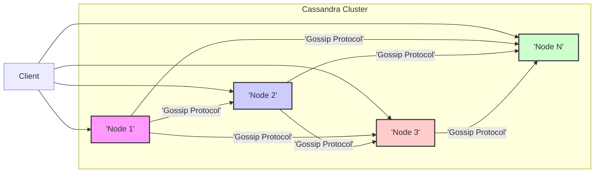
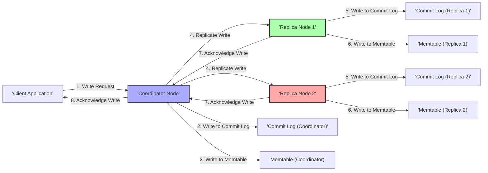
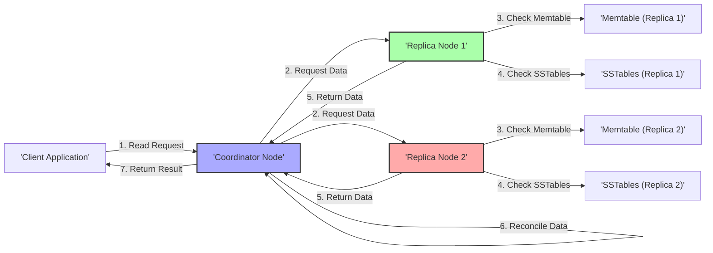

## Project Design Document: Apache Cassandra (Improved)

**1. Introduction**

This document provides an enhanced architectural overview of the Apache Cassandra database system, specifically tailored for threat modeling. It details the core components, data flow, and interactions within a Cassandra cluster, emphasizing aspects relevant to security vulnerabilities. This design focuses on the fundamental functionalities of Cassandra as represented in the linked GitHub repository.

**2. System Overview**

Apache Cassandra is a distributed, highly scalable, and fault-tolerant NoSQL database. It's designed to manage large volumes of data across numerous commodity servers, ensuring high availability without a single point of failure. Cassandra employs a peer-to-peer architecture where all nodes possess similar responsibilities.

Key characteristics of Cassandra include:

*   Decentralized, masterless architecture: Eliminates single points of failure and simplifies management.
*   Horizontal scalability: Capacity and throughput can be increased by adding more nodes to the cluster.
*   High availability and fault tolerance: Data replication across nodes ensures continued operation even during failures.
*   Tunable consistency: Offers a spectrum of consistency levels, allowing trade-offs between consistency and availability (CAP theorem).
*   Flexible schema: Supports structured, semi-structured, and unstructured data, with schema evolution capabilities.
*   Write-optimized design: Efficiently handles high-volume write operations.

**3. Key Components**

This section provides a more detailed explanation of the major components within a Cassandra cluster and their security implications.

*   **Client:** Any application, user, or service interacting with the Cassandra cluster. Clients communicate with Cassandra nodes using protocols like CQL (Cassandra Query Language) over TCP. *Security implication: Client authentication and authorization are crucial to prevent unauthorized access.*

*   **Node:** A single running instance of the Cassandra process on a server. Each node participates in data storage, routing, and cluster management. *Security implication: Securing the underlying operating system and Java Virtual Machine (JVM) is essential.*

*   **Coordinator Node:** The Cassandra node that initially receives a client request. It acts as a proxy, routing the request and aggregating responses from other nodes involved in the operation. Any node can serve as a coordinator. *Security implication: Coordinator nodes are a primary point of interaction and require robust security measures.*

*   **Data Node:** A Cassandra node responsible for storing and serving data. Each data node owns a specific range of data partitions based on the configured partitioner. *Security implication: Protecting data at rest on these nodes is paramount.*

*   **Commit Log:** A persistent, append-only log on each node. Every write operation is first written to the commit log before being applied to in-memory structures. This ensures data durability in case of crashes. *Security implication: The commit log contains sensitive data and should be protected (e.g., encryption).*

*   **Memtable:** An in-memory data structure where write operations are initially stored. Data in the memtable is sorted by partition key and clustering columns for efficient retrieval. *Security implication: While in memory, data is vulnerable to memory attacks if the node is compromised.*

*   **SSTable (Sorted Strings Table):** Immutable, on-disk data files where memtable data is periodically flushed. SSTables are sorted and indexed, optimized for efficient read operations and compaction. *Security implication: SSTables contain the persistent data and require strong access controls and potentially encryption.*

*   **Bloom Filter:** A probabilistic data structure associated with each SSTable. It's used to quickly determine if a particular key *might* exist in the SSTable, reducing unnecessary disk I/O during read operations. *Security implication: While not directly a security risk, a compromised bloom filter could lead to denial-of-service by forcing unnecessary disk reads.*

*   **Partitioner:** A function that determines which node(s) are responsible for storing a particular row of data based on its partition key. Common partitioners include Murmur3Partitioner and RandomPartitioner. *Security implication: The partitioner distribution impacts data locality and the nodes involved in a request.*

*   **Replication Strategy:** Defines how data is replicated across the cluster for fault tolerance and availability. Common strategies include SimpleStrategy and NetworkTopologyStrategy. *Security implication: Replication factor and strategy directly impact data durability and the number of nodes an attacker needs to compromise to affect data.*

*   **Gossip Protocol:** A peer-to-peer communication protocol used by Cassandra nodes to exchange information about cluster topology, node status, and data ownership. *Security implication: Securing the gossip protocol is critical to prevent malicious nodes from joining the cluster or spreading false information.*

*   **Compaction:** A background process that merges and rewrites SSTables to remove tombstones (markers for deleted data), consolidate data, and improve read performance. Different compaction strategies exist (e.g., SizeTieredCompactionStrategy, LeveledCompactionStrategy). *Security implication: Compaction involves rewriting data, and vulnerabilities in this process could lead to data corruption or exposure.*

*   **Hinted Handoff:** A mechanism where a coordinator node temporarily stores write requests destined for a down or unavailable node. When the target node becomes available, the coordinator forwards the stored hints. *Security implication: Hints contain data intended for other nodes and need to be protected during storage and transfer.*

*   **Consistency Level:** A setting that determines the number of replicas that must acknowledge a read or write operation before it is considered successful. Examples include `ONE`, `QUORUM`, `ALL`. *Security implication: Lower consistency levels offer higher availability but potentially weaker consistency guarantees, which could be exploited.*

*   **System Keyspace:** A special keyspace that stores metadata about the Cassandra cluster itself, such as schema definitions, node status, and configuration. *Security implication: Access to the system keyspace allows for significant control over the cluster and must be strictly controlled.*

**4. Data Flow**

This section provides a more detailed description of the typical flow of data during write and read operations, highlighting security-relevant steps.

**4.1. Write Operation:**

1. The client sends a write request (e.g., INSERT, UPDATE) to a coordinator node. *Security implication: This is the initial point where input validation and authorization checks should occur.*
2. The coordinator node authenticates and authorizes the client request.
3. The coordinator determines the target data nodes responsible for the data based on the partition key and the configured replication strategy.
4. The coordinator writes the data to its local commit log. *Security implication: Ensure the commit log is protected.*
5. The coordinator writes the data to its local memtable.
6. The coordinator sends the write request to the replica nodes responsible for the data. *Security implication: Communication with replica nodes should be encrypted.*
7. Replica nodes also write the data to their local commit logs and memtables.
8. Once a sufficient number of replicas (as defined by the write consistency level) acknowledge the write, the coordinator acknowledges the write to the client. *Security implication: The chosen consistency level impacts the durability and consistency guarantees.*
9. Periodically, memtables are flushed to disk as SSTables on the respective nodes.

**4.2. Read Operation:**

1. The client sends a read request (e.g., SELECT) to a coordinator node. *Security implication: Similar to writes, input validation and authorization are crucial.*
2. The coordinator node authenticates and authorizes the client request.
3. The coordinator determines the potential nodes holding the requested data.
4. The coordinator sends read requests to a sufficient number of replica nodes to satisfy the read consistency level. *Security implication: The coordinator might need to query multiple nodes depending on the consistency level.*
5. Each contacted replica node checks its memtable and relevant SSTables for the requested data. Bloom filters are used to optimize SSTable lookups.
6. The nodes return the data they find to the coordinator, along with timestamps.
7. The coordinator collects the responses and reconciles the data based on timestamps to provide the most up-to-date version, according to the chosen consistency level. *Security implication: Data reconciliation logic should be robust to prevent inconsistencies.*
8. The coordinator returns the result to the client.

**5. Security Considerations (Detailed for Threat Modeling)**

This section expands on the initial security considerations, providing more specific examples and potential threats.

*   **Client Authentication and Authorization:**
    *   **Threats:** Unauthorized data access, data modification, data deletion.
    *   **Considerations:**  Strong password policies, multi-factor authentication, integration with external authentication providers (LDAP, Kerberos), granular role-based access control (RBAC).
*   **Inter-Node Communication Security:**
    *   **Threats:** Eavesdropping, man-in-the-middle attacks, data corruption during transit, unauthorized node joining.
    *   **Considerations:**  Enforce TLS/SSL encryption for all inter-node communication, mutual authentication between nodes, secure key management for encryption certificates.
*   **Data at Rest Encryption:**
    *   **Threats:** Unauthorized access to data stored on disk in case of physical security breaches or compromised storage.
    *   **Considerations:**  Encryption of SSTable files using transparent data encryption (TDE), encryption of commit logs, secure key management for encryption keys.
*   **Network Security:**
    *   **Threats:** Unauthorized access to Cassandra ports, denial-of-service attacks, network segmentation bypass.
    *   **Considerations:**  Implement firewalls to restrict access to necessary Cassandra ports (e.g., 7000, 7001, 9042), network segmentation to isolate the Cassandra cluster, intrusion detection and prevention systems.
*   **Auditing:**
    *   **Threats:**  Lack of visibility into security events, difficulty in identifying and responding to breaches.
    *   **Considerations:**  Enable and configure audit logging to track client connections, queries, administrative actions, and security-related events. Securely store and monitor audit logs.
*   **Input Validation:**
    *   **Threats:** CQL injection attacks, data corruption due to malformed input.
    *   **Considerations:**  Implement robust input validation on the client-side and server-side to sanitize and validate all data received from clients. Use parameterized queries to prevent CQL injection.
*   **Denial of Service (DoS) Protection:**
    *   **Threats:**  Resource exhaustion attacks that make the Cassandra cluster unavailable.
    *   **Considerations:**  Implement rate limiting for client requests, configure resource limits (e.g., memory, CPU), protect against gossip storms, implement connection limits.
*   **Vulnerability Management:**
    *   **Threats:** Exploitation of known vulnerabilities in Cassandra software or underlying dependencies.
    *   **Considerations:**  Regularly update Cassandra software to the latest stable version with security patches, monitor security advisories, and patch underlying operating systems and JVMs.
*   **Secure Configuration:**
    *   **Threats:**  Exploitation of default or insecure configurations.
    *   **Considerations:**  Disable unnecessary features and ports, set strong passwords for administrative users, configure appropriate resource limits, review and harden default configurations.

**6. Diagrams**

**6.1. High-Level Architecture Diagram**

**6.2. Data Flow Diagram (Write Operation)**

**6.3. Data Flow Diagram (Read Operation)**

**7. Conclusion**

This improved document provides a more comprehensive and security-focused architectural understanding of Apache Cassandra. The detailed descriptions of components, data flow, and security considerations will serve as a valuable foundation for conducting thorough threat modeling and designing effective security controls for Cassandra deployments.
