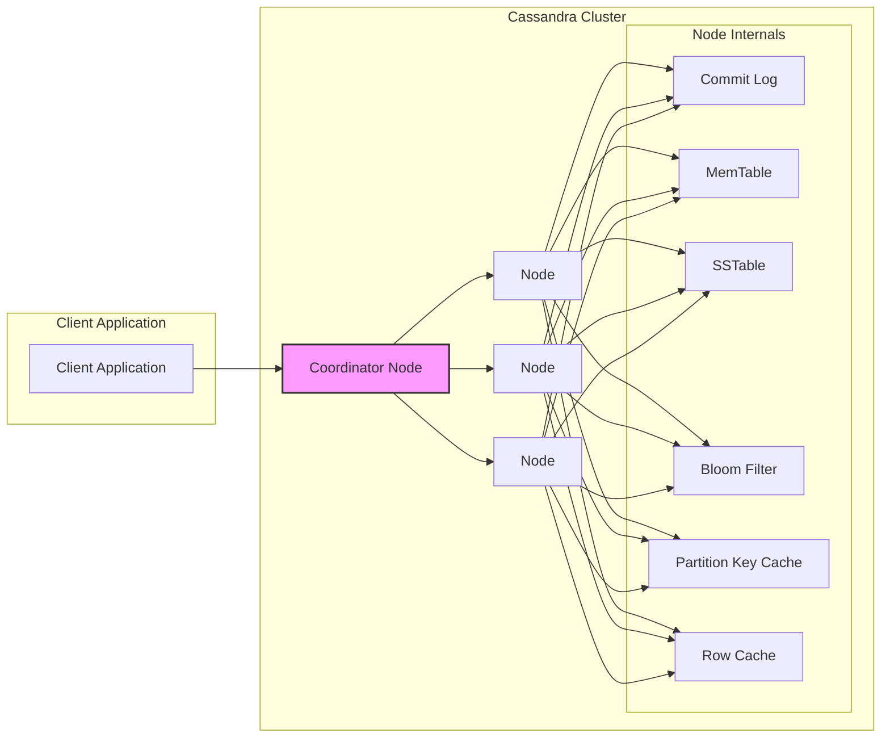

# Project Design Document: Apache Cassandra (Improved)

**Version:** 1.1
**Date:** October 26, 2023
**Author:** AI Software Architect

## 1. Introduction

This document provides an enhanced design overview of the Apache Cassandra project, specifically tailored for subsequent threat modeling activities. Building upon the previous version, this iteration offers more granular detail on key components, data flow, and architectural considerations crucial for understanding potential security vulnerabilities. The aim is to provide a robust foundation for comprehensive security analysis.

## 2. Project Overview

Apache Cassandra is a distributed, wide-column store NoSQL database designed for high availability and scalability. Its decentralized, peer-to-peer architecture ensures no single point of failure, making it suitable for applications requiring continuous uptime and the ability to handle massive datasets across commodity hardware. Cassandra's tunable consistency model allows developers to balance consistency and availability based on application needs.

## 3. Architectural Diagram

## 4. Key Components (Detailed)

This section provides a more detailed description of the major components within the Cassandra architecture, highlighting aspects relevant to security:

*   **Client Application:**  The external entity interacting with Cassandra. Security considerations include authentication methods used by the client and the permissions granted to it.
*   **Node:** A fundamental unit of the Cassandra cluster. Each node stores a portion of the data and participates in data replication and request handling. Security involves securing the operating system and Java Virtual Machine (JVM) on each node.
*   **Coordinator Node:**  The initial point of contact for client requests. Any node can act as a coordinator. It's responsible for request routing, data aggregation, and conflict resolution. Security vulnerabilities here could expose the entire cluster.
*   **Commit Log:** An append-only log on each node that durably records every write operation before it's applied to the MemTable. This ensures data durability in case of crashes. Security considerations include protecting the commit log files from unauthorized access or modification.
*   **MemTable:** An in-memory, sorted data structure where write operations are initially stored. Data is organized by partition key. While in memory, data is vulnerable to memory attacks if the node is compromised.
*   **SSTable (Sorted String Table):** Immutable, on-disk data files where MemTable data is periodically flushed. SSTables are the primary storage mechanism. Security involves data-at-rest encryption and access controls to prevent unauthorized reading or modification.
*   **Bloom Filter:** A probabilistic data structure associated with each SSTable, used to quickly determine if an SSTable *might* contain the requested data. While not directly a security risk, its efficiency impacts performance, which can be a denial-of-service consideration.
*   **Partition Key Cache:** Stores the location of partition keys within SSTables in memory, speeding up read operations. Similar to MemTable, in-memory data is vulnerable if the node is compromised.
*   **Row Cache:** Caches frequently accessed rows in memory for faster retrieval. Again, in-memory data is a potential target if a node is compromised.

## 5. Data Flow (Enhanced)

This section provides a more detailed breakdown of the data flow for read and write operations, emphasizing security touchpoints:

### 5.1. Write Operation (Detailed)

1. **Client Request:** The client application sends a write request (e.g., INSERT, UPDATE) to a **Coordinator Node**. This communication channel should be secured (e.g., using TLS/SSL).
2. **Authentication and Authorization:** The Coordinator Node authenticates the client (if authentication is enabled) and verifies if the client has the necessary permissions to perform the write operation on the target keyspace and table.
3. **Write to Commit Log:** The Coordinator Node forwards the write request to the nodes responsible for the data (based on the partition key and replication strategy). Each responsible node **first writes the data to its local Commit Log**. This is a critical step for durability. Access control to the commit log files is essential.
4. **Write to MemTable:** After the commit log write is successful, the data is written to the **MemTable** in memory on the responsible nodes.
5. **Acknowledgement:** The responsible nodes send an acknowledgement to the Coordinator Node.
6. **Client Response:** The Coordinator Node sends an acknowledgement back to the client application.
7. **MemTable Flush:** Periodically, or when the MemTable reaches a certain size, its contents are flushed to disk as an immutable **SSTable**. This process involves sorting the data.

### 5.2. Read Operation (Detailed)

1. **Client Request:** The client application sends a read request (e.g., SELECT) to a **Coordinator Node**. Secure communication is important here.
2. **Authentication and Authorization:** The Coordinator Node authenticates the client and verifies read permissions for the requested data.
3. **Request Routing:** The Coordinator Node determines which nodes hold the replicas of the requested data based on the partition key.
4. **Data Retrieval:** The Coordinator Node queries the relevant nodes. Each node checks:
    *   **MemTable:**  Checks if the data is present in the in-memory MemTable.
    *   **Bloom Filter:** Consults the Bloom Filter for each SSTable to quickly rule out SSTables that don't contain the requested data.
    *   **SSTables:** Reads data from the relevant SSTables on disk. This involves disk I/O and is a potential area for performance-based attacks.
    *   **Caches:** Checks the **Partition Key Cache** and **Row Cache** for faster retrieval.
5. **Data Merging:** The Coordinator Node receives data fragments from the queried nodes. It merges these fragments, handling potential inconsistencies based on the configured consistency level.
6. **Client Response:** The Coordinator Node sends the merged result back to the client application.

## 6. Security Considerations (Comprehensive)

This section expands on the security considerations relevant for threat modeling:

*   **Client Authentication:** Mechanisms for verifying the identity of clients connecting to the Cassandra cluster. Options include:
    *   **Password Authentication:** Basic username/password authentication.
    *   **Kerberos Authentication:** Integration with Kerberos for centralized authentication.
    *   **LDAP Authentication:** Integration with LDAP directories for user management.
    *   **Mutual TLS (mTLS):**  Authenticating both the client and the server using certificates.
*   **Client Authorization:** Controlling what actions authenticated clients are permitted to perform. This includes:
    *   **Role-Based Access Control (RBAC):** Assigning permissions to roles and then assigning users to roles.
    *   **Granular Permissions:** Defining permissions at the keyspace, table, and even column level.
*   **Inter-Node Communication Security:** Securing communication between nodes within the cluster to prevent eavesdropping and tampering:
    *   **Internode TLS Encryption:** Encrypting all communication between Cassandra nodes.
    *   **Authentication between Nodes:** Ensuring that only authorized nodes can join the cluster.
*   **Data-at-Rest Encryption:** Protecting data stored on disk:
    *   **Encryption of SSTables:** Encrypting the SSTable files.
    *   **Encryption of Commit Logs:** Encrypting the commit log files.
    *   **Transparent Data Encryption (TDE):**  Encrypting data transparently at the storage layer.
*   **Network Security:** Securing the network infrastructure hosting the Cassandra cluster:
    *   **Firewalls:** Restricting network access to the Cassandra ports.
    *   **Network Segmentation:** Isolating the Cassandra cluster within a secure network segment.
*   **Auditing:** Tracking and logging security-related events:
    *   **Audit Logging:** Recording actions such as login attempts, schema changes, and data access.
*   **Input Validation:**  Sanitizing and validating data received from clients to prevent injection attacks.
*   **Vulnerability Management:** Regularly patching and updating Cassandra to address known security vulnerabilities.
*   **Secure Configuration:**  Properly configuring Cassandra settings to enhance security (e.g., disabling unnecessary features, setting strong passwords).
*   **Resource Limits:** Configuring resource limits to prevent denial-of-service attacks.
*   **Backup and Recovery:** Implementing secure backup and recovery procedures to protect against data loss.

## 7. Technology Stack

*   **Programming Language:** Java
*   **Storage Engine:** Custom built, distributed, and highly performant.
*   **Communication Protocol:**  Binary protocol over TCP, with support for TLS/SSL.
*   **Configuration:** Primarily YAML-based configuration files.
*   **Monitoring and Management:** JMX (Java Management Extensions), command-line tools (cqlsh), and various monitoring integrations.

## 8. Deployment Model

*   **On-Premise:** Self-managed deployment on physical or virtual servers within an organization's infrastructure.
*   **Cloud-Based:** Deployment on cloud platforms (AWS, Azure, GCP) using virtual machines or managed Cassandra services.
*   **Containerized:** Deployment using containerization technologies like Docker and orchestration platforms like Kubernetes, offering scalability and portability.

## 9. Assumptions and Constraints

*   This document describes the general architecture of Apache Cassandra. Specific implementations and configurations may vary.
*   Security features and their effectiveness depend on proper configuration and maintenance.
*   The threat model will need to consider the specific deployment environment, configuration, and potential third-party integrations.

## 10. Future Considerations

*   Detailed analysis of specific security features' implementation and configuration options.
*   Identification of potential attack vectors targeting each component and data flow.
*   Evaluation of the security implications of different consistency levels and replication strategies.
*   Assessment of the security of client drivers and their interaction with the Cassandra cluster.

This improved design document provides a more detailed and security-focused overview of Apache Cassandra, serving as a more robust foundation for subsequent threat modeling activities.