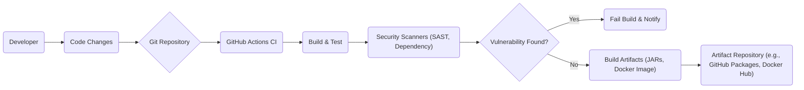
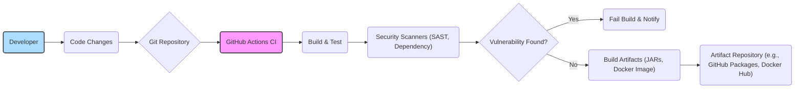

# BUSINESS POSTURE

This project, Apache Cassandra, aims to provide a highly scalable, distributed, and fault-tolerant NoSQL database management system. It is designed to handle large amounts of data across many commodity servers, providing high availability with no single point of failure.

Business priorities and goals:
- Provide a highly available and fault-tolerant database solution.
- Offer linear scalability to handle growing data volumes and user traffic.
- Ensure operational simplicity for managing large-scale deployments.
- Support flexible data modeling and fast read/write operations.
- Maintain an open-source and community-driven project.

Most important business risks:
- Data loss or corruption due to system failures or misconfigurations.
- Unauthorized access to sensitive data stored in the database.
- Performance degradation or service unavailability due to security vulnerabilities or attacks.
- Compliance violations related to data privacy and security regulations.
- Loss of user trust and adoption due to security incidents.

# SECURITY POSTURE

Existing security controls:
- security control Authentication mechanisms (e.g., PasswordAuthenticator, KerberosAuthenticator, AllowAllAuthenticator). Implemented within Cassandra codebase and configuration.
- security control Authorization framework (Role-Based Access Control - RBAC). Implemented within Cassandra codebase and configuration.
- security control Data encryption in transit using TLS/SSL. Configurable within Cassandra.
- security control Data encryption at rest (transparent data encryption). Configurable within Cassandra.
- security control Audit logging of security-related events. Configurable within Cassandra.
- security control Input validation on client requests to prevent injection attacks. Implemented within Cassandra codebase.
- security control Secure inter-node communication using authentication and encryption. Configurable within Cassandra.

Accepted risks:
- accepted risk Complexity of security configuration can lead to misconfigurations if not properly managed.
- accepted risk Reliance on users to properly configure and manage security features.
- accepted risk Potential vulnerabilities in third-party dependencies.
- accepted risk Performance overhead of encryption and security features.

Recommended security controls:
- security control Implement automated security vulnerability scanning of the codebase and dependencies during development.
- security control Conduct regular penetration testing and security audits of Cassandra deployments.
- security control Enhance default security configurations and provide security hardening guides.
- security control Improve security logging and monitoring capabilities for proactive threat detection.
- security control Implement and enforce secure coding practices throughout the development lifecycle.

Security requirements:
- Authentication:
    - Requirement: Support strong authentication mechanisms to verify the identity of users and applications accessing Cassandra.
    - Requirement: Integrate with existing enterprise authentication systems (e.g., LDAP, Active Directory).
    - Requirement: Implement multi-factor authentication for privileged access.
- Authorization:
    - Requirement: Implement fine-grained access control to manage permissions for different users and roles.
    - Requirement: Enforce the principle of least privilege for all users and applications.
    - Requirement: Provide mechanisms to audit and review access control configurations.
- Input validation:
    - Requirement: Validate all inputs from clients and external systems to prevent injection attacks (e.g., CQL injection).
    - Requirement: Sanitize and encode outputs to prevent cross-site scripting (XSS) vulnerabilities if Cassandra UI components are present.
    - Requirement: Implement input validation at multiple layers of the application.
- Cryptography:
    - Requirement: Use strong cryptographic algorithms and protocols for data encryption in transit and at rest.
    - Requirement: Properly manage cryptographic keys and secrets.
    - Requirement: Ensure compliance with relevant cryptographic standards and regulations.

# DESIGN

## C4 CONTEXT

```mermaid
flowchart LR
    subgraph "Organization"
        A("User Application")
        B("Monitoring System")
        C("Backup System")
    end
    D("Apache Cassandra"):::software
    E("Developers"):::person

    A -->> D: Uses Data
    B -->> D: Monitors
    C -->> D: Backups Data
    E -->> D: Develops and Operates

    style D software
    style E person
```

```mermaid
%% C4 Context Diagram Description
graph LR
    subgraph Organization
        style UserApplication fill:#f9f,stroke:#333,stroke-width:2px
        UserApplication("User Application")
        style MonitoringSystem fill:#f9f,stroke:#333,stroke-width:2px
        MonitoringSystem("Monitoring System")
        style BackupSystem fill:#f9f,stroke:#333,stroke-width:2px
        BackupSystem("Backup System")
    end
    style ApacheCassandra fill:#ccf,stroke:#333,stroke-width:2px
    ApacheCassandra("Apache Cassandra")
    style Developers fill:#adf,stroke:#333,stroke-width:2px
    Developers("Developers")

    UserApplication -->> ApacheCassandra: Uses Data
    MonitoringSystem -->> ApacheCassandra: Monitors
    BackupSystem -->> ApacheCassandra: Backups Data
    Developers -->> ApacheCassandra: Develops and Operates

    classDef software fill:#ccf,stroke:#333,stroke-width:2px
    classDef person fill:#adf,stroke:#333,stroke-width:2px
```

Context Diagram Elements:

- Element:
    - Name: User Application
    - Type: Software System
    - Description: Applications developed by users or organizations that require a database to store and retrieve data. These applications interact with Cassandra to perform various operations.
    - Responsibilities:
        - Sending data queries and commands to Cassandra.
        - Receiving and processing data from Cassandra.
        - Implementing application-level security controls.
    - Security controls:
        - security control Application-level authentication and authorization.
        - security control Input validation before sending data to Cassandra.
        - security control Secure communication channels to Cassandra (e.g., TLS).

- Element:
    - Name: Monitoring System
    - Type: Software System
    - Description: Systems used to monitor the health, performance, and security of the Cassandra cluster. These systems collect metrics and logs from Cassandra nodes.
    - Responsibilities:
        - Collecting metrics from Cassandra nodes (e.g., CPU usage, memory usage, latency).
        - Aggregating and visualizing monitoring data.
        - Alerting administrators about potential issues.
    - Security controls:
        - security control Secure access to monitoring data and dashboards.
        - security control Authentication and authorization for accessing monitoring APIs.
        - security control Encryption of monitoring data in transit and at rest.

- Element:
    - Name: Backup System
    - Type: Software System
    - Description: Systems responsible for backing up Cassandra data for disaster recovery and data protection purposes.
    - Responsibilities:
        - Periodically backing up Cassandra data.
        - Storing backups securely.
        - Restoring data from backups in case of failures.
    - Security controls:
        - security control Secure storage of backups (encryption at rest).
        - security control Access control to backups.
        - security control Integrity checks for backups.

- Element:
    - Name: Apache Cassandra
    - Type: Software System
    - Description: The Apache Cassandra distributed NoSQL database system itself. It is the central component of this design.
    - Responsibilities:
        - Storing and managing data in a distributed and fault-tolerant manner.
        - Handling client requests for data read and write operations.
        - Ensuring data consistency and availability.
        - Providing security features like authentication, authorization, and encryption.
    - Security controls:
        - security control Authentication and authorization mechanisms.
        - security control Data encryption in transit and at rest.
        - security control Audit logging.
        - security control Input validation.
        - security control Secure inter-node communication.

- Element:
    - Name: Developers
    - Type: Person
    - Description: Individuals or teams responsible for developing, deploying, and operating Cassandra clusters and applications that use Cassandra.
    - Responsibilities:
        - Developing applications that interact with Cassandra.
        - Configuring and managing Cassandra clusters.
        - Monitoring and troubleshooting Cassandra deployments.
        - Implementing security best practices for Cassandra.
    - Security controls:
        - security control Secure access to Cassandra configuration and management tools.
        - security control Training on secure Cassandra development and operations.
        - security control Access control to production Cassandra environments.

## C4 CONTAINER

```mermaid
flowchart LR
    subgraph "Apache Cassandra"
        subgraph "Node"
            A("Client Coordinator"):::container
            B("Storage Engine"):::container
            C("Gossip Service"):::container
            D("Commit Log"):::container
            E("Memtable"):::container
            F("SSTable"):::container
            G("Internode Communication"):::container
        end
    end

    style A container
    style B container
    style C container
    style D container
    style E container
    style F container
    style G container

    A -->> B: Data requests
    A -->> G: Inter-node communication
    B -->> D: Write operations
    B -->> E: Write operations
    B -->> F: Read/Write operations
    C -->> G: Cluster state
```

```mermaid
%% C4 Container Diagram Description
graph LR
    subgraph ApacheCassandra
        subgraph Node
            style ClientCoordinator fill:#f9f,stroke:#333,stroke-width:2px
            ClientCoordinator("Client Coordinator")
            style StorageEngine fill:#f9f,stroke:#333,stroke-width:2px
            StorageEngine("Storage Engine")
            style GossipService fill:#f9f,stroke:#333,stroke-width:2px
            GossipService("Gossip Service")
            style CommitLog fill:#f9f,stroke:#333,stroke-width:2px
            CommitLog("Commit Log")
            style Memtable fill:#f9f,stroke:#333,stroke-width:2px
            Memtable("Memtable")
            style SSTable fill:#f9f,stroke:#333,stroke-width:2px
            SSTable("SSTable")
            style InternodeCommunication fill:#f9f,stroke:#333,stroke-width:2px
            InternodeCommunication("Internode Communication")
        end
    end

    ClientCoordinator -->> StorageEngine: Data requests
    ClientCoordinator -->> InternodeCommunication: Inter-node communication
    StorageEngine -->> CommitLog: Write operations
    StorageEngine -->> Memtable: Write operations
    StorageEngine -->> SSTable: Read/Write operations
    GossipService -->> InternodeCommunication: Cluster state

    classDef container fill:#f9f,stroke:#333,stroke-width:2px
```

Container Diagram Elements:

- Element:
    - Name: Client Coordinator
    - Type: Container (Cassandra Component)
    - Description: The entry point for client requests to a Cassandra node. It handles request routing, authentication, authorization, and query processing.
    - Responsibilities:
        - Accepting client connections and requests.
        - Authenticating and authorizing clients.
        - Parsing and routing queries to the appropriate nodes.
        - Coordinating data retrieval and updates across nodes.
    - Security controls:
        - security control Client authentication mechanisms.
        - security control Role-Based Access Control (RBAC).
        - security control Input validation for client requests.
        - security control TLS/SSL for client connections.

- Element:
    - Name: Storage Engine
    - Type: Container (Cassandra Component)
    - Description: Responsible for managing data storage and retrieval on disk. It handles write operations to Commit Log and Memtable, and reads from SSTables.
    - Responsibilities:
        - Writing data to Commit Log for durability.
        - Writing data to Memtable (in-memory table).
        - Flushing Memtables to SSTables (on-disk sorted tables).
        - Reading data from SSTables.
        - Compacting SSTables to optimize storage and read performance.
    - Security controls:
        - security control Data encryption at rest (transparent data encryption).
        - security control Access control to SSTable files.
        - security control Integrity checks for SSTables.

- Element:
    - Name: Gossip Service
    - Type: Container (Cassandra Component)
    - Description: A peer-to-peer communication protocol used by Cassandra nodes to discover each other and maintain cluster membership and state information.
    - Responsibilities:
        - Node discovery and membership management.
        - Dissemination of cluster state information (e.g., topology, schema).
        - Failure detection and node removal.
    - Security controls:
        - security control Authentication for inter-node communication.
        - security control Encryption for inter-node communication.
        - security control Access control to gossip information.

- Element:
    - Name: Commit Log
    - Type: Container (Cassandra Component)
    - Description: A persistent, append-only log of all write operations. It ensures data durability in case of node failures.
    - Responsibilities:
        - Persisting all write operations before they are applied to Memtable.
        - Replaying uncommitted operations during node recovery.
    - Security controls:
        - security control Access control to Commit Log files.
        - security control Encryption of Commit Log data.
        - security control Integrity checks for Commit Log.

- Element:
    - Name: Memtable
    - Type: Container (Cassandra Component)
    - Description: An in-memory data structure that buffers write operations before they are flushed to SSTables.
    - Responsibilities:
        - Storing recent write operations in memory.
        - Providing fast read access to recently written data.
        - Periodically flushing data to SSTables.
    - Security controls:
        - security control Memory protection mechanisms.
        - security control Secure handling of sensitive data in memory.

- Element:
    - Name: SSTable (Sorted String Table)
    - Type: Container (Cassandra Component)
    - Description: On-disk data files that store sorted data. SSTables are immutable and are the primary storage format for Cassandra data.
    - Responsibilities:
        - Persistently storing sorted data on disk.
        - Providing efficient read access to data.
        - Participating in data compaction processes.
    - Security controls:
        - security control Access control to SSTable files.
        - security control Data encryption at rest within SSTables.
        - security control Integrity checks for SSTables.

- Element:
    - Name: Internode Communication
    - Type: Container (Cassandra Component)
    - Description: Handles communication between Cassandra nodes for data replication, consistency, and cluster management.
    - Responsibilities:
        - Data replication across nodes.
        - Coordination of distributed transactions.
        - Cluster state synchronization.
        - Handling node failures and recoveries.
    - Security controls:
        - security control Authentication for inter-node communication.
        - security control Encryption for inter-node communication.
        - security control Secure protocols for inter-node communication.

## DEPLOYMENT

Deployment Solution: Cloud-based Deployment on Kubernetes

```mermaid
flowchart LR
    subgraph "Kubernetes Cluster"
        subgraph "Nodes"
            subgraph "Node 1"
                A("Cassandra Pod 1"):::deployment_node
            end
            subgraph "Node 2"
                B("Cassandra Pod 2"):::deployment_node
            end
            subgraph "Node 3"
                C("Cassandra Pod 3"):::deployment_node
            end
        end
        D("Kubernetes Services"):::deployment_k8s_service
        E("Persistent Volumes"):::deployment_storage
    end
    F("Client Application"):::deployment_external

    F -->> D: Connects to Service
    D -->> A: Routes to Pods
    D -->> B: Routes to Pods
    D -->> C: Routes to Pods
    A -->> E: Uses Storage
    B -->> E: Uses Storage
    C -->> E: Uses Storage

    style A deployment_node
    style B deployment_node
    style C deployment_node
    style D deployment_k8s_service
    style E deployment_storage
    style F deployment_external
```

```mermaid
%% Deployment Diagram Description - Kubernetes
graph LR
    subgraph KubernetesCluster
        subgraph Nodes
            subgraph Node1
                style CassandraPod1 fill:#f9f,stroke:#333,stroke-width:2px
                CassandraPod1("Cassandra Pod 1")
            end
            subgraph Node2
                style CassandraPod2 fill:#f9f,stroke:#333,stroke-width:2px
                CassandraPod2("Cassandra Pod 2")
            end
            subgraph Node3
                style CassandraPod3 fill:#f9f,stroke:#333,stroke-width:2px
                CassandraPod3("Cassandra Pod 3")
            end
        end
        style KubernetesServices fill:#f9f,stroke:#333,stroke-width:2px
        KubernetesServices("Kubernetes Services")
        style PersistentVolumes fill:#f9f,stroke:#333,stroke-width:2px
        PersistentVolumes("Persistent Volumes")
    end
    style ClientApplication fill:#adf,stroke:#333,stroke-width:2px
    ClientApplication("Client Application")

    ClientApplication -->> KubernetesServices: Connects to Service
    KubernetesServices -->> CassandraPod1: Routes to Pods
    KubernetesServices -->> CassandraPod2: Routes to Pods
    KubernetesServices -->> CassandraPod3: Routes to Pods
    CassandraPod1 -->> PersistentVolumes: Uses Storage
    CassandraPod2 -->> PersistentVolumes: Uses Storage
    CassandraPod3 -->> PersistentVolumes: Uses Storage

    classDef deployment_node fill:#f9f,stroke:#333,stroke-width:2px
    classDef deployment_k8s_service fill:#f9f,stroke:#333,stroke-width:2px
    classDef deployment_storage fill:#f9f,stroke:#333,stroke-width:2px
    classDef deployment_external fill:#adf,stroke:#333,stroke-width:2px
```

Deployment Diagram Elements:

- Element:
    - Name: Cassandra Pod 1, 2, 3
    - Type: Kubernetes Pod
    - Description: Kubernetes Pods running Cassandra containers. Each pod represents a Cassandra node in the cluster.
    - Responsibilities:
        - Running a Cassandra instance.
        - Storing data on persistent volumes.
        - Participating in the Cassandra cluster.
    - Security controls:
        - security control Container image security scanning.
        - security control Kubernetes Network Policies to restrict network access.
        - security control Pod Security Policies/Admission Controllers to enforce security configurations.
        - security control Resource limits and quotas to prevent resource exhaustion.

- Element:
    - Name: Kubernetes Services
    - Type: Kubernetes Service
    - Description: Kubernetes Services provide a stable endpoint for client applications to connect to the Cassandra cluster. They load balance traffic across Cassandra pods.
    - Responsibilities:
        - Exposing Cassandra to client applications.
        - Load balancing client requests across Cassandra pods.
        - Service discovery within the Kubernetes cluster.
    - Security controls:
        - security control Network Policies to control access to the service.
        - security control Kubernetes RBAC to control access to service resources.
        - security control TLS/SSL termination at the service level (optional).

- Element:
    - Name: Persistent Volumes
    - Type: Kubernetes Persistent Volume
    - Description: Persistent volumes provide durable storage for Cassandra data. They are decoupled from the lifecycle of pods and ensure data persistence across pod restarts and failures.
    - Responsibilities:
        - Providing persistent storage for Cassandra data.
        - Ensuring data durability and availability.
    - Security controls:
        - security control Encryption at rest for persistent volumes (cloud provider specific).
        - security control Access control to persistent volumes.
        - security control Backup and recovery mechanisms for persistent volumes.

- Element:
    - Name: Kubernetes Cluster
    - Type: Kubernetes Cluster
    - Description: The underlying Kubernetes cluster infrastructure that hosts the Cassandra deployment.
    - Responsibilities:
        - Orchestrating and managing Cassandra pods.
        - Providing networking and storage infrastructure.
        - Ensuring high availability and scalability of the Cassandra deployment.
    - Security controls:
        - security control Kubernetes cluster security hardening.
        - security control Kubernetes RBAC for cluster access control.
        - security control Network segmentation and firewalling for the cluster.
        - security control Regular security patching and updates for the cluster.

- Element:
    - Name: Client Application
    - Type: External System
    - Description: Applications running outside the Kubernetes cluster that connect to and use the Cassandra database.
    - Responsibilities:
        - Connecting to the Cassandra service endpoint.
        - Sending data requests to Cassandra.
        - Receiving and processing data from Cassandra.
    - Security controls:
        - security control Client-side authentication and authorization.
        - security control Secure communication channels to Cassandra (TLS/SSL).
        - security control Input validation before sending data to Cassandra.

## BUILD





Build Process Description:

- Element:
    - Name: Developer
    - Type: Person
    - Description: Software developers who write and modify the Cassandra codebase.
    - Responsibilities:
        - Writing code and implementing new features.
        - Fixing bugs and addressing security vulnerabilities.
        - Committing code changes to the Git repository.
    - Security controls:
        - security control Secure development environment.
        - security control Code review process.
        - security control Training on secure coding practices.
        - security control Access control to code repositories.

- Element:
    - Name: Code Changes
    - Type: Artifact
    - Description: Modifications to the Cassandra codebase made by developers.
    - Responsibilities:
        - Representing new features, bug fixes, or security patches.
        - Undergoing code review and testing.
    - Security controls:
        - security control Version control using Git.
        - security control Code review process to identify potential security issues.

- Element:
    - Name: Git Repository (GitHub)
    - Type: System
    - Description: The central repository for the Cassandra source code, hosted on GitHub.
    - Responsibilities:
        - Storing and managing the codebase.
        - Tracking code changes and versions.
        - Facilitating collaboration among developers.
    - Security controls:
        - security control Access control to the repository (authentication and authorization).
        - security control Audit logging of repository activities.
        - security control Branch protection policies.

- Element:
    - Name: GitHub Actions CI
    - Type: CI/CD System
    - Description: GitHub Actions is used for continuous integration and continuous delivery. It automates the build, test, and security scanning processes.
    - Responsibilities:
        - Automating the build process.
        - Running unit and integration tests.
        - Performing security scans (SAST, dependency checks).
        - Publishing build artifacts.
    - Security controls:
        - security control Secure configuration of CI/CD pipelines.
        - security control Access control to CI/CD workflows and secrets.
        - security control Regular security audits of CI/CD infrastructure.

- Element:
    - Name: Build & Test
    - Type: Process
    - Description: The process of compiling the Cassandra code and running automated tests to ensure code quality and functionality.
    - Responsibilities:
        - Compiling the source code.
        - Running unit tests and integration tests.
        - Generating build artifacts.
    - Security controls:
        - security control Secure build environment.
        - security control Dependency management and vulnerability scanning.
        - security control Automated testing to detect functional and security issues.

- Element:
    - Name: Security Scanners (SAST, Dependency)
    - Type: Security Tool
    - Description: Static Application Security Testing (SAST) and dependency scanning tools are used to identify potential security vulnerabilities in the codebase and dependencies.
    - Responsibilities:
        - Performing static code analysis to identify vulnerabilities.
        - Scanning dependencies for known vulnerabilities.
        - Generating security reports.
    - Security controls:
        - security control Regularly updated vulnerability databases.
        - security control Configuration of scanners to detect relevant vulnerabilities.
        - security control Integration of scanner results into the build process.

- Element:
    - Name: Vulnerability Found?
    - Type: Decision Point
    - Description: A decision point in the build process based on the results of security scans.
    - Responsibilities:
        - Evaluating security scan results.
        - Determining if vulnerabilities are critical enough to fail the build.
    - Security controls:
        - security control Defined thresholds for vulnerability severity.
        - security control Automated or manual review of vulnerability findings.

- Element:
    - Name: Fail Build & Notify
    - Type: Process
    - Description: If critical vulnerabilities are found, the build process is failed, and developers are notified to address the issues.
    - Responsibilities:
        - Stopping the build process.
        - Notifying developers about vulnerabilities.
        - Preventing vulnerable code from being deployed.
    - Security controls:
        - security control Automated build failure mechanism.
        - security control Notification system for developers.

- Element:
    - Name: Build Artifacts (JARs, Docker Image)
    - Type: Artifact
    - Description: The output of the build process, including JAR files, Docker images, and other distributable components.
    - Responsibilities:
        - Packaging the compiled code and dependencies.
        - Creating distributable artifacts.
    - Security controls:
        - security control Signing of build artifacts to ensure integrity.
        - security control Secure storage of build artifacts.

- Element:
    - Name: Artifact Repository (e.g., GitHub Packages, Docker Hub)
    - Type: System
    - Description: A repository for storing and managing build artifacts, such as JAR files and Docker images.
    - Responsibilities:
        - Storing build artifacts securely.
        - Providing access to build artifacts for deployment.
        - Versioning and managing artifacts.
    - Security controls:
        - security control Access control to the artifact repository.
        - security control Audit logging of artifact access.
        - security control Vulnerability scanning of stored artifacts.

# RISK ASSESSMENT

Critical business processes we are trying to protect:
- Data storage and retrieval: Ensuring the availability, integrity, and confidentiality of data stored in Cassandra.
- Database operations: Maintaining the operational stability and performance of the Cassandra database to support applications.
- Cluster management: Securing the management and administration of the Cassandra cluster to prevent unauthorized modifications or disruptions.

Data we are trying to protect and their sensitivity:
- Customer data: Depending on the application, Cassandra might store sensitive customer information (PII, financial data, etc.). Sensitivity is high, requiring strong confidentiality and integrity controls.
- Application data: Data generated and used by applications. Sensitivity depends on the application and data type.
- Operational data: Logs, metrics, and configuration data related to Cassandra operations. Sensitivity is medium, as exposure could reveal system vulnerabilities or operational details.
- Authentication credentials and secrets: Keys, passwords, and other secrets used for authentication and encryption. Sensitivity is critical, requiring strong protection to prevent unauthorized access and data breaches.

# QUESTIONS & ASSUMPTIONS

Questions:
- What are the specific compliance requirements for organizations using Apache Cassandra (e.g., GDPR, HIPAA, PCI DSS)?
- What are the typical deployment environments for Cassandra (on-premise, cloud, hybrid)?
- What are the common attack vectors targeting Cassandra deployments?
- What are the performance implications of enabling different security features in Cassandra?
- What are the best practices for security monitoring and incident response for Cassandra clusters?

Assumptions:
- BUSINESS POSTURE: The primary business goal is to provide a highly available, scalable, and secure database solution. Security is a critical non-functional requirement.
- SECURITY POSTURE: Cassandra implements basic security controls like authentication, authorization, and encryption, but further hardening and proactive security measures are needed.
- DESIGN: The design assumes a typical distributed Cassandra architecture with multiple nodes, client coordinators, storage engines, and supporting components. Deployment is assumed to be cloud-based on Kubernetes for scalability and manageability. Build process includes automated security checks in CI/CD pipeline.