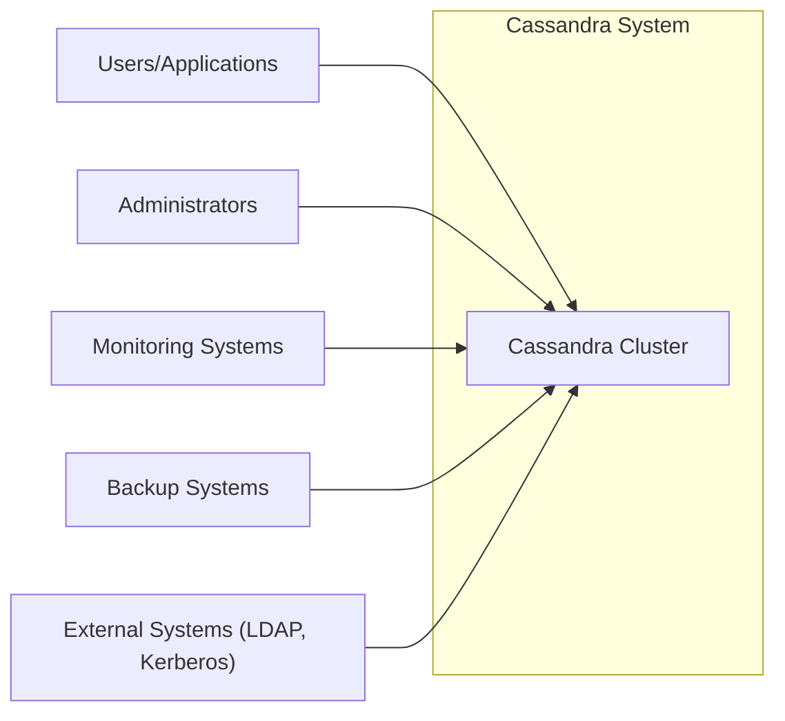
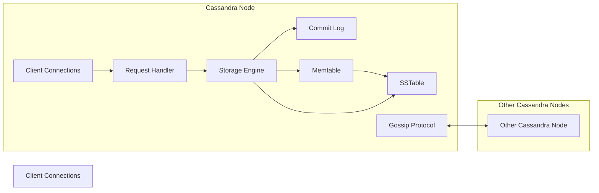
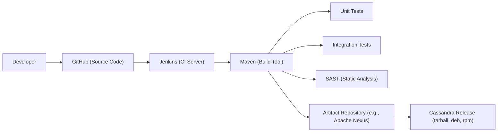

# BUSINESS POSTURE

Business Priorities and Goals:

*   Provide a highly available and scalable database solution.
*   Offer a decentralized, fault-tolerant architecture for mission-critical data.
*   Support high-volume, high-velocity data ingestion and retrieval.
*   Provide a flexible data model (schema-optional) that can adapt to evolving application needs.
*   Maintain a strong open-source community and ecosystem.
*   Offer tunable consistency levels to meet different application requirements.
*   Minimize operational overhead and administrative burden.

Most Important Business Risks:

*   Data loss or corruption due to hardware failures, software bugs, or operational errors.
*   Service unavailability leading to application downtime and business disruption.
*   Unauthorized data access or modification due to security vulnerabilities.
*   Performance degradation or bottlenecks impacting application responsiveness.
*   Inability to scale to meet growing data volume and user demand.
*   Complexity of management and configuration leading to operational errors.
*   Lack of skilled personnel to manage and maintain the Cassandra cluster.

# SECURITY POSTURE

Existing Security Controls:

*   security control: Authentication: Cassandra supports multiple authentication mechanisms, including internal authentication (using passwords), LDAP, and Kerberos. This is described in the Cassandra documentation and configuration files.
*   security control: Authorization: Cassandra provides role-based access control (RBAC) to manage permissions on database objects (keyspaces, tables, etc.). This is managed through Cassandra's `GRANT` and `REVOKE` commands and roles management.
*   security control: Client-to-node encryption: Cassandra supports TLS/SSL encryption for communication between clients and Cassandra nodes. Configuration details are in `cassandra.yaml`.
*   security control: Node-to-node encryption: Cassandra supports TLS/SSL encryption for inter-node communication. Configuration details are in `cassandra.yaml`.
*   security control: JMX access control: Cassandra uses JMX for management and monitoring. Access to JMX can be secured using password authentication and SSL.
*   security control: Auditing: Cassandra can be configured to log various events, including authentication successes and failures, schema changes, and permission changes. This is configured in `cassandra.yaml` and related audit logging configuration files.
*   security control: Transparent Data Encryption (TDE): DSE (DataStax Enterprise, a commercial distribution) offers TDE, but the open-source Apache Cassandra project does not natively support encryption at rest. Users often rely on OS-level or disk-level encryption.

Accepted Risks:

*   accepted risk: Lack of native encryption at rest in Apache Cassandra. This means data stored on disk is not encrypted by default in the open-source version. Mitigation often relies on external tools or operating system features.
*   accepted risk: Potential for misconfiguration of security features. Cassandra's security features require careful configuration. Mistakes can lead to vulnerabilities.
*   accepted risk: Complexity of managing a distributed database. Cassandra's distributed nature introduces complexities in security management, requiring expertise to configure and maintain securely.

Recommended Security Controls:

*   security control: Implement OS-level or disk-level encryption to provide encryption at rest. This mitigates the accepted risk of no native encryption at rest.
*   security control: Regularly review and update Cassandra configurations, especially security-related settings, to address potential misconfigurations.
*   security control: Implement a robust monitoring and alerting system to detect and respond to security incidents promptly.
*   security control: Conduct regular security audits and penetration testing to identify and address vulnerabilities.
*   security control: Use a dedicated, secured network segment for inter-node communication.
*   security control: Implement strong password policies and regularly rotate credentials.

Security Requirements:

*   Authentication:
    *   All client connections must be authenticated.
    *   Support for strong authentication mechanisms (e.g., Kerberos, LDAP).
    *   Enforce password complexity and rotation policies.
*   Authorization:
    *   Implement granular access control using RBAC.
    *   Follow the principle of least privilege.
    *   Regularly review and audit user permissions.
*   Input Validation:
    *   While Cassandra itself doesn't directly handle "input" in the same way as a web application, data types are enforced at the schema level. Ensure appropriate data types are used to prevent injection-like attacks at the application level.
    *   Applications interacting with Cassandra should perform input validation to prevent malicious data from being stored.
*   Cryptography:
    *   Use TLS/SSL for all client-to-node and node-to-node communication.
    *   Use strong cipher suites and regularly update TLS/SSL configurations.
    *   If using OS-level or disk-level encryption, use strong encryption algorithms (e.g., AES-256).

# DESIGN

## C4 CONTEXT



Element Descriptions:

*   Element:
    *   Name: Cassandra Cluster
    *   Type: System
    *   Description: The distributed database system itself, comprising multiple nodes.
    *   Responsibilities: Storing data, processing queries, ensuring data consistency and availability.
    *   Security controls: Authentication, authorization, client-to-node encryption, node-to-node encryption, JMX access control, auditing.

*   Element:
    *   Name: Users/Applications
    *   Type: User
    *   Description: Applications or users that interact with the Cassandra cluster to store and retrieve data.
    *   Responsibilities: Sending requests to Cassandra, processing responses.
    *   Security controls: Authenticate to Cassandra, use secure communication channels (TLS/SSL).

*   Element:
    *   Name: Administrators
    *   Type: User
    *   Description: Individuals responsible for managing and maintaining the Cassandra cluster.
    *   Responsibilities: Configuring Cassandra, monitoring performance, performing backups, managing security.
    *   Security controls: Authenticate to Cassandra with strong credentials, use secure communication channels, adhere to the principle of least privilege.

*   Element:
    *   Name: Monitoring Systems
    *   Type: System
    *   Description: Systems that collect metrics and logs from the Cassandra cluster for performance monitoring and troubleshooting.
    *   Responsibilities: Collecting data from Cassandra, providing dashboards and alerts.
    *   Security controls: Secure communication with Cassandra (e.g., using JMX over SSL), access control to monitoring data.

*   Element:
    *   Name: Backup Systems
    *   Type: System
    *   Description: Systems used to create and restore backups of the Cassandra data.
    *   Responsibilities: Creating backups, storing backups securely, restoring backups when needed.
    *   Security controls: Secure communication with Cassandra, secure storage of backup data (encryption), access control to backup systems.

*   Element:
    *   Name: External Systems (LDAP, Kerberos)
    *   Type: System
    *   Description: External systems used for authentication and authorization.
    *   Responsibilities: Authenticating users, providing authorization information.
    *   Security controls: Secure communication with Cassandra, secure configuration of LDAP/Kerberos.

## C4 CONTAINER

Since Cassandra is a single, albeit distributed, application, the container diagram is essentially an expanded view of the context diagram, focusing on the internal components of a Cassandra node.



Element Descriptions:

*   Element:
    *   Name: Client Connections
    *   Type: Container
    *   Description: Handles incoming connections from clients.
    *   Responsibilities: Accepting connections, authenticating clients, routing requests.
    *   Security controls: Authentication (using configured mechanisms), TLS/SSL encryption.

*   Element:
    *   Name: Request Handler
    *   Type: Container
    *   Description: Processes client requests (reads and writes).
    *   Responsibilities: Parsing requests, coordinating with the storage engine, returning results.
    *   Security controls: Authorization (checking permissions).

*   Element:
    *   Name: Storage Engine
    *   Type: Container
    *   Description: Manages data storage and retrieval.
    *   Responsibilities: Writing data to the commit log and memtable, flushing memtables to SSTables, reading data from SSTables.
    *   Security controls: None directly, relies on OS-level security and file permissions.

*   Element:
    *   Name: Commit Log
    *   Type: Container
    *   Description: A persistent log of all write operations.
    *   Responsibilities: Ensuring data durability in case of crashes.
    *   Security controls: None directly, relies on OS-level security and file permissions.

*   Element:
    *   Name: Memtable
    *   Type: Container
    *   Description: An in-memory data structure that buffers writes.
    *   Responsibilities: Storing recent writes, providing fast read access to recent data.
    *   Security controls: None directly.

*   Element:
    *   Name: SSTable
    *   Type: Container
    *   Description: Sorted String Tables - immutable data files on disk.
    *   Responsibilities: Storing data persistently.
    *   Security controls: None directly in open-source Cassandra, relies on OS-level security and file permissions. DSE can use TDE.

*   Element:
    *   Name: Gossip Protocol
    *   Type: Container
    *   Description: A peer-to-peer communication protocol used for node discovery and cluster management.
    *   Responsibilities: Sharing node status information, detecting failures.
    *   Security controls: Node-to-node encryption (TLS/SSL).

*   Element:
      * Name: Other Cassandra Node
      * Type: Container
      * Description: Represents another node in Cassandra cluster.
      * Responsibilities: Same as Cassandra Node.
      * Security controls: Same as Cassandra Node.

## DEPLOYMENT

Cassandra can be deployed in various ways:

1.  **Bare Metal:** Directly on physical servers.
2.  **Virtual Machines:** On VMs in a private or public cloud.
3.  **Containers (e.g., Docker):** Within containers, often orchestrated by Kubernetes.
4.  **Cloud Provider Managed Services:** Using managed Cassandra offerings like Amazon Keyspaces or Azure Cosmos DB for Apache Cassandra.

We'll describe deployment using **Kubernetes**, as it's a common and robust approach.

```mermaid
graph LR
    subgraph Kubernetes Cluster
        subgraph Namespace (cassandra)
            CassandraPod1["Cassandra Pod 1"]
            CassandraPod2["Cassandra Pod 2"]
            CassandraPod3["Cassandra Pod 3"]
            Storage1["Persistent Volume 1"]
            Storage2["Persistent Volume 2"]
            Storage3["Persistent Volume 3"]
            Service["Cassandra Service"]
        end
        Ingress["Ingress Controller"] --> Service
    end
    Client["Client Application"] --> Ingress
    CassandraPod1 --> Storage1
    CassandraPod2 --> Storage2
    CassandraPod3 --> Storage3
    CassandraPod1 <--> CassandraPod2
    CassandraPod1 <--> CassandraPod3
    CassandraPod2 <--> CassandraPod3

```

Element Descriptions:

*   Element:
    *   Name: Kubernetes Cluster
    *   Type: Deployment Environment
    *   Description: The Kubernetes cluster where Cassandra is deployed.
    *   Responsibilities: Orchestrating containers, managing resources, providing networking.
    *   Security controls: Kubernetes RBAC, network policies, pod security policies, secrets management.

*   Element:
    *   Name: Namespace (cassandra)
    *   Type: Logical Grouping
    *   Description: A Kubernetes namespace dedicated to the Cassandra deployment.
    *   Responsibilities: Isolating Cassandra resources from other applications.
    *   Security controls: Network policies to restrict traffic to/from the namespace.

*   Element:
    *   Name: Cassandra Pod (1, 2, 3)
    *   Type: Container Instance
    *   Description: A Kubernetes pod running a Cassandra container.
    *   Responsibilities: Running a single instance of the Cassandra database.
    *   Security controls: Container image security (scanning for vulnerabilities), resource limits, pod security context.

*   Element:
    *   Name: Persistent Volume (1, 2, 3)
    *   Type: Storage
    *   Description: Persistent storage for each Cassandra pod.
    *   Responsibilities: Providing durable storage for Cassandra data.
    *   Security controls: Encryption at rest (if supported by the storage provider), access controls on the storage.

*   Element:
    *   Name: Cassandra Service
    *   Type: Service
    *   Description: A Kubernetes service that provides a stable endpoint for accessing the Cassandra cluster.
    *   Responsibilities: Load balancing traffic across Cassandra pods.
    *   Security controls: Network policies to control access to the service.

*   Element:
    *   Name: Ingress Controller
    *   Type: Load Balancer
    *   Description: An ingress controller that manages external access to the Cassandra service.
    *   Responsibilities: Routing external traffic to the Cassandra service.
    *   Security controls: TLS termination, access control rules.

*   Element:
    *   Name: Client Application
    *   Type: External Application
    *   Description: An application outside the Kubernetes cluster that connects to Cassandra.
    *   Responsibilities: Interacting with the Cassandra database.
    *   Security controls: Authenticate to Cassandra, use secure communication (TLS).

## BUILD

Cassandra's build process is managed through Apache Maven. The source code is hosted on GitHub, and continuous integration is likely performed using Jenkins (based on historical information; the Apache project uses a variety of tools, and specifics can change).



Build Process Security Controls:

*   security control: Source Code Management: GitHub provides access control, code review mechanisms, and branch protection rules.
*   security control: Build Automation: Jenkins automates the build process, ensuring consistency and repeatability.
*   security control: Dependency Management: Maven manages dependencies, but it's crucial to use tools like OWASP Dependency-Check to identify and mitigate vulnerabilities in third-party libraries.
*   security control: Static Analysis (SAST): SAST tools (e.g., FindBugs, SpotBugs, SonarQube) can be integrated into the Maven build process to identify potential security vulnerabilities in the code.
*   security control: Unit and Integration Tests: Comprehensive tests help ensure the correctness and security of the code.
*   security control: Artifact Repository: A secure artifact repository (e.g., Apache Nexus) is used to store and manage build artifacts. Access control and integrity checks are important.
*   security control: Supply Chain Security: While not explicitly shown in the diagram, efforts are ongoing in the open-source community to improve supply chain security, including signing releases and providing SBOMs (Software Bill of Materials).

# RISK ASSESSMENT

Critical Business Processes:

*   Data storage and retrieval for applications relying on Cassandra.
*   Real-time data processing and analytics (if applicable).
*   Maintaining high availability and fault tolerance for mission-critical applications.

Data Sensitivity:

*   The sensitivity of the data stored in Cassandra depends entirely on the applications using it. Cassandra itself doesn't inherently know the sensitivity of the data.
*   Data sensitivity can range from non-sensitive (e.g., public data) to highly sensitive (e.g., PII, financial data, healthcare data).
*   Applications using Cassandra are responsible for classifying and protecting data appropriately, using techniques like encryption and access control.

# QUESTIONS & ASSUMPTIONS

Questions:

*   What specific compliance requirements (e.g., GDPR, HIPAA, PCI DSS) apply to the applications using Cassandra? This will influence the necessary security controls.
*   What are the specific performance and scalability requirements for the Cassandra cluster?
*   What is the expected data volume and growth rate?
*   What are the existing security policies and procedures within the organization?
*   What level of expertise is available for managing and maintaining Cassandra?
*   Are there any specific external systems (besides LDAP/Kerberos) that Cassandra needs to integrate with?
*   What is the specific CI/CD pipeline used for building and deploying Cassandra (confirming Jenkins usage and details)?
*   What specific SAST/DAST tools are used, if any?
*   What is the process for vulnerability management and patching?

Assumptions:

*   BUSINESS POSTURE: The organization prioritizes data availability and scalability, but also recognizes the importance of data security.
*   SECURITY POSTURE: The organization has a basic understanding of security best practices and is willing to invest in necessary security controls.
*   DESIGN: The deployment will use Kubernetes, and the build process will leverage Maven and a CI/CD system (assumed to be Jenkins). The organization will implement OS-level or disk-level encryption to compensate for the lack of native encryption at rest in open-source Cassandra.