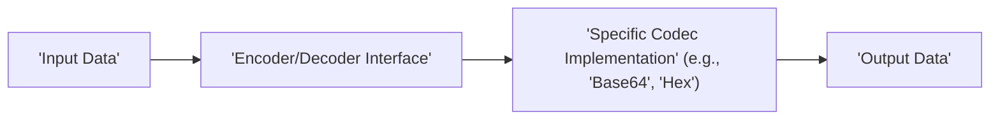
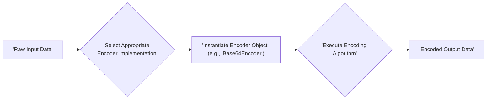
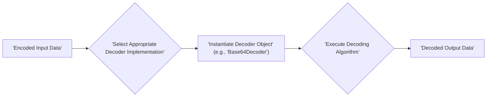

# Project Design Document: Apache Commons Codec Library

**Version:** 1.1
**Date:** October 26, 2023
**Author:** AI Software Architect

## 1. Introduction

This document provides an enhanced design overview of the Apache Commons Codec library, specifically tailored for threat modeling activities. It details the library's architecture, key components, and data flow, aiming to provide a solid foundation for identifying potential security vulnerabilities and risks. This document is intended to be a living artifact, updated as the library evolves.

## 2. Project Overview

The Apache Commons Codec library offers a collection of widely used encoding and decoding algorithms, including Base64, Hexadecimal, URL encoding, and various phonetic encoding schemes. Its primary goal is to provide reusable, reliable, and efficient components for data transformation within Java applications.

### 2.1. Goals

*   Deliver a comprehensive and performant suite of encoding and decoding algorithms.
*   Maintain a simple and intuitive API for seamless integration by developers.
*   Ensure platform independence and broad compatibility across Java environments.
*   Minimize external dependencies to enhance stability and reduce the attack surface.

### 2.2. Scope

This design document focuses on the core encoding and decoding functionalities of the library. It emphasizes architectural elements and data pathways that are pertinent to security analysis and threat identification. Auxiliary utilities are mentioned where relevant to security considerations.

### 2.3. Target Audience

This document is primarily intended for:

*   Security engineers responsible for conducting threat modeling and security assessments.
*   Software developers who utilize or integrate the Apache Commons Codec library into their applications.
*   System architects involved in designing systems that incorporate the library.

## 3. Architectural Design

The Apache Commons Codec library adopts a modular architecture, where individual encoding and decoding algorithms are implemented as distinct components. The design centers around interfaces and abstract classes that define the common behavior expected from encoders and decoders, promoting extensibility and maintainability.

### 3.1. High-Level Architecture Diagram

### 3.2. Key Components

*   **`Encoder` Interface:**  Defines the fundamental contract for encoding operations. Implementations accept raw data and produce its encoded representation.
*   **`Decoder` Interface:** Defines the fundamental contract for decoding operations. Implementations accept encoded data and produce its original raw form.
*   **Abstract Base Classes:**
    *   `AbstractStringEncoder`: Provides a skeletal implementation for encoders that operate on String inputs.
    *   `AbstractStringDecoder`: Provides a skeletal implementation for decoders that operate on String inputs.
*   **Concrete Codec Implementations:**
    *   `Base64`: Implements the Base64 encoding and decoding scheme as defined by RFC 2045 and other related standards.
    *   `Hex`: Implements hexadecimal encoding and decoding, converting between byte arrays and their hexadecimal string representation.
    *   `URLCodec`: Implements URL encoding (also known as percent-encoding) and decoding, as specified in RFC 3986.
    *   `DigestUtils`: Offers utility methods for creating cryptographic message digests (hashes) using algorithms like MD5 and SHA-1. While not strictly encoding/decoding, it's a part of the library and relevant for integrity and security considerations.
    *   `BinaryCodec`: Provides functionalities for converting between binary data (byte arrays) and other data types, such as strings of '0' and '1'.
    *   Phonetic Encoders:
        *   `Soundex`: Implements the Soundex algorithm for phonetic encoding of English names.
        *   `Metaphone`: An improvement over Soundex, designed to be more accurate for English words.
        *   `DoubleMetaphone`: A further refinement of Metaphone, providing two phonetic encodings for a word.
*   **Utility Classes and Interfaces:** Provide supporting functionalities and constants used across various codec implementations, promoting code reuse and consistency. Examples include helper methods for byte manipulation and character encoding.

### 3.3. Data Flow

The general data flow within the library follows a consistent pattern, regardless of the specific codec being used:

1. **Input Acquisition:** The application provides the data to be encoded or decoded to an instance of a specific codec implementation. This data can be in the form of byte arrays, strings, or other supported data types.
2. **Codec Invocation:** The application calls the appropriate `encode()` or `decode()` method of the chosen codec implementation.
3. **Data Transformation:** The codec implementation applies its specific algorithm to transform the input data. This involves a series of steps depending on the encoding/decoding scheme.
4. **Output Generation:** The encoder produces the encoded data, and the decoder produces the decoded data. The output format typically corresponds to the input format (e.g., byte array to byte array, string to string).

#### 3.3.1. Detailed Encoding Data Flow

#### 3.3.2. Detailed Decoding Data Flow

### 3.4. Key Interactions

*   **Application Interaction via API:** Applications interact with the library by creating instances of specific encoder or decoder classes and invoking their `encode()` or `decode()` methods. The API is designed to be straightforward and easy to use.
*   **Internal Component Collaboration:** Different codec implementations might leverage shared utility classes within the library for common tasks, such as handling character encodings or performing bitwise operations. This promotes code reuse and reduces redundancy.

## 4. Security Considerations for Threat Modeling

This section outlines potential security concerns and attack vectors that should be thoroughly investigated during threat modeling.

*   **Input Validation Vulnerabilities:**
    *   **Malformed Input Handling:** How do decoders handle invalid or malformed encoded input? Can providing such input lead to exceptions, crashes, or unexpected behavior that could be exploited? For example, providing non-Base64 characters to a Base64 decoder.
    *   **Injection Attacks:** While less common in encoding/decoding libraries, are there any scenarios where specially crafted input could be interpreted as commands or control sequences by downstream systems after decoding? Consider edge cases in URL decoding.
    *   **Denial of Service (DoS):** Can excessively large or specially crafted input cause the library to consume excessive resources (CPU, memory), leading to a denial of service?
*   **Output Encoding Issues:**
    *   **Incorrect Encoding:** Does the library guarantee that the encoded output adheres to the relevant standards and specifications? Incorrect encoding could lead to misinterpretation by receiving systems.
    *   **Canonicalization Issues:** In URL encoding, are there potential issues with different encoded forms of the same URL leading to security bypasses?
*   **Algorithm-Specific Vulnerabilities:**
    *   **Cryptographic Weaknesses:** For `DigestUtils`, are the hashing algorithms used still considered secure against collision attacks or preimage attacks?  The use of older algorithms like MD5 should be flagged as a potential risk.
    *   **Side-Channel Attacks:** Are the implementations of encoding/decoding algorithms susceptible to timing attacks or other side-channel attacks that could leak information about the input data?
*   **Dependency-Related Risks:**
    *   **Transitive Dependencies:** While the core library has minimal dependencies, are there any optional modules or build-time dependencies that could introduce vulnerabilities?
*   **Error Handling and Information Disclosure:**
    *   **Verbose Error Messages:** Do error messages reveal sensitive information about the internal workings of the library or the input data?
    *   **Exception Handling:** Are exceptions handled gracefully to prevent information leakage or unexpected program termination?
*   **State Management and Thread Safety:**
    *   **Stateful Codecs:** Do any of the codec implementations maintain internal state that could be vulnerable to manipulation or lead to inconsistent behavior in multi-threaded environments?
    *   **Thread Safety:** Is the library thread-safe if used concurrently by multiple threads? Are there any potential race conditions or synchronization issues?
*   **Phonetic Encoding Specific Concerns:**
    *   **Information Leakage:** Could phonetic encoding inadvertently reveal sensitive information based on phonetic similarities between different inputs?
    *   **Algorithm Weaknesses:** Are there known weaknesses in the specific phonetic algorithms that could be exploited?

## 5. Dependencies

The Apache Commons Codec library is designed to be lightweight and has very few external runtime dependencies. This is a significant security advantage as it reduces the potential attack surface introduced by third-party libraries.

*   **Runtime Dependencies:** The core library has **no mandatory external runtime dependencies** beyond the standard Java Class Library (JDK). This minimizes the risk of introducing vulnerabilities through external components.
*   **Optional Dependencies:** Certain optional features or less commonly used functionalities might have specific dependencies. These should be carefully reviewed if those features are utilized.
*   **Build Dependencies:** The build process relies on standard Java development tools like Maven. Security considerations for the build environment are separate but important for supply chain security.

## 6. Deployment Considerations

The Apache Commons Codec library is typically deployed as a JAR file that is included in the classpath of a Java application. Its security is intrinsically linked to how it is integrated and used within the application.

*   **Integration Points as Attack Vectors:**  The points where the library receives input and produces output are potential attack vectors. Careful validation and sanitization of data before encoding and after decoding are crucial.
*   **Configuration Security:** The library generally does not require extensive configuration. Any configuration options, if present, should be reviewed for potential security implications.
*   **Context of Use:** The security requirements for the library will vary depending on the context in which it is used. For example, encoding data for transmission over an untrusted network requires more stringent security considerations than encoding data for internal processing.

## 7. Future Considerations

While not directly impacting the current security posture, understanding future development plans can help anticipate potential future security considerations.

*   **New Algorithm Implementations:** Adding support for new encoding or hashing algorithms might introduce new security challenges that need to be addressed.
*   **Performance Optimizations:** Changes made for performance reasons should be carefully reviewed to ensure they do not introduce security vulnerabilities.
*   **API Enhancements:** Modifications to the API should maintain or improve the security and ease of secure usage.

## 8. Conclusion

This enhanced design document provides a detailed and security-focused overview of the Apache Commons Codec library. It highlights the key architectural components, data flow, and potential security considerations relevant for threat modeling. The library's modular design and minimal dependencies are positive security attributes. However, a thorough threat modeling exercise, focusing on input validation, output encoding, algorithm-specific weaknesses, and the context of use, is essential to identify and mitigate potential security risks effectively. This document serves as a valuable resource for security engineers and developers working with the Apache Commons Codec library.
