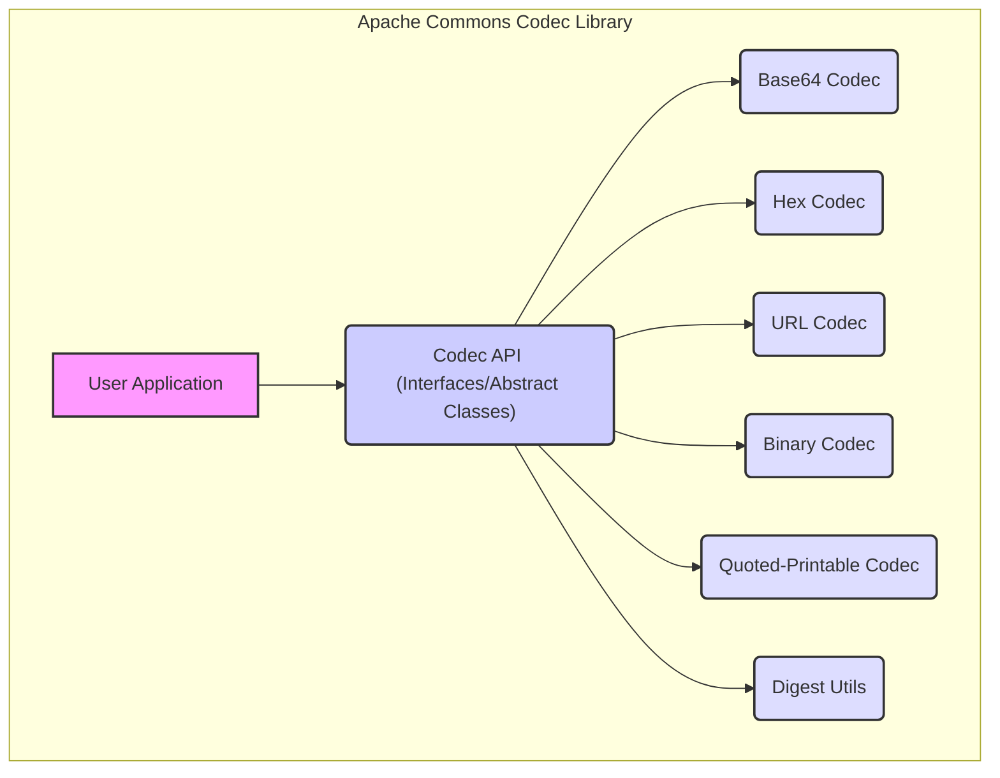
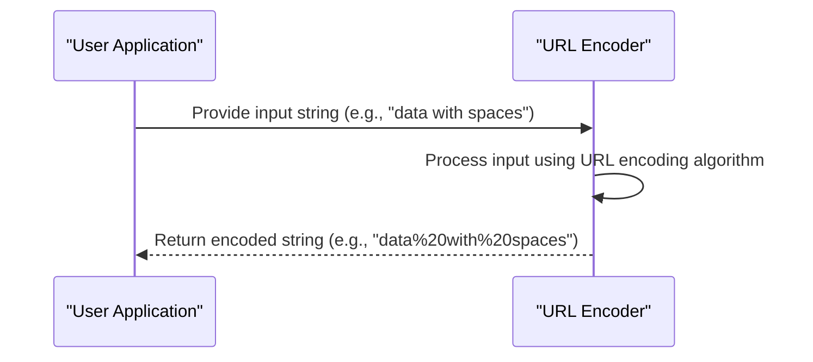

# Project Design Document: Apache Commons Codec

**Version:** 1.1
**Date:** October 26, 2023
**Author:** Gemini (AI Language Model)

## 1. Introduction

This document provides an enhanced design overview of the Apache Commons Codec library, specifically tailored for subsequent threat modeling activities. It aims to offer a clear and comprehensive understanding of the library's architecture, components, and functionalities to identify potential security vulnerabilities and attack surfaces. This document serves as a foundational reference for security analysis and risk assessment.

## 2. Project Overview

Apache Commons Codec offers robust and well-tested implementations of common encoding and decoding algorithms, such as Base64, Hexadecimal, and URL encoding. It's a utility library designed for seamless integration into Java projects, providing developers with reliable tools for data transformation.

**Goals:**

* Deliver a dependable and reusable collection of encoding and decoding algorithms.
* Offer a consistent, well-documented, and thoroughly tested API for standard codec operations.
* Maintain a lightweight design with minimal external dependencies to reduce the attack surface.
* Guarantee platform independence within the Java runtime environment.

**Non-Goals:**

* Implementing cryptographic encryption or decryption functionalities; its focus is on data representation transformations, not security through secrecy.
* Providing sophisticated data compression algorithms; its purpose is encoding, not reducing data size.
* Directly handling specific file formats or network protocols; it offers building blocks for such operations.

## 3. System Architecture

The Apache Commons Codec library employs a modular architecture centered around distinct encoding/decoding algorithms. The library's core comprises interfaces and abstract classes that define the standardized contract for encoders and decoders. Concrete implementations of these interfaces furnish the specific logic for various encoding schemes.

**Key Architectural Components:**

* **Codec API (Interfaces and Abstract Classes):**
    * Defines fundamental interfaces like `"Encoder"` and `"Decoder"`, specifying methods for encoding and decoding data, respectively.
    * Offers abstract classes that provide base implementations and shared functionalities for specific codec types, promoting code reuse.
* **Concrete Codec Implementations:**
    * **"Base64 Codec":** Implements Base64 encoding and decoding according to relevant RFC specifications, handling various Base64 schemes.
    * **"Hex Codec":** Implements hexadecimal encoding and decoding, converting between binary data and its hexadecimal representation.
    * **"URL Codec":** Implements URL encoding and decoding (percent-encoding) as defined in RFC 3986, crucial for web-based applications.
    * **"Binary Codec":** Provides utility functions for manipulating binary data, including basic encoding and decoding operations.
    * **"Quoted-Printable Codec":** Implements quoted-printable encoding and decoding, commonly used in email systems.
* **Digest Utilities ("Digest Utils"):**
    * Offers utility methods for calculating cryptographic message digests (hashes) using algorithms like MD5 and SHA families. While not strictly encoding/decoding, they are related to data integrity verification.

## 4. Component Details

This section elaborates on the key components within the Apache Commons Codec library, providing a deeper understanding of their functionalities.

* **`org.apache.commons.codec.Encoder` and `org.apache.commons.codec.Decoder` Interfaces:**
    * The `"Encoder"` interface declares the `encode(Object)` method, which accepts an object and returns its encoded representation. Implementations must handle potential `EncoderException`.
    * The `"Decoder"` interface declares the `decode(Object)` method, which accepts an encoded object and returns its decoded form. Implementations must handle potential `DecoderException`.
    * These interfaces establish the core contract for all encoding and decoding operations within the library, ensuring a consistent API.

* **`org.apache.commons.codec.BinaryEncoder` and `org.apache.commons.codec.BinaryDecoder` Interfaces:**
    * Extend the base `"Encoder"` and `"Decoder"` interfaces specifically for processing byte arrays, the fundamental unit of binary data.
    * Define `encode(byte[])` and `decode(byte[])` methods, streamlining operations on binary data.

* **`org.apache.commons.codec.StringEncoder` and `org.apache.commons.codec.StringDecoder` Interfaces:**
    * Extend the base `"Encoder"` and `"Decoder"` interfaces for handling String objects, facilitating encoding and decoding of textual data.
    * Define `encode(String)` and `decode(String)` methods, commonly used for text-based encoding schemes.

* **`org.apache.commons.codec.net.URLCodec`:**
    * Implements URL encoding and decoding as specified in RFC 3986, crucial for safely transmitting data within URLs.
    * Handles the conversion of unsafe characters into their percent-encoded equivalents, preventing misinterpretations by web servers and browsers.

* **`org.apache.commons.codec.binary.Base64`:**
    * Offers both static methods and a class for performing Base64 encoding and decoding, a widely used scheme for representing binary data in ASCII string format.
    * Supports various Base64 flavors and configurations, such as MIME and PEM, catering to different application needs.

* **`org.apache.commons.codec.binary.Hex`:**
    * Provides methods for converting between byte arrays and their hexadecimal string representations, useful for debugging and data inspection.

* **`org.apache.commons.codec.digest.DigestUtils`:**
    * Contains static methods for generating cryptographic message digests (hashes) using algorithms like MD5, SHA-1, SHA-256, SHA-384, and SHA-512.
    * Accepts input as byte arrays or input streams, offering flexibility in handling data sources. It's important to note the security implications of choosing specific digest algorithms.

* **`org.apache.commons.codec.net.QuotedPrintableCodec`:**
    * Implements the quoted-printable encoding scheme, primarily used to represent 8-bit data within 7-bit environments, such as email bodies.

## 5. Data Flow

The typical data flow within the library involves a user application invoking an encoder or decoder with input data, triggering a transformation process.

**Encoding Process:**

1. The user application provides input data (e.g., a String or byte array) to a specific encoder instance.
2. The encoder's `encode()` method processes the input data according to its defined algorithm, potentially throwing an `EncoderException` if an error occurs.
3. The encoded representation of the data is returned to the user application.

**Decoding Process:**

1. The user application provides encoded data (e.g., a String or byte array) to a corresponding decoder instance.
2. The decoder's `decode()` method reverses the encoding process based on its algorithm, potentially throwing a `DecoderException` if an error occurs.
3. The original, decoded representation of the data is returned to the user application.

**Example Data Flow (URL Encoding):**

## 6. External Interactions

Apache Commons Codec, being a utility library, primarily interacts with the Java environment and the applications that utilize it.

**Dependencies:**

* **`java.base` (Standard Java Library):** The library relies on core Java functionalities provided by the standard library.

**APIs:**

* The primary interaction is through the library's public API, encompassing the interfaces and concrete codec implementations. Developers utilize these classes and methods to perform encoding and decoding operations within their applications.

## 7. Deployment Considerations

Apache Commons Codec is typically deployed as a dependency within other Java applications. Developers include the library's JAR file in their project's build path (e.g., using Maven or Gradle). The library itself doesn't necessitate any specific deployment environment or configuration beyond a standard Java runtime environment. Its lightweight nature ensures minimal overhead.

## 8. Security Considerations (Detailed for Threat Modeling)

This section provides a more in-depth look at security considerations relevant for threat modeling activities.

* **Input Validation Vulnerabilities:**  While Commons Codec performs encoding and decoding, it does *not* inherently validate the semantic correctness or safety of the input data. Applications using the library must implement robust input validation *before* encoding and *after* decoding to prevent vulnerabilities such as:
    * **Injection Attacks:** If decoded data is directly used in SQL queries or commands without sanitization, it could lead to SQL injection or command injection.
    * **Cross-Site Scripting (XSS):** If decoded data is displayed on a web page without proper escaping, it could lead to XSS vulnerabilities.
* **Output Handling Vulnerabilities:**  Applications must handle the encoded or decoded output securely to prevent issues like:
    * **Information Disclosure:** Incorrectly handling encoded data might inadvertently reveal sensitive information.
    * **Data Integrity Issues:** If encoded data is tampered with during transmission and the receiving application doesn't verify its integrity after decoding, it could lead to the processing of corrupted data.
* **Denial of Service (DoS) Attacks:** Although the encoding/decoding algorithms in Commons Codec are generally efficient, processing extremely large inputs could potentially lead to resource exhaustion (CPU or memory). Applications should implement safeguards against processing excessively large data.
* **Dependency Vulnerabilities:**  While Commons Codec has minimal external dependencies, it's crucial to stay updated with the latest versions to mitigate any potential vulnerabilities in its dependencies or within the library itself. Regularly scanning dependencies for known vulnerabilities is recommended.
* **Digest Algorithm Security Risks:**  When using `DigestUtils`, the choice of hashing algorithm is critical.
    * **Collision Attacks:** Algorithms like MD5 and SHA-1 are considered cryptographically broken for many security-sensitive applications due to their susceptibility to collision attacks. Using them where collision resistance is required can have severe security implications. SHA-256 or stronger algorithms are generally recommended for new applications.
    * **Preimage Attacks:** While less of a concern for common use cases, understanding the resistance of the chosen algorithm to preimage attacks is important in specific scenarios.
* **Error Handling and Exception Management:**  Applications should properly handle `EncoderException` and `DecoderException` to prevent unexpected behavior or security vulnerabilities arising from unhandled errors during the encoding/decoding process. Logging these exceptions appropriately is also crucial for debugging and security monitoring.
* **Configuration and Parameterization:** Some codecs might offer configuration options (e.g., Base64 with different line separators). Incorrect configuration could lead to interoperability issues or, in some cases, security vulnerabilities if not handled carefully.

## 9. Future Considerations

* **Support for New Encoding Algorithms:**  The library could be expanded to incorporate support for emerging or less commonly used encoding schemes as needed by the community.
* **Performance Optimizations:**  Continuous efforts to optimize the performance of existing codec implementations would be beneficial, especially for high-throughput applications.
* **Integration with other Apache Commons Libraries:** Exploring opportunities for tighter integration with other Apache Commons components could enhance functionality and simplify development.
* **Improved Documentation and Examples:** Providing more comprehensive documentation and practical examples can help developers use the library correctly and securely.

This improved document provides a more detailed and security-focused design overview of the Apache Commons Codec library, serving as a valuable resource for comprehensive threat modeling and security analysis. The emphasis on potential vulnerabilities arising from the usage of the library, rather than just the library itself, provides a more holistic security perspective.