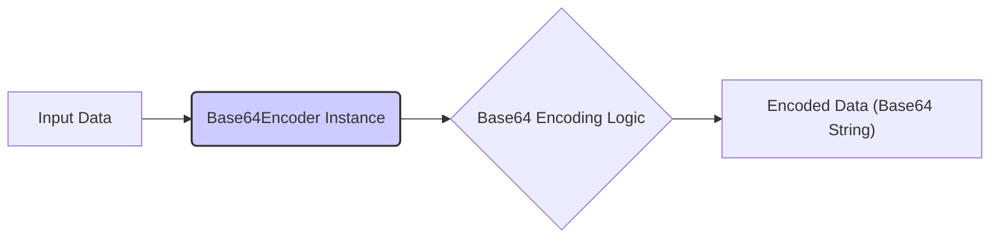
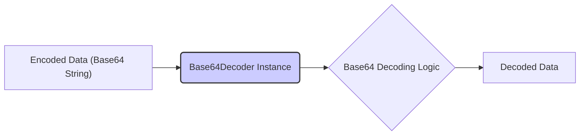
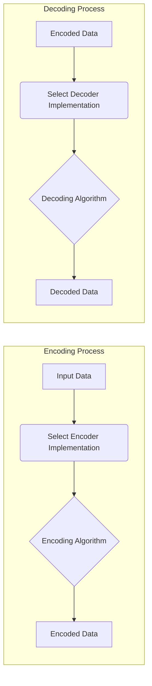

# Project Design Document: Apache Commons Codec Library

**Version:** 1.1
**Date:** October 26, 2023
**Author:** AI Software Architect

## 1. Introduction

This document provides an enhanced architectural design of the Apache Commons Codec library, specifically tailored for threat modeling activities. It aims to offer a clear understanding of the library's internal structure, data flow, and potential security considerations to facilitate the identification of vulnerabilities and attack vectors. This document builds upon the previous version with more detailed explanations and improved visualizations.

## 2. Project Overview

The Apache Commons Codec library offers robust and widely-used implementations of various encoding and decoding algorithms. These algorithms facilitate transformations between different data representations, including Base64, Hexadecimal, URL encoding, and phonetic representations. Its widespread adoption makes it a critical component in numerous Java applications, emphasizing the importance of understanding its security characteristics.

## 3. Goals

*   Present a refined and more detailed architectural overview of the Apache Commons Codec library.
*   Clearly define the responsibilities and interactions of key components.
*   Visually represent the data flow during encoding and decoding processes with enhanced clarity.
*   Provide a more structured and comprehensive analysis of potential security concerns relevant to threat modeling.

## 4. Target Audience

This document is intended for:

*   Security architects and engineers responsible for conducting threat modeling and security assessments.
*   Software developers integrating and utilizing the Apache Commons Codec library in their projects.
*   Quality assurance and security testing teams involved in evaluating the library's robustness.

## 5. Architectural Design

The Apache Commons Codec library employs a design centered around interfaces and their concrete implementations for diverse encoding and decoding functionalities. The fundamental concepts are the `Encoder` and `Decoder` interfaces, which define the core contracts for data transformation.

### 5.1. Key Components and Responsibilities

*   **`Encoder` Interface:**  Defines the blueprint for encoding data from one format to another. Implementations handle the specific logic for each encoding scheme.
    *   Responsibilities: Accepts raw data as input, applies the encoding algorithm, and outputs the encoded data.
    *   Implementations:
        *   `org.apache.commons.codec.binary.Base64`: Encodes data using the Base64 algorithm.
        *   `org.apache.commons.codec.binary.Hex`: Encodes data into its hexadecimal representation.
        *   `org.apache.commons.codec.net.URLCodec`: Encodes data for safe inclusion in URLs.
*   **`Decoder` Interface:** Defines the blueprint for decoding data back to its original format. Implementations reverse the encoding process.
    *   Responsibilities: Accepts encoded data as input, applies the decoding algorithm, and outputs the original data.
    *   Implementations:
        *   `org.apache.commons.codec.binary.Base64`: Decodes Base64 encoded data.
        *   `org.apache.commons.codec.binary.Hex`: Decodes hexadecimal encoded data.
        *   `org.apache.commons.codec.net.URLCodec`: Decodes URL encoded data.
*   **Algorithm-Specific Implementations:** Concrete classes providing the actual encoding and decoding logic for particular algorithms. These often implement both `Encoder` and `Decoder` interfaces or separate specialized interfaces.
*   **`StringEncoder` Interface:** Extends `Encoder` to specifically handle the encoding of String objects. It often manages character encoding considerations.
*   **`StringDecoder` Interface:** Extends `Decoder` to specifically handle the decoding of String objects, managing character encoding.
*   **Phonetic Encoders:** Implementations of algorithms that encode words based on their pronunciation.
    *   Examples:
        *   `org.apache.commons.codec.language.Soundex`: Implements the Soundex algorithm.
        *   `org.apache.commons.codec.language.Metaphone`: Implements the Metaphone algorithm.
        *   `org.apache.commons.codec.language.DoubleMetaphone`: Implements the Double Metaphone algorithm.
*   **Digest Utilities:**  Classes providing utility methods for creating cryptographic digests (hash values). While not strictly encoding/decoding, they are part of the library's functionality.
    *   Example: `org.apache.commons.codec.digest.DigestUtils`.

### 5.2. Component Interaction

The following Mermaid diagrams illustrate the interaction between components during encoding and decoding operations, using Base64 as a specific example for clarity.

**Encoding Operation (Base64 Example):**

**Decoding Operation (Base64 Example):**

**General Encoding/Decoding Flow:**

### 5.3. Data Flow

The data flow within the library is generally as follows:

**Encoding:**

1. Raw input data (typically a byte array or a String) is provided to a specific encoder implementation (e.g., an instance of `Base64`).
2. The encoder's `encode()` method is invoked, which applies the defined encoding algorithm to the input data.
3. The encoding algorithm transforms the input data into its encoded representation.
4. The encoded data (typically a byte array or a String) is returned as the output.

**Decoding:**

1. Encoded data (typically a byte array or a String) is provided to a corresponding decoder implementation (e.g., an instance of `Base64`).
2. The decoder's `decode()` method is invoked, which applies the reverse of the encoding algorithm.
3. The decoding algorithm transforms the encoded data back to its original representation.
4. The decoded data (typically a byte array or a String) is returned as the output.

The specific transformations are dictated by the chosen encoding/decoding algorithm. For instance, Base64 converts binary data into a printable ASCII string, while URL encoding replaces unsafe characters with their percent-encoded equivalents.

### 5.4. Package Structure (Simplified)

*   `org.apache.commons.codec`: Contains core interfaces (`Encoder`, `Decoder`, `StringEncoder`, `StringDecoder`) and utility classes.
*   `org.apache.commons.codec.binary`: Houses implementations for binary encoding schemes like Base64 and Hexadecimal.
*   `org.apache.commons.codec.net`: Includes implementations for network-related encoding, primarily URL encoding.
*   `org.apache.commons.codec.language`: Contains implementations of various phonetic encoding algorithms.
*   `org.apache.commons.codec.digest`: Provides utility classes for working with cryptographic message digests.

## 6. Security Considerations (For Threat Modeling)

This section outlines potential security considerations relevant for threat modeling the Apache Commons Codec library.

*   **Input Validation and Error Handling:**
    *   **Malformed Input to Decoders:** Decoders must robustly handle invalid or malformed encoded input to prevent unexpected exceptions, crashes, or potential vulnerabilities. Consider scenarios with incorrect padding in Base64 or invalid characters in Hex encoding.
    *   **Character Encoding Issues:** When decoding strings, ensure the correct character encoding is used to prevent data corruption or misinterpretation, which could have security implications in downstream processing.
*   **Resource Consumption:**
    *   **Large Input Sizes:** Encoding or decoding very large inputs could lead to excessive memory consumption or CPU usage, potentially causing denial-of-service conditions.
    *   **Algorithmic Complexity:**  While generally efficient, certain encoding/decoding algorithms might have performance implications for extremely large datasets.
*   **Algorithm-Specific Vulnerabilities:**
    *   While the library implements standard algorithms, staying updated on any discovered vulnerabilities in the underlying algorithms is crucial. This is less about the library's implementation and more about the inherent security of the chosen algorithm.
*   **Injection Vulnerabilities (Context-Dependent):**
    *   If the output of a decoding operation is used in a context where it's interpreted (e.g., constructing SQL queries or shell commands), improper handling of the decoded data could lead to injection attacks. This is a concern for the *usage* of the library's output rather than a direct vulnerability within the codec library itself. Output encoding and sanitization are crucial in such scenarios.
*   **Side-Channel Attacks (Less Likely but Possible):**
    *   In highly sensitive applications, consider the possibility of side-channel attacks, such as timing attacks, where the time taken for encoding or decoding operations might leak information. This is generally a lower risk for typical use cases of this library.
*   **Dependency Management:**
    *   Ensure that the Apache Commons Codec library itself is kept up-to-date to patch any discovered vulnerabilities within the library's code.
    *   While the library has minimal dependencies, any transitive dependencies should also be considered for potential vulnerabilities.
*   **Error Handling and Information Disclosure:**
    *   Ensure that error conditions during encoding or decoding are handled gracefully and do not reveal sensitive information through error messages or stack traces.

## 7. Dependencies

The Apache Commons Codec library has minimal external dependencies, primarily relying on the Java Standard Library. The project's `pom.xml` file should be consulted for the definitive list of dependencies and their versions. It's important to review these dependencies for potential security vulnerabilities as well.

## 8. Deployment Considerations

The Apache Commons Codec library is typically deployed as a JAR file included in the classpath of a Java application. Its integration is straightforward, involving instantiating the required encoder or decoder class and invoking its `encode()` or `decode()` methods. Consider the context in which the library is deployed, as this can influence the potential impact of vulnerabilities.

## 9. Future Considerations

*   **Support for Emerging Standards:**  The library could be extended to support new and evolving encoding and decoding standards.
*   **Performance Enhancements:** Continuous optimization of encoding and decoding algorithms can improve efficiency.
*   **Regular Security Audits:** Periodic security audits and penetration testing are essential to proactively identify and address potential vulnerabilities.

## 10. Conclusion

This enhanced design document provides a more detailed and structured overview of the Apache Commons Codec library, specifically tailored for threat modeling. By understanding the library's architecture, component interactions, and potential security considerations, security professionals can effectively assess risks and implement appropriate safeguards. This document serves as a valuable resource for ensuring the secure and reliable utilization of the Apache Commons Codec library in various software applications.