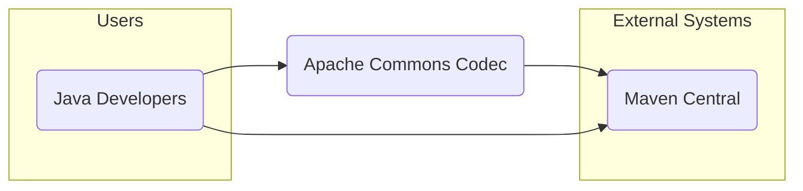
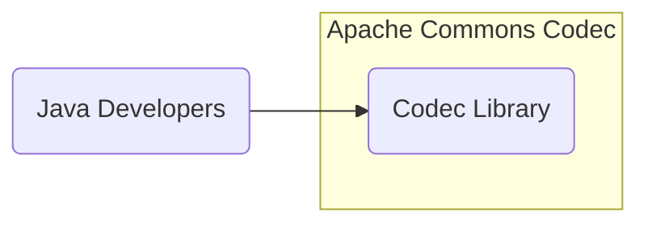

# BUSINESS POSTURE

The Apache Commons Codec library provides implementations of common encoders and decoders such as Base64, Hex, and various phonetic encoders.

- Business Priorities and Goals:
  - Provide reliable and efficient encoding and decoding functionalities for Java applications.
  - Maintain a high level of code quality and stability to ensure consistent behavior across different environments.
  - Offer a comprehensive set of codec implementations to reduce the need for developers to implement these functionalities themselves.
  - Ensure the library is performant and does not introduce significant overhead to applications using it.
  - Maintain compatibility with widely used Java versions and platforms.
  - Foster an open and collaborative development environment through the Apache Software Foundation.

- Business Risks:
  - Vulnerabilities in encoding/decoding algorithms could lead to security breaches in applications using the library (e.g., data corruption, information disclosure, injection attacks).
  - Performance issues or bugs in the library could negatively impact the performance and stability of dependent applications.
  - Lack of maintenance or slow response to security issues could lead to developers choosing alternative libraries.
  - Incompatibility with new Java versions or platforms could limit the library's usability.
  - Supply chain attacks targeting the library's build or distribution process could compromise applications using it.

# SECURITY POSTURE

- Security Controls:
  - security control: Code hosted on GitHub (https://github.com/apache/commons-codec) - Provides version control and transparency.
  - security control: Apache Software Foundation project - Benefits from ASF's established processes and infrastructure.
  - security control: Build process managed by Apache Maven - Standardized build process.
  - security control: Unit tests - Ensure basic functionality and detect regressions.
  - security control: Publicly available source code - Allows for community review and security audits.

- Accepted Risks:
  - accepted risk: Open-source nature means vulnerabilities are publicly discoverable, potentially leading to faster exploitation if not addressed promptly.
  - accepted risk: Reliance on community contributions for security patches and vulnerability reports.
  - accepted risk: Potential for dependencies to introduce vulnerabilities (transitive dependencies).

- Recommended Security Controls:
  - security control: Implement static application security testing (SAST) in the build pipeline to automatically detect potential code vulnerabilities.
  - security control: Implement dependency scanning to identify known vulnerabilities in third-party libraries used by the project.
  - security control: Conduct regular security code reviews, especially for changes related to encoding/decoding algorithms.
  - security control: Establish a clear process for handling security vulnerability reports and releasing security patches.
  - security control: Consider code signing build artifacts to ensure integrity and authenticity.

- Security Requirements:
  - Authentication: Not applicable for a library. Authentication is relevant for systems that *use* the library, but not the library itself.
  - Authorization: Not applicable for a library. Authorization is relevant for systems that *use* the library, but not the library itself.
  - Input Validation:
    - Requirement: Implement robust input validation for all encoding and decoding methods to prevent injection attacks and handle malformed input gracefully.
    - Requirement: Clearly document expected input formats and potential error conditions for each codec.
  - Cryptography:
    - Requirement: Use secure cryptographic practices when implementing cryptographic codecs (if any are included or added in the future).
    - Requirement: Ensure proper handling of cryptographic keys and sensitive data if cryptographic codecs are implemented.
    - Requirement: Follow established cryptographic standards and best practices for any cryptographic operations.
  - General Security:
    - Requirement: Adhere to secure coding practices to minimize common vulnerabilities (e.g., buffer overflows, integer overflows, format string bugs).
    - Requirement: Regularly update dependencies to patch known vulnerabilities.
    - Requirement: Provide clear documentation on security considerations for developers using the library.

# DESIGN

## C4 CONTEXT



- Elements of Context Diagram:
  - - Name: Java Developers
    - Type: User
    - Description: Software developers who use the Apache Commons Codec library in their Java projects.
    - Responsibilities: Integrate the library into their applications to perform encoding and decoding operations.
    - Security controls: Responsible for securely using the library in their applications, including proper input validation and handling of encoded/decoded data.
  - - Name: Apache Commons Codec
    - Type: Software System
    - Description: A library providing implementations of common encoders and decoders.
    - Responsibilities: Provide reliable, efficient, and secure encoding and decoding functionalities.
    - Security controls: Input validation within codec implementations, secure coding practices, vulnerability management, and secure build and release processes.
  - - Name: Maven Central
    - Type: External System
    - Description: The central repository for Maven artifacts, where the Apache Commons Codec library is published and distributed.
    - Responsibilities: Host and distribute the library artifacts.
    - Security controls: Repository security controls to ensure artifact integrity and prevent tampering during distribution.

## C4 CONTAINER



- Elements of Container Diagram:
  - - Name: Codec Library
    - Type: Library
    - Description: A single library containing all the encoder and decoder implementations. It is distributed as a JAR file.
    - Responsibilities: Encapsulate all encoding and decoding logic. Provide a well-defined API for developers to use.
    - Security controls: Input validation within codec implementations, secure coding practices, unit tests, static analysis, and vulnerability scanning during development.

## DEPLOYMENT

For a library, deployment is primarily about publishing the library to a repository so that developers can include it in their projects. The typical deployment environment is Maven Central.

```mermaid
flowchart LR
    subgraph "Maven Central Repository"
        MavenCentralRepo("Maven Central\nRepository")
    end
    subgraph "Developer Workstation"
        DeveloperBuildEnv("Developer Build\nEnvironment")
    end
    subgraph "Build Server"
        ASFBuildServer("ASF Build\nServer")
    end

    DeveloperBuildEnv --> ASFBuildServer: Build & Test
    ASFBuildServer --> MavenCentralRepo: Publish Artifact
```

- Elements of Deployment Diagram:
  - - Name: Developer Build Environment
    - Type: Environment
    - Description: Developer's local machine where they develop and initially build the library.
    - Responsibilities: Code development, local testing, and initial build.
    - Security controls: Developer workstation security practices, code review before committing changes.
  - - Name: ASF Build Server
    - Type: Environment
    - Description: Apache Software Foundation's build infrastructure, likely using Jenkins or similar CI/CD tools, to perform automated builds, tests, and releases.
    - Responsibilities: Automated building, testing, and publishing of the library.
    - Security controls: Access control to build server, secure build configurations, vulnerability scanning during build process, and artifact signing.
  - - Name: Maven Central Repository
    - Type: Environment
    - Description: Public repository for Maven artifacts, serving as the distribution point for the library.
    - Responsibilities: Hosting and distributing the library artifacts to developers worldwide.
    - Security controls: Repository security measures to ensure artifact integrity, access control, and protection against unauthorized modifications.

## BUILD

```mermaid
flowchart LR
    subgraph "Developer"
        DeveloperWorkstation("Developer\nWorkstation")
    end
    subgraph "Version Control\n(GitHub)"
        GitHubRepo("GitHub\nRepository")
    end
    subgraph "Build Server\n(ASF Infrastructure)"
        BuildServer("Build Server\n(Maven, Jenkins)")
        StaticAnalysis("Static Analysis\n(SAST, Dependency Scan)")
        UnitTests("Unit Tests")
        ArtifactSigning("Artifact Signing")
    end
    subgraph "Artifact Repository\n(Maven Central)"
        MavenCentral("Maven Central")
    end

    DeveloperWorkstation --> GitHubRepo: Code Commit
    GitHubRepo --> BuildServer: Trigger Build
    BuildServer --> StaticAnalysis: Code Analysis
    BuildServer --> UnitTests: Execute Tests
    BuildServer --> ArtifactSigning: Sign Artifact
    BuildServer --> MavenCentral: Publish Artifact
```

- Elements of Build Diagram:
  - - Name: Developer Workstation
    - Type: Environment
    - Description: Developer's local machine where code is written and initially tested.
    - Responsibilities: Code development, local testing, and committing code changes.
    - Security controls: Developer workstation security practices, code review before committing.
  - - Name: GitHub Repository
    - Type: System
    - Description: Version control system hosting the source code of the library.
    - Responsibilities: Source code management, version history, and collaboration platform.
    - Security controls: Access control to the repository, branch protection, and audit logs.
  - - Name: Build Server (Maven, Jenkins)
    - Type: System
    - Description: Automated build system using Maven and a CI/CD platform like Jenkins (or ASF equivalent).
    - Responsibilities: Automated compilation, testing, static analysis, artifact signing, and publishing.
    - Security controls: Secure build configurations, access control to build server, vulnerability scanning of build environment, and secure credential management.
  - - Name: Static Analysis (SAST, Dependency Scan)
    - Type: Tool
    - Description: Tools integrated into the build pipeline to perform static application security testing and dependency vulnerability scanning.
    - Responsibilities: Identify potential code vulnerabilities and dependency vulnerabilities.
    - Security controls: Regularly updated vulnerability databases, configured to detect relevant security issues.
  - - Name: Unit Tests
    - Type: Process
    - Description: Automated execution of unit tests to verify code functionality and detect regressions.
    - Responsibilities: Ensure code correctness and identify functional issues.
    - Security controls: Well-designed tests covering security-relevant functionalities and edge cases.
  - - Name: Artifact Signing
    - Type: Process
    - Description: Signing the build artifacts (JAR file) to ensure integrity and authenticity.
    - Responsibilities: Provide a mechanism to verify the origin and integrity of the library.
    - Security controls: Secure key management for signing process, verification process for consumers.
  - - Name: Maven Central
    - Type: System
    - Description: Public artifact repository for distributing the library.
    - Responsibilities: Host and distribute the library artifacts.
    - Security controls: Repository security measures to ensure artifact integrity and availability.

# RISK ASSESSMENT

- Critical Business Processes:
  - Correct encoding and decoding of data in applications that depend on the Apache Commons Codec library. This is critical for data integrity, security, and application functionality.

- Data to Protect and Sensitivity:
  - The Apache Commons Codec library itself does not directly handle or store sensitive data. However, it processes data provided by applications using it.
  - The sensitivity of the data being encoded/decoded depends entirely on the context of the application using the library. It could range from public information to highly sensitive personal or financial data.
  - The primary concern is to protect the integrity and confidentiality of data processed by applications using the library, by ensuring the library itself is secure and functions correctly.

# QUESTIONS & ASSUMPTIONS

- Questions:
  - What are the specific types of applications that are the primary users of Apache Commons Codec? (e.g., web applications, data processing systems, etc.)
  - Are there any specific codecs within the library that are considered more critical or security-sensitive than others?
  - What is the current process for handling security vulnerability reports for Apache Commons Codec?
  - Are there any existing SAST or dependency scanning tools currently used in the build process?
  - Is artifact signing currently implemented for releases of Apache Commons Codec?

- Assumptions:
  - Assumption: The primary use case for Apache Commons Codec is within Java/JVM-based applications.
  - Assumption: Developers using the library are responsible for implementing application-level security controls, such as authentication, authorization, and data protection, in addition to using the library securely.
  - Assumption: The build and release process for Apache Commons Codec follows the standard Apache Software Foundation practices.
  - Assumption: The library is intended to be used in a wide range of environments, from small applications to large enterprise systems.