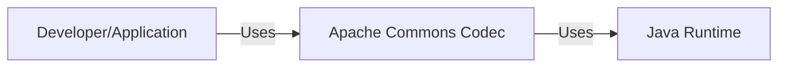
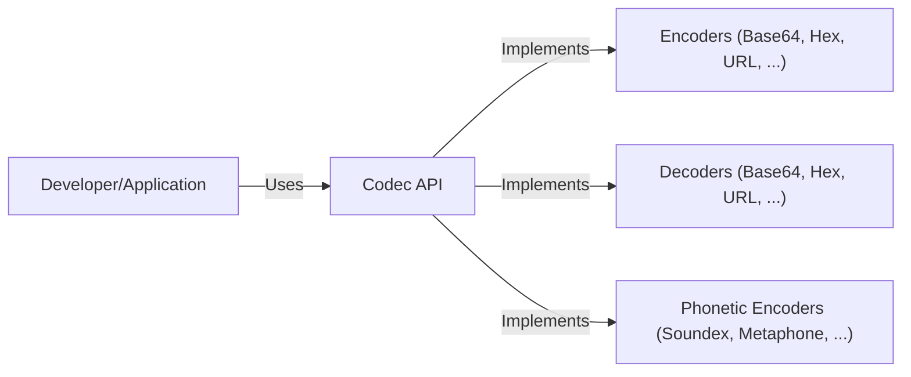
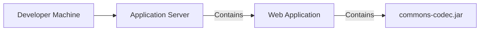
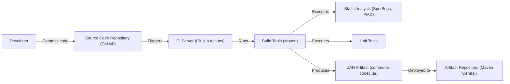

# Project Design Document: Apache Commons Codec

## BUSINESS POSTURE

*   Priorities and Goals:
    *   Provide a reliable and widely-used library of common encoders and decoders.
    *   Maintain high code quality and stability.
    *   Ensure compatibility across different Java versions.
    *   Offer a simple and consistent API for developers.
    *   Minimize external dependencies.
    *   Provide comprehensive documentation and examples.

*   Business Risks:
    *   Vulnerabilities in encoding/decoding algorithms could lead to security exploits in applications using the library.
    *   Performance bottlenecks in the library could impact the performance of applications using it.
    *   Lack of maintenance or updates could lead to compatibility issues or security vulnerabilities over time.
    *   Inconsistent or confusing API could lead to developer errors and misuse of the library.
    *   Bugs or defects in the library could lead to incorrect data handling in applications.

## SECURITY POSTURE

*   Existing Security Controls:
    *   security control: The project uses static code analysis tools (FindBugs, PMD, SpotBugs) to identify potential bugs and vulnerabilities. Implemented in build process.
    *   security control: The project has a suite of unit tests to ensure the correctness of the implementations. Implemented in build process.
    *   security control: The project follows established coding standards and best practices. Described in project documentation.
    *   security control: The project uses GitHub Actions for continuous integration, which includes running tests and static analysis. Implemented in CI/CD pipeline.
    *   security control: Dependency management to minimize and control external libraries. Implemented in build process.

*   Accepted Risks:
    *   accepted risk: Some algorithms provided might be inherently less secure than others (e.g., MD5). The project provides warnings in the documentation for such cases.
    *   accepted risk: The library relies on the underlying Java platform for certain security aspects (e.g., cryptographic providers).

*   Recommended Security Controls:
    *   security control: Integrate a fuzzing framework to test the robustness of the encoders/decoders against unexpected inputs.
    *   security control: Implement regular security audits and penetration testing.
    *   security control: Establish a clear vulnerability disclosure and reporting process.
    *   security control: Consider adding support for hardware-accelerated cryptographic operations where available.
    *   security control: Provide clear guidance on secure usage of the library, including recommendations for specific algorithms and configurations.

*   Security Requirements:

    *   Authentication: Not directly applicable, as the library provides encoding/decoding functionalities, not authentication mechanisms.
    *   Authorization: Not directly applicable.
    *   Input Validation: The library should handle invalid or malformed input gracefully, without throwing unexpected exceptions or causing security vulnerabilities. Encoders/decoders should be robust against various input types and sizes.
    *   Cryptography:
        *   Where cryptographic algorithms are used (e.g., hashing, encryption), they should be implemented correctly and follow industry best practices.
        *   The library should allow users to configure cryptographic parameters (e.g., key sizes, algorithms) where appropriate.
        *   Deprecated or known-weak algorithms should be clearly marked as such, and their use should be discouraged.

## DESIGN

### C4 CONTEXT

*   Elements:

    *   User:
        *   Name: Developer/Application
        *   Type: External Entity
        *   Description: A developer or an application that utilizes the Apache Commons Codec library for encoding and decoding functionalities.
        *   Responsibilities: Integrates and uses the Commons Codec library in their software.
        *   Security controls: Relies on the security controls implemented within the Commons Codec library and their own application's security measures.

    *   Commons Codec:
        *   Name: Apache Commons Codec
        *   Type: System
        *   Description: The Apache Commons Codec library, providing various encoding and decoding implementations.
        *   Responsibilities: Provides implementations for various encoders and decoders (e.g., Base64, Hex, URL encoding, phonetic encoders).
        *   Security controls: Static code analysis, unit tests, coding standards, dependency management.

    *   Java Runtime:
        *   Name: Java Runtime
        *   Type: External System
        *   Description: The Java Runtime Environment (JRE) or Java Development Kit (JDK) on which the Commons Codec library and the using application run.
        *   Responsibilities: Provides the underlying platform and libraries for Java execution.
        *   Security controls: Relies on the security features and updates provided by the Java platform vendor.

### C4 CONTAINER

*   Elements:

    *   User:
        *   Name: Developer/Application
        *   Type: External Entity
        *   Description: A developer or an application that utilizes the Apache Commons Codec library.
        *   Responsibilities: Integrates and uses the Commons Codec library in their software.
        *   Security controls: Relies on the security controls implemented within the Commons Codec library and their own application's security measures.

    *   Codec API:
        *   Name: Codec API
        *   Type: Container
        *   Description: The public API of the Commons Codec library, providing a consistent interface for accessing various encoders and decoders.
        *   Responsibilities: Provides a unified interface for developers to interact with different encoding/decoding functionalities.
        *   Security controls: Input validation, consistent error handling.

    *   Encoders:
        *   Name: Encoders (Base64, Hex, URL, ...)
        *   Type: Container
        *   Description: Implementations of various encoding algorithms.
        *   Responsibilities: Encode data according to specific algorithms.
        *   Security controls: Algorithm-specific security considerations, input validation.

    *   Decoders:
        *   Name: Decoders (Base64, Hex, URL, ...)
        *   Type: Container
        *   Description: Implementations of various decoding algorithms.
        *   Responsibilities: Decode data according to specific algorithms.
        *   Security controls: Algorithm-specific security considerations, input validation.

    *   Phonetic Encoders:
        *   Name: Phonetic Encoders (Soundex, Metaphone, ...)
        *   Type: Container
        *   Description: Implementations of phonetic encoding algorithms.
        *   Responsibilities: Encode strings based on their pronunciation.
        *   Security controls: Input validation.

### DEPLOYMENT

*   Possible Deployment Solutions:
    *   Embedded within a Java application (most common).
    *   Deployed as a shared library in a Java application server.
    *   Used as a dependency in other libraries or frameworks.

*   Chosen Solution: Embedded within a Java application.

*   Elements:

    *   Developer Machine:
        *   Name: Developer Machine
        *   Type: Node
        *   Description: The machine where the application using Commons Codec is developed.
        *   Responsibilities: Hosts the development environment, build tools, and source code.
        *   Security controls: Standard development machine security practices.

    *   Application Server:
        *   Name: Application Server
        *   Type: Node
        *   Description: The server where the application is deployed.
        *   Responsibilities: Hosts and runs the web application.
        *   Security controls: Server hardening, firewall, intrusion detection/prevention systems.

    *   Web Application:
        *   Name: Web Application
        *   Type: Container
        *   Description: The application that uses the Commons Codec library.
        *   Responsibilities: Provides the application's functionality.
        *   Security controls: Application-level security controls (authentication, authorization, input validation, etc.).

    *   Commons Codec JAR:
        *   Name: commons-codec.jar
        *   Type: Artifact
        *   Description: The compiled JAR file of the Commons Codec library.
        *   Responsibilities: Provides the encoding/decoding functionalities.
        *   Security controls: Build process security controls, code signing (optional).

### BUILD

*   Build Process Description:

    1.  Developers commit code changes to the source code repository (GitHub).
    2.  The CI server (GitHub Actions) is triggered by the commit.
    3.  The CI server uses build tools (Maven) to compile the code, run unit tests, and perform static analysis.
    4.  Static analysis tools (SpotBugs, PMD) check for potential bugs and vulnerabilities.
    5.  Unit tests verify the correctness of the code.
    6.  If all checks and tests pass, a JAR artifact (commons-codec.jar) is produced.
    7.  The JAR artifact is deployed to an artifact repository (Maven Central).

*   Security Controls:
    *   Source Code Repository: Access control, code review process.
    *   CI Server: Secure configuration, limited access, monitoring.
    *   Build Tools: Dependency management, secure configuration.
    *   Static Analysis: Identification of potential vulnerabilities.
    *   Unit Tests: Verification of code correctness.
    *   Artifact Repository: Access control, integrity checks.

## RISK ASSESSMENT

*   Critical Business Processes:
    *   Providing reliable and secure encoding/decoding functionalities for applications.
    *   Maintaining the integrity and availability of the library.

*   Data Protection:
    *   The library itself does not store or manage sensitive data directly. However, it processes data that may be sensitive in the context of the applications using it.
    *   Data Sensitivity: Varies depending on the application. The library handles data as byte arrays or strings, and the sensitivity depends on the nature of that data. For example, if an application uses Commons Codec to encode passwords, the encoded data would be considered highly sensitive. If it's used to encode URLs, the sensitivity might be lower.

## QUESTIONS & ASSUMPTIONS

*   Questions:
    *   Are there any specific performance requirements or constraints for the library?
    *   Are there any specific regulatory or compliance requirements that the library needs to adhere to?
    *   Are there plans to add support for any new encoding/decoding algorithms in the future?
    *   What is the expected lifespan of the project and the long-term maintenance plan?

*   Assumptions:
    *   BUSINESS POSTURE: The project prioritizes stability, reliability, and security over adding new features rapidly.
    *   SECURITY POSTURE: The project follows established security best practices and has a proactive approach to addressing potential vulnerabilities.
    *   DESIGN: The library is primarily used as an embedded dependency within Java applications. The Java Runtime Environment is assumed to be securely configured and maintained. The build process is automated and includes security checks.