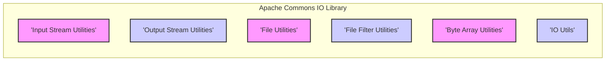
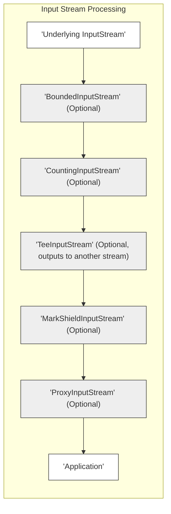
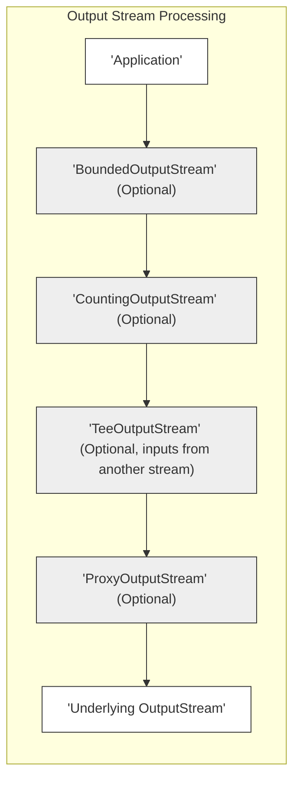
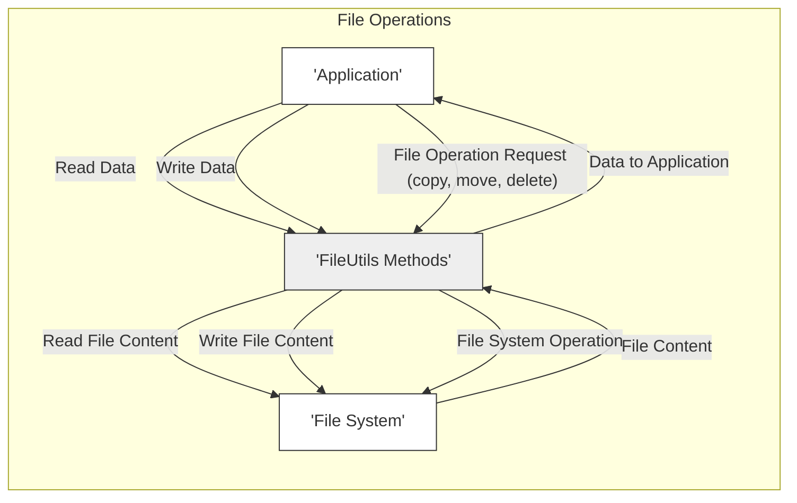
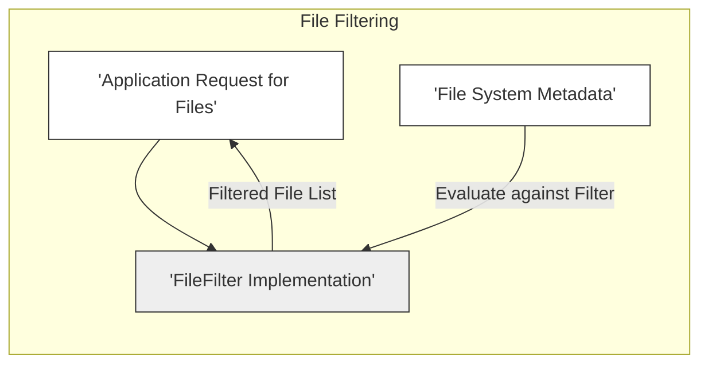
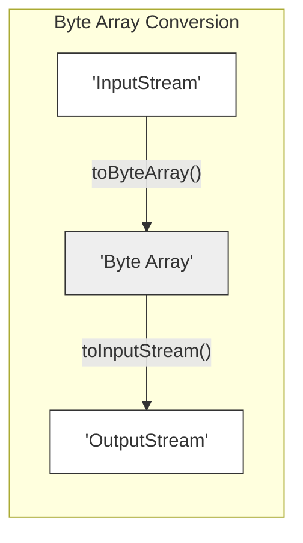
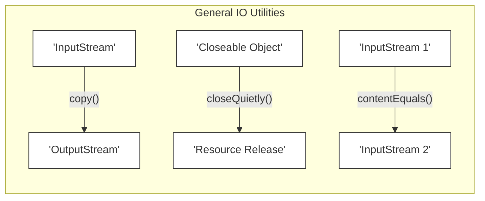

# Project Design Document: Apache Commons IO Library (Improved for Threat Modeling)

This document provides a detailed design overview of the Apache Commons IO library, intended to facilitate subsequent threat modeling activities. It outlines the key components, functionalities, and data flows within the library, highlighting potential areas of security concern.

## 1. Introduction

The Apache Commons IO library is a collection of utility classes for performing common input/output tasks. It provides a robust and efficient alternative to the standard Java I/O library in many situations. This document aims to provide a comprehensive understanding of the library's architecture and functionality for security analysis.

## 2. Goals

*   Provide a clear and concise description of the Apache Commons IO library's architecture.
*   Identify key components and their interactions.
*   Map data flow within the library.
*   Highlight potential areas of security concern for future threat modeling.
*   Serve as a basis for identifying potential attack vectors and vulnerabilities.

## 3. Target Audience

*   Security engineers and architects performing threat modeling.
*   Developers integrating Commons IO into their applications.
*   Quality assurance engineers responsible for security testing.

## 4. Scope

This document covers the core functionalities of the Apache Commons IO library, focusing on aspects relevant to security. It includes:

*   Key classes and interfaces involved in file and stream manipulation.
*   Data flow related to reading, writing, and processing data.
*   Interactions with the underlying operating system and file system.

This document does not cover:

*   Detailed implementation specifics of individual methods.
*   Performance benchmarks or optimization strategies.
*   The history of the library or its evolution.

## 5. Architectural Overview

The Apache Commons IO library is structured around several key packages, each providing distinct functionalities. The core of the library revolves around handling input and output streams, files, and byte arrays.

## 6. Key Components and Data Flow

This section details the major components and how data flows through them.

### 6.1. Input Stream Utilities (`org.apache.commons.io.input`)

*   **Functionality:** Provides utility classes for working with `InputStream` objects, such as reading data, counting bytes, and teeing streams.
*   **Key Classes:**
    *   `BoundedInputStream`: Limits the number of bytes that can be read from an underlying stream.
    *   `CountingInputStream`: Counts the number of bytes read.
    *   `TeeInputStream`: Copies input data to another stream as it's being read.
    *   `MarkShieldInputStream`: Prevents `reset()` from going beyond the marked position.
    *   `ProxyInputStream`: A proxy for an `InputStream` which can be used to add custom behavior.
*   **Data Flow:** Data flows from an underlying `InputStream` through these utility classes, potentially being transformed, counted, or copied before being consumed by the application.

### 6.2. Output Stream Utilities (`org.apache.commons.io.output`)

*   **Functionality:** Provides utility classes for working with `OutputStream` objects, such as writing data, counting bytes, and teeing streams.
*   **Key Classes:**
    *   `BoundedOutputStream`: Limits the number of bytes that can be written to an underlying stream.
    *   `CountingOutputStream`: Counts the number of bytes written.
    *   `TeeOutputStream`: Copies output data to another stream as it's being written.
    *   `ProxyOutputStream`: A proxy for an `OutputStream` which can be used to add custom behavior.
    *   `StringBuilderWriter`: Writes data to a `StringBuilder`.
*   **Data Flow:** Data flows from the application through these utility classes to an underlying `OutputStream`, potentially being transformed, counted, or copied.

### 6.3. File Utilities (`org.apache.commons.io.FileUtils`)

*   **Functionality:** Provides static methods for common file operations, such as copying, moving, deleting, and reading/writing file content.
*   **Key Methods:**
    *   `copyFile(File srcFile, File destFile)`: Copies a file.
    *   `moveFile(File srcFile, File destFile)`: Moves a file.
    *   `deleteDirectory(File directory)`: Deletes a directory recursively.
    *   `readFileToString(File file, String encoding)`: Reads the content of a file into a String.
    *   `writeStringToFile(File file, String data, String encoding)`: Writes a String to a file.
*   **Data Flow:** Data flows between the file system and the application. Operations involve reading data from files into memory or writing data from memory to files. File system operations (copy, move, delete) directly interact with the operating system.

### 6.4. File Filter Utilities (`org.apache.commons.io.filefilter`)

*   **Functionality:** Provides implementations of `java.io.FileFilter` and `java.io.FilenameFilter` for filtering files based on various criteria (name, extension, directory, etc.).
*   **Key Classes:**
    *   `WildcardFileFilter`: Filters files based on wildcard patterns.
    *   `SuffixFileFilter`: Filters files based on file suffixes.
    *   `DirectoryFileFilter`: Filters directories.
    *   `AgeFileFilter`: Filters files based on their last modified date.
    *   `AndFileFilter`, `OrFileFilter`, `NotFileFilter`: Combinations of other filters.
*   **Data Flow:** File system metadata (file names, paths, attributes) is evaluated against the filter criteria.

### 6.5. Byte Array Utilities (`org.apache.commons.io.IOUtils` methods for byte arrays)

*   **Functionality:** Provides utility methods for converting between byte arrays, input streams, and output streams.
*   **Key Methods:**
    *   `toByteArray(InputStream input)`: Reads the contents of an input stream into a byte array.
    *   `toInputStream(byte[] array)`: Converts a byte array to an input stream.
*   **Data Flow:** Data is transferred between different representations (streams and byte arrays).

### 6.6. IO Utilities (`org.apache.commons.io.IOUtils`)

*   **Functionality:** Provides general I/O utility methods, such as closing streams quietly, copying streams, and comparing stream content.
*   **Key Methods:**
    *   `closeQuietly(Closeable closeable)`: Closes a `Closeable` without throwing exceptions.
    *   `copy(InputStream input, OutputStream output)`: Copies data from an input stream to an output stream.
    *   `contentEquals(InputStream input1, InputStream input2)`: Compares the content of two input streams.
*   **Data Flow:** Data flows between input and output streams during copy operations. Other methods operate on stream objects or perform comparisons.

## 7. Security Considerations

This section outlines potential security considerations related to the use of the Apache Commons IO library.

*   **Path Traversal:** When using methods that accept file paths as input (e.g., in `FileUtils`), improper sanitization of these paths by the calling application could lead to path traversal vulnerabilities. Attackers could potentially access or manipulate files outside of the intended directories.
*   **Symlink Attacks:** Operations involving file copying or moving might be susceptible to symlink attacks if the library doesn't handle symbolic links securely. An attacker could create a symbolic link pointing to a sensitive file, and a copy or move operation could inadvertently affect that file.
*   **Resource Exhaustion:** Reading large files into memory using methods like `FileUtils.readFileToString()` without proper size limits could lead to resource exhaustion and denial-of-service.
*   **Temporary File Handling:**  If the library creates temporary files, their permissions and cleanup mechanisms need to be secure to prevent unauthorized access or information leakage.
*   **Input Validation:** While Commons IO primarily deals with I/O operations, the data being read or written might originate from untrusted sources. The calling application is primarily responsible for input validation, but understanding how Commons IO handles different types of input is crucial.
*   **Error Handling:** How the library handles errors (e.g., file not found, permission denied) can impact security. Information leakage through overly verbose error messages should be considered.
*   **Dependency Vulnerabilities:** As with any library, vulnerabilities in the Apache Commons IO library itself or its transitive dependencies could pose a security risk. Keeping the library updated is essential.
*   **Encoding Issues:** When reading or writing text files, incorrect handling of character encodings could lead to data corruption or security vulnerabilities.

## 8. Potential Threat Scenarios

Based on the architecture and security considerations, some potential threat scenarios include:

*   An attacker provides a malicious file path to a `FileUtils` method, leading to unauthorized file access or modification.
*   An application uses `FileUtils.readFileToString()` on an extremely large file provided by an attacker, causing a denial-of-service.
*   An attacker exploits a vulnerability in a file filter to bypass intended access controls.
*   An application using `TeeOutputStream` inadvertently logs sensitive data to an unintended location.
*   Improper handling of temporary files created by the library leads to information disclosure.

## 9. Conclusion

This design document provides a foundation for understanding the architecture and functionality of the Apache Commons IO library from a security perspective. By outlining the key components, data flows, and potential security considerations, it serves as a valuable resource for conducting thorough threat modeling and identifying potential vulnerabilities. Further analysis should focus on specific use cases and interactions with the library within the context of a larger application.
