# BUSINESS POSTURE

This project is the Apache Commons IO library, a widely used open-source Java library.

- Business Priorities and Goals:
  - Provide a robust, efficient, and reliable set of Java utility classes to assist with common input/output tasks.
  - Simplify and standardize IO operations for Java developers, reducing boilerplate code and potential errors.
  - Maintain backward compatibility and stability to ensure existing applications relying on the library continue to function correctly.
  - Foster a community-driven development model, encouraging contributions and improvements from the wider Java ecosystem.
  - Ensure the library is freely available and usable under the Apache License, promoting broad adoption.

- Most Important Business Risks:
  - Introduction of bugs or vulnerabilities in new releases that could negatively impact applications using the library.
  - Lack of maintenance or timely security updates, leading to security risks for users.
  - Performance regressions in new versions that could degrade the performance of applications using the library.
  - Incompatibility issues with newer Java versions or other libraries, causing integration problems for users.
  - Dependency on vulnerable third-party libraries, creating supply chain security risks.

# SECURITY POSTURE

- Security Controls:
  - security control: Source code hosted on GitHub, providing transparency and version control. (Implemented: GitHub Repository)
  - security control: Development process managed by the Apache Software Foundation (ASF), which has established open-source development practices. (Implemented: ASF Governance)
  - security control: Public issue tracker (JIRA) for reporting bugs and security vulnerabilities. (Implemented: ASF JIRA)
  - security control: Use of Apache Maven for build management and dependency management. (Implemented: pom.xml)
  - security control: Code reviews are likely part of the ASF development process, although not explicitly documented in the repository. (Assumed: ASF Best Practices)
  - security control: Releases are signed using GPG keys by ASF release managers. (Implemented: ASF Release Process)

- Accepted Risks:
  - accepted risk: Potential for vulnerabilities to be discovered in the library code, given the complexity of IO operations and the wide range of use cases.
  - accepted risk: Reliance on community contributions, which may introduce unforeseen security issues if not properly vetted.
  - accepted risk: Dependency on third-party libraries, which may have their own vulnerabilities.
  - accepted risk: Users may misuse the library in insecure ways in their applications.

- Recommended Security Controls:
  - security control: Implement automated static analysis security testing (SAST) as part of the build process to identify potential vulnerabilities in the code.
  - security control: Integrate dependency scanning tools to identify known vulnerabilities in third-party libraries used by Commons IO.
  - security control: Conduct regular security audits or penetration testing of the library to proactively identify and address security weaknesses.
  - security control: Provide clear security guidelines and best practices for users on how to use Commons IO securely in their applications, especially regarding file path handling and input validation.
  - security control: Establish a clear process for handling security vulnerability reports, including response times and communication channels.

- Security Requirements:
  - Authentication: Not applicable for a library. Authentication is the responsibility of applications using the library.
  - Authorization: Not applicable for a library. Authorization is the responsibility of applications using the library.
  - Input Validation:
    - Requirement: The library should handle invalid or malicious input gracefully and prevent unexpected behavior or security vulnerabilities.
    - Requirement: File path inputs should be carefully validated to prevent path traversal vulnerabilities.
    - Requirement: Input streams and readers should be handled to prevent denial-of-service attacks or resource exhaustion.
  - Cryptography:
    - Requirement: If the library provides any cryptographic functionality (which is not apparent in a basic IO library, but needs to be confirmed), it should use well-established and secure cryptographic algorithms and libraries.
    - Requirement: Sensitive data (if any is handled by the library, which is unlikely) should be protected appropriately, avoiding storage in plaintext or insecure transmission.

# DESIGN

## C4 CONTEXT

```mermaid
flowchart LR
    subgraph "Java Ecosystem"
        style "Java Ecosystem" fill:#f9f,stroke:#333,stroke-width:2px
        JDK["JDK (Java Development Kit)"]
        JVM["JVM (Java Virtual Machine)"]
    end

    Developer["Java Developer"] -- Uses --> CommonsIO
    Application["Java Application"] -- Uses --> CommonsIO
    CommonsIO["Apache Commons IO Library"]

    CommonsIO -- "Runs on" --> JVM
    JVM -- "Requires" --> JDK
    Application -- "Runs on" --> JVM

    style Developer fill:#ccf,stroke:#333,stroke-width:2px
    style Application fill:#ccf,stroke:#333,stroke-width:2px
    style CommonsIO fill:#fcf,stroke:#333,stroke-width:2px

```

- Context Diagram Elements:
  - - Name: Java Developer
    - Type: Person
    - Description: Software developers who use the Apache Commons IO library in their Java projects.
    - Responsibilities: Integrate Commons IO into their applications to simplify IO operations.
    - Security controls: Responsible for using the library securely and following best practices in their applications.
  - - Name: Java Application
    - Type: Software System
    - Description: Any Java application that depends on and utilizes the Apache Commons IO library.
    - Responsibilities: Perform specific business logic and functionalities, leveraging Commons IO for IO tasks.
    - Security controls: Application-level security controls, including input validation, authorization, and secure data handling, are the responsibility of the application developers.
  - - Name: Apache Commons IO Library
    - Type: Software System
    - Description: A Java library providing utility classes for common IO operations.
    - Responsibilities: Provide robust and efficient IO utility functions to Java applications.
    - Security controls: Security controls within the library itself, such as input validation within library functions, and secure coding practices during development.
  - - Name: JVM (Java Virtual Machine)
    - Type: Technology
    - Description: The runtime environment for Java applications, including those using Commons IO.
    - Responsibilities: Execute Java bytecode and provide core Java functionalities.
    - Security controls: JVM security features, such as bytecode verification and security managers (though less commonly used now).
  - - Name: JDK (Java Development Kit)
    - Type: Technology
    - Description: The development environment for Java, required to compile and build Java applications and libraries like Commons IO.
    - Responsibilities: Provide tools and libraries for Java development.
    - Security controls: JDK security features and updates are crucial for the security of Java applications and libraries.

## C4 CONTAINER

```mermaid
flowchart LR
    subgraph "Java Ecosystem"
        style "Java Ecosystem" fill:#f9f,stroke:#333,stroke-width:2px
        JDK["JDK (Java Development Kit)"]
        JVM["JVM (Java Virtual Machine)"]
    end

    Developer["Java Developer"] -- Uses --> CommonsIO
    Application["Java Application"] -- Uses --> CommonsIO
    CommonsIO["Apache Commons IO Library"]

    subgraph "Commons IO Library Internals"
        style "Commons IO Library Internals" fill:#efe,stroke:#333,stroke-width:2px
        FileUtils["FileUtils Component"]
        IOUtils["IOUtils Component"]
        FileSystemUtils["FileSystemUtils Component"]
        // Add more components as needed based on library structure
    end

    CommonsIO -- "Comprises" --> FileUtils
    CommonsIO -- "Comprises" --> IOUtils
    CommonsIO -- "Comprises" --> FileSystemUtils


    CommonsIO -- "Runs on" --> JVM
    JVM -- "Requires" --> JDK
    Application -- "Runs on" --> JVM

    style Developer fill:#ccf,stroke:#333,stroke-width:2px
    style Application fill:#ccf,stroke:#333,stroke-width:2px
    style CommonsIO fill:#fcf,stroke:#333,stroke-width:2px
    style FileUtils fill:#ddf,stroke:#333,stroke-width:2px
    style IOUtils fill:#ddf,stroke:#333,stroke-width:2px
    style FileSystemUtils fill:#ddf,stroke:#333,stroke-width:2px

```

- Container Diagram Elements:
  - - Name: Java Developer
    - Type: Person
    - Description: Software developers who use the Apache Commons IO library in their Java projects.
    - Responsibilities: Integrate Commons IO components into their applications to simplify IO operations.
    - Security controls: Responsible for using the library components securely and following best practices in their applications.
  - - Name: Java Application
    - Type: Software System
    - Description: Any Java application that depends on and utilizes the Apache Commons IO library.
    - Responsibilities: Perform specific business logic and functionalities, leveraging Commons IO components for IO tasks.
    - Security controls: Application-level security controls, including input validation, authorization, and secure data handling, are the responsibility of the application developers.
  - - Name: Apache Commons IO Library
    - Type: Container
    - Description: A Java library providing utility classes for common IO operations, composed of several components.
    - Responsibilities: Provide robust and efficient IO utility functions through its components to Java applications.
    - Security controls: Security controls within the library components, such as input validation within component functions, and secure coding practices during development of each component.
  - - Name: FileUtils Component
    - Type: Component
    - Description: A component within Commons IO providing utility methods for file operations.
    - Responsibilities: Offer file-related utility functions like copying, deleting, moving files and directories.
    - Security controls: Input validation for file paths, handling file permissions appropriately, and preventing path traversal vulnerabilities.
  - - Name: IOUtils Component
    - Type: Component
    - Description: A component within Commons IO providing utility methods for stream and reader/writer operations.
    - Responsibilities: Offer stream and reader/writer utility functions like copying streams, reading lines, and closing resources safely.
    - Security controls: Handling input streams to prevent denial-of-service, ensuring resources are closed properly to avoid leaks, and handling character encoding correctly.
  - - Name: FileSystemUtils Component
    - Type: Component
    - Description: A component within Commons IO providing utility methods for interacting with the file system.
    - Responsibilities: Offer file system related utility functions like getting free space, checking if a file system is writable.
    - Security controls: Handling file system operations securely, considering permissions and access controls, and preventing information disclosure.
  - - Name: JVM (Java Virtual Machine)
    - Type: Technology
    - Description: The runtime environment for Java applications, including those using Commons IO.
    - Responsibilities: Execute Java bytecode and provide core Java functionalities.
    - Security controls: JVM security features, such as bytecode verification and security managers.
  - - Name: JDK (Java Development Kit)
    - Type: Technology
    - Description: The development environment for Java, required to compile and build Java applications and libraries like Commons IO.
    - Responsibilities: Provide tools and libraries for Java development.
    - Security controls: JDK security features and updates are crucial for the security of Java applications and libraries.

## DEPLOYMENT

```mermaid
flowchart LR
    subgraph "Developer Environment"
        style "Developer Environment" fill:#f9f,stroke:#333,stroke-width:2px
        Developer["Developer Machine"]
        LocalMaven["Local Maven Repository"]
    end

    subgraph "Build Environment"
        style "Build Environment" fill:#efe,stroke:#333,stroke-width:2px
        CI["CI Server (e.g., GitHub Actions)"]
        CentralMaven["Central Maven Repository"]
    end

    subgraph "User Application Runtime Environment"
        style "User Application Runtime Environment" fill:#ccf,stroke:#333,stroke-width:2px
        AppServer["Application Server"]
        AppFileSystem["Application File System"]
    end

    Developer -- "Develops Code" --> Developer
    Developer -- "Builds Library" --> LocalMaven
    LocalMaven -- "Publishes to" --> CentralMaven
    CI -- "Builds & Tests" --> CentralMaven
    Application -- "Downloads from" --> CentralMaven
    Application -- "Runs on" --> AppServer
    AppServer -- "Accesses" --> AppFileSystem
    Application -- "Uses" --> CommonsIO
    CommonsIO -- "Operates on" --> AppFileSystem

    style Developer fill:#ccf,stroke:#333,stroke-width:2px
    style LocalMaven fill:#ddf,stroke:#333,stroke-width:2px
    style CI fill:#ddf,stroke:#333,stroke-width:2px
    style CentralMaven fill:#ddf,stroke:#333,stroke-width:2px
    style AppServer fill:#ddf,stroke:#333,stroke-width:2px
    style AppFileSystem fill:#ddf,stroke:#333,stroke-width:2px
    style CommonsIO fill:#fcf,stroke:#333,stroke-width:2px
    style Application fill:#fcf,stroke:#333,stroke-width:2px

```

- Deployment Diagram Elements:
  - - Name: Developer Machine
    - Type: Environment
    - Description: The local development environment used by developers to write code for Commons IO.
    - Responsibilities: Code development, local testing, and building the library.
    - Security controls: Developer machine security practices, including OS security, access controls, and secure coding habits.
  - - Name: Local Maven Repository
    - Type: Software
    - Description: A local repository on the developer's machine where built artifacts are stored temporarily.
    - Responsibilities: Caching build artifacts during development.
    - Security controls: Access control to the developer's machine.
  - - Name: CI Server (e.g., GitHub Actions)
    - Type: Environment
    - Description: Continuous Integration server used to automate the build, test, and release process of Commons IO.
    - Responsibilities: Automated building, testing, static analysis, and publishing of the library.
    - Security controls: CI server security, including access controls, secure build pipelines, and secrets management.
  - - Name: Central Maven Repository
    - Type: Software
    - Description: A central repository (like Maven Central) where the released artifacts of Commons IO are published and made available to users.
    - Responsibilities: Hosting and distributing released versions of the Commons IO library.
    - Security controls: Repository security, including access controls, artifact signing, and vulnerability scanning.
  - - Name: Application Server
    - Type: Environment
    - Description: The runtime environment where Java applications using Commons IO are deployed and executed.
    - Responsibilities: Hosting and running Java applications.
    - Security controls: Application server security, including access controls, network security, and runtime environment hardening.
  - - Name: Application File System
    - Type: Infrastructure
    - Description: The file system that the application server and applications interact with, where Commons IO might be used for file operations.
    - Responsibilities: Storing and managing files accessed by applications.
    - Security controls: File system access controls, permissions, and monitoring.
  - - Name: Apache Commons IO Library
    - Type: Software
    - Description: The deployed library (JAR file) within the application runtime environment.
    - Responsibilities: Providing IO utility functions to the running application.
    - Security controls: Library's internal security controls and secure coding practices.
  - - Name: Java Application
    - Type: Software System
    - Description: The Java application running on the application server that utilizes the Commons IO library.
    - Responsibilities: Performing business logic and using Commons IO for IO operations.
    - Security controls: Application-level security controls, including input validation, authorization, and secure data handling.

## BUILD

```mermaid
flowchart LR
    Developer["Developer"] --> SourceCode["Source Code (GitHub)"]
    SourceCode --> MavenBuild["Maven Build Process (CI)"]
    MavenBuild --> StaticAnalysis["Static Analysis Security Testing (SAST)"]
    StaticAnalysis --> DependencyCheck["Dependency Check"]
    DependencyCheck --> UnitTests["Unit Tests"]
    UnitTests --> IntegrationTests["Integration Tests"]
    IntegrationTests --> BuildArtifacts["Build Artifacts (JAR)"]
    BuildArtifacts --> Signing["Artifact Signing (GPG)"]
    Signing --> MavenRepository["Maven Repository (Central)"]

    style Developer fill:#ccf,stroke:#333,stroke-width:2px
    style SourceCode fill:#ddf,stroke:#333,stroke-width:2px
    style MavenBuild fill:#ddf,stroke:#333,stroke-width:2px
    style StaticAnalysis fill:#ddf,stroke:#333,stroke-width:2px
    style DependencyCheck fill:#ddf,stroke:#333,stroke-width:2px
    style UnitTests fill:#ddf,stroke:#333,stroke-width:2px
    style IntegrationTests fill:#ddf,stroke:#333,stroke-width:2px
    style BuildArtifacts fill:#fcf,stroke:#333,stroke-width:2px
    style Signing fill:#fcf,stroke:#333,stroke-width:2px
    style MavenRepository fill:#fcf,stroke:#333,stroke-width:2px
```



- Build Process Elements:
  - - Name: Developer
    - Type: Person
    - Description: Software developer contributing to the Commons IO project.
    - Responsibilities: Writing code, committing changes to the source code repository.
    - Security controls: Developer workstation security, secure coding practices, and authentication to source code repository.
  - - Name: Source Code (GitHub)
    - Type: Software Repository
    - Description: The GitHub repository hosting the source code of Commons IO.
    - Responsibilities: Version control, source code management, and access control.
    - Security controls: GitHub access controls, branch protection, and audit logging.
  - - Name: Maven Build Process (CI)
    - Type: Automated Build System
    - Description: Automated build process managed by a CI system (e.g., GitHub Actions) using Apache Maven.
    - Responsibilities: Compiling code, running tests, packaging artifacts, and publishing releases.
    - Security controls: CI system security, secure build pipelines, secrets management, and access controls.
  - - Name: Static Analysis Security Testing (SAST)
    - Type: Security Tool
    - Description: Automated SAST tools integrated into the build process to scan the source code for potential vulnerabilities.
    - Responsibilities: Identifying potential security flaws in the code.
    - Security controls: Configuration and management of SAST tools, and remediation of identified vulnerabilities.
  - - Name: Dependency Check
    - Type: Security Tool
    - Description: Automated dependency checking tools to identify known vulnerabilities in third-party libraries used by Commons IO.
    - Responsibilities: Identifying vulnerable dependencies.
    - Security controls: Configuration and management of dependency checking tools, and updating vulnerable dependencies.
  - - Name: Unit Tests
    - Type: Automated Tests
    - Description: Unit tests to verify the functionality of individual components of Commons IO.
    - Responsibilities: Ensuring code correctness and preventing regressions.
    - Security controls: Well-written tests that cover security-relevant scenarios.
  - - Name: Integration Tests
    - Type: Automated Tests
    - Description: Integration tests to verify the interaction between different components of Commons IO.
    - Responsibilities: Ensuring components work together correctly and preventing integration issues.
    - Security controls: Well-written tests that cover security-relevant integration scenarios.
  - - Name: Build Artifacts (JAR)
    - Type: Software Artifact
    - Description: The compiled JAR file of the Commons IO library.
    - Responsibilities: Packaging the library for distribution.
    - Security controls: Integrity of the build process to ensure artifacts are not tampered with.
  - - Name: Artifact Signing (GPG)
    - Type: Security Process
    - Description: Signing the build artifacts (JAR files) using GPG keys to ensure authenticity and integrity.
    - Responsibilities: Verifying the origin and integrity of the released artifacts.
    - Security controls: Secure key management and signing process.
  - - Name: Maven Repository (Central)
    - Type: Artifact Repository
    - Description: Maven Central repository where signed JAR artifacts are published for public consumption.
    - Responsibilities: Distributing the released library to users.
    - Security controls: Repository security, access controls, and artifact verification mechanisms.

# RISK ASSESSMENT

- Critical Business Processes:
  - Providing reliable and secure IO utility functions to Java developers.
  - Maintaining the integrity and availability of the Commons IO library.
  - Ensuring the library does not introduce vulnerabilities into applications that use it.

- Data to Protect and Sensitivity:
  - Source code of the Commons IO library: High sensitivity. Confidentiality and integrity are crucial to prevent unauthorized modifications or disclosure.
  - Build artifacts (JAR files): High sensitivity. Integrity is crucial to ensure users download and use untampered and safe libraries.
  - Security vulnerability information: High sensitivity. Confidentiality is important until a fix is released to prevent exploitation. Public disclosure should be coordinated.
  - Developer credentials and signing keys: Critical sensitivity. Confidentiality is paramount to prevent unauthorized access and releases.

# QUESTIONS & ASSUMPTIONS

- Questions:
  - What specific SAST and dependency scanning tools are currently used in the Apache Commons IO build process (if any)?
  - What is the process for handling security vulnerability reports for Commons IO?
  - Are there documented security guidelines for developers contributing to Commons IO?
  - Are there any known past security vulnerabilities in Commons IO and how were they addressed?
  - What are the typical use cases of Commons IO that are most security-sensitive?

- Assumptions:
  - The Apache Software Foundation follows secure development practices for its projects, including Commons IO.
  - Code reviews are conducted for all code changes in Commons IO.
  - The build process is automated and uses a CI/CD pipeline.
  - Released artifacts are signed to ensure integrity and authenticity.
  - Developers using Commons IO are responsible for implementing security controls in their own applications.
  - Commons IO itself does not handle sensitive data directly, but provides utilities for applications that might handle sensitive data.