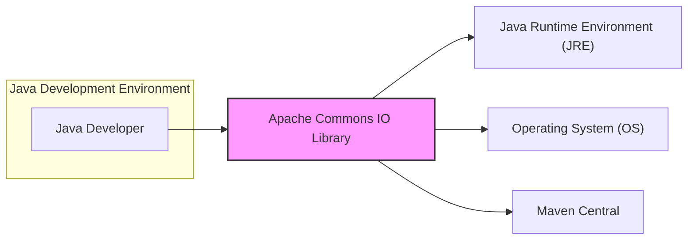
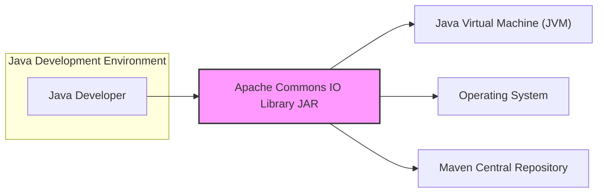
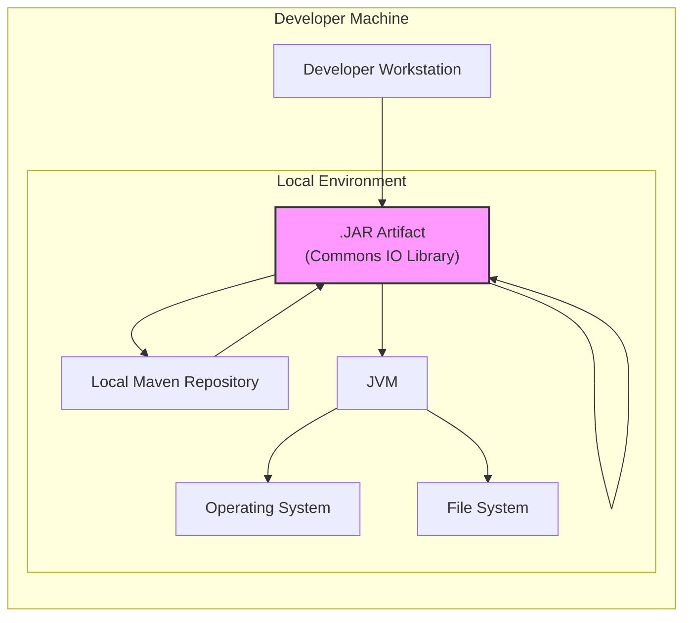
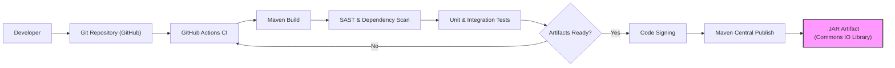

# BUSINESS POSTURE

This project, Apache Commons IO, aims to provide a comprehensive collection of utility classes to assist with general Input/Output operations in Java. It is designed to simplify common IO tasks and handle edge cases, making Java development more efficient and robust when dealing with file systems, streams, and other IO resources.

Business priorities and goals:
- Provide stable and reliable IO utility library for Java developers.
- Offer a wide range of functionalities to cover common IO operations.
- Ensure high performance and efficiency in IO operations.
- Maintain backward compatibility to minimize disruption for existing users.
- Foster a strong community around the library for continuous improvement and support.
- Distribute the library through standard channels like Maven Central for easy accessibility.

Most important business risks:
- Security vulnerabilities in the library could be exploited by malicious actors in applications using Commons IO, leading to data breaches or system compromise.
- Performance bottlenecks introduced by the library could negatively impact applications relying on it.
- Backward incompatible changes could break existing applications and require significant rework for users.
- Lack of maintenance or community support could lead to stagnation and unaddressed security issues.
- Supply chain attacks targeting the build and distribution process could compromise the integrity of the library.

# SECURITY POSTURE

Existing security controls:
- security control: Open source project with public code repository on GitHub, allowing for community review and scrutiny. Implemented in: GitHub repository.
- security control: Reliance on the Apache Software Foundation infrastructure, which has its own security policies and procedures. Implemented in: Apache infrastructure.
- security control: Use of standard build tools like Maven, which includes dependency management and verification features. Implemented in: Maven build system.
- security control: Version control system (Git) to track changes and potentially revert to previous versions if issues are found. Implemented in: Git repository.

Accepted risks:
- accepted risk: As an open-source library, vulnerabilities might be discovered and publicly disclosed before a patch is available.
- accepted risk: Developers using the library might misuse its functionalities, leading to security vulnerabilities in their applications.
- accepted risk: Dependencies of the library might introduce security vulnerabilities.

Recommended security controls:
- security control: Implement automated static analysis security testing (SAST) in the CI/CD pipeline to identify potential code-level vulnerabilities.
- security control: Integrate dependency scanning to identify known vulnerabilities in third-party libraries used by Commons IO.
- security control: Conduct regular vulnerability scanning of the released artifacts and infrastructure.
- security control: Establish a clear process for reporting and handling security vulnerabilities, including a security policy and contact information.
- security control: Implement code signing for released artifacts to ensure integrity and authenticity.
- security control: Follow secure coding practices throughout the development lifecycle, including input validation, output encoding, and secure error handling.

Security requirements:
- Authentication: Not applicable for a library. Authentication is the responsibility of applications using the library.
- Authorization: Not applicable for a library. Authorization is the responsibility of applications using the library.
- Input validation: The library should perform robust input validation to prevent unexpected behavior or vulnerabilities when handling user-provided or external data, especially file paths and names.
- Cryptography: If the library implements any cryptographic operations, it should use well-established and secure cryptographic algorithms and libraries. (Assumption: Commons IO itself is unlikely to implement cryptography directly, but it might handle streams that could contain sensitive data).

# DESIGN

## C4 CONTEXT

Context Diagram Description:
- Element List:
  - - Name: Java Developer
    - Type: Person
    - Description: Software developers who use the Apache Commons IO library to simplify IO operations in their Java applications.
    - Responsibilities: Develop Java applications, integrate and use the Commons IO library.
    - Security controls: Secure development practices on the developer's machine.
  - - Name: Apache Commons IO Library
    - Type: Software System
    - Description: A Java library providing utility classes for IO operations. It is the system being designed and analyzed.
    - Responsibilities: Provide reusable and robust IO functionalities to Java applications.
    - Security controls: Input validation, secure coding practices, vulnerability scanning, secure build and release process.
  - - Name: Java Runtime Environment (JRE)
    - Type: Software System
    - Description: The runtime environment required to execute Java applications and the Commons IO library.
    - Responsibilities: Execute Java bytecode, provide core Java functionalities.
    - Security controls: JRE security patches and updates, JVM security features.
  - - Name: Operating System (OS)
    - Type: Software System
    - Description: The underlying operating system on which the JRE and Java applications run.
    - Responsibilities: Provide system resources, file system access, network access.
    - Security controls: OS security hardening, access control, security updates.
  - - Name: Maven Central
    - Type: Software System
    - Description: The central repository for Maven artifacts, used to distribute the Commons IO library.
    - Responsibilities: Host and distribute Java libraries, manage dependencies.
    - Security controls: Maven Central's infrastructure security, artifact verification (checksums, signatures).

## C4 CONTAINER

Container Diagram Description:
- Element List:
  - - Name: Java Developer
    - Type: Person
    - Description: Software developers who use the Apache Commons IO library.
    - Responsibilities: Integrate the library into their Java applications.
    - Security controls: Secure coding practices.
  - - Name: Apache Commons IO Library JAR
    - Type: Container - Java Library
    - Description: The compiled and packaged Java library distributed as a JAR file. This is the main container for the Commons IO functionality.
    - Responsibilities: Provide IO utility classes, be included as a dependency in Java applications.
    - Security controls: Input validation within library code, secure coding practices, SAST, dependency scanning, vulnerability scanning during build.
  - - Name: Java Virtual Machine (JVM)
    - Type: Container - Runtime Environment
    - Description: The JVM executes the Java bytecode of the Commons IO library and the applications using it.
    - Responsibilities: Execute Java code, manage memory, provide runtime environment.
    - Security controls: JVM security features, security updates.
  - - Name: Operating System
    - Type: Container - Operating System
    - Description: The OS provides the underlying platform for the JVM and file system access.
    - Responsibilities: Manage system resources, provide file system and network access.
    - Security controls: OS security hardening, access control, security updates.
  - - Name: Maven Central Repository
    - Type: Container - Artifact Repository
    - Description: The repository where the compiled JAR file is published and from where developers download it as a dependency.
    - Responsibilities: Host and distribute the JAR file, ensure availability.
    - Security controls: Repository security, artifact verification (checksums, signatures).

## DEPLOYMENT

Deployment Environment: Developer's Local Machine and Application Servers/Cloud Environments.

Detailed Deployment Scenario: Developer's Local Machine (for development and testing).

Deployment Diagram Description (Developer Machine):
- Element List:
  - - Name: Developer Workstation
    - Type: Infrastructure - Physical Machine
    - Description: The physical computer used by a developer to write and test Java code.
    - Responsibilities: Provide a development environment.
    - Security controls: Workstation security policies, endpoint protection, access control.
  - - Name: IDE (IntelliJ, Eclipse)
    - Type: Software - Development Tool
    - Description: Integrated Development Environment used by developers to write, build, and test Java applications using Commons IO.
    - Responsibilities: Code editing, compilation, debugging, dependency management.
    - Security controls: IDE security updates, plugin security, secure configuration.
  - - Name: Local Maven Repository
    - Type: Data Store - File System Directory
    - Description: A local directory on the developer's machine where Maven dependencies, including Commons IO JAR, are downloaded and cached.
    - Responsibilities: Store downloaded JAR files, provide dependencies to the IDE and build tools.
    - Security controls: File system permissions, access control on the developer's machine.
  - - Name: JVM
    - Type: Software - Runtime Environment
    - Description: The Java Virtual Machine running on the developer's machine, executing the IDE and the Java code that uses Commons IO.
    - Responsibilities: Execute Java bytecode, provide runtime environment.
    - Security controls: JVM security features, security updates.
  - - Name: Operating System
    - Type: Infrastructure - Operating System
    - Description: The operating system running on the developer's workstation.
    - Responsibilities: Manage system resources, provide file system access.
    - Security controls: OS security hardening, access control, security updates.
  - - Name: File System
    - Type: Infrastructure - File System
    - Description: The local file system on the developer's machine, used for storing project files, dependencies, and for IO operations performed by Commons IO during development and testing.
    - Responsibilities: Store files and directories, provide file access.
    - Security controls: File system permissions, access control.
  - - Name: .JAR Artifact (Commons IO Library)
    - Type: Software Artifact - Java Archive
    - Description: The compiled and packaged Commons IO library JAR file, used as a dependency in Java projects.
    - Responsibilities: Provide IO utility classes to Java applications.
    - Security controls: Code signing (potentially), vulnerability scanning during build process.

## BUILD

Build Process Description:
- Element List:
  - - Name: Developer
    - Type: Person
    - Description: A software developer contributing code to the Apache Commons IO project.
    - Responsibilities: Write code, commit changes to the Git repository.
    - Security controls: Secure coding practices, code review.
  - - Name: Git Repository (GitHub)
    - Type: Software - Version Control System
    - Description: The GitHub repository hosting the source code of Apache Commons IO.
    - Responsibilities: Store and manage source code, track changes, facilitate collaboration.
    - Security controls: Access control, branch protection, audit logs.
  - - Name: GitHub Actions CI
    - Type: Software - CI/CD System
    - Description: GitHub Actions workflows used for automated build, test, and release processes.
    - Responsibilities: Automate build, test, and deployment pipelines.
    - Security controls: Secure workflow configuration, secret management, access control, audit logs.
  - - Name: Maven Build
    - Type: Software - Build Tool
    - Description: Maven is used to build the Java library, manage dependencies, and package the JAR artifact.
    - Responsibilities: Compile code, manage dependencies, package JAR file.
    - Security controls: Dependency management, plugin verification, build reproducibility.
  - - Name: SAST & Dependency Scan
    - Type: Software - Security Tooling
    - Description: Static Application Security Testing (SAST) tools and dependency scanning tools integrated into the CI pipeline to identify potential vulnerabilities.
    - Responsibilities: Identify code-level vulnerabilities and vulnerable dependencies.
    - Security controls: Tool configuration, vulnerability reporting, integration with CI pipeline.
  - - Name: Unit & Integration Tests
    - Type: Software - Testing Framework
    - Description: Automated unit and integration tests to ensure code quality and functionality.
    - Responsibilities: Verify code correctness, prevent regressions.
    - Security controls: Test coverage, secure test data management.
  - - Name: Artifacts Ready?
    - Type: Process - Decision Point
    - Description: A check to ensure all tests and security scans have passed before proceeding with artifact publishing.
    - Responsibilities: Gate for release process, ensure quality and security.
    - Security controls: Automated checks, manual review (potentially).
  - - Name: Code Signing
    - Type: Software - Security Process
    - Description: Signing the JAR artifact with a digital signature to ensure integrity and authenticity.
    - Responsibilities: Protect artifact integrity, verify publisher authenticity.
    - Security controls: Secure key management, signing process.
  - - Name: Maven Central Publish
    - Type: Software - Artifact Repository
    - Description: Publishing the signed JAR artifact to Maven Central repository for public consumption.
    - Responsibilities: Distribute the library to Java developers.
    - Security controls: Secure publishing process, repository security.
  - - Name: .JAR Artifact (Commons IO Library)
    - Type: Software Artifact - Java Archive
    - Description: The final compiled, tested, and signed JAR artifact of the Commons IO library.
    - Responsibilities: Provide IO utility classes to Java applications.
    - Security controls: Code signing, vulnerability scanning.

# RISK ASSESSMENT

Critical business process:
- Providing reusable and reliable IO utilities for Java developers globally. The library's stability and security are crucial for the smooth operation of countless Java applications that depend on it.

Data to protect and sensitivity:
- The Apache Commons IO library itself does not directly handle or store sensitive user data. However, it operates on data streams and files within applications that use it. The sensitivity of the data being processed depends entirely on the applications using the library. If an application uses Commons IO to handle files containing personal or confidential information, then that data is indirectly within the scope of the library's operation. The library should be designed and maintained to avoid introducing vulnerabilities that could compromise the confidentiality, integrity, or availability of data processed by applications using it.

# QUESTIONS & ASSUMPTIONS

Questions:
- What is the specific context in which this design document will be used for threat modeling? Is it for a specific application that uses Commons IO, or for the library itself?
- What are the primary concerns regarding security for the user requesting this document? Are they focused on specific types of threats or vulnerabilities?
- What is the risk appetite of the organization using this document? Is it a startup with a higher risk tolerance or a large enterprise with strict security requirements?

Assumptions:
- BUSINESS POSTURE: The primary business goal is to provide a stable, reliable, and widely used IO utility library for the Java ecosystem. Security is a significant concern but is balanced with usability and functionality.
- SECURITY POSTURE: The project follows standard open-source security practices. There is an understanding of the need for ongoing security vigilance and proactive measures.
- DESIGN: The library is designed as a set of utility classes intended to be integrated into other Java applications. It does not operate as a standalone service or application. The deployment model is primarily as a dependency within Java applications. The build process is assumed to be automated and include basic security checks.