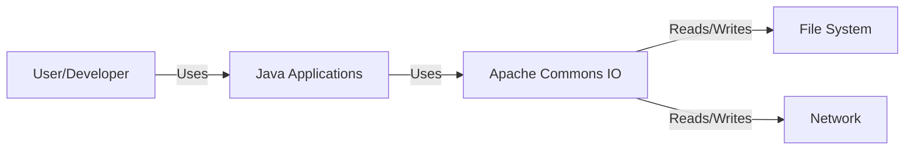
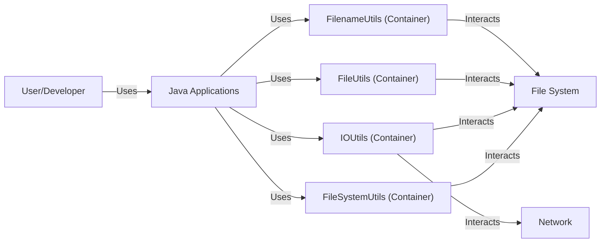
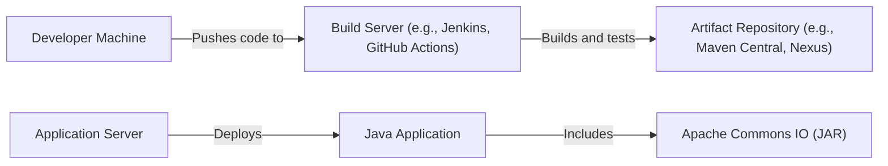
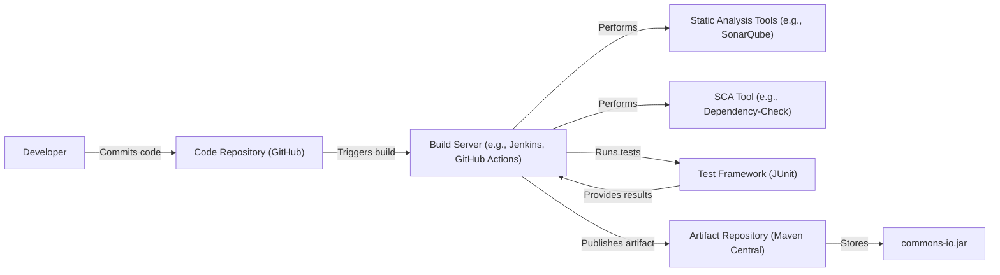

# BUSINESS POSTURE

Business Priorities and Goals:

*   Provide a reusable, high-performance library of utilities for I/O operations in Java.
*   Simplify common I/O tasks for developers, reducing boilerplate code and potential errors.
*   Maintain backward compatibility to ensure existing applications using the library continue to function without modification.
*   Ensure the library is well-tested and reliable for use in production environments.
*   Provide comprehensive documentation and examples to facilitate easy adoption and usage.
*   Foster a community-driven development model, encouraging contributions and feedback from users.

Business Risks:

*   Vulnerabilities in the library could be exploited to compromise applications that use it, potentially leading to data breaches, system compromise, or denial of service.
*   Performance issues or bugs in the library could negatively impact the performance or stability of applications that depend on it.
*   Lack of maintenance or updates could lead to the library becoming obsolete or incompatible with newer Java versions or related libraries.
*   Inadequate documentation or support could hinder adoption and lead to developer frustration.

# SECURITY POSTURE

Existing Security Controls:

*   security control: Code reviews: The project uses a community-driven development model with contributions reviewed by maintainers and other contributors. (Described in contribution guidelines and visible in pull requests on GitHub).
*   security control: Static analysis: The project likely uses static analysis tools as part of its build process, although the specific tools are not explicitly mentioned in the repository's root. (Assumed based on common practice for Java projects).
*   security control: Testing: The project has a comprehensive suite of unit tests to ensure the correctness and reliability of the code. (Visible in the `src/test` directory on GitHub).
*   security control: Dependency management: The project uses Maven for dependency management, which helps to track and manage external libraries. (Defined in the `pom.xml` file).

Accepted Risks:

*   accepted risk: The library handles file system operations, which inherently involve risks related to file permissions, path traversal, and symbolic links. These risks are mitigated through careful coding practices and validation, but some residual risk remains.
*   accepted risk: The library deals with input streams, which could potentially be sources of malicious data. The library does not perform extensive input sanitization, relying on the user to provide valid input.

Recommended Security Controls:

*   security control: Integrate a Software Composition Analysis (SCA) tool to identify known vulnerabilities in third-party dependencies.
*   security control: Implement regular fuzz testing to identify potential vulnerabilities related to unexpected or malformed input.
*   security control: Establish a clear security policy and vulnerability disclosure process.
*   security control: Consider adding security-focused static analysis tools (e.g., FindSecBugs) to the build process.

Security Requirements:

*   Authentication: Not directly applicable, as the library itself does not perform authentication.
*   Authorization: Not directly applicable, as the library does not manage access control.
*   Input Validation:
    *   The library should validate file paths to prevent path traversal vulnerabilities.
    *   The library should handle potentially malicious input streams gracefully, avoiding resource exhaustion or other denial-of-service vulnerabilities.
*   Cryptography:
    *   If the library implements any cryptographic functionality (e.g., checksum calculation), it should use well-established and secure algorithms.
*   Output Encoding: Not directly applicable, as the library primarily deals with binary data and streams.

# DESIGN

## C4 CONTEXT

Element Descriptions:

*   Element:
    *   Name: User/Developer
    *   Type: Person
    *   Description: A developer who uses the Apache Commons IO library in their Java applications.
    *   Responsibilities: Writes and maintains Java applications that utilize the library for I/O operations.
    *   Security controls: Not directly applicable.
*   Element:
    *   Name: Java Applications
    *   Type: Software System
    *   Description: Applications built using the Java programming language.
    *   Responsibilities: Perform various tasks, including I/O operations facilitated by Apache Commons IO.
    *   Security controls: Implement application-specific security controls, including input validation, output encoding, and access control.
*   Element:
    *   Name: Apache Commons IO
    *   Type: Software System (Library)
    *   Description: A library of utilities for I/O operations in Java.
    *   Responsibilities: Provide reusable and efficient methods for handling files, streams, and other I/O-related tasks.
    *   Security controls: Code reviews, static analysis, unit testing, dependency management.
*   Element:
    *   Name: File System
    *   Type: External System
    *   Description: The underlying file system of the operating system.
    *   Responsibilities: Store and retrieve files.
    *   Security controls: Operating system-level file permissions and access controls.
*   Element:
    *   Name: Network
    *   Type: External System
    *   Description: Network resources accessed via streams.
    *   Responsibilities: Transmit and receive data over a network.
    *   Security controls: Network-level security controls, such as firewalls and intrusion detection systems.

## C4 CONTAINER

Element Descriptions:

*   Element:
    *   Name: User/Developer
    *   Type: Person
    *   Description: A developer who uses the Apache Commons IO library in their Java applications.
    *   Responsibilities: Writes and maintains Java applications that utilize the library for I/O operations.
    *   Security controls: Not directly applicable.
*   Element:
    *   Name: Java Applications
    *   Type: Software System
    *   Description: Applications built using the Java programming language.
    *   Responsibilities: Perform various tasks, including I/O operations facilitated by Apache Commons IO.
    *   Security controls: Implement application-specific security controls, including input validation, output encoding, and access control.
*   Element:
    *   Name: FileSystemUtils (Container)
    *   Type: Container (Package/Namespace)
    *   Description: Provides utilities related to file system operations.
    *   Responsibilities: Offers methods for querying file system information, such as free space.
    *   Security controls: Input validation for file paths.
*   Element:
    *   Name: IOUtils (Container)
    *   Type: Container (Package/Namespace)
    *   Description: Provides utilities for working with streams.
    *   Responsibilities: Offers methods for reading, writing, and copying data between streams.
    *   Security controls: Handling of potentially large streams, proper resource closure.
*   Element:
    *   Name: FileUtils (Container)
    *   Type: Container (Package/Namespace)
    *   Description: Provides utilities for working with files.
    *   Responsibilities: Offers methods for reading, writing, copying, deleting, and moving files.
    *   Security controls: Input validation for file paths, handling of file permissions.
*   Element:
    *   Name: FilenameUtils (Container)
    *   Type: Container (Package/Namespace)
    *   Description: Provides utilities for working with file names.
    *   Responsibilities: Offers methods for manipulating file names and extensions, normalizing paths.
    *   Security controls: Input validation for file paths, prevention of path traversal.
*   Element:
    *   Name: File System
    *   Type: External System
    *   Description: The underlying file system of the operating system.
    *   Responsibilities: Store and retrieve files.
    *   Security controls: Operating system-level file permissions and access controls.
*   Element:
    *   Name: Network
    *   Type: External System
    *   Description: Network resources accessed via streams.
    *   Responsibilities: Transmit and receive data over a network.
    *   Security controls: Network-level security controls, such as firewalls and intrusion detection systems.

## DEPLOYMENT

Possible Deployment Solutions:

1.  Embedded within a Java application (most common).
2.  Deployed as a shared library within an application server (e.g., Tomcat, JBoss).
3.  Used within a build tool (e.g., Maven, Gradle) as a dependency.

Chosen Deployment Solution (1. Embedded within a Java application):

Element Descriptions:

*   Element:
    *   Name: Developer Machine
    *   Type: Infrastructure Node
    *   Description: The machine used by developers to write and test code.
    *   Responsibilities: Code development, local testing.
    *   Security controls: Local security measures, such as antivirus and firewall.
*   Element:
    *   Name: Build Server (e.g., Jenkins, GitHub Actions)
    *   Type: Infrastructure Node
    *   Description: A server that automates the build and testing process.
    *   Responsibilities: Compiling code, running tests, creating artifacts.
    *   Security controls: Access controls, secure configuration, vulnerability scanning.
*   Element:
    *   Name: Artifact Repository (e.g., Maven Central, Nexus)
    *   Type: Infrastructure Node
    *   Description: A repository that stores build artifacts (e.g., JAR files).
    *   Responsibilities: Storing and providing access to build artifacts.
    *   Security controls: Access controls, integrity checks, vulnerability scanning.
*   Element:
    *   Name: Application Server
    *   Type: Infrastructure Node
    *   Description: The server where the Java application is deployed.
    *   Responsibilities: Running the Java application.
    *   Security controls: Operating system security, application server security configuration, network security.
*   Element:
    *   Name: Java Application
    *   Type: Software Element
    *   Description: The application that uses Apache Commons IO.
    *   Responsibilities: Performing application-specific tasks.
    *   Security controls: Application-specific security controls.
*   Element:
    *   Name: Apache Commons IO (JAR)
    *   Type: Software Element
    *   Description: The Apache Commons IO library packaged as a JAR file.
    *   Responsibilities: Providing I/O utility functions.
    *   Security controls: Inherited from the build process and deployment environment.

## BUILD

Build Process Description:

1.  Developer commits code changes to the GitHub repository.
2.  The build server (e.g., Jenkins, GitHub Actions) is triggered by the code commit.
3.  The build server checks out the code from the repository.
4.  Static analysis tools (e.g., SonarQube) are run to identify potential code quality and security issues.
5.  A Software Composition Analysis (SCA) tool (e.g., OWASP Dependency-Check) is run to identify known vulnerabilities in third-party dependencies.
6.  The test framework (JUnit) is used to run unit tests.
7.  If all tests pass and the analysis tools report no critical issues, the build server creates the `commons-io.jar` artifact.
8.  The artifact is published to an artifact repository (Maven Central).

Security Controls:

*   security control: Code reviews: Performed by maintainers and contributors before merging code changes.
*   security control: Static analysis: Used to identify potential code quality and security issues.
*   security control: Software Composition Analysis (SCA): Used to identify known vulnerabilities in dependencies.
*   security control: Unit testing: Ensures the correctness and reliability of the code.
*   security control: Build automation: Ensures a consistent and repeatable build process.
*   security control: Artifact signing: (Recommended) The JAR file should be digitally signed to ensure its integrity and authenticity.

# RISK ASSESSMENT

Critical Business Processes:

*   Reliable I/O operations within Java applications. The library is a foundational component, and its failure can impact a wide range of applications.

Data Protection:

*   Data Sensitivity: The library itself does not handle sensitive data directly. However, it is used to read and write data from various sources (files, network streams), which *could* contain sensitive information. The sensitivity of the data depends on the specific application using the library.
*   Data Types: The library handles primarily binary data (streams) and text data (file content). The specific types of data processed depend on the application using the library.

# QUESTIONS & ASSUMPTIONS

Questions:

*   Are there any specific compliance requirements (e.g., PCI DSS, HIPAA) that applications using this library typically need to meet?
*   What are the typical deployment environments for applications using this library (e.g., cloud, on-premise)?
*   What is the expected volume of data processed by applications using this library?
*   Are there any specific performance requirements for the library?
*   What is the process for reporting and addressing security vulnerabilities discovered in the library?

Assumptions:

*   BUSINESS POSTURE: The project prioritizes stability, reliability, and backward compatibility.
*   SECURITY POSTURE: The project follows common secure coding practices, but may not have a formal security program.
*   DESIGN: The library is primarily used as an embedded dependency within Java applications. The primary users are Java developers. The library interacts with the file system and network streams. The build process includes static analysis and unit testing.