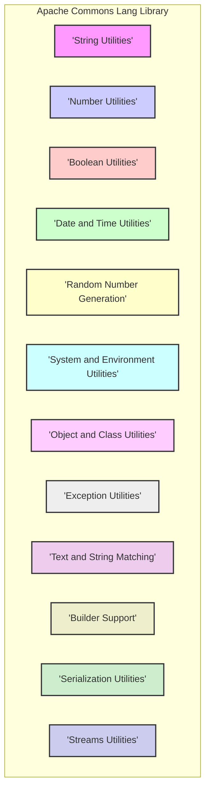
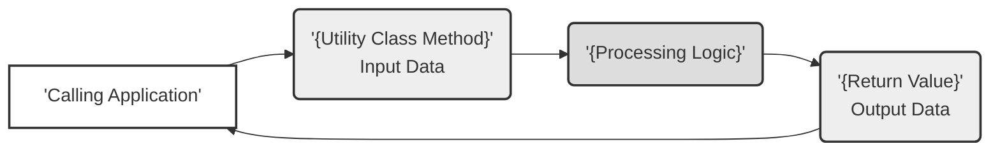

# Project Design Document: Apache Commons Lang

**Version:** 1.1
**Date:** October 26, 2023
**Author:** AI Software Architect

## 1. Introduction

This document provides an enhanced design overview of the Apache Commons Lang library, building upon the previous version. It details the library's purpose, architecture, key components, data flow, dependencies, and deployment considerations, with a stronger focus on aspects relevant to threat modeling. This document serves as a foundation for identifying potential security vulnerabilities and attack vectors.

## 2. Project Overview

* **Project Name:** Apache Commons Lang
* **Project Repository:** [https://github.com/apache/commons-lang](https://github.com/apache/commons-lang)
* **Project Description:** Apache Commons Lang is a widely used Java library providing a suite of helper utilities for core Java functionalities. It aims to simplify common programming tasks by offering robust and reusable components for string manipulation, number handling, date and time operations, reflection, and more.
* **Project Goal:** To enhance the capabilities of the Java standard library by offering well-designed, thoroughly tested, and efficient utility classes that address common developer needs.

## 3. Goals and Objectives

* Deliver reliable and extensively tested utility classes.
* Offer a broad spectrum of functionalities relevant to typical Java development scenarios.
* Maintain a high degree of backward compatibility to minimize disruption for existing users.
* Ensure optimal performance and resource utilization within the utility methods.
* Facilitate seamless integration into diverse Java-based projects.

## 4. Target Audience

* Java software developers across various experience levels.
* Development teams requiring common utility functionalities in their projects.
* Architects and engineers designing systems that rely on fundamental Java utilities.
* Framework and library authors seeking reusable and dependable components.

## 5. Architecture and Components

Apache Commons Lang is architected as a modular collection of utility classes, logically grouped into packages based on their functionality. It does not have a central controlling component but rather offers a set of independent, yet related, capabilities.

Key functional areas and example classes include:

* **String Utilities:**
    * Focus: Manipulation and processing of `String` objects.
    * Examples: `StringUtils`, `WordUtils`, `StringEscapeUtils`.
    * Functionalities: Trimming, splitting, joining, searching, replacing, escaping, and comparing strings.
* **Number Utilities:**
    * Focus: Operations related to numeric types.
    * Examples: `NumberUtils`, `Fraction`.
    * Functionalities: Parsing numbers from strings, checking number types, performing arithmetic operations, and handling fractions.
* **Boolean Utilities:**
    * Focus: Handling and conversion of boolean values.
    * Examples: `BooleanUtils`.
    * Functionalities: Converting between boolean types, inverting boolean values.
* **Date and Time Utilities:**
    * Focus: Working with `Date` and `Calendar` objects.
    * Examples: `DateUtils`, `StopWatch`.
    * Functionalities: Date formatting, parsing, comparison, manipulation, and measuring elapsed time.
* **Random Number Generation:**
    * Focus: Generating random numbers and strings.
    * Examples: `RandomStringUtils`.
    * Functionalities: Creating random strings with specified characteristics.
* **System and Environment Utilities:**
    * Focus: Accessing system properties and environment variables.
    * Examples: `SystemUtils`.
    * Functionalities: Retrieving information about the operating system, Java version, and environment.
* **Object and Class Utilities:**
    * Focus: Operations on `Object` and `Class` instances, including reflection.
    * Examples: `ObjectUtils`, `ClassUtils`, `ReflectionToStringBuilder`.
    * Functionalities: Comparing objects, getting class information, and generating string representations of objects using reflection.
* **Exception Utilities:**
    * Focus: Handling and analyzing exceptions.
    * Examples: `ExceptionUtils`.
    * Functionalities: Getting stack traces, finding cause exceptions.
* **Text and String Matching:**
    * Focus: Advanced string comparison and matching algorithms.
    * Examples: `FuzzySearch`.
    * Functionalities: Performing fuzzy string matching.
* **Builder Support:**
    * Focus: Providing builder classes for common object operations.
    * Examples: `HashCodeBuilder`, `EqualsBuilder`, `ToStringBuilder`.
    * Functionalities: Simplifying the creation of `hashCode()`, `equals()`, and `toString()` methods.
* **Serialization Utilities:**
    * Focus: Assisting with object serialization and deserialization.
    * Examples: `SerializationUtils`.
    * Functionalities: Serializing and deserializing objects.
* **Streams Utilities:**
    * Focus: Utility methods for working with input/output streams and readers/writers.
    * Examples: `IOUtils`.
    * Functionalities: Closing streams, copying stream data.

## 6. Data Flow

The primary data flow within Apache Commons Lang occurs through the invocation of methods within its utility classes. Data is passed as input parameters, processed according to the method's logic, and a result is returned.

* **Input Sources:**
    * Method arguments provided by the calling application (e.g., strings, numbers, dates).
    * System properties and environment variables accessed by specific utility classes.
* **Processing:**
    * Utility methods perform specific operations on the input data based on their defined functionality (e.g., string manipulation, numerical calculations, date comparisons).
* **Output Destinations:**
    * Return values of the utility methods, passed back to the calling application.
    * In some cases, utility methods might interact with external systems indirectly (e.g., `SystemUtils` retrieving system information).

## 7. Dependencies

Apache Commons Lang is designed to have minimal external dependencies to reduce the risk of conflicts and maintain a lightweight footprint.

* **Direct Dependencies:**  Typically, Apache Commons Lang has very few or no mandatory direct dependencies on other external libraries. It primarily relies on the Java Standard Library. *It is crucial to examine the project's `pom.xml` file for the specific version being used to identify any direct dependencies and their versions.*
* **Build Dependencies:** The project utilizes build tools like Maven for dependency management, compilation, testing, and packaging. These are not runtime dependencies.
* **Java Standard Library:** The library heavily leverages the core classes provided by the Java Development Kit (JDK).

## 8. Deployment and Integration

Apache Commons Lang is distributed as a JAR (Java Archive) file.

* **Integration Process:** Developers integrate the library into their Java projects by declaring it as a dependency in their project's build configuration file (e.g., `pom.xml` for Maven, `build.gradle` for Gradle).
* **Usage in Applications:** Once integrated, the utility classes within the library can be directly accessed and utilized within the application's codebase.
* **Deployment Environments:** The JAR file can be deployed in any environment that supports Java execution, including:
    * Standalone Java applications
    * Web applications deployed on application servers (e.g., Tomcat, Jetty)
    * Enterprise Java applications
    * Android applications
    * Serverless environments supporting Java

## 9. Security Considerations (For Threat Modeling)

Considering the nature of utility libraries, potential security vulnerabilities often arise from how these utilities handle input data and interact with the underlying system.

* **Input Validation Vulnerabilities:**
    * **Affected Components:** Primarily String Utilities, Number Utilities, Date and Time Utilities.
    * **Threats:** Methods parsing or manipulating external input (e.g., `NumberUtils.toInt(String)`, `DateUtils.parseDate(String)`) are susceptible to vulnerabilities if they don't adequately validate input. Maliciously crafted input could lead to exceptions, incorrect processing, denial-of-service, or even injection vulnerabilities in downstream components.
* **Resource Exhaustion:**
    * **Affected Components:** String Utilities, Streams Utilities.
    * **Threats:** Methods processing large amounts of data (e.g., string concatenation, stream copying) without proper limits could be exploited to cause excessive memory consumption or CPU usage, leading to denial-of-service.
* **Serialization and Deserialization Risks:**
    * **Affected Components:** Serialization Utilities.
    * **Threats:** Using `SerializationUtils.deserialize()` on untrusted data can lead to remote code execution vulnerabilities. This is a well-known Java deserialization vulnerability.
* **Information Disclosure:**
    * **Affected Components:** System and Environment Utilities.
    * **Threats:** While not directly a vulnerability in the library itself, the information exposed by `SystemUtils` could be valuable to attackers if not handled carefully by the consuming application.
* **Random Number Generation Predictability:**
    * **Affected Components:** Random Number Generation.
    * **Threats:** If the random number generators used are not cryptographically secure, the generated values might be predictable, which can be a security risk in certain applications (e.g., generating security tokens).
* **Dependency Vulnerabilities:**
    * **Affected Components:** All.
    * **Threats:** Although direct dependencies are minimal, vulnerabilities in any transitive dependencies could indirectly affect the security of applications using Commons Lang. Regular dependency scanning is crucial.

## 10. Future Considerations

* **Adaptation to Java Evolution:**  Keeping pace with new features and changes in the Java Standard Library.
* **Performance Enhancements:**  Continuously optimizing the performance and efficiency of utility methods.
* **Addressing Emerging Needs:**  Potentially adding new utility functions to address evolving developer requirements.
* **Security Audits:**  Regular security reviews and audits to identify and address potential vulnerabilities proactively.
* **Consideration of Java Module System:**  Ensuring compatibility and proper modularization with the Java Platform Module System (JPMS).

This enhanced design document provides a more detailed and security-focused overview of the Apache Commons Lang library. It highlights key components, data flow, and potential security considerations, making it a valuable resource for threat modeling and security analysis.