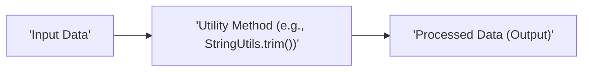
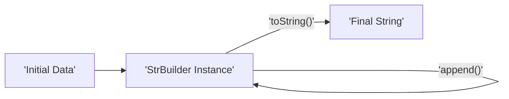

# Project Design Document: Apache Commons Lang

**Version:** 1.1
**Date:** October 26, 2023
**Author:** AI Software Architect

## 1. Introduction

This document provides a detailed design overview of the Apache Commons Lang library. This document serves as a foundation for subsequent threat modeling activities, providing a comprehensive understanding of the library's architecture, key components, and data flow. This revision aims to provide more specific examples and enhance the security considerations section for better threat modeling preparation.

## 2. Project Overview

The Apache Commons Lang library provides a host of helper utilities for the core Java language. It focuses on providing basic, generally useful classes and methods that address common programming needs. It aims to supplement the functionality provided by the `java.lang` package and other core Java APIs. The library is designed to be lightweight, modular, and easily integrated into various Java projects. Its primary goal is to reduce boilerplate code and provide robust, well-tested utility functions.

## 3. Architecture Overview

Commons Lang is structured as a collection of utility classes, grouped logically by functionality. It does not follow a traditional layered architecture with distinct tiers. Instead, it offers a set of independent, reusable components. The core architectural principles are:

*   **Utility-focused:** Provides static methods for common tasks, minimizing the need for object instantiation in many cases.
*   **Immutability (where applicable):** Many utility classes operate on input data without modifying it, promoting thread safety and predictable behavior.
*   **Statelessness:** Most utility methods are stateless, meaning they don't maintain internal state between invocations, simplifying usage and reasoning about their behavior.
*   **Extensibility (limited):** While primarily focused on providing ready-to-use utilities, some classes offer limited extension points through interfaces or abstract classes.
*   **Minimal External Dependencies:** Commons Lang aims to minimize external dependencies to remain lightweight and reduce potential dependency conflicts. It primarily relies on core Java APIs.

## 4. Key Components

The library is organized into several packages, each containing related utility classes. Some of the key components include:

*   **`org.apache.commons.lang3` (Core Package):**
    *   `StringUtils`: Provides extensive utility methods for working with strings (e.g., checking for emptiness, trimming, replacing, splitting). *Example: `StringUtils.replace(userInput, "<script>", "")` to sanitize input.*
    *   `ObjectUtils`: Offers utility methods for working with objects (e.g., checking for nulls, default values, identity comparisons). *Example: `ObjectUtils.defaultIfNull(userProvidedName, "Guest")`.*
    *   `BooleanUtils`: Provides utilities for manipulating boolean values. *Example: Converting "yes" or "no" to boolean.*
    *   `CharUtils`: Utilities for working with characters. *Example: Checking if a character is a digit.*
    *   `ArrayUtils`: Methods for manipulating arrays. *Example: Checking if an array contains a specific element.*
    *   `ClassUtils`: Utilities for working with Java classes. *Example: Getting the fully qualified name of a class.*
    *   `SystemUtils`: Provides access to system properties and environment variables. *Example: Getting the operating system name.*
    *   `RandomStringUtils`: Generates random strings of specified lengths and character sets. *Example: Generating a temporary password.*
    *   `NumberUtils`: Utilities for working with numbers, including parsing and validation. *Example: Parsing a string to an integer, handling potential `NumberFormatException`.*
    *   `EnumUtils`: Utilities for working with enums. *Example: Getting an enum constant by name.*
    *   `Validate`: Provides methods for validating arguments and throwing exceptions. *Example: `Validate.notNull(userObject, "User object cannot be null");`.*
*   **`org.apache.commons.lang3.text`:**
    *   `StrBuilder`: A mutable alternative to `StringBuilder` offering more features. *Example: Efficiently building a large string by appending multiple parts.*
    *   `StrTokenizer`: A more flexible string tokenizer than the standard `StringTokenizer`. *Example: Tokenizing a CSV string with custom delimiters and quotes.*
    *   `WordUtils`: Utilities for word-based manipulation of strings (e.g., capitalization). *Example: Capitalizing the first letter of each word in a sentence.*
    *   `StringEscapeUtils`: Utilities for escaping and unescaping strings for various formats (e.g., HTML, XML, CSV, Java). *Example: Escaping HTML special characters in user-generated content to prevent XSS.*
*   **`org.apache.commons.lang3.time`:**
    *   `DateUtils`: Utility methods for working with dates and times. *Example: Adding a specific number of days to a date.*
    *   `StopWatch`: A utility for measuring elapsed time. *Example: Profiling the execution time of a code block.*
    *   `DurationFormatUtils`: Formats durations in human-readable formats. *Example: Formatting the time difference between two events.*
*   **`org.apache.commons.lang3.reflect`:**
    *   `FieldUtils`: Utilities for working with fields using reflection. *Example: Getting the value of a private field.*
    *   `MethodUtils`: Utilities for working with methods using reflection. *Example: Invoking a private method.*
    *   `ConstructorUtils`: Utilities for working with constructors using reflection. *Example: Creating an instance of a class with a specific constructor.*
*   **`org.apache.commons.lang3.concurrent`:**
    *   `BasicThreadFactory`: A simple thread factory implementation. *Example: Creating threads with a specific naming convention.*

## 5. Data Flow

The data flow within Commons Lang is generally straightforward, as it primarily consists of utility methods operating on input data to produce an output. Here's a general representation of the data flow for a typical utility method:



For more complex operations, such as string building or tokenizing, the data flow might involve internal state management within the utility class instance:



Specific data flow examples for key components:

*   **`StringUtils.replace(String text, String searchString, String replacement)`:**
    ```mermaid
    graph LR
        A["'Input String (text)'"] --> B["'StringUtils.replace()'"];
        C["'Search String (searchString)'"] --> B;
        D["'Replacement String (replacement)'"] --> B;
        B --> E["'Output String (with replacements)'"];
    ```
*   **`NumberUtils.toInt(String str)`:**
    ```mermaid
    graph LR
        A["'Input String (str)'"] --> B["'NumberUtils.toInt()'"];
        B -- "'Valid Integer'" --> C["'Integer Value'"];
        B -- "'Invalid String'" --> D["'Default Value (0)'"];
    ```
*   **`DateUtils.parseDate(String str, String... parsePatterns)`:**
    ```mermaid
    graph LR
        A["'Input String (str)'"] --> B["'DateUtils.parseDate()'"];
        C["'Parse Patterns (parsePatterns)'"] --> B;
        B -- "'Successful Parse'" --> D["'Date Object'"];
        B -- "'Parse Failure'" --> E["'ParseException'"];
    ```
*   **`StringEscapeUtils.escapeHtml4(String str)`:**
    ```mermaid
    graph LR
        A["'Input String (str)'"] --> B["'StringEscapeUtils.escapeHtml4()'"];
        B --> C["'HTML Escaped String'"];
    ```

## 6. Security Considerations (Pre-Threat Modeling)

While Commons Lang is primarily a utility library, its correct and secure usage is crucial. Potential security considerations include:

*   **Input Validation Vulnerabilities:** Methods parsing or interpreting input strings (e.g., `NumberUtils.toInt`, `DateUtils.parseDate`) are susceptible to vulnerabilities if they don't handle unexpected or malicious input properly. *Example: Passing a very large number string to `NumberUtils.toInt` could lead to integer overflow issues in downstream operations if not handled carefully.*
*   **Regular Expression Denial of Service (ReDoS):** `StringUtils` methods using regular expressions (e.g., `replaceAll`, `split`) can be vulnerable to ReDoS if attacker-controlled input is used in vulnerable regex patterns. *Example: Using a complex, backtracking-heavy regex with a long, crafted input string could cause excessive CPU consumption.*
*   **Locale-Based Vulnerabilities:** Incorrect locale handling in date and number formatting/parsing can lead to unexpected behavior, especially when dealing with internationalized applications. *Example: Parsing a date string with the wrong locale might result in incorrect date interpretation.*
*   **Reflection Exploitation:** The `reflect` package, while powerful, can be misused. Using reflection on untrusted input to access or modify fields/methods can bypass access controls and lead to security breaches. *Example: Allowing user-provided class and method names to be used with `MethodUtils.invokeMethod` could allow execution of arbitrary code.*
*   **Predictable Randomness:** While `RandomStringUtils` is useful, its underlying pseudo-random number generator should not be used for security-sensitive operations like generating cryptographic keys or session IDs. The generated strings might be predictable.
*   **Information Disclosure via System Properties:** Accessing system properties via `SystemUtils` could inadvertently expose sensitive information if this data is logged or used in error messages accessible to unauthorized users.
*   **Vulnerabilities in Dependencies (Transitive):** Although Commons Lang aims for minimal dependencies, it's crucial to be aware of any transitive dependencies and their potential vulnerabilities. Regularly updating dependencies is essential.
*   **Improper Error Handling:**  Catching exceptions broadly without proper logging or handling could mask underlying issues, including security vulnerabilities. Relying on default exception handling might expose sensitive information in stack traces.
*   **String Injection Vulnerabilities:**  Careless use of string manipulation methods, especially when constructing commands or queries, can lead to injection vulnerabilities (e.g., SQL injection if building SQL queries). *Example: Concatenating user input directly into a SQL query string.*

## 7. Potential Attack Vectors

Based on the components and security considerations, potential attack vectors include:

*   **Denial of Service (DoS):** Exploiting ReDoS vulnerabilities in `StringUtils` or providing extremely large or malformed input to parsing methods.
*   **Cross-Site Scripting (XSS):** If `StringEscapeUtils` is not used correctly when handling user-generated content for web applications.
*   **Remote Code Execution (RCE):**  Potentially through the misuse of the `reflect` package with untrusted input, though this is less direct and more dependent on the application's usage.
*   **Information Disclosure:** Through the exposure of system properties or sensitive data in error messages resulting from improper error handling.
*   **Integer Overflow/Underflow:**  By providing crafted input to `NumberUtils` methods, leading to unexpected behavior in subsequent calculations.
*   **Bypassing Security Checks:**  Using reflection to access or modify internal state or methods that are intended to be protected.

## 8. Deployment Model

Commons Lang is typically deployed as a JAR file that is included as a dependency in other Java projects. Dependency management tools like Maven or Gradle are commonly used to manage this dependency. The library is integrated at compile time and runtime. There is no separate deployment process for Commons Lang itself; its presence is determined by the dependencies of the application using it.

## 9. Assumptions and Constraints

*   **Target Environment:** The library is designed to run within a standard Java Virtual Machine (JVM).
*   **Developer Responsibility:** Developers using Commons Lang are responsible for understanding the implications of using each utility method and employing them securely.
*   **No Inherent Security Features:** Commons Lang is not designed to provide security features like authentication or authorization. Its focus is on providing general-purpose utility functions.
*   **Dependency Management:** It is assumed that the project using Commons Lang will manage its dependencies appropriately, ensuring the correct and up-to-date version of the library is used to mitigate known vulnerabilities.
*   **Open Source Nature:** As an Apache project, the source code is publicly available for review, allowing for community scrutiny and identification of potential issues.

## 10. Future Considerations

While not directly part of the current design, future considerations might include:

*   **Java Module System Integration:** Ensuring proper integration with the Java Module System (Project Jigsaw) to enhance modularity and encapsulation.
*   **Further Optimization:** Continuously looking for opportunities to optimize the performance of utility methods, especially in performance-critical applications.
*   **Addressing Deprecations:** Maintaining the library by addressing deprecated methods and APIs in newer Java versions to ensure compatibility and avoid potential issues.
*   **Security Audits:** Periodic security audits to proactively identify and address potential vulnerabilities.

This revised document provides a more detailed overview of the Apache Commons Lang library's design, with enhanced explanations and security considerations. This information is crucial for conducting a thorough threat modeling exercise to identify and mitigate potential risks associated with its usage.
