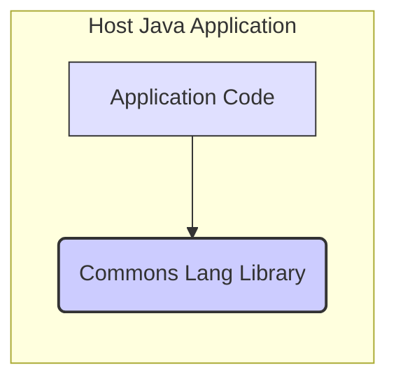
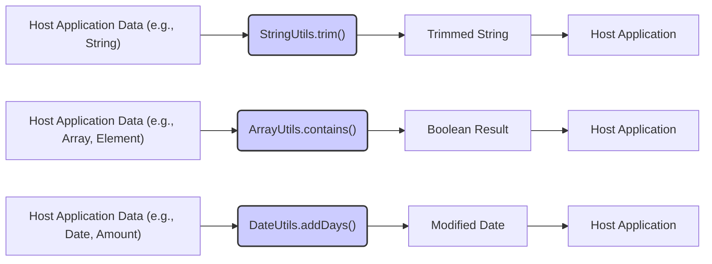

# Project Design Document: Apache Commons Lang

**Version:** 1.1
**Date:** October 26, 2023
**Author:** AI Software Architect

## 1. Introduction

This document provides an enhanced design overview of the Apache Commons Lang library, accessible at [https://github.com/apache/commons-lang](https://github.com/apache/commons-lang). This revised document aims to offer a more detailed and nuanced understanding of the library's architecture, key components, and data flow, specifically tailored for effective threat modeling.

## 2. Project Overview

Apache Commons Lang is a foundational library of Java utility classes. It offers a rich set of helper methods designed to streamline common programming tasks. These utilities span areas like string manipulation, number handling, date and time operations, object reflection, and more. The library's core objective is to reduce repetitive coding, enhance code clarity, and improve the overall robustness of Java applications. It is intentionally designed to be lightweight and minimize its reliance on external dependencies.

## 3. Goals and Objectives

*   To furnish Java developers with a comprehensive suite of reusable and reliable utility classes.
*   To simplify frequently encountered programming tasks, thereby increasing developer efficiency.
*   To promote code readability and reduce redundancy across Java projects.
*   To uphold rigorous standards of code quality, stability, and maintainability.
*   To minimize the number of external dependencies, reducing potential conflicts and security concerns.
*   To ensure seamless integration into a diverse range of Java project types.

## 4. Target Audience

The primary audience for Apache Commons Lang encompasses Java developers with varying levels of experience who are engaged in building a wide spectrum of Java applications, including but not limited to:

*   Web applications (utilizing frameworks like Spring, Jakarta EE, etc.)
*   Standalone desktop applications (e.g., using Swing or JavaFX)
*   Mobile applications developed for the Android platform
*   Backend services and microservices
*   Software libraries and frameworks intended for use by other developers

## 5. System Architecture

Apache Commons Lang is architected as a collection of independent, focused utility classes, logically grouped into packages based on their functionality. It is designed to be directly embedded and utilized within a host Java application. The library does not operate as a standalone entity or require separate deployment.

*   **Host Java Application:** Represents any Java application that incorporates and leverages the functionalities provided by the Apache Commons Lang library. This is the context in which the library operates.
*   **Commons Lang Library:** The library itself, containing the various utility classes organized into packages.

## 6. Key Components

The library is meticulously organized into several packages, each dedicated to a specific category of utility functions. Key component areas include:

*   **`org.apache.commons.lang3` (Core Utilities):** The central package housing fundamental utility classes.
    *   `StringUtils`: Offers a wide array of methods for string manipulation, such as:
        *   `isBlank(String str)`: Checks if a string is null, empty, or contains only whitespace.
        *   `trim(String str)`: Removes leading and trailing whitespace from a string.
        *   `replace(String text, String searchString, String replacement)`: Replaces all occurrences of a substring within a string.
    *   `ObjectUtils`: Provides utilities for working with objects:
        *   `isNull(Object obj)`: Checks if an object is null.
        *   `defaultIfNull(T object, T defaultValue)`: Returns the object if it's not null, otherwise returns the default value.
        *   `identityToString(Object object)`: Gets the toString of an Object returning nullText ("<null>") if null.
    *   `ArrayUtils`: Offers utilities for array manipulation:
        *   `contains(Object[] array, Object objectToFind)`: Checks if an array contains a specific element.
        *   `add(Object[] array, Object element)`: Adds an element to the end of an array.
        *   `remove(Object[] array, int index)`: Removes the element at a specific index in an array.
    *   `BooleanUtils`: Provides utilities for working with boolean values and their string representations.
    *   `NumberUtils`: Offers utilities for working with numbers:
        *   `isCreatable(String str)`: Checks if a string is a valid representation of a number.
        *   `toInt(String str, int defaultValue)`: Converts a string to an integer, returning a default value if the conversion fails.
    *   `CharUtils`: Provides utilities for working with characters and their numeric representations.
    *   `SystemUtils`: Provides information about the system environment the application is running in.
    *   `RandomStringUtils`: Offers methods for generating random strings of various types and lengths.
*   **`org.apache.commons.lang3.text` (Advanced Text Processing):** Contains classes for more sophisticated text manipulation.
    *   `StrBuilder`: Provides an efficient and mutable way to build strings, minimizing object creation.
    *   `StringEscapeUtils`: Offers methods for escaping and unescaping strings for different formats:
        *   `escapeHtml4(String str)`: Escapes characters for use in HTML 4.0.
        *   `unescapeXml(String str)`: Unescapes XML entities.
    *   `WordUtils`: Provides utilities for manipulating words within strings, such as wrapping text or capitalizing words.
*   **`org.apache.commons.lang3.time` (Date and Time Utilities):** Contains classes for working with dates and times.
    *   `DateUtils`: Offers utility methods for date manipulation:
        *   `addDays(Date date, int amount)`: Adds a specified number of days to a date.
        *   `isSameDay(Date date1, Date date2)`: Checks if two dates fall on the same day.
    *   `DurationFormatUtils`: Provides utilities for formatting time durations into human-readable strings.
    *   `StopWatch`: A utility for measuring elapsed time, useful for performance analysis.
*   **`org.apache.commons.lang3.reflect` (Reflection Utilities):** Contains classes that simplify working with Java reflection.
    *   `FieldUtils`: Provides utility methods for accessing and manipulating fields of objects.
    *   `MethodUtils`: Provides utility methods for invoking methods on objects.
*   **`org.apache.commons.lang3.concurrent` (Concurrency Utilities):** Contains utility classes to aid in concurrent programming.
    *   `BasicThreadFactory`: A straightforward implementation of a thread factory.
*   **`org.apache.commons.lang3.builder` (Object Builders):** Contains classes to assist in generating standard object methods.
    *   `ToStringBuilder`: Simplifies the creation of meaningful `toString()` methods.
    *   `EqualsBuilder`: Helps in implementing correct `equals()` methods.
    *   `HashCodeBuilder`: Assists in implementing consistent `hashCode()` methods.
*   **`org.apache.commons.lang3.tuple` (Tuple Classes):** Contains classes representing ordered lists of elements.
    *   `Pair`: Represents a tuple of two elements.
    *   `Triple`: Represents a tuple of three elements.
*   **`org.apache.commons.lang3.exception` (Exception Utilities):** Contains utilities for working with exceptions.
    *   `ExceptionUtils`: Provides methods for analyzing and manipulating exceptions, such as retrieving stack traces.

## 7. Data Flow

The data flow within Apache Commons Lang involves passing data to its utility methods as arguments and receiving the processed data as the method's return value. The library itself does not inherently manage data persistence or engage in direct communication with external systems. The data's lifecycle is managed by the host application.

*   **Host Application Data (e.g., String):** Data originating from the host application that requires processing by a Commons Lang utility method. The type of data varies depending on the utility being used.
*   **Commons Lang Utility Method (e.g., `StringUtils.trim()`):** A specific method within the library that performs an operation on the input data.
*   **Processed Data (e.g., Trimmed String):** The result of the operation performed by the utility method. The data type of the processed data depends on the function of the utility method.
*   **Host Application:** The host application receives the processed data and continues its execution.

**Detailed Data Flow Examples:**

*   A user-provided string from a web form (within the Host Application) is passed to `StringUtils.trim()` to remove leading/trailing whitespace before further processing. The trimmed string is then used by the application.
*   An array of allowed values and a user-provided input (both within the Host Application) are passed to `ArrayUtils.contains()` to validate if the input is within the allowed set. The boolean result determines the subsequent application logic.
*   A date representing a scheduled event and an integer representing the number of days to offset (both within the Host Application) are passed to `DateUtils.addDays()`. The resulting modified date is then used to update a calendar or schedule.

## 8. Security Considerations

While Apache Commons Lang is primarily a utility library and does not directly handle sensitive data storage or network communication, its usage within a larger application introduces potential security considerations:

*   **Input Validation Vulnerabilities:** Methods like `NumberUtils.toInt()` or parsing methods in `DateUtils` rely on the host application providing correctly formatted input. If the host application fails to sanitize external input, malicious users could provide unexpected or malformed data, potentially leading to exceptions, incorrect program behavior, or even denial-of-service conditions. For example, providing an extremely large string to `NumberUtils.toInt()` could lead to resource exhaustion.
*   **Resource Exhaustion through String Manipulation:** Methods in `StringUtils` like `replace()` or operations within `StrBuilder`, if used with extremely large strings or in loops without proper size limits, could lead to excessive memory consumption or CPU usage, resulting in a denial-of-service.
*   **Cross-Site Scripting (XSS) via Improper Escaping:**  If `StringEscapeUtils` methods like `escapeHtml4()` are used incorrectly or inconsistently within the host application, it could lead to XSS vulnerabilities. For instance, if data is escaped for HTML but then used in a JavaScript context without further escaping, it could introduce security flaws.
*   **Weak Random Number Generation:** If `RandomStringUtils` is used for generating security-sensitive values like temporary passwords or tokens, the default `java.util.Random` might not be cryptographically secure enough for certain applications. Developers should be aware of this and consider using more robust random number generators if necessary.
*   **Reflection Abuse:** While `MethodUtils` and `FieldUtils` provide convenient ways to use reflection, improper use in the host application could bypass access controls or lead to unexpected behavior if used on untrusted data or objects.
*   **Dependency Vulnerabilities:** Although Commons Lang aims for minimal dependencies, vulnerabilities in its own code or any transitive dependencies could pose a risk to the host application. Regular updates and security scanning of the library are crucial.

## 9. Dependencies

Apache Commons Lang is designed to have a minimal set of external dependencies, primarily relying on the standard Java Development Kit (JDK). This reduces the risk of dependency conflicts and simplifies integration. To determine the exact dependencies for a specific version, refer to the project's build configuration file (e.g., `pom.xml` for Maven projects or `build.gradle` for Gradle projects).

## 10. Deployment

Apache Commons Lang is distributed as a JAR (Java Archive) file. It is integrated into a Java project by including this JAR file as a dependency during the build process. Common methods for including the dependency are:

*   **Maven:** Adding the appropriate dependency declaration to the project's `pom.xml` file.
*   **Gradle:** Adding the dependency to the project's `build.gradle` file.
*   **Manual Inclusion:** Placing the JAR file in the project's classpath.

The library itself is not deployed as a standalone application or service. It is always deployed as part of a larger Java application.

## 11. Future Considerations

Potential future developments and enhancements for Apache Commons Lang might include:

*   Introducing new utility classes to address evolving Java features and common programming needs.
*   Optimizing the performance of existing utility methods for improved efficiency.
*   Refining the package structure for enhanced organization and maintainability.
*   Addressing any reported bugs or security vulnerabilities promptly.
*   Exploring the possibility of providing more specialized utility classes tailored for specific domains or use cases.

This enhanced design document provides a more detailed and nuanced understanding of the Apache Commons Lang library, specifically focusing on aspects relevant to threat modeling. This information will be instrumental in identifying and mitigating potential security risks associated with its integration into Java applications.