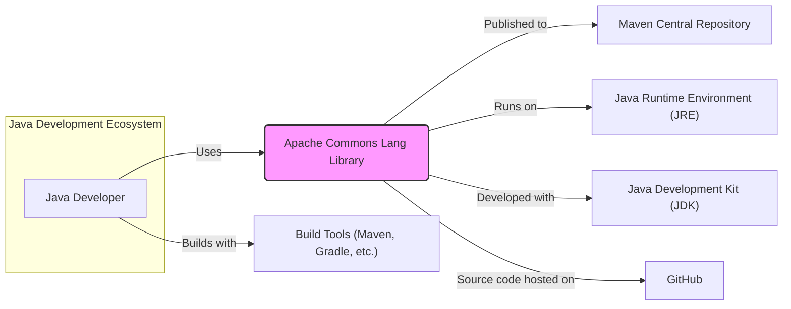
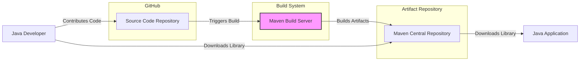
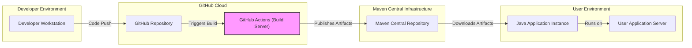
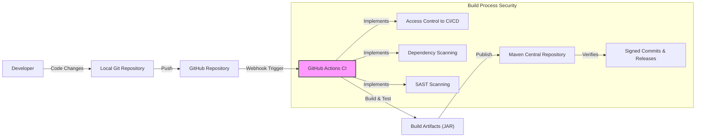

# BUSINESS POSTURE

The Apache Commons Lang library aims to provide a suite of helper utilities for the core Java language. It focuses on providing reusable, robust, and efficient components that address common programming needs, thereby enhancing developer productivity and code quality in Java projects.

Business Priorities:
- Maintain and enhance a widely used and trusted library of Java utility classes.
- Ensure compatibility with various Java versions and environments.
- Provide stable and reliable components to minimize disruptions for users.
- Foster community contributions and maintain an active project.

Business Goals:
- Increase developer efficiency by offering pre-built, well-tested utility functions.
- Reduce code duplication across Java projects by providing reusable components.
- Improve the overall quality and maintainability of Java applications that utilize the library.
- Expand the library's functionality to address evolving developer needs.

Business Risks:
- Security vulnerabilities within the library could be exploited in applications that depend on it, leading to potential security breaches and reputational damage.
- Compatibility issues with new Java versions or other popular libraries could reduce adoption and user satisfaction.
- Performance inefficiencies in the library could negatively impact the performance of applications using it.
- Lack of maintenance or slow response to bug fixes and security issues could erode user trust and project reputation.

# SECURITY POSTURE

Existing Security Controls:
- security control: Version Control - Source code is managed using Git on GitHub, providing traceability and history of changes. Implemented in: GitHub repository.
- security control: Public Issue Tracker - Bug reports and feature requests are publicly tracked on GitHub Issues, allowing for community involvement and transparency. Implemented in: GitHub repository.
- security control: Code Review - Contributions are likely reviewed by project committers before being merged into the main branch to ensure code quality and identify potential issues. Implemented in: Project development process (assumed).
- security control: Build Automation - The project likely uses Maven or a similar build tool for automated building, testing, and packaging. Implemented in: Project build scripts (pom.xml).
- security control: Unit and Integration Testing - The project likely includes unit and integration tests to ensure the functionality and stability of the library components. Implemented in: Project source code and build process.

Accepted Risks:
- accepted risk: Open Source Vulnerability Disclosure - As an open-source project, vulnerabilities may be publicly disclosed before a patch is available, potentially increasing the window of exploitation.
- accepted risk: Community Contribution Security - Reliance on community contributions may introduce security vulnerabilities if contributions are not thoroughly vetted.
- accepted risk: Dependency Vulnerabilities - The library itself may depend on other libraries that could have vulnerabilities.

Recommended Security Controls:
- security control: Static Application Security Testing (SAST) - Integrate SAST tools into the build process to automatically scan the codebase for potential security vulnerabilities.
- security control: Dependency Vulnerability Scanning - Implement dependency scanning to identify and manage vulnerabilities in third-party libraries used by the project.
- security control: Security Audits - Conduct periodic security audits by external security experts to identify and address potential security weaknesses.
- security control: Input Validation and Sanitization - Emphasize and enforce robust input validation and sanitization practices across all utility functions to prevent common vulnerabilities like injection attacks.

Security Requirements:
- Authentication:
    - Requirement: Secure authentication mechanisms for project committers to manage the repository and release artifacts.
    - Requirement: Consider signing commits and releases to ensure authenticity and integrity.
- Authorization:
    - Requirement: Role-based access control for the GitHub repository to manage permissions for committers, contributors, and maintainers.
    - Requirement: Secure authorization for access to build and release infrastructure to prevent unauthorized modifications or releases.
- Input Validation:
    - Requirement: All utility functions should implement thorough input validation to handle unexpected, malicious, or malformed inputs gracefully and prevent unexpected behavior or security vulnerabilities in consuming applications.
    - Requirement: Clearly document expected input formats and validation rules for each function.
- Cryptography:
    - Requirement: If the library includes cryptographic utilities, ensure they are implemented using secure and up-to-date cryptographic practices and libraries.
    - Requirement: If cryptographic operations are performed, follow best practices for key management and secure storage.

# DESIGN

## C4 CONTEXT

Context Diagram Elements:

- Element:
    - Name: Java Developer
    - Type: Person
    - Description: Software developers who use the Apache Commons Lang library in their Java projects.
    - Responsibilities: Utilize the library to simplify development tasks, improve code quality, and reduce development time.
    - Security controls: Responsible for securely integrating the library into their applications and following secure coding practices.

- Element:
    - Name: Apache Commons Lang Library
    - Type: Software System
    - Description: A library of Java utility classes providing helper functions for common programming tasks.
    - Responsibilities: Provide reliable, efficient, and secure utility functions for Java developers. Maintain code quality, address bug fixes, and release updates.
    - Security controls: Implement secure coding practices, conduct code reviews, perform testing, and address security vulnerabilities promptly.

- Element:
    - Name: Maven Central Repository
    - Type: Software System
    - Description: A public repository for Maven artifacts, used to distribute the Apache Commons Lang library.
    - Responsibilities: Host and distribute the library artifacts, ensure availability and integrity of the artifacts.
    - Security controls: Implement security measures to protect the repository from unauthorized access and tampering.

- Element:
    - Name: Java Runtime Environment (JRE)
    - Type: Software System
    - Description: The runtime environment required to execute Java applications that use the Apache Commons Lang library.
    - Responsibilities: Provide a stable and secure runtime environment for Java applications.
    - Security controls: Implement security features to protect against vulnerabilities in Java applications.

- Element:
    - Name: Java Development Kit (JDK)
    - Type: Software System
    - Description: The development environment used to build and compile the Apache Commons Lang library.
    - Responsibilities: Provide tools and libraries for Java development.
    - Security controls: Secure development environment to prevent introduction of vulnerabilities during development.

- Element:
    - Name: Build Tools (Maven, Gradle, etc.)
    - Type: Software System
    - Description: Tools used to build, test, and package the Apache Commons Lang library.
    - Responsibilities: Automate the build process, manage dependencies, and ensure consistent builds.
    - Security controls: Secure build process to prevent tampering and ensure integrity of build artifacts.

- Element:
    - Name: GitHub
    - Type: Software System
    - Description: A web-based platform for version control and collaboration, hosting the source code repository for Apache Commons Lang.
    - Responsibilities: Host the source code, manage version control, facilitate collaboration, and provide issue tracking.
    - Security controls: Access control, authentication, and authorization to protect the source code and project resources.

## C4 CONTAINER

Container Diagram Elements:

- Element:
    - Name: Source Code Repository
    - Type: Container
    - Description: Git repository hosted on GitHub, containing the source code of the Apache Commons Lang library.
    - Responsibilities: Version control, source code management, collaboration platform.
    - Security controls: Access control via GitHub permissions, branch protection, commit history tracking.

- Element:
    - Name: Maven Build Server
    - Type: Container
    - Description: Automated build system using Maven to compile, test, and package the library. This could be GitHub Actions or a dedicated CI/CD server.
    - Responsibilities: Automated build process, dependency management, testing, artifact creation.
    - Security controls: Access control to build server, secure build configurations, dependency vulnerability scanning (recommended), SAST (recommended).

- Element:
    - Name: Maven Central Repository
    - Type: Container
    - Description: Public repository for distributing the compiled JAR artifacts of the library.
    - Responsibilities: Artifact hosting, distribution, version management.
    - Security controls: Repository security policies, artifact integrity checks, access control for publishing.

- Element:
    - Name: Java Application
    - Type: Container
    - Description: Any Java application that depends on and utilizes the Apache Commons Lang library.
    - Responsibilities: Utilize the library's functionalities, integrate it into application logic.
    - Security controls: Secure coding practices within the application, dependency management, input validation.

## DEPLOYMENT

Deployment Architecture: Public Artifact Repository Distribution

Deployment Diagram Elements:

- Element:
    - Name: Developer Workstation
    - Type: Infrastructure
    - Description: Developer's local machine used for coding, testing, and committing changes.
    - Responsibilities: Code development, local testing, version control interaction.
    - Security controls: Local workstation security practices, developer authentication.

- Element:
    - Name: GitHub Repository
    - Type: Infrastructure
    - Description: GitHub's infrastructure hosting the project's Git repository.
    - Responsibilities: Source code hosting, version control, collaboration platform.
    - Security controls: GitHub's security infrastructure, access controls, and security features.

- Element:
    - Name: GitHub Actions (Build Server)
    - Type: Infrastructure
    - Description: GitHub's CI/CD service used to automate the build, test, and release process.
    - Responsibilities: Automated build execution, testing, artifact packaging, and publishing.
    - Security controls: GitHub Actions security features, secure workflow configurations, access control to secrets and credentials.

- Element:
    - Name: Maven Central Repository
    - Type: Infrastructure
    - Description: Infrastructure hosting the Maven Central Repository, managed by Sonatype.
    - Responsibilities: Artifact hosting, distribution, and availability.
    - Security controls: Maven Central's security infrastructure, artifact integrity checks, and access controls.

- Element:
    - Name: User Application Server
    - Type: Infrastructure
    - Description: Server infrastructure where user applications that depend on Apache Commons Lang are deployed.
    - Responsibilities: Hosting and running user applications.
    - Security controls: Standard server security practices, network security, application security configurations.

- Element:
    - Name: Java Application Instance
    - Type: Software
    - Description: Instance of a Java application running on the user's application server, utilizing the Apache Commons Lang library.
    - Responsibilities: Application logic execution, utilizing library functionalities.
    - Security controls: Application-level security controls, secure coding practices, dependency management.

## BUILD

Build Process Description:

1. Developer: A developer writes code changes and commits them to their local Git repository.
2. Local Git Repository: Developer's local Git repository stores the code changes.
3. GitHub Repository: The developer pushes their local commits to the remote GitHub repository.
4. GitHub Actions CI: A webhook in the GitHub repository triggers the GitHub Actions CI/CD pipeline upon code push.
5. Build Artifacts (JAR): GitHub Actions CI executes the build process (using Maven), compiles the code, runs tests, and generates build artifacts (JAR file).
6. Maven Central Repository: The build artifacts (JAR file) are published to the Maven Central Repository, making the library available for public consumption.

Build Process Security Controls:

- Access Control to CI/CD: Restrict access to the GitHub Actions CI/CD pipeline configuration and execution to authorized project committers to prevent unauthorized modifications or builds.
- Dependency Scanning: Integrate dependency vulnerability scanning tools into the CI/CD pipeline to automatically identify and report vulnerabilities in third-party libraries used by the project.
- SAST Scanning: Integrate Static Application Security Testing (SAST) tools into the CI/CD pipeline to automatically scan the codebase for potential security vulnerabilities during the build process.
- Signed Commits & Releases: Implement commit signing and release signing to ensure the authenticity and integrity of the code and released artifacts. Maven Central verifies signatures upon artifact publication.

# RISK ASSESSMENT

Critical Business Process: Providing reliable and secure Java utility functions to the Java developer community. The library's core function is to enhance developer productivity and code quality by offering pre-built, well-tested components.

Data to Protect:
- Source Code: The source code of the Apache Commons Lang library is publicly available but needs to be protected against unauthorized modification to maintain integrity. Sensitivity: Public, Integrity is critical.
- Build Artifacts (JAR files): The compiled JAR files distributed to users must be free from malware and vulnerabilities to ensure the security of applications using the library. Sensitivity: Public, Integrity and Availability are critical.
- Project Metadata: Project configuration, build scripts, and release information need to be protected to ensure the integrity of the build and release process. Sensitivity: Public, Integrity is important.

Data Sensitivity: While the source code is open and publicly accessible, maintaining the integrity and availability of the library and its build artifacts is crucial for the project's reputation and the security of its users. Any compromise in these areas could have widespread negative impacts on the Java ecosystem.

# QUESTIONS & ASSUMPTIONS

Questions:
- What specific Static Application Security Testing (SAST) and Dependency Vulnerability Scanning tools are currently used or planned to be used in the build process?
- Is there a documented process for handling reported security vulnerabilities, including response times and communication strategies?
- Are regular security audits conducted by external parties, and if so, what is the frequency and scope?
- What are the criteria and processes for accepting community contributions, particularly concerning security considerations?
- Are commits and releases currently signed to ensure authenticity and integrity?

Assumptions:
- BUSINESS POSTURE: It is assumed that the primary business goal is to provide a stable, reliable, and secure utility library for the Java community, prioritizing code quality and security.
- SECURITY POSTURE: It is assumed that standard open-source development practices are followed, including code review and testing, but there is room for improvement in proactive security measures like SAST and dependency scanning.
- DESIGN: It is assumed that Maven is the primary build tool, GitHub is used for source code hosting and CI/CD, and Maven Central is the distribution repository. The deployment model focuses on public artifact distribution through Maven Central.