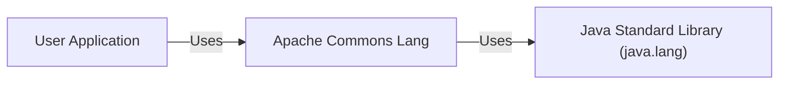
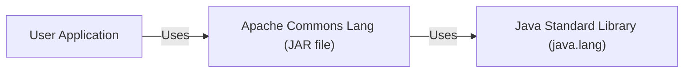
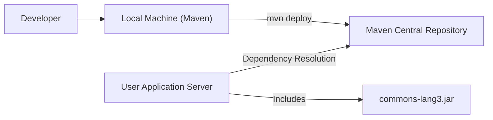
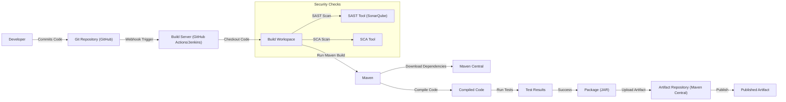

# BUSINESS POSTURE

Business Priorities and Goals:

*   Provide a library of helper utilities for the java.lang API, with a focus on String manipulation.
*   Maintain backward compatibility to ensure minimal disruption for existing users.
*   Offer a stable and reliable set of utilities to reduce boilerplate code in Java projects.
*   Ensure the library is lightweight and has minimal dependencies.
*   Provide comprehensive documentation and examples for ease of use.
*   Maintain high code quality and test coverage.

Business Risks:

*   Introduction of vulnerabilities through new features or dependencies that could be exploited, leading to security breaches in applications using the library.
*   Breaking backward compatibility, causing build failures or runtime errors in applications that depend on the library.
*   Performance degradation due to inefficient code, impacting the performance of applications using the library.
*   Lack of adoption due to poor documentation or perceived lack of value, leading to the library becoming obsolete.
*   Legal issues arising from licensing or intellectual property violations.

# SECURITY POSTURE

Existing Security Controls:

*   security control: Code reviews are performed to ensure code quality and identify potential security issues. (Mentioned in contributing guidelines and visible in pull request process)
*   security control: Static code analysis is used to identify potential vulnerabilities. (Implied by use of tools like SonarQube, though not explicitly stated in the repository's root)
*   security control: Unit tests are extensively used to ensure the correctness of the code and prevent regressions. (Visible in the test directory and build configuration)
*   security control: The project uses a well-defined and permissive Apache 2.0 license, mitigating legal risks. (LICENSE file)
*   security control: Dependency management is used to control external libraries and minimize the attack surface. (pom.xml file)

Accepted Risks:

*   accepted risk: The library relies on the underlying Java platform for security features like sandboxing and access control.
*   accepted risk: The library may be vulnerable to certain types of attacks if used improperly, such as regular expression denial of service (ReDoS) if user-supplied input is not validated before being used in regular expressions.

Recommended Security Controls:

*   security control: Implement a comprehensive security policy that includes guidelines for handling vulnerabilities and reporting security issues.
*   security control: Integrate dynamic application security testing (DAST) into the build process to identify runtime vulnerabilities.
*   security control: Perform regular penetration testing to identify and address potential security weaknesses.
*   security control: Use a Software Composition Analysis (SCA) tool to identify known vulnerabilities in dependencies.
*   security control: Implement fuzz testing to identify unexpected behavior and potential vulnerabilities.

Security Requirements:

*   Authentication: Not applicable, as this is a library and not a service.
*   Authorization: Not applicable, as this is a library and not a service.
*   Input Validation:
    *   All input to public methods should be validated to ensure it meets expected types, lengths, and formats.
    *   Special care should be taken with regular expressions to avoid ReDoS vulnerabilities. User-supplied input should never be directly used in regular expressions without proper sanitization or escaping.
    *   Methods that handle file paths or URLs should validate input to prevent path traversal vulnerabilities.
*   Cryptography:
    *   If cryptographic functions are added, they should use well-established and secure algorithms.
    *   Cryptographic keys should be managed securely and never hardcoded.
    *   Random number generation should use cryptographically secure random number generators (CSRNGs).
*   Output Encoding: Not applicable, as this library primarily deals with string manipulation and does not produce output for display in web browsers or other contexts requiring encoding.

# DESIGN

## C4 CONTEXT

Element Descriptions:

*   Element:
    *   Name: User Application
    *   Type: External System
    *   Description: Any Java application that utilizes the Apache Commons Lang library.
    *   Responsibilities: Consumes the functionalities provided by the Commons Lang library.
    *   Security controls: Relies on the security controls implemented within the application itself and the security guarantees of the Commons Lang library.

*   Element:
    *   Name: Apache Commons Lang
    *   Type: Project
    *   Description: A library of helper utilities for the java.lang API.
    *   Responsibilities: Provides utility methods for string manipulation, object reflection, creation, and more.
    *   Security controls: Code reviews, static analysis, unit tests, dependency management.

*   Element:
    *   Name: Java Standard Library (java.lang)
    *   Type: External System
    *   Description: The core Java library that provides fundamental classes and functionalities.
    *   Responsibilities: Provides the underlying platform and APIs used by Commons Lang.
    *   Security controls: Relies on the security controls implemented within the Java platform.

## C4 CONTAINER

Element Descriptions:

*   Element:
    *   Name: User Application
    *   Type: External System
    *   Description: Any Java application that utilizes the Apache Commons Lang library.
    *   Responsibilities: Consumes the functionalities provided by the Commons Lang library.
    *   Security controls: Relies on the security controls implemented within the application itself and the security guarantees of the Commons Lang library.

*   Element:
    *   Name: Apache Commons Lang (JAR file)
    *   Type: Container (Library)
    *   Description: The compiled and packaged library, distributed as a JAR file.
    *   Responsibilities: Provides utility methods for string manipulation, object reflection, creation, and more.
    *   Security controls: Code reviews, static analysis, unit tests, dependency management.

*   Element:
    *   Name: Java Standard Library (java.lang)
    *   Type: External System
    *   Description: The core Java library that provides fundamental classes and functionalities.
    *   Responsibilities: Provides the underlying platform and APIs used by Commons Lang.
    *   Security controls: Relies on the security controls implemented within the Java platform.

## DEPLOYMENT

Possible Deployment Solutions:

1.  Manual download and inclusion in the project's classpath.
2.  Dependency management using build tools like Maven or Gradle.
3.  Inclusion as a module in a larger system.

Chosen Solution (Dependency Management with Maven):

Element Descriptions:

*   Element:
    *   Name: Developer
    *   Type: Person
    *   Description: A developer working on the Commons Lang project or a user application.
    *   Responsibilities: Writes code, builds the library, and deploys it.
    *   Security controls: Uses secure coding practices.

*   Element:
    *   Name: Local Machine (Maven)
    *   Type: Software System
    *   Description: The developer's local machine with Maven installed.
    *   Responsibilities: Builds the project, resolves dependencies, and deploys artifacts.
    *   Security controls: Uses secure communication channels (HTTPS) to interact with Maven Central.

*   Element:
    *   Name: Maven Central Repository
    *   Type: Software System
    *   Description: The central repository for Maven artifacts.
    *   Responsibilities: Stores and serves artifacts to users.
    *   Security controls: Implements access controls and uses secure communication channels (HTTPS).

*   Element:
    *   Name: User Application Server
    *   Type: Software System
    *   Description: The server where the user application is deployed.
    *   Responsibilities: Runs the user application, including the Commons Lang library.
    *   Security controls: Relies on the security controls of the operating system and the Java runtime environment.

*   Element:
    *   Name: commons-lang3.jar
    *   Type: Artifact
    *   Description: The compiled JAR file of the Commons Lang library.
    *   Responsibilities: Provides the library's functionality to the user application.
    *   Security controls: Built with security controls in mind (code reviews, static analysis, etc.).

## BUILD

Build Process Description:

1.  A developer commits code changes to the Git repository (GitHub).
2.  A webhook triggers the build server (GitHub Actions or Jenkins).
3.  The build server checks out the code into a build workspace.
4.  Maven is used to manage the build process.
5.  Maven downloads dependencies from Maven Central.
6.  Maven compiles the source code.
7.  Unit tests are executed.
8.  Security Checks:
    *   A Static Application Security Testing (SAST) tool (e.g., SonarQube) analyzes the code for potential vulnerabilities.
    *   A Software Composition Analysis (SCA) tool analyzes dependencies for known vulnerabilities.
9.  If the build and tests are successful, the code is packaged into a JAR file.
10. The JAR file is uploaded to an artifact repository (Maven Central).
11. The artifact is published and becomes available for use.

Security Controls in Build Process:

*   security control: Use of a version control system (Git) to track changes and facilitate collaboration.
*   security control: Use of a build server (GitHub Actions/Jenkins) to automate the build process and ensure consistency.
*   security control: Use of Maven for dependency management and build automation.
*   security control: Execution of unit tests to verify code correctness.
*   security control: Integration of SAST tools (e.g., SonarQube) to identify potential code vulnerabilities.
*   security control: Integration of SCA tools to identify known vulnerabilities in dependencies.
*   security control: Use of secure communication channels (HTTPS) for interacting with Maven Central and other external services.

# RISK ASSESSMENT

Critical Business Processes:

*   Providing reliable and secure utility functions for Java applications.
*   Maintaining the stability and backward compatibility of the library.

Data Protection:

*   The library itself does not handle sensitive data directly. However, it's crucial to ensure that the library does not introduce vulnerabilities that could be exploited to compromise sensitive data handled by applications using the library.
*   Data Sensitivity: Low (for the library itself), but potentially high for applications using the library, depending on the application's functionality.

# QUESTIONS & ASSUMPTIONS

Questions:

*   Are there any specific compliance requirements (e.g., PCI DSS, HIPAA) that applications using this library typically need to adhere to? This would influence recommendations for security controls.
*   What is the expected frequency of releases and updates to the library? This impacts the recommended cadence of security testing.
*   Is there a dedicated security team or individual responsible for the security of the library?
*   What is the process for handling vulnerability reports?
*   Are there any plans to add features that might handle sensitive data or perform security-sensitive operations (e.g., cryptography, input validation)?

Assumptions:

*   BUSINESS POSTURE: The project prioritizes stability, backward compatibility, and ease of use. The project has a moderate risk appetite, balancing the need for new features with the need for security and stability.
*   SECURITY POSTURE: The project has some basic security controls in place (code reviews, unit tests), but there is room for improvement. The project is open to implementing additional security measures.
*   DESIGN: The library is designed to be lightweight and have minimal dependencies. The primary deployment method is through dependency management systems like Maven. The build process is automated using tools like GitHub Actions or Jenkins.