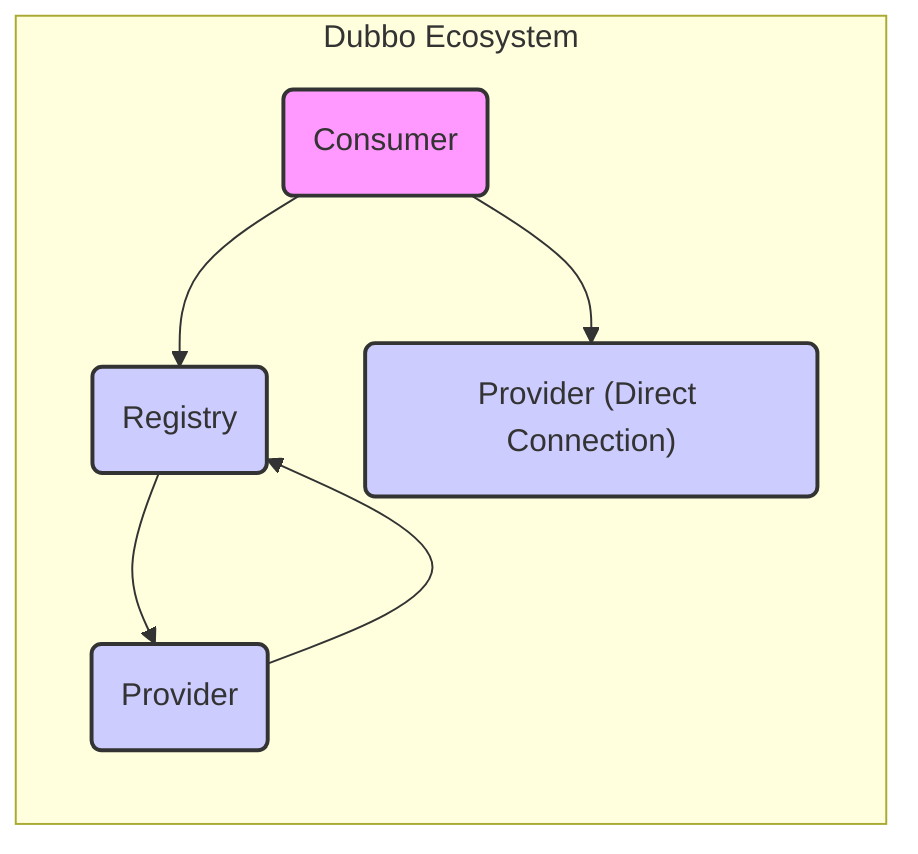
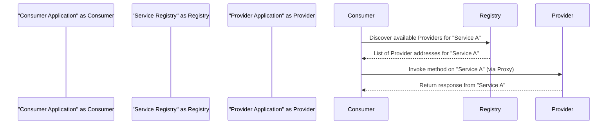

# Project Design Document: Apache Dubbo (Improved)

**Version:** 1.1
**Date:** October 26, 2023
**Author:** AI Architecture Expert

## 1. Introduction

This document provides an enhanced architectural overview of the Apache Dubbo project, focusing on details relevant for security threat modeling. It describes the key components, their interactions, and the overall system design with a security-conscious perspective. This document serves as a refined foundation for subsequent threat modeling activities.

## 2. Goals and Objectives

The core goal of Apache Dubbo is to offer a robust, high-performance, and lightweight Java RPC framework. Key objectives include:

* **Seamless Remote Procedure Calls:**  Allowing developers to invoke remote services as if they were local methods, abstracting away the complexities of network communication.
* **Dynamic Service Discovery and Registry:**  Providing a dynamic mechanism for service providers to advertise their presence and consumers to locate available providers in real-time.
* **Intelligent Load Balancing:**  Distributing client requests across multiple service provider instances based on configurable strategies to optimize resource utilization and performance.
* **Built-in Fault Tolerance and Resilience:**  Implementing various strategies to gracefully handle service failures, network issues, and ensure the overall system remains resilient.
* **Highly Extensible Architecture:**  Enabling developers to customize and extend the framework's functionality through a plugin-based architecture, adapting it to specific needs.
* **Comprehensive Observability and Monitoring:**  Providing built-in tools and extension points for monitoring service interactions, performance metrics, and tracing requests for better insights and troubleshooting.

## 3. High-Level Architecture

Dubbo's architecture is centered around the interaction of three primary roles:

* **'Provider'**: The service provider application that implements and exposes services for consumption.
* **'Consumer'**: The service consumer application that needs to invoke and utilize the services provided by providers.
* **'Registry'**: A central service discovery component that acts as a directory, maintaining a dynamic list of available services and their corresponding provider locations.

**Explanation:**

* The 'Consumer' discovers available 'Provider' instances by querying the 'Registry'.
* The 'Provider' registers its services and availability information with the 'Registry'.
* In certain configurations, the 'Consumer' can establish a direct connection with the 'Provider', bypassing the 'Registry' for specific use cases or optimizations.

## 4. Detailed Component Architecture

This section provides a more granular view of the components within each role, highlighting security-relevant aspects:

### 4.1. Provider Components

* **'Service Implementation'**: Contains the core business logic that implements the service interface and handles requests.
* **'Proxy'**: Generates a proxy object that intercepts incoming calls and manages the invocation lifecycle. This can be a point for security interceptors.
* **'Invoker'**: Encapsulates the details of the service invocation, including parameters and method information, and interacts with the underlying transport layer.
* **'Exporter'**: Responsible for publishing the service, making it available for remote invocation, and registering the service details with the 'Registry'.
* **'Protocol'**: Defines the communication protocol used for remote calls (e.g., Dubbo, gRPC, REST). The choice of protocol impacts security features like encryption.
* **'Transport'**: Handles the actual network communication, managing connections and data transmission (e.g., Netty). Security features like TLS/SSL are configured at this level.
* **'Codec'**: Responsible for serializing and deserializing request and response objects into a byte stream for network transmission. Vulnerabilities in serialization libraries can be a security risk.
* **'Filter (Provider Side)'**: Allows for intercepting incoming requests and outgoing responses. This is a key point for implementing security measures like authentication, authorization, and logging.

### 4.2. Consumer Components

* **'Service Interface'**: Defines the contract for the service to be consumed.
* **'Proxy'**: Creates a local proxy object that mimics the remote service, handling the complexities of remote invocation.
* **'Invoker'**: Encapsulates the invocation details and interacts with the 'Cluster' and 'Transport' layers to execute the remote call.
* **'Registry'**: Interacts with the 'Registry' to discover available 'Provider' instances for the desired service.
* **'Cluster'**: Provides load balancing, fault tolerance, and routing strategies for selecting the appropriate 'Provider' instance. Security considerations include routing to trusted providers.
* **'Monitor'**: Collects invocation statistics and monitors service performance, which can be used for detecting anomalies or attacks.
* **'Protocol'**:  Matches the 'Provider's' protocol for communication.
* **'Transport'**: Handles network communication.
* **'Codec'**: Handles serialization/deserialization.
* **'Filter (Consumer Side)'**: Allows for intercepting outgoing requests and incoming responses, enabling security measures before and after remote calls.

### 4.3. Registry Components

* **'Data Storage'**: Persistently stores service registration information, including service names, provider addresses, and metadata. The security of this storage is critical.
* **'Notification Mechanism'**:  Provides a mechanism for notifying 'Consumers' about changes in available 'Providers'. Secure notification mechanisms are important to prevent malicious redirection.
* **'Management Interface'**: Offers tools for managing registered services, potentially including administrative functions that require strong authentication and authorization.
* **'Authentication/Authorization'**: Mechanisms to control access to the registry itself, preventing unauthorized registration or modification of service information.

**Common Registry Implementations and their Security Considerations:**

* **ZooKeeper:**  Relies on ACLs for access control. Misconfigured ACLs can lead to security vulnerabilities.
* **Nacos:** Offers namespace-based isolation and access control.
* **Consul:** Uses ACLs for securing access to services and data.
* **Etcd:** Employs client certificates and role-based access control.
* **Redis (with limitations):**  Security often relies on network isolation and password protection.

## 5. Data Flow

A typical service invocation follows this sequence:

**Detailed Data Flow with Security Considerations:**

```mermaid
sequenceDiagram
    participant "Consumer Proxy" as CProxy
    participant "Consumer Invoker" as CInvoker
    participant "Consumer Cluster" as CCluster
    participant "Consumer Protocol" as CProtocol
    participant "Consumer Transport" as CTransport
    participant "Provider Transport" as PTransport
    participant "Provider Protocol" as PProtocol
    participant "Provider Invoker" as PInvoker
    participant "Provider Proxy" as PProxy
    participant "Service Implementation" as ServiceImpl

    CProxy->>CInvoker: Invoke method
    CInvoker->>CCluster: Select Provider instance (consider trusted routing)
    CCluster->>CProtocol: Encode request (consider encryption)
    CProtocol->>CTransport: Send request (ensure secure transport)
    CTransport->>PTransport: Network transmission (potential MITM attack)
    PTransport->>PProtocol: Decode request
    PProtocol->>PInvoker: Invoke service
    PInvoker->>PProxy: Call service method (consider authorization checks)
    PProxy->>ServiceImpl: Execute business logic (potential injection vulnerabilities)
    ServiceImpl-->>PProxy: Return result
    PProxy->>PInvoker: Return result
    PInvoker->>PProtocol: Encode response (consider encryption)
    PProtocol->>PTransport: Send response (ensure secure transport)
    PTransport->>CTransport: Network transmission (potential MITM attack)
    CTransport->>CProtocol: Decode response
    CProtocol->>CInvoker: Return response
    CInvoker-->>CProxy: Return result to caller
```

## 6. Key Components and Responsibilities (Security Focused)

* **'Registry'**:
    * **Secure Service Discovery**: Maintaining an accurate and tamper-proof list of available service providers, preventing malicious redirection.
    * **Access Control**: Implementing strong authentication and authorization mechanisms to restrict access to registry data and administrative functions.
    * **Data Integrity**: Ensuring the integrity of service registration information to prevent unauthorized modifications.
* **'Provider'**:
    * **Secure Service Exposure**:  Implementing robust authentication and authorization to control access to exposed services.
    * **Input Validation**:  Thoroughly validating all incoming requests to prevent injection attacks.
    * **Data Protection**:  Protecting sensitive data at rest and in transit, including encryption where necessary.
    * **Rate Limiting/Throttling**:  Protecting against denial-of-service attacks.
* **'Consumer'**:
    * **Trusted Provider Selection**:  Ensuring that connections are established only with legitimate and trusted providers.
    * **Secure Communication**:  Utilizing secure communication protocols (e.g., TLS/SSL) to protect data in transit.
    * **Proper Credential Management**:  Securely managing and transmitting any necessary authentication credentials.
* **'Protocol'**:
    * **Message Integrity and Confidentiality**:  Providing mechanisms for ensuring the integrity and confidentiality of messages exchanged between 'Consumers' and 'Providers' (e.g., encryption, signing).
* **'Transport'**:
    * **Secure Channel Establishment**:  Establishing secure communication channels using protocols like TLS/SSL to encrypt data in transit and authenticate endpoints.
* **'Cluster'**:
    * **Secure Routing**:  Implementing strategies to ensure that requests are routed to trusted and healthy 'Provider' instances.
* **'Monitor'**:
    * **Security Monitoring**:  Collecting and analyzing metrics to detect suspicious activity or potential security breaches.

## 7. Security Considerations (Detailed)

This section expands on potential security concerns, categorized for clarity:

* **Registry Security:**
    * **Unauthorized Access:**  Lack of proper authentication and authorization can allow unauthorized access to service registration data.
    * **Data Tampering:**  Malicious actors could register rogue services or modify existing service information, leading to incorrect routing or service disruption.
    * **Denial of Service (DoS):** The registry can be targeted with DoS attacks, preventing legitimate service discovery.
    * **Information Disclosure:**  Exposure of sensitive service metadata stored in the registry.
* **Provider Security:**
    * **Authentication Bypass:**  Vulnerabilities allowing attackers to bypass authentication mechanisms and access services without proper credentials.
    * **Authorization Failures:**  Insufficient or misconfigured authorization controls allowing access to unauthorized resources or operations.
    * **Injection Attacks:**  Vulnerabilities like SQL injection, command injection, or code injection if input is not properly validated.
    * **Data Breaches:**  Exposure of sensitive data due to insecure storage, processing, or transmission.
    * **Denial of Service (DoS):**  Providers can be targeted with DoS attacks, making services unavailable.
    * **Serialization Vulnerabilities:**  Exploiting vulnerabilities in serialization libraries to execute arbitrary code.
* **Consumer Security:**
    * **Man-in-the-Middle (MITM) Attacks:**  Attackers intercepting communication between 'Consumers' and 'Providers' to eavesdrop or manipulate data.
    * **Data Exposure:**  Sensitive data in requests or responses being exposed due to lack of encryption.
    * **Compromised Consumers:**  Vulnerabilities in the 'Consumer' application itself being exploited to gain access to sensitive information or launch further attacks.
* **Communication Security:**
    * **Lack of Encryption:**  Data transmitted between 'Consumers' and 'Providers' is vulnerable to eavesdropping if not encrypted.
    * **Replay Attacks:**  Attackers intercepting and retransmitting valid requests to perform unauthorized actions.
* **Authentication and Authorization:**
    * **Weak Authentication:**  Use of weak or easily guessable credentials.
    * **Missing Authentication:**  Services being accessible without any authentication.
    * **Inadequate Authorization:**  Not properly restricting access to specific services or operations based on user roles or permissions.
* **Dependency Vulnerabilities:**
    *  Vulnerabilities in the Dubbo framework itself or its underlying dependencies (e.g., Netty, serialization libraries).

## 8. Deployment Model (Security Implications)

The deployment environment significantly impacts security considerations:

* **Standalone Applications:**  Requires careful configuration of firewalls and network security.
* **Containerized Environments (Docker, Kubernetes):**  Security relies on container image security, network policies, and orchestration platform security.
* **Cloud Environments (AWS, Azure, GCP):**  Leverages cloud provider security features but requires proper configuration of access controls, network security groups, and encryption services.
* **Microservices Architectures:**  Increased complexity requires robust service-to-service authentication and authorization mechanisms.

## 9. Technologies Used (Security Relevance)

* **Programming Language (Java):**  Security best practices for Java development must be followed.
* **RPC Framework (Dubbo Core):**  Understanding Dubbo's security features and potential vulnerabilities is crucial.
* **Serialization (Hessian, Fastjson, Protobuf):**  Choosing secure and well-maintained serialization libraries and being aware of their potential vulnerabilities.
* **Transport (Netty, gRPC):**  Configuring secure transport protocols like TLS/SSL.
* **Registry (ZooKeeper, Nacos, Consul, Etcd, Redis):**  Securing the chosen registry implementation according to its specific security guidelines.
* **Load Balancing:**  Ensuring load balancers do not introduce security vulnerabilities.
* **Monitoring:**  Utilizing monitoring tools to detect and respond to security incidents.

## 10. Future Considerations (Security Focused)

* **Enhanced Security Features:**  Continuously improving Dubbo's built-in security features, such as more robust authentication and authorization options.
* **Standardized Security Integrations:**  Providing easier integration with industry-standard security solutions.
* **Vulnerability Management:**  Proactive identification and patching of potential vulnerabilities in the framework and its dependencies.
* **Security Audits:**  Regular security audits to identify and address potential weaknesses.
* **Improved Documentation on Security Best Practices:**  Providing clear guidance to developers on how to securely configure and use Dubbo.

This improved document provides a more detailed and security-focused architectural overview of Apache Dubbo, enhancing its value as a foundation for comprehensive threat modeling. The added details and categorizations aim to facilitate a more thorough analysis of potential security risks.
