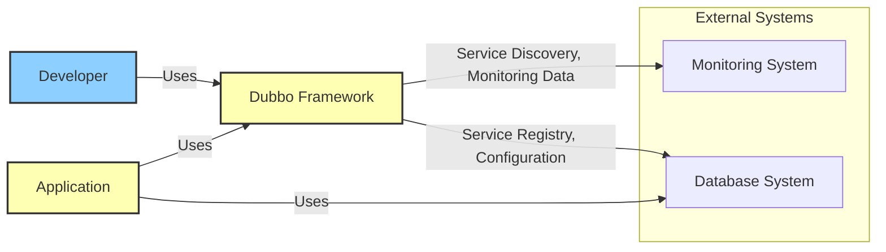
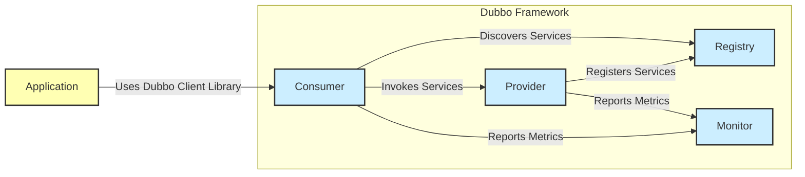
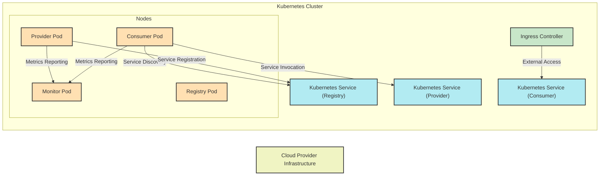

# BUSINESS POSTURE

- Business Priorities and Goals:
  - Enable developers to build distributed microservice applications.
  - Provide a framework for service discovery, load balancing, traffic routing, and fault tolerance in distributed systems.
  - Simplify the development and management of microservices.
  - Offer high performance and scalability for microservice architectures.
  - Support various communication protocols and deployment environments.
- Business Risks:
  - Risk of service unavailability due to misconfiguration or failures in the distributed system.
  - Risk of data breaches or unauthorized access to services and data due to security vulnerabilities in the framework or applications built on top of it.
  - Risk of performance degradation due to inefficient configuration or resource constraints.
  - Risk of vendor lock-in if heavily reliant on specific Dubbo features or ecosystem components.
  - Risk of adoption failure if the framework is too complex to learn or use effectively.

# SECURITY POSTURE

- Existing Security Controls:
  - security control: Code review process (described in project contribution guidelines).
  - security control: Dependency management (using Maven, Gradle, etc. - standard practice in Java projects).
  - security control: Regular updates to dependencies (implied by active project maintenance).
  - security control: Input validation (expected to be implemented by developers using the framework).
  - security control: Authentication and Authorization mechanisms (provided as features within Dubbo framework, documentation available).
  - security control: Encryption capabilities (SSL/TLS support for communication, documented in Dubbo features).
- Accepted Risks:
  - accepted risk: Vulnerabilities in third-party dependencies (mitigated by dependency management and updates, but not fully eliminated).
  - accepted risk: Misconfiguration of security features by developers using the framework.
  - accepted risk: Security vulnerabilities in applications built on top of Dubbo (responsibility of application developers).
- Recommended Security Controls:
  - security control: Implement automated security scanning (SAST/DAST) in the CI/CD pipeline.
  - security control: Conduct regular penetration testing of applications built using Dubbo.
  - security control: Provide security training for developers using Dubbo framework.
  - security control: Implement security policy enforcement mechanisms within the framework (e.g., policy-based access control).
  - security control: Enhance logging and monitoring for security events.
- Security Requirements:
  - Authentication:
    - Services must be able to authenticate clients (other services or external applications).
    - Support for various authentication mechanisms (e.g., basic authentication, OAuth 2.0, JWT).
    - Secure storage and management of authentication credentials.
  - Authorization:
    - Services must enforce access control policies to restrict access to resources and operations.
    - Role-Based Access Control (RBAC) or Attribute-Based Access Control (ABAC) should be supported.
    - Fine-grained authorization at the method or data level.
  - Input Validation:
    - All service inputs must be validated to prevent injection attacks (e.g., SQL injection, command injection).
    - Input validation should be performed on both client and server sides.
    - Use of secure coding practices to avoid common input validation vulnerabilities.
  - Cryptography:
    - Sensitive data in transit must be encrypted using strong cryptographic protocols (e.g., TLS).
    - Consider encryption for sensitive data at rest (if applicable within the framework's scope).
    - Proper key management practices for cryptographic keys.
    - Use of well-vetted and standard cryptographic libraries.

# DESIGN

## C4 CONTEXT

- Context Diagram Elements:
  - - Name: Developer
    - Type: Person
    - Description: Software developers who use the Dubbo framework to build and deploy microservice applications.
    - Responsibilities: Develop, deploy, and maintain microservices using Dubbo. Configure and manage Dubbo infrastructure.
    - Security controls: Code review, secure development practices, access control to development environments.
  - - Name: Application
    - Type: Software System
    - Description: Microservice applications built using the Dubbo framework. These applications provide specific business functionalities.
    - Responsibilities: Implement business logic, expose services via Dubbo, consume services from other applications.
    - Security controls: Input validation, authorization, authentication, secure coding practices, application-level security controls.
  - - Name: Dubbo Framework
    - Type: Software System
    - Description: The Apache Dubbo framework itself, providing core functionalities for building and managing microservices.
    - Responsibilities: Service discovery, load balancing, routing, communication, monitoring, and other microservice infrastructure capabilities.
    - Security controls: Authentication, authorization, encryption, input validation (within framework components), security updates, secure development lifecycle for the framework itself.
  - - Name: Database System
    - Type: External System
    - Description: Persistent storage for Dubbo's registry data, configuration, and potentially monitoring data. Could be various database technologies.
    - Responsibilities: Store and provide access to registry information, configuration data, and potentially monitoring data.
    - Security controls: Database access control, encryption at rest, regular backups, database hardening.
  - - Name: Monitoring System
    - Type: External System
    - Description: System used to monitor the health and performance of Dubbo services and infrastructure. Examples include Prometheus, Grafana, etc.
    - Responsibilities: Collect, aggregate, and visualize monitoring data from Dubbo services. Provide alerts and dashboards for operational insights.
    - Security controls: Access control to monitoring dashboards and data, secure data transmission, secure storage of monitoring data.

## C4 CONTAINER

- Container Diagram Elements:
  - - Name: Registry
    - Type: Container
    - Description: Service registry component of Dubbo. Responsible for storing and providing service discovery information. Examples include ZooKeeper, Nacos, Redis.
    - Responsibilities: Service registration, service discovery, health checking, configuration management.
    - Security controls: Access control to registry data, authentication for registry access, secure communication with registry clients, data integrity checks.
  - - Name: Provider
    - Type: Container
    - Description: Service provider application instance. Exposes services and registers them with the registry.
    - Responsibilities: Implement service logic, expose services via Dubbo protocols, register services with the registry, handle service requests.
    - Security controls: Authentication and authorization of incoming requests, input validation, secure service implementation, rate limiting, resource management.
  - - Name: Consumer
    - Type: Container
    - Description: Service consumer application instance. Discovers and consumes services from providers through the registry.
    - Responsibilities: Discover services from the registry, invoke services from providers, handle service responses, implement client-side logic.
    - Security controls: Authentication to access services, secure communication with providers, input validation of responses, circuit breaking, retry mechanisms.
  - - Name: Monitor
    - Type: Container
    - Description: Monitoring component of Dubbo. Collects and aggregates metrics from providers and consumers.
    - Responsibilities: Collect metrics data, aggregate metrics, expose metrics for monitoring systems, provide basic monitoring dashboards.
    - Security controls: Access control to monitoring data, secure data transmission, data anonymization (if necessary), secure storage of monitoring data.

## DEPLOYMENT

- Deployment Architecture Options:
  - Option 1: Cloud-based deployment using Kubernetes and cloud-managed services.
  - Option 2: On-premise deployment using virtual machines or bare-metal servers.
  - Option 3: Hybrid deployment combining cloud and on-premise environments.

- Detailed Deployment Architecture (Option 1: Cloud-based Kubernetes):

- Deployment Diagram Elements:
  - - Name: Kubernetes Cluster
    - Type: Environment
    - Description: Kubernetes cluster managed in a cloud environment. Provides container orchestration and management.
    - Responsibilities: Container orchestration, resource management, service discovery within the cluster, scaling, and high availability.
    - Security controls: Kubernetes RBAC, network policies, pod security policies/admission controllers, secrets management, regular security updates, cluster hardening.
  - - Name: Nodes
    - Type: Infrastructure
    - Description: Worker nodes within the Kubernetes cluster. Physical or virtual machines running container runtime.
    - Responsibilities: Run container workloads (Pods), provide compute resources, network connectivity, and storage.
    - Security controls: Operating system hardening, security patching, access control, network segmentation, monitoring and logging.
  - - Name: Provider Pod
    - Type: Container Instance
    - Description: Kubernetes Pod running an instance of a Dubbo service provider.
    - Responsibilities: Run service provider application, expose service endpoints, handle service requests.
    - Security controls: Container image security scanning, resource limits, network policies, application-level security controls.
  - - Name: Consumer Pod
    - Type: Container Instance
    - Description: Kubernetes Pod running an instance of a Dubbo service consumer application.
    - Responsibilities: Run service consumer application, discover and invoke services, handle service responses.
    - Security controls: Container image security scanning, resource limits, network policies, application-level security controls.
  - - Name: Registry Pod
    - Type: Container Instance
    - Description: Kubernetes Pod running an instance of the Dubbo registry (e.g., ZooKeeper, Nacos).
    - Responsibilities: Service registry functionality, store and provide service discovery information.
    - Security controls: Access control to registry data, secure configuration, regular backups, resource limits, network policies.
  - - Name: Monitor Pod
    - Type: Container Instance
    - Description: Kubernetes Pod running an instance of the Dubbo monitor.
    - Responsibilities: Collect and aggregate metrics data from Dubbo services.
    - Security controls: Access control to monitoring data, secure configuration, resource limits, network policies.
  - - Name: ServiceRegistry (Kubernetes Service)
    - Type: Service
    - Description: Kubernetes Service exposing the Dubbo Registry Pods within the cluster. Provides stable endpoint for service discovery.
    - Responsibilities: Load balancing and service discovery for Registry Pods within the cluster.
    - Security controls: Network policies, service account permissions.
  - - Name: ServiceProvider (Kubernetes Service)
    - Type: Service
    - Description: Kubernetes Service exposing Dubbo Provider Pods within the cluster. Provides stable endpoint for service invocation.
    - Responsibilities: Load balancing and service discovery for Provider Pods within the cluster.
    - Security controls: Network policies, service account permissions.
  - - Name: ServiceConsumer (Kubernetes Service)
    - Type: Service
    - Description: Kubernetes Service exposing Dubbo Consumer Pods within the cluster (if consumers need to be externally accessible).
    - Responsibilities: Load balancing and service discovery for Consumer Pods within the cluster.
    - Security controls: Network policies, service account permissions.
  - - Name: Ingress Controller
    - Type: Infrastructure Component
    - Description: Kubernetes Ingress controller to manage external access to services within the cluster.
    - Responsibilities: Route external traffic to Kubernetes Services, TLS termination, load balancing, and other ingress functionalities.
    - Security controls: TLS configuration, access control to ingress configuration, web application firewall (WAF) integration, rate limiting.
  - - Name: Cloud Provider Infrastructure
    - Type: Environment
    - Description: Underlying cloud infrastructure provided by a cloud provider (e.g., AWS, Azure, GCP).
    - Responsibilities: Provide compute, storage, networking, and other infrastructure services for the Kubernetes cluster.
    - Security controls: Cloud provider security controls (IAM, VPCs, security groups, encryption at rest, etc.), compliance certifications.

## BUILD

```mermaid
flowchart LR
    Developer["Developer"] -->|Code Commit| SourceCodeRepository["Source Code Repository (GitHub)"]
    SourceCodeRepository -->|Webhook| CI_CD_System["CI/CD System (GitHub Actions)"]
    CI_CD_System -->|Build, Test, Scan| BuildEnvironment["Build Environment"]
    BuildEnvironment -->|Artifacts| ArtifactRepository["Artifact Repository (Maven Central, Docker Hub)"]
    ArtifactRepository -->|Deployment| DeploymentEnvironment["Deployment Environment (Kubernetes)"]

    subgraph "Build Environment"
        CodeCheckout["Code Checkout"]
        DependencyResolution["Dependency Resolution"]
        Compilation["Compilation"]
        UnitTests["Unit Tests"]
        SAST["SAST Scanning"]
        ContainerImageBuild["Container Image Build (if applicable)"]
    end
    CI_CD_System --> CodeCheckout
    CodeCheckout --> DependencyResolution
    DependencyResolution --> Compilation
    Compilation --> UnitTests
    UnitTests --> SAST
    SAST --> ContainerImageBuild
    BuildEnvironment --> CI_CD_System

```

- Build Process Elements:
  - - Name: Developer
    - Type: Person
    - Description: Software developer writing and committing code changes.
    - Responsibilities: Write code, commit code changes, perform local testing.
    - Security controls: Secure development environment, access control to source code repository, code review.
  - - Name: Source Code Repository (GitHub)
    - Type: System
    - Description: Git repository hosted on GitHub, storing the source code of the Dubbo project.
    - Responsibilities: Version control, code storage, collaboration, change tracking.
    - Security controls: Access control (authentication and authorization), branch protection, audit logging, vulnerability scanning (GitHub Security Features).
  - - Name: CI/CD System (GitHub Actions)
    - Type: System
    - Description: Continuous Integration and Continuous Delivery system, likely GitHub Actions for a GitHub project. Automates the build, test, and deployment process.
    - Responsibilities: Automated build, test execution, security scanning, artifact publishing, deployment automation.
    - Security controls: Secure configuration of CI/CD pipelines, access control to CI/CD system, secret management, audit logging.
  - - Name: Build Environment
    - Type: Environment
    - Description: Environment where the build process is executed. Could be a containerized environment or virtual machine.
    - Responsibilities: Provide necessary tools and dependencies for building the project, execute build steps.
    - Security controls: Secure build environment, hardened operating system, access control, regular updates, isolated environment.
  - - Name: Code Checkout
    - Type: Build Step
    - Description: Step in the build process where the source code is checked out from the source code repository.
    - Responsibilities: Retrieve the latest code changes from the repository.
    - Security controls: Authentication to source code repository, secure communication protocols.
  - - Name: Dependency Resolution
    - Type: Build Step
    - Description: Step in the build process where project dependencies are resolved and downloaded.
    - Responsibilities: Download required libraries and dependencies from dependency repositories (e.g., Maven Central).
    - Security controls: Dependency vulnerability scanning, dependency lock files, secure communication with dependency repositories.
  - - Name: Compilation
    - Type: Build Step
    - Description: Step in the build process where the source code is compiled into executable code.
    - Responsibilities: Compile source code using appropriate compiler.
    - Security controls: Secure compiler toolchain, compiler hardening options.
  - - Name: Unit Tests
    - Type: Build Step
    - Description: Step in the build process where unit tests are executed to verify code functionality.
    - Responsibilities: Execute unit tests, report test results.
    - Security controls: Secure test environment, test case review, code coverage analysis.
  - - Name: SAST Scanning
    - Type: Build Step
    - Description: Static Application Security Testing (SAST) is performed to identify potential security vulnerabilities in the source code.
    - Responsibilities: Analyze source code for security vulnerabilities, generate security reports.
    - Security controls: Regularly updated SAST scanner, configured security rules, vulnerability reporting and tracking.
  - - Name: Container Image Build (if applicable)
    - Type: Build Step
    - Description: Step in the build process where container images are built (if the project is containerized).
    - Responsibilities: Build container images based on Dockerfiles or similar, tag and push images to container registry.
    - Security controls: Base image security scanning, minimal container image, security best practices for container image building.
  - - Name: Artifact Repository (Maven Central, Docker Hub)
    - Type: System
    - Description: Repository for storing build artifacts (e.g., JAR files, container images). Examples include Maven Central for Java libraries, Docker Hub for container images.
    - Responsibilities: Store and distribute build artifacts, versioning, artifact management.
    - Security controls: Access control to artifact repository, artifact signing, vulnerability scanning of artifacts, secure artifact storage.
  - - Name: Deployment Environment (Kubernetes)
    - Type: Environment
    - Description: Target environment where the built artifacts are deployed (e.g., Kubernetes cluster).
    - Responsibilities: Run and manage deployed applications, provide runtime environment.
    - Security controls: Deployment environment security controls (as described in Deployment section).

# RISK ASSESSMENT

- Critical Business Processes:
  - Service Discovery: Ensuring services can reliably discover each other is critical for the functioning of the distributed system. Failure can lead to service unavailability and application failures.
  - Service Invocation: Secure and reliable communication between services is essential for data integrity and application functionality. Interruption or compromise can lead to data loss or corruption.
  - Configuration Management: Proper configuration of Dubbo and services is crucial for performance, stability, and security. Misconfiguration can lead to vulnerabilities or performance issues.
  - Monitoring and Alerting: Effective monitoring is necessary to detect and respond to issues in the distributed system. Lack of monitoring can delay incident response and increase downtime.
- Data Sensitivity:
  - Service Metadata (Registry Data): Low to Medium sensitivity. Contains information about services, their locations, and configurations. Exposure could lead to service disruption or information disclosure.
  - Application Data: Sensitivity depends on the applications built using Dubbo. Could range from low to high sensitivity depending on the business domain and data types. Dubbo itself handles the transport and routing of this data, so its security is paramount.
  - Monitoring Data: Low sensitivity in general, but can contain operational insights that might be valuable to attackers.

# QUESTIONS & ASSUMPTIONS

- BUSINESS POSTURE Questions:
  - What are the specific business use cases and applications that will be built using Dubbo?
  - What is the acceptable level of risk for service unavailability and data breaches?
  - What are the compliance requirements for applications built using Dubbo (e.g., GDPR, HIPAA, PCI DSS)?
- BUSINESS POSTURE Assumptions:
  - The primary business goal is to enable rapid development and deployment of microservices.
  - High availability and scalability are important business requirements.
  - Security is a concern, but might be balanced against development speed and ease of use, especially for early-stage projects.
- SECURITY POSTURE Questions:
  - What security controls are already in place for the development and deployment environments?
  - What are the specific authentication and authorization mechanisms required for services?
  - What are the data encryption requirements for data in transit and at rest?
  - Is there a dedicated security team involved in the project?
- SECURITY POSTURE Assumptions:
  - Basic security controls like code review and dependency management are in place.
  - Developers are expected to implement application-level security controls.
  - Security is considered important but might not be the highest priority in the initial phases.
- DESIGN Questions:
  - What specific registry, monitoring, and database systems will be used with Dubbo?
  - What communication protocols will be used for service invocation (e.g., HTTP, gRPC, Dubbo protocol)?
  - What are the expected performance and scalability requirements for the system?
  - Are there any specific deployment environment constraints or requirements?
- DESIGN Assumptions:
  - Kubernetes is a likely deployment environment for cloud-based deployments.
  - Standard open-source components will be used for registry and monitoring.
  - The design should be flexible and adaptable to different deployment environments and technologies.