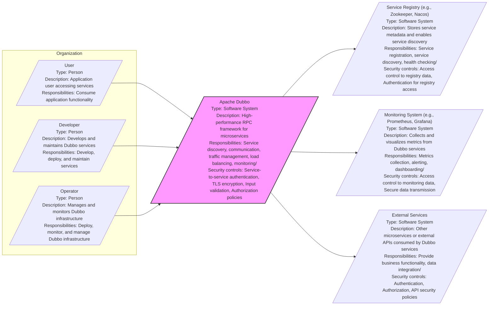

# BUSINESS POSTURE

This project, Apache Dubbo, aims to provide a high-performance, lightweight RPC framework for building microservices architectures. The primary business priority is to enable organizations to develop and deploy distributed applications efficiently and reliably. The goal is to simplify the complexities of microservices communication, service discovery, and traffic management, allowing businesses to focus on core application logic and faster time-to-market for new features and services.

Most important business risks that need to be addressed:
- Risk of service unavailability due to failures in the distributed system.
- Risk of performance bottlenecks affecting application responsiveness and user experience.
- Risk of data inconsistency across services in a distributed environment.
- Risk of security breaches due to vulnerabilities in the framework or misconfigurations.
- Risk of vendor lock-in if the framework becomes too tightly coupled with specific infrastructure or platforms.

# SECURITY POSTURE

Existing security controls:
- security control: Open Source Development Model - The project is developed in the open, allowing for community review and contributions, which can lead to earlier detection of vulnerabilities. Implemented through GitHub repository and Apache Software Foundation processes.
- security control: Code Review Process - Contributions to the project are reviewed by maintainers, aiming to catch potential security issues before they are merged. Implemented through GitHub pull request review process.
- security control: Vulnerability Reporting - The Apache Software Foundation has a process for reporting and handling security vulnerabilities. Described in Apache Security Team documentation.
- security control: Secure Software Development Lifecycle (SSDLC) awareness - While not explicitly documented for Dubbo, being an Apache project, there is an implicit awareness of SSDLC principles within the development process.
- security control: Dependency Management - Project uses dependency management tools (like Maven) which helps in managing and potentially scanning dependencies for known vulnerabilities. Implemented through Maven build system configuration.

Accepted risks:
- accepted risk: Reliance on community contributions for security fixes - The speed and completeness of security fixes can depend on the availability and responsiveness of the community.
- accepted risk: Potential for vulnerabilities in dependencies - Despite dependency management, there's always a risk of undiscovered or unpatched vulnerabilities in third-party libraries.
- accepted risk: Configuration complexity -  Dubbo's flexibility can lead to complex configurations, increasing the risk of misconfigurations that introduce security vulnerabilities.

Recommended security controls:
- security control: Implement automated security scanning in CI/CD pipeline - Integrate SAST and DAST tools to automatically detect vulnerabilities in code and during runtime.
- security control: Regularly perform penetration testing - Conduct periodic penetration testing to identify vulnerabilities that might be missed by automated tools and code reviews.
- security control: Provide security configuration guidelines and best practices - Create and maintain clear documentation on secure configuration and deployment of Dubbo applications.
- security control: Implement and enforce security policies for dependencies - Establish policies for dependency selection and update, including vulnerability scanning and whitelisting/blacklisting.
- security control: Enhance input validation and output encoding across all components - Ensure robust input validation and output encoding to prevent common web application vulnerabilities.

Security requirements:
- Authentication:
    - security requirement: Service-to-service authentication - Dubbo should support mechanisms for services to authenticate each other to ensure only authorized services can communicate.
    - security requirement: User authentication for management interfaces - If Dubbo exposes management interfaces, these should require strong user authentication.
- Authorization:
    - security requirement: Role-Based Access Control (RBAC) - Implement RBAC to control access to services and operations based on roles.
    - security requirement: Fine-grained authorization policies - Allow for defining granular authorization policies to control access to specific resources or data within services.
- Input Validation:
    - security requirement: Validate all inputs at service boundaries - Implement strict input validation for all service requests to prevent injection attacks and other input-related vulnerabilities.
    - security requirement: Sanitize data before processing and storage - Ensure data is properly sanitized before being processed or stored to prevent data integrity issues and security vulnerabilities.
- Cryptography:
    - security requirement: Encrypt sensitive data in transit - Support encryption of communication channels between services using protocols like TLS.
    - security requirement: Secure storage of sensitive data - If Dubbo components store sensitive data (e.g., configuration secrets), ensure it is encrypted at rest.
    - security requirement: Use strong cryptographic algorithms and libraries - Rely on well-vetted and strong cryptographic algorithms and libraries for all security functions.

# DESIGN

## C4 CONTEXT



### C4 CONTEXT Elements Description

- Element:
    - Name: User
    - Type: Person
    - Description: End-user of applications built using Dubbo, accessing functionalities exposed by Dubbo services.
    - Responsibilities: Consume application functionality exposed through Dubbo services.
    - Security controls: Authentication to applications, Authorization within applications, Input validation at application level.

- Element:
    - Name: Developer
    - Type: Person
    - Description: Software developers who build, deploy, and maintain microservices using the Apache Dubbo framework.
    - Responsibilities: Develop, deploy, and maintain Dubbo services, configure Dubbo framework components.
    - Security controls: Access control to development environments, Code review processes, Secure coding practices.

- Element:
    - Name: Operator
    - Type: Person
    - Description: Operations and infrastructure teams responsible for deploying, managing, and monitoring the Dubbo infrastructure and applications.
    - Responsibilities: Deploy, monitor, and manage Dubbo infrastructure components and services, ensure system availability and performance.
    - Security controls: Access control to production environments, Monitoring and alerting systems, Incident response procedures.

- Element:
    - Name: Apache Dubbo
    - Type: Software System
    - Description: The Apache Dubbo framework itself, providing core functionalities for building and managing microservices.
    - Responsibilities: Service discovery, inter-service communication (RPC), load balancing, traffic management, service monitoring and metrics.
    - Security controls: Service-to-service authentication, TLS encryption for communication, Input validation, Authorization policies, Configuration management.

- Element:
    - Name: Service Registry (e.g., Zookeeper, Nacos)
    - Type: Software System
    - Description: External service registry used by Dubbo for service discovery and configuration management. Examples include Zookeeper, Nacos, etcd, Consul.
    - Responsibilities: Store service metadata (addresses, configurations), facilitate service registration and discovery, provide health checking mechanisms.
    - Security controls: Access control to registry data, Authentication for registry access, Data encryption at rest (depending on registry implementation), Network security (firewalls).

- Element:
    - Name: Monitoring System (e.g., Prometheus, Grafana)
    - Type: Software System
    - Description: External monitoring and observability systems used to collect metrics and logs from Dubbo services and infrastructure. Examples include Prometheus, Grafana, ELK stack.
    - Responsibilities: Collect metrics from Dubbo services, provide dashboards and visualizations, enable alerting and anomaly detection.
    - Security controls: Access control to monitoring data, Secure data transmission (TLS), Authentication for accessing monitoring dashboards, Data retention policies.

- Element:
    - Name: External Services
    - Type: Software System
    - Description: External microservices or third-party APIs that Dubbo services might interact with.
    - Responsibilities: Provide business functionalities, data integration, external dependencies for Dubbo services.
    - Security controls: Authentication and authorization mechanisms implemented by external services, API security policies, Input validation and output encoding when interacting with external services.

## C4 CONTAINER

```mermaid
graph LR
    subgraph "Apache Dubbo System"
        RegistryContainer[/"Registry Container"\nType: Container\nDescription: Interacts with Service Registry for service discovery\nResponsibilities: Service registration, service discovery, health check reporting/\nSecurity controls: Secure connection to Registry, Authentication to Registry/]
        ProviderContainer[/"Provider Container"\nType: Container\nDescription: Hosts Dubbo service providers, exposing services\nResponsibilities: Service implementation, handling service requests, exposing service endpoints/\nSecurity controls: Input validation, Authorization checks, TLS for service communication, Rate limiting/]
        ConsumerContainer[/"Consumer Container"\nType: Container\nDescription: Hosts Dubbo service consumers, invoking services\nResponsibilities: Service invocation, load balancing, fault tolerance, service discovery lookup/\nSecurity controls: Service-to-service authentication, TLS for service communication, Circuit breaking, Request retries/]
        MonitorContainer[/"Monitor Container"\nType: Container\nDescription: Collects and reports service metrics and logs\nResponsibilities: Metrics collection, log aggregation, reporting to monitoring system/\nSecurity controls: Secure data transmission to Monitoring System, Data sanitization/]
        ConfigCenterContainer[/"Config Center Container"\nType: Container\nDescription: Manages distributed configurations for Dubbo services\nResponsibilities: Configuration storage, configuration distribution, dynamic configuration updates/\nSecurity controls: Access control to configuration data, Encryption of sensitive configurations, Audit logging/]
    end

    RegistryService[/"Service Registry (e.g., Zookeeper, Nacos)"\nType: External System\nDescription: External service registry\nResponsibilities: Service metadata storage and discovery/]
    MonitoringService[/"Monitoring System (e.g., Prometheus, Grafana)"\nType: External System\nDescription: External monitoring system\nResponsibilities: Metrics collection and visualization/]

    RegistryContainer --> RegistryService
    ProviderContainer --> RegistryContainer
    ConsumerContainer --> RegistryContainer
    ConsumerContainer --> ProviderContainer
    MonitorContainer --> MonitoringService
    MonitorContainer --> ProviderContainer
    MonitorContainer --> ConsumerContainer
    ConfigCenterContainer --> RegistryService

    style "Apache Dubbo System" fill:#ccf,stroke:#333,stroke-width:2px
```

### C4 CONTAINER Elements Description

- Element:
    - Name: Registry Container
    - Type: Container
    - Description:  Component within Dubbo that interacts with the external Service Registry. It handles service registration, discovery, and health checks.
    - Responsibilities: Service registration to the registry, service discovery from the registry, reporting service health status to the registry.
    - Security controls: Secure connection to the Service Registry (e.g., using authentication and TLS), Access control to the registry API, Input validation of service metadata.

- Element:
    - Name: Provider Container
    - Type: Container
    - Description:  Container hosting Dubbo service providers. These are the applications that implement and expose services.
    - Responsibilities: Implementing service logic, handling incoming service requests, exposing service endpoints for consumers.
    - Security controls: Input validation for all incoming requests, Authorization checks to ensure only authorized consumers can access services, TLS encryption for service communication, Rate limiting to prevent abuse, Secure configuration management.

- Element:
    - Name: Consumer Container
    - Type: Container
    - Description: Container hosting Dubbo service consumers. These are applications that invoke services provided by other Dubbo services.
    - Responsibilities: Service invocation, service discovery lookup, load balancing across providers, handling service invocation failures (fault tolerance, retries, circuit breaking).
    - Security controls: Service-to-service authentication to verify providers, TLS encryption for service communication, Circuit breaking to prevent cascading failures, Request retries with appropriate backoff, Secure storage of service credentials if needed.

- Element:
    - Name: Monitor Container
    - Type: Container
    - Description: Component responsible for collecting and reporting metrics and logs from Dubbo providers and consumers.
    - Responsibilities: Collecting service invocation metrics, aggregating logs, reporting metrics to external Monitoring System.
    - Security controls: Secure data transmission to the Monitoring System (e.g., using HTTPS), Data sanitization before reporting, Access control to collected metrics data.

- Element:
    - Name: Config Center Container
    - Type: Container
    - Description: Component for managing distributed configurations for Dubbo services. It interacts with the Service Registry or a dedicated configuration center.
    - Responsibilities: Storing service configurations, distributing configurations to providers and consumers, enabling dynamic configuration updates.
    - Security controls: Access control to configuration data, Encryption of sensitive configurations at rest and in transit, Audit logging of configuration changes, Version control for configurations.

- Element:
    - Name: Service Registry (e.g., Zookeeper, Nacos)
    - Type: External System
    - Description:  External system used for service registry and discovery.
    - Responsibilities:  Storing service metadata, facilitating service discovery.
    - Security controls: Managed by external system security policies.

- Element:
    - Name: Monitoring System (e.g., Prometheus, Grafana)
    - Type: External System
    - Description: External system used for monitoring and observability.
    - Responsibilities: Metrics collection, visualization, alerting.
    - Security controls: Managed by external system security policies.

## DEPLOYMENT

Deployment Solution: Kubernetes Cluster

```mermaid
graph LR
    subgraph "Kubernetes Cluster"
        subgraph "Nodes"
            NodeA[/"Node A"\nType: Physical/Virtual Machine\nDescription: Kubernetes worker node\nResponsibilities: Running Pods, Container Runtime/\nSecurity controls: OS hardening, Network segmentation, Container security/]
            NodeB[/"Node B"\nType: Physical/Virtual Machine\nDescription: Kubernetes worker node\nResponsibilities: Running Pods, Container Runtime/\nSecurity controls: OS hardening, Network segmentation, Container security/]
        end
        subgraph "Pods"
            ProviderPodA[/"Provider Pod A"\nType: Pod\nDescription: Pod running Provider Container instance\nResponsibilities: Hosting Provider Container/\nSecurity controls: Network policies, Resource limits, Security context/]
            ProviderPodB[/"Provider Pod B"\nType: Pod\nDescription: Pod running Provider Container instance\nResponsibilities: Hosting Provider Container/\nSecurity controls: Network policies, Resource limits, Security context/]
            ConsumerPod[/"Consumer Pod"\nType: Pod\nDescription: Pod running Consumer Container instance\nResponsibilities: Hosting Consumer Container/\nSecurity controls: Network policies, Resource limits, Security context/]
            RegistryPod[/"Registry Pod"\nType: Pod\nDescription: Pod running Registry Container instance\nResponsibilities: Hosting Registry Container/\nSecurity controls: Network policies, Resource limits, Security context/]
            MonitorPod[/"Monitor Pod"\nType: Pod\nDescription: Pod running Monitor Container instance\nResponsibilities: Hosting Monitor Container/\nSecurity controls: Network policies, Resource limits, Security context/]
            ConfigCenterPod[/"Config Center Pod"\nType: Pod\nDescription: Pod running Config Center Container instance\nResponsibilities: Hosting Config Center Container/\nSecurity controls: Network policies, Resource limits, Security context/]
        end
        KubeService[/"Kubernetes Service"\nType: Kubernetes Service\nDescription: Exposes Provider Pods\nResponsibilities: Load balancing, Service discovery within cluster/\nSecurity controls: Network policies, Ingress/Egress controls/]
    end
    User[/"User"\nType: External User\nDescription: User accessing application\nResponsibilities: Accessing application functionality/]
    Ingress[/"Ingress Controller"\nType: Kubernetes Ingress\nDescription: Manages external access to Kubernetes services\nResponsibilities: Routing external traffic, TLS termination, Load balancing/\nSecurity controls: TLS configuration, WAF, Rate limiting, Authentication (optional)/]

    User --> Ingress
    Ingress --> KubeService
    KubeService --> ProviderPodA
    KubeService --> ProviderPodB
    ConsumerPod --> KubeService
    ConsumerPod --> RegistryPod
    ProviderPodA --> RegistryPod
    ProviderPodB --> RegistryPod
    MonitorPod --> ProviderPodA
    MonitorPod --> ProviderPodB
    MonitorPod --> ConsumerPod
    ConfigCenterPod --> RegistryPod

    style "Kubernetes Cluster" fill:#efe,stroke:#333,stroke-width:2px
```

### DEPLOYMENT Elements Description

- Element:
    - Name: Kubernetes Cluster
    - Type: Deployment Environment
    - Description:  Kubernetes cluster providing the container orchestration platform for deploying and managing Dubbo services.
    - Responsibilities: Container orchestration, service discovery within the cluster, resource management, scaling, high availability.
    - Security controls: Kubernetes RBAC, Network Policies, Pod Security Policies/Admission Controllers, Secrets management, Audit logging, Regular security updates.

- Element:
    - Name: Nodes (Node A, Node B)
    - Type: Physical/Virtual Machine
    - Description: Worker nodes in the Kubernetes cluster where Pods are scheduled and run.
    - Responsibilities: Running container runtime (e.g., Docker, containerd), executing Pods, providing compute and network resources.
    - Security controls: OS hardening, Regular patching, Network segmentation, Access control to nodes, Container runtime security configurations.

- Element:
    - Name: Pods (ProviderPodA, ProviderPodB, ConsumerPod, RegistryPod, MonitorPod, ConfigCenterPod)
    - Type: Pod
    - Description:  Kubernetes Pods encapsulating one or more containers. Each Pod hosts a specific Dubbo container instance (Provider, Consumer, Registry, Monitor, Config Center).
    - Responsibilities: Hosting Dubbo containers, providing network namespace and shared resources for containers within the Pod.
    - Security controls: Network Policies to isolate Pods, Resource Limits to prevent resource exhaustion, Security Context to define security settings for containers within Pods, Service Account for identity and authorization within the cluster.

- Element:
    - Name: Kubernetes Service
    - Type: Kubernetes Service
    - Description: Kubernetes Service object that provides a stable endpoint and load balancing for accessing Provider Pods.
    - Responsibilities: Load balancing traffic across Provider Pods, providing service discovery within the Kubernetes cluster, exposing services.
    - Security controls: Network Policies to control access to the Service, Ingress/Egress controls for external access, Service Account for identity and authorization.

- Element:
    - Name: Ingress Controller
    - Type: Kubernetes Ingress
    - Description: Kubernetes Ingress controller managing external access to services within the cluster.
    - Responsibilities: Routing external HTTP/HTTPS traffic to Kubernetes Services, TLS termination, load balancing, potentially WAF and other security features.
    - Security controls: TLS configuration for secure external access, Web Application Firewall (WAF) for protecting against web attacks, Rate limiting to prevent abuse, Authentication and authorization for external access (optional).

- Element:
    - Name: User
    - Type: External User
    - Description: End-user accessing the application from outside the Kubernetes cluster.
    - Responsibilities: Accessing application functionalities exposed through Dubbo services.
    - Security controls: Authentication and authorization at the application level, Secure communication channels (HTTPS).

## BUILD

```mermaid
graph LR
    Developer[/"Developer"\nType: Person\nDescription: Writes and commits code\nResponsibilities: Code development, unit testing, code commit/\nSecurity controls: Developer workstation security, Code review participation, Secure coding training/]
    SourceCodeRepo[/"Source Code Repository (GitHub)"\nType: System\nDescription: Hosts project source code\nResponsibilities: Version control, code storage, collaboration/\nSecurity controls: Access control, Branch protection, Audit logging/]
    CI[/"CI System (GitHub Actions)"\nType: System\nDescription: Automated build and test system\nResponsibilities: Build automation, unit testing, integration testing, security scanning/\nSecurity controls: Secure pipeline configuration, Access control to CI system, Secret management, SAST/DAST integration/]
    ArtifactRepo[/"Artifact Repository (e.g., Maven Central, Nexus)"\nType: System\nDescription: Stores build artifacts (JAR files)\nResponsibilities: Artifact storage, versioning, dependency management/\nSecurity controls: Access control, Vulnerability scanning, Integrity checks (signatures)/]

    Developer --> SourceCodeRepo: Code Commit
    SourceCodeRepo --> CI: Trigger Build
    CI --> ArtifactRepo: Publish Artifacts
    CI --> SourceCodeRepo: Report Status

    subgraph "CI System (GitHub Actions) Steps"
        CodeCheckout[/"Code Checkout"\nType: Step\nDescription: Checkout code from repository\nResponsibilities: Retrieve source code/\nSecurity controls: Access control to repository/]
        BuildStep[/"Build"\nType: Step\nDescription: Compile and package code\nResponsibilities: Compilation, packaging, dependency resolution/\nSecurity controls: Dependency scanning, Build tool security/]
        TestStep[/"Test"\nType: Step\nDescription: Run unit and integration tests\nResponsibilities: Code quality checks, bug detection/\nSecurity controls: Test environment isolation, Test data security/]
        SecurityScan[/"Security Scan"\nType: Step\nDescription: Perform SAST and DAST scans\nResponsibilities: Vulnerability detection, code analysis/\nSecurity controls: SAST/DAST tool configuration, Vulnerability reporting/]
        PublishArtifact[/"Publish Artifact"\nType: Step\nDescription: Publish build artifacts\nResponsibilities: Artifact upload to repository/\nSecurity controls: Secure artifact upload, Artifact signing/]
    end

    CI --> CodeCheckout: Step
    CI --> BuildStep: Step
    CI --> TestStep: Step
    CI --> SecurityScan: Step
    CI --> PublishArtifact: Step

    style "CI System (GitHub Actions) Steps" fill:#ddf,stroke:#333,stroke-width:1px
```

### BUILD Elements Description

- Element:
    - Name: Developer
    - Type: Person
    - Description: Software developer writing code and contributing to the Dubbo project.
    - Responsibilities: Code development, writing unit tests, committing code to the source code repository.
    - Security controls: Secure developer workstation, participation in code reviews, secure coding training, access control to development environments.

- Element:
    - Name: Source Code Repository (GitHub)
    - Type: System
    - Description: GitHub repository hosting the Apache Dubbo project source code.
    - Responsibilities: Version control, code storage, collaboration platform for developers, managing branches and pull requests.
    - Security controls: Access control to the repository (authentication and authorization), branch protection rules, audit logging of repository activities.

- Element:
    - Name: CI System (GitHub Actions)
    - Type: System
    - Description: Continuous Integration system (using GitHub Actions as an example) automating the build, test, and security scanning processes.
    - Responsibilities: Automated build execution, running unit and integration tests, performing security scans (SAST/DAST), publishing build artifacts.
    - Security controls: Secure pipeline configuration, access control to the CI system and its configurations, secret management for credentials used in the build process, integration of SAST/DAST tools, secure communication channels.

- Element:
    - Name: Artifact Repository (e.g., Maven Central, Nexus)
    - Type: System
    - Description: Repository for storing and managing build artifacts (e.g., JAR files for Java projects like Dubbo). Examples include Maven Central (for public releases) or Nexus/Artifactory (for internal or staging).
    - Responsibilities: Storing compiled artifacts, versioning artifacts, managing dependencies, providing artifacts for download and deployment.
    - Security controls: Access control to the artifact repository, vulnerability scanning of artifacts, integrity checks (e.g., artifact signing), secure artifact upload and download channels.

- Element:
    - Name: Code Checkout (CI Step)
    - Type: Step
    - Description: First step in the CI pipeline, responsible for retrieving the source code from the Source Code Repository.
    - Responsibilities: Fetching the latest code changes from the repository.
    - Security controls: Access control to the source code repository, secure communication during code checkout.

- Element:
    - Name: Build (CI Step)
    - Type: Step
    - Description: Step in the CI pipeline that compiles and packages the source code into build artifacts.
    - Responsibilities: Compilation of code, packaging into JAR files or other formats, dependency resolution.
    - Security controls: Dependency scanning to identify vulnerable dependencies, security of build tools and build environment.

- Element:
    - Name: Test (CI Step)
    - Type: Step
    - Description: Step in the CI pipeline that executes unit and integration tests to ensure code quality and functionality.
    - Responsibilities: Running automated tests, verifying code functionality, detecting bugs and regressions.
    - Security controls: Isolation of test environment, security of test data, access control to test results.

- Element:
    - Name: Security Scan (CI Step)
    - Type: Step
    - Description: Step in the CI pipeline that performs security scans, including SAST (Static Application Security Testing) and DAST (Dynamic Application Security Testing).
    - Responsibilities: Identifying potential vulnerabilities in the code (SAST), detecting runtime vulnerabilities (DAST), generating security scan reports.
    - Security controls: Configuration of SAST/DAST tools, secure storage and handling of scan results, vulnerability reporting and tracking.

- Element:
    - Name: Publish Artifact (CI Step)
    - Type: Step
    - Description: Final step in the CI pipeline that publishes the build artifacts to the Artifact Repository.
    - Responsibilities: Uploading artifacts to the repository, versioning and tagging artifacts.
    - Security controls: Secure artifact upload process, artifact signing to ensure integrity, access control to the artifact repository.

# RISK ASSESSMENT

Critical business processes we are trying to protect:
- Inter-service communication: Reliable and secure communication between microservices is fundamental for application functionality.
- Service discovery: Accurate and timely service discovery is crucial for services to locate and interact with each other.
- Configuration management: Consistent and secure configuration management is essential for proper service operation and security posture.
- Monitoring and observability: Effective monitoring is necessary to ensure service availability, performance, and security incident detection.

Data we are trying to protect and their sensitivity:
- Service metadata (service names, addresses, configurations): Sensitivity: Medium. Exposure could lead to service disruption or unauthorized access if leveraged for malicious purposes.
- Application data transmitted between services: Sensitivity: High to Low, depending on the application. Could include sensitive user data, financial information, or business-critical data. Requires confidentiality and integrity.
- Configuration data (including secrets): Sensitivity: High. Secrets like database passwords, API keys, and encryption keys must be protected to prevent unauthorized access and system compromise.
- Monitoring and logging data: Sensitivity: Low to Medium. Logs may contain operational details and potentially some user information. Access should be controlled to prevent unauthorized access to operational insights or sensitive data.

# QUESTIONS & ASSUMPTIONS

Questions:
- What specific Service Registry is primarily used with Dubbo in the target environment? (Zookeeper, Nacos, etc.)
- What Monitoring System is used for Dubbo services? (Prometheus, Grafana, ELK, etc.)
- What are the specific authentication and authorization mechanisms required for service-to-service communication?
- What are the data sensitivity levels for the applications being built with Dubbo?
- Are there any specific compliance requirements (e.g., PCI DSS, HIPAA, GDPR) that Dubbo deployments must adhere to?
- What is the expected deployment environment (cloud, on-premise, hybrid)?

Assumptions:
- Dubbo will be deployed in a containerized environment, likely Kubernetes.
- Service-to-service communication will require mutual TLS for encryption and authentication.
- A centralized Service Registry and Monitoring System will be used.
- Security is a high priority for the applications being built with Dubbo.
- Standard secure development practices will be followed.